# Kubernetes集群资源监控

## 概述

### 监控指标

一个好的系统，主要监控以下内容

- 集群监控
  - 节点资源利用率
  - 节点数
  - 运行Pods
- Pod监控
  - 容器指标
  - 应用程序【程序占用多少CPU、内存】

### 监控平台

使用普罗米修斯【prometheus】 + Grafana 搭建监控平台

- prometheus【定时搜索被监控服务的状态】
  - 开源的
  - 监控、报警、数据库
  - 以HTTP协议周期性抓取被监控组件状态
  - 不需要复杂的集成过程，使用http接口接入即可

- Grafana
  - 开源的数据分析和可视化工具
  - 支持多种数据源

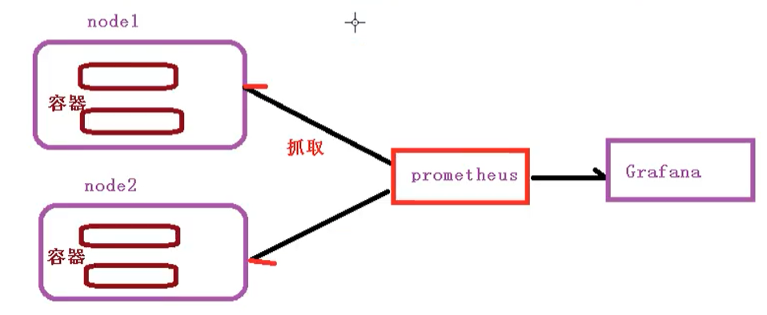


## 部署prometheus

首先需要部署一个守护进程


```bash
---
apiVersion: apps/v1
kind: DaemonSet
metadata:
  name: node-exporter
  namespace: kube-system
  labels:
    k8s-app: node-exporter
spec:
  selector:
    matchLabels:
      k8s-app: node-exporter
  template:
    metadata:
      labels:
        k8s-app: node-exporter
    spec:
      containers:
      - image: prom/node-exporter
        name: node-exporter
        ports:
        - containerPort: 9100
          protocol: TCP
          name: http
---
apiVersion: v1
kind: Service
metadata:
  labels:
    k8s-app: node-exporter
  name: node-exporter
  namespace: kube-system
spec:
  ports:
  - name: http
    port: 9100
    nodePort: 31672
    protocol: TCP
  type: NodePort
  selector:
    k8s-app: node-exporter
```

然后执行下面命令

```bash
kubectl create -f node-exporter.yaml
```

执行完，发现会报错


这是因为版本不一致的问题，因为发布的正式版本，而这个属于测试版本

所以我们找到第一行，然后把内容修改为如下所示

```bash
# 修改前
apiVersion: extensions/v1beta1
# 修改后 【正式版本发布后，测试版本不能使用】
apiVersion: apps/v1
```

创建完成后的效果

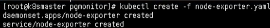


然后通过yaml的方式部署prometheus

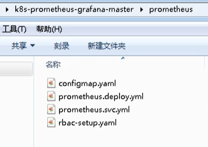

- configmap：定义一个configmap：存储一些配置文件【不加密】
- prometheus.deploy.yaml：部署一个deployment【包括端口号，资源限制】
- prometheus.svc.yaml：对外暴露的端口
- rbac-setup.yaml：分配一些角色的权限


下面我们进入目录下，首先部署 rbac-setup.yaml

```bash
kubectl create -f rbac-setup.yaml
```

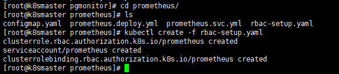

然后分别部署

```bash
# 部署configmap
kubectl create -f configmap.yaml
# 部署deployment
kubectl create -f prometheus.deploy.yml
# 部署svc
kubectl create -f prometheus.svc.yml
```

部署完成后，我们使用下面命令查看

```bash
kubectl get pods -n kube-system
```

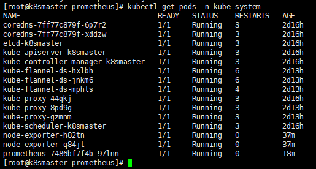

在我们部署完成后，即可看到 prometheus 的 pod了，然后通过下面命令，能够看到对应的端口

```bash
kubectl get svc -n kube-system
```

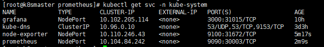

通过这个，我们可以看到 `prometheus` 对外暴露的端口为 30003，访问页面即可对应的图形化界面

```bash
http://192.168.177.130:30003
```

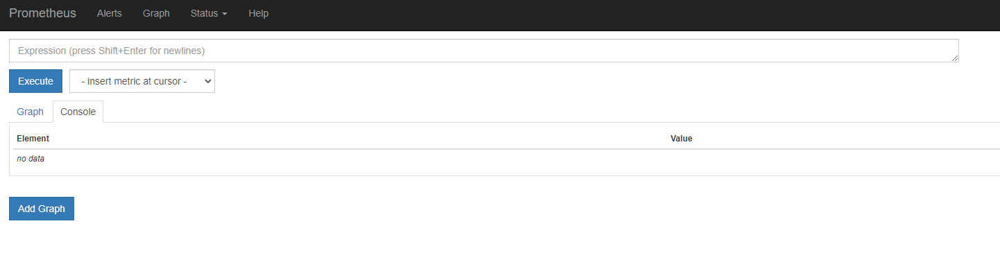

在上面我们部署完prometheus后，我们还需要来部署grafana

```bash
kubectl create -f grafana-deploy.yaml
```

然后执行完后，发现下面的问题

```bash
error: unable to recognize "grafana-deploy.yaml": no matches for kind "Deployment" in version "extensions/v1beta1"
```

我们需要修改如下内容

```bash
# 修改
apiVersion: apps/v1

# 添加selector
spec:
  replicas: 1
  selector:
    matchLabels:
      app: grafana
      component: core
```

修改完成后，我们继续执行上述代码

```bash
# 创建deployment
kubectl create -f grafana-deploy.yaml
# 创建svc
kubectl create -f grafana-svc.yaml
# 创建 ing
kubectl create -f grafana-ing.yaml
```

我们能看到，我们的grafana正在

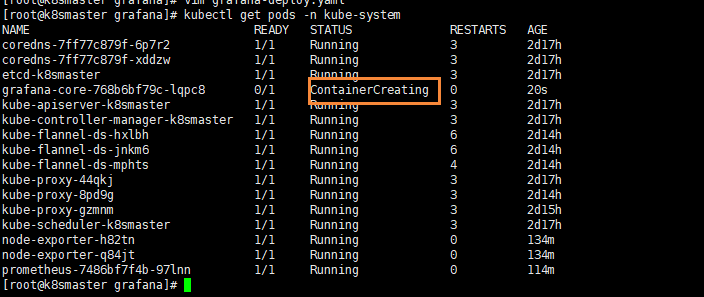

### 配置数据源

下面我们需要开始打开 Grafana，然后配置数据源，导入数据显示模板

```bash
kubectl get svc -n kube-system
```

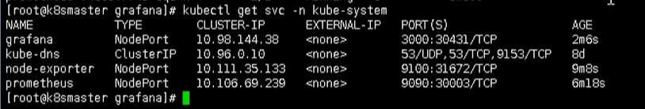

我们可以通过 ip + 30431 访问我们的 grafana 图形化页面


然后输入账号和密码：admin admin

进入后，我们就需要配置 prometheus 的数据源

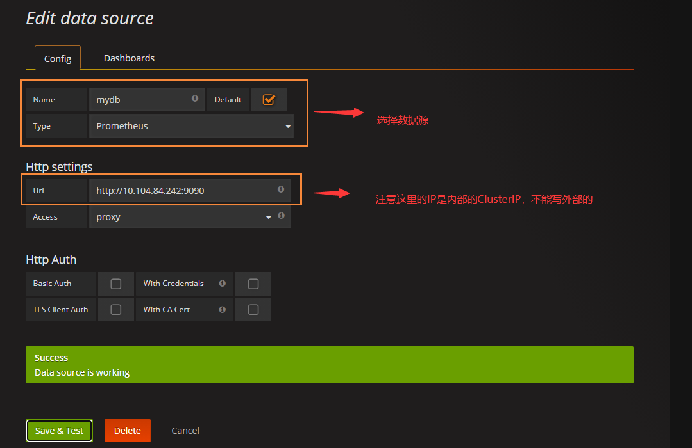

 和 对应的IP【这里IP是我们的ClusterIP】


### 设置显示数据的模板

选择Dashboard，导入我们的模板

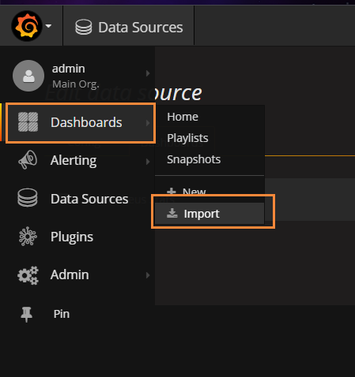

然后输入 315 号模板

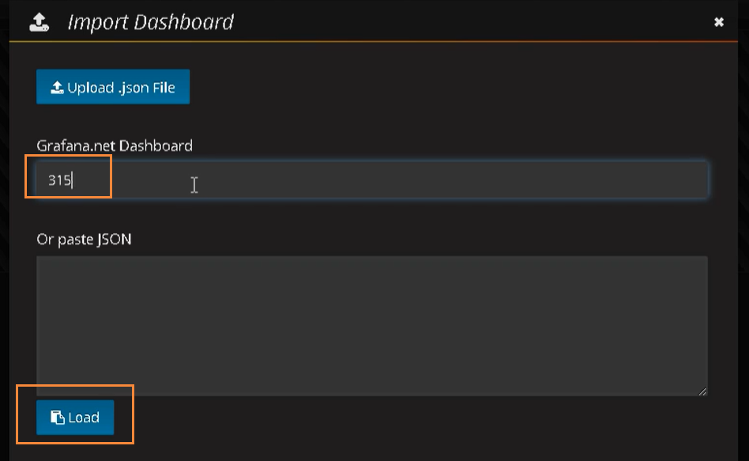

然后选择 prometheus数据源 mydb，导入即可

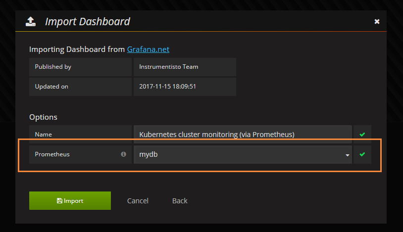

导入后的效果如下所示

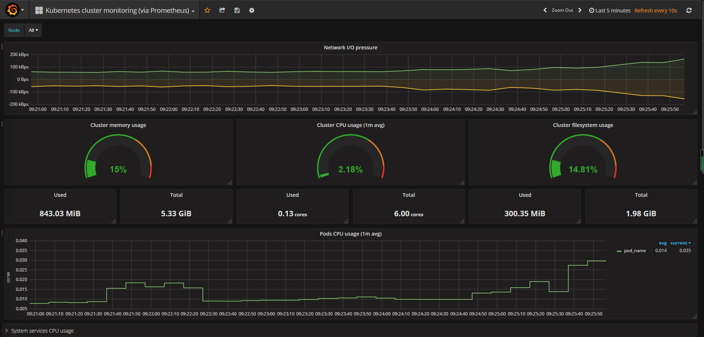