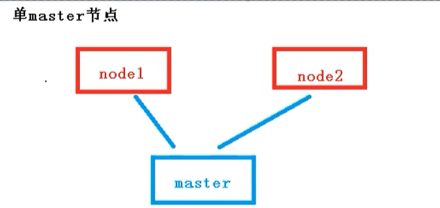
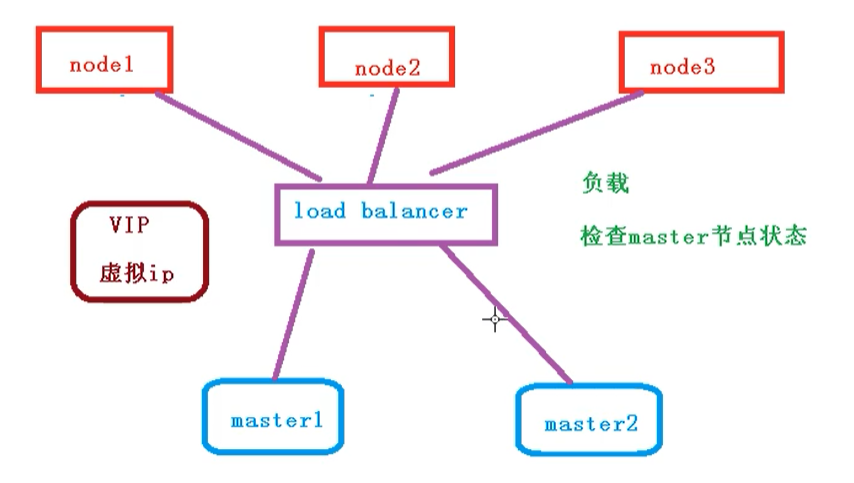
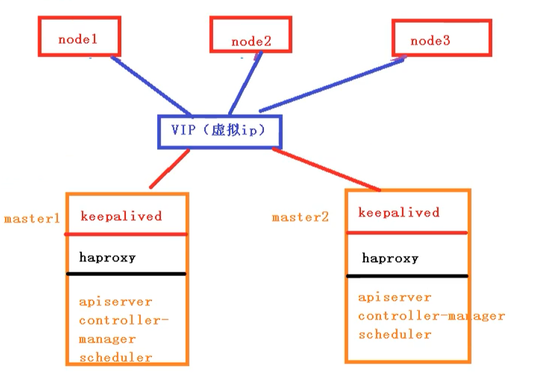
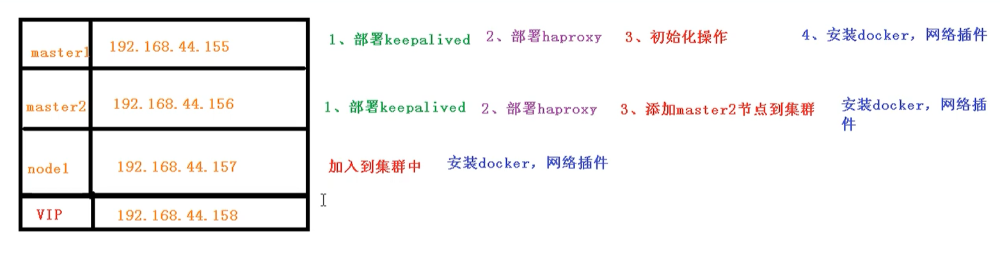
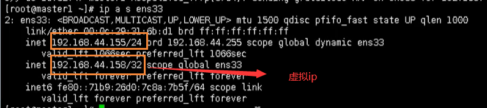
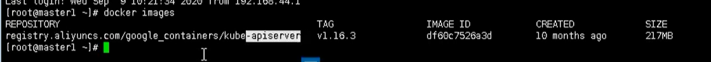

# Kubernetes搭建高可用集群

## 前言

之前我们搭建的集群，只有一个master节点，当master节点宕机的时候，通过node将无法继续访问，而master主要是管理作用，所以整个集群将无法提供服务



## 高可用集群

下面我们就需要搭建一个多master节点的高可用集群，不会存在单点故障问题

但是在node 和 master节点之间，需要存在一个 LoadBalancer组件，作用如下：

- 负载
- 检查master节点的状态



对外有一个统一的VIP：虚拟ip来对外进行访问

## 高可用集群技术细节

高可用集群技术细节如下所示：



- keepalived：配置虚拟ip，检查节点的状态
- haproxy：负载均衡服务【类似于nginx】
- apiserver：
- controller：
- manager：
- scheduler：

## 高可用集群步骤

我们采用2个master节点，一个node节点来搭建高可用集群，下面给出了每个节点需要做的事情



## 初始化操作

我们需要在这三个节点上进行操作

```bash
# 关闭防火墙
systemctl stop firewalld
systemctl disable firewalld

# 关闭selinux
# 永久关闭
sed -i 's/enforcing/disabled/' /etc/selinux/config  
# 临时关闭
setenforce 0  

# 关闭swap
# 临时
swapoff -a 
# 永久关闭
sed -ri 's/.*swap.*/#&/' /etc/fstab

# 根据规划设置主机名【master1节点上操作】
hostnamectl set-hostname master1
# 根据规划设置主机名【master2节点上操作】
hostnamectl set-hostname master1
# 根据规划设置主机名【node1节点操作】
hostnamectl set-hostname node1

# r添加hosts
cat >> /etc/hosts << EOF
192.168.44.158  k8smaster
192.168.44.155 master01.k8s.io master1
192.168.44.156 master02.k8s.io master2
192.168.44.157 node01.k8s.io node1
EOF


# 将桥接的IPv4流量传递到iptables的链【3个节点上都执行】
cat > /etc/sysctl.d/k8s.conf << EOF
net.bridge.bridge-nf-call-ip6tables = 1
net.bridge.bridge-nf-call-iptables = 1
EOF

# 生效
sysctl --system  

# 时间同步
yum install ntpdate -y
ntpdate time.windows.com
```

## 部署keepAlived

下面我们需要在所有的master节点【master1和master2】上部署keepAlive

### 安装相关包

```bash
# 安装相关工具
yum install -y conntrack-tools libseccomp libtool-ltdl
# 安装keepalived
yum install -y keepalived
```

### 配置master节点

添加master1的配置

```bash
cat > /etc/keepalived/keepalived.conf <<EOF 
! Configuration File for keepalived

global_defs {
   router_id k8s
}

vrrp_script check_haproxy {
    script "killall -0 haproxy"
    interval 3
    weight -2
    fall 10
    rise 2
}

vrrp_instance VI_1 {
    state MASTER 
    interface ens33 
    virtual_router_id 51
    priority 250
    advert_int 1
    authentication {
        auth_type PASS
        auth_pass ceb1b3ec013d66163d6ab
    }
    virtual_ipaddress {
        192.168.44.158
    }
    track_script {
        check_haproxy
    }

}
EOF
```

添加master2的配置

```bash
cat > /etc/keepalived/keepalived.conf <<EOF 
! Configuration File for keepalived

global_defs {
   router_id k8s
}

vrrp_script check_haproxy {
    script "killall -0 haproxy"
    interval 3
    weight -2
    fall 10
    rise 2
}

vrrp_instance VI_1 {
    state BACKUP 
    interface ens33 
    virtual_router_id 51
    priority 200
    advert_int 1
    authentication {
        auth_type PASS
        auth_pass ceb1b3ec013d66163d6ab
    }
    virtual_ipaddress {
        192.168.44.158
    }
    track_script {
        check_haproxy
    }

}
EOF
```

### 启动和检查

在两台master节点都执行

```bash
# 启动keepalived
systemctl start keepalived.service
# 设置开机启动
systemctl enable keepalived.service
# 查看启动状态
systemctl status keepalived.service
```

启动后查看master的网卡信息

```bash
ip a s ens33
```




## 部署haproxy

haproxy主要做负载的作用，将我们的请求分担到不同的node节点上

### 安装

在两个master节点安装 haproxy

```bash
# 安装haproxy
yum install -y haproxy
# 启动 haproxy
systemctl start haproxy
# 开启自启
systemctl enable haproxy
```

启动后，我们查看对应的端口是否包含 16443

```bash
netstat -tunlp | grep haproxy
```


### 配置

两台master节点的配置均相同，配置中声明了后端代理的两个master节点服务器，指定了haproxy运行的端口为16443等，因此16443端口为集群的入口

```bash
cat > /etc/haproxy/haproxy.cfg << EOF
#---------------------------------------------------------------------
# Global settings
#---------------------------------------------------------------------
global
    # to have these messages end up in /var/log/haproxy.log you will
    # need to:
    # 1) configure syslog to accept network log events.  This is done
    #    by adding the '-r' option to the SYSLOGD_OPTIONS in
    #    /etc/sysconfig/syslog
    # 2) configure local2 events to go to the /var/log/haproxy.log
    #   file. A line like the following can be added to
    #   /etc/sysconfig/syslog
    #
    #    local2.*                       /var/log/haproxy.log
    #
    log         127.0.0.1 local2
    
    chroot      /var/lib/haproxy
    pidfile     /var/run/haproxy.pid
    maxconn     4000
    user        haproxy
    group       haproxy
    daemon 
       
    # turn on stats unix socket
    stats socket /var/lib/haproxy/stats
#---------------------------------------------------------------------
# common defaults that all the 'listen' and 'backend' sections will
# use if not designated in their block
#---------------------------------------------------------------------  
defaults
    mode                    http
    log                     global
    option                  httplog
    option                  dontlognull
    option http-server-close
    option forwardfor       except 127.0.0.0/8
    option                  redispatch
    retries                 3
    timeout http-request    10s
    timeout queue           1m
    timeout connect         10s
    timeout client          1m
    timeout server          1m
    timeout http-keep-alive 10s
    timeout check           10s
    maxconn                 3000
#---------------------------------------------------------------------
# kubernetes apiserver frontend which proxys to the backends
#--------------------------------------------------------------------- 
frontend kubernetes-apiserver
    mode                 tcp
    bind                 *:16443
    option               tcplog
    default_backend      kubernetes-apiserver    
#---------------------------------------------------------------------
# round robin balancing between the various backends
#---------------------------------------------------------------------
backend kubernetes-apiserver
    mode        tcp
    balance     roundrobin
    server      master01.k8s.io   192.168.44.155:6443 check
    server      master02.k8s.io   192.168.44.156:6443 check
#---------------------------------------------------------------------
# collection haproxy statistics message
#---------------------------------------------------------------------
listen stats
    bind                 *:1080
    stats auth           admin:awesomePassword
    stats refresh        5s
    stats realm          HAProxy\ Statistics
    stats uri            /admin?stats
EOF
```

## 安装Docker、Kubeadm、kubectl

所有节点安装Docker/kubeadm/kubelet ，Kubernetes默认CRI（容器运行时）为Docker，因此先安装Docker

### 安装Docker

首先配置一下Docker的阿里yum源

```bash
cat >/etc/yum.repos.d/docker.repo<<EOF
[docker-ce-edge]
name=Docker CE Edge - \$basearch
baseurl=https://mirrors.aliyun.com/docker-ce/linux/centos/7/\$basearch/edge
enabled=1
gpgcheck=1
gpgkey=https://mirrors.aliyun.com/docker-ce/linux/centos/gpg
EOF
```

然后yum方式安装docker

```bash
# yum安装
yum -y install docker-ce

# 查看docker版本
docker --version  

# 启动docker
systemctl enable docker
systemctl start docker
```

配置docker的镜像源

```bash
cat >> /etc/docker/daemon.json << EOF
{
  "registry-mirrors": ["https://b9pmyelo.mirror.aliyuncs.com"]
}
EOF
```

然后重启docker

```bash
systemctl restart docker
```

### 添加kubernetes软件源

然后我们还需要配置一下yum的k8s软件源

```bash
cat > /etc/yum.repos.d/kubernetes.repo << EOF
[kubernetes]
name=Kubernetes
baseurl=https://mirrors.aliyun.com/kubernetes/yum/repos/kubernetes-el7-x86_64
enabled=1
gpgcheck=0
repo_gpgcheck=0
gpgkey=https://mirrors.aliyun.com/kubernetes/yum/doc/yum-key.gpg https://mirrors.aliyun.com/kubernetes/yum/doc/rpm-package-key.gpg
EOF
```

###  安装kubeadm，kubelet和kubectl

由于版本更新频繁，这里指定版本号部署：

```bash
# 安装kubelet、kubeadm、kubectl，同时指定版本
yum install -y kubelet-1.18.0 kubeadm-1.18.0 kubectl-1.18.0
# 设置开机启动
systemctl enable kubelet
```

## 部署Kubernetes Master【master节点】

### 创建kubeadm配置文件

在具有vip的master上进行初始化操作，这里为master1

```bash
# 创建文件夹
mkdir /usr/local/kubernetes/manifests -p
# 到manifests目录
cd /usr/local/kubernetes/manifests/
# 新建yaml文件
vi kubeadm-config.yaml
```

yaml内容如下所示：

```bash
apiServer:
  certSANs:
    - master1
    - master2
    - master.k8s.io
    - 192.168.44.158
    - 192.168.44.155
    - 192.168.44.156
    - 127.0.0.1
  extraArgs:
    authorization-mode: Node,RBAC
  timeoutForControlPlane: 4m0s
apiVersion: kubeadm.k8s.io/v1beta1
certificatesDir: /etc/kubernetes/pki
clusterName: kubernetes
controlPlaneEndpoint: "master.k8s.io:16443"
controllerManager: {}
dns: 
  type: CoreDNS
etcd:
  local:    
    dataDir: /var/lib/etcd
imageRepository: registry.aliyuncs.com/google_containers
kind: ClusterConfiguration
kubernetesVersion: v1.16.3
networking: 
  dnsDomain: cluster.local  
  podSubnet: 10.244.0.0/16
  serviceSubnet: 10.1.0.0/16
scheduler: {}
```

然后我们在 master1 节点执行

```bash
kubeadm init --config kubeadm-config.yaml
```

执行完成后，就会在拉取我们的进行了【需要等待...】



按照提示配置环境变量，使用kubectl工具

```bash
# 执行下方命令
mkdir -p $HOME/.kube
sudo cp -i /etc/kubernetes/admin.conf $HOME/.kube/config
sudo chown $(id -u):$(id -g) $HOME/.kube/config
# 查看节点
kubectl get nodes
# 查看pod
kubectl get pods -n kube-system
```

**按照提示保存以下内容，一会要使用：**

```bash
kubeadm join master.k8s.io:16443 --token jv5z7n.3y1zi95p952y9p65 \
    --discovery-token-ca-cert-hash sha256:403bca185c2f3a4791685013499e7ce58f9848e2213e27194b75a2e3293d8812 \
    --control-plane 
```

> --control-plane ： 只有在添加master节点的时候才有

查看集群状态

```bash
# 查看集群状态
kubectl get cs
# 查看pod
kubectl get pods -n kube-system
```

## 安装集群网络

从官方地址获取到flannel的yaml，在master1上执行

```bash
# 创建文件夹
mkdir flannel
cd flannel
# 下载yaml文件
wget -c https://raw.githubusercontent.com/coreos/flannel/master/Documentation/kube-flannel.yml
```

安装flannel网络

```bash
kubectl apply -f kube-flannel.yml 
```

检查

```bash
kubectl get pods -n kube-system
```

## master2节点加入集群

### 复制密钥及相关文件

从master1复制密钥及相关文件到master2

```bash
# ssh root@192.168.44.156 mkdir -p /etc/kubernetes/pki/etcd

# scp /etc/kubernetes/admin.conf root@192.168.44.156:/etc/kubernetes
   
# scp /etc/kubernetes/pki/{ca.*,sa.*,front-proxy-ca.*} root@192.168.44.156:/etc/kubernetes/pki
   
# scp /etc/kubernetes/pki/etcd/ca.* root@192.168.44.156:/etc/kubernetes/pki/etcd
```

###  master2加入集群

执行在master1上init后输出的join命令,需要带上参数`--control-plane`表示把master控制节点加入集群

```bash
kubeadm join master.k8s.io:16443 --token ckf7bs.30576l0okocepg8b     --discovery-token-ca-cert-hash sha256:19afac8b11182f61073e254fb57b9f19ab4d798b70501036fc69ebef46094aba --control-plane
```

检查状态

```bash
kubectl get node

kubectl get pods --all-namespaces
```

## 加入Kubernetes Node

在node1上执行

向集群添加新节点，执行在kubeadm init输出的kubeadm join命令：

```bash
kubeadm join master.k8s.io:16443 --token ckf7bs.30576l0okocepg8b     --discovery-token-ca-cert-hash sha256:19afac8b11182f61073e254fb57b9f19ab4d798b70501036fc69ebef46094aba
```

**集群网络重新安装，因为添加了新的node节点**

检查状态

```bash
kubectl get node
kubectl get pods --all-namespaces
```

## 测试kubernetes集群

在Kubernetes集群中创建一个pod，验证是否正常运行：

```bash
# 创建nginx deployment
kubectl create deployment nginx --image=nginx
# 暴露端口
kubectl expose deployment nginx --port=80 --type=NodePort
# 查看状态
kubectl get pod,svc
```

然后我们通过任何一个节点，都能够访问我们的nginx页面

