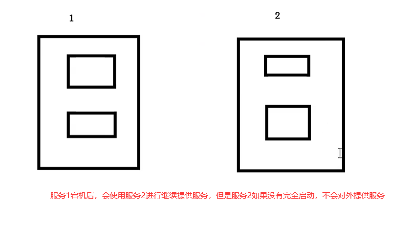
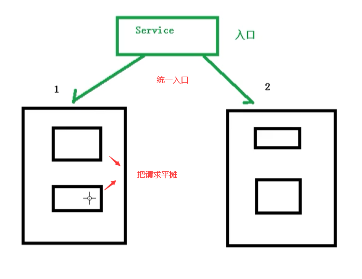
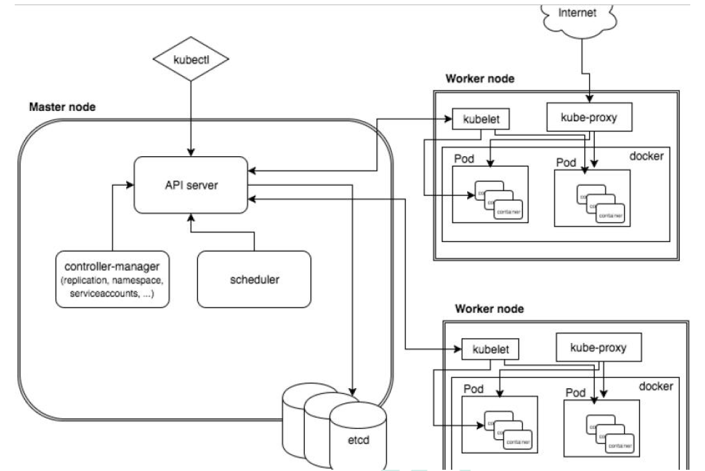
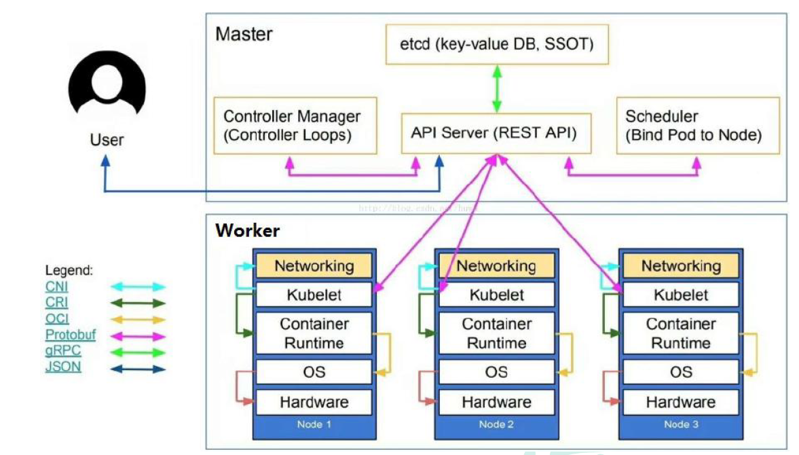

# Kubernetes简介

## 介绍

K8S主要讲的就是Kubernetes，首先Kubernetes首字母为K，末尾为s，中间一共有8个字母，所以简称K8s

## 前置知识

- Linux操作系统
- Docker

## 课程简介

- K8s概念和架构
- 从零搭建K8s集群
  - 基于客户端工具kubeadm搭建（简单，最多半小时）
  - 基于二进制包方式（能看到内部的架构）

- K8s核心概念
  - Pod：K8s管理的最小单位级，是所有业务类型的基础
  - Controller：控制器，有状态，无状态，一次任务，定时任务，守护进程
  - Service Ingress：对外暴露端口
  - RBAC：安全机制，权限模型
  - Helm：下载机制
  - 持久化存储

- 搭建集群监控平台系统
- 从零搭建高可用K8s集群
- 在集群环境部署项目

## K8S概念和特性

### 概述

kubernetes，简称K8s，是用8 代替8 个字符“ubernete”而成的缩写。是一个开源的，用于管理云平台中多个主机上的容器化的应用，Kubernetes 的目标是让部署容器化的应用简单并且高效（powerful）,Kubernetes 提供了应用部署，规划，更新，维护的一种机制。

传统的应用部署方式是通过插件或脚本来安装应用。这样做的缺点是应用的运行、配置、管理、所有生存周期将与当前操作系统绑定，这样做并不利于应用的升级更新/回滚等操作，当然也可以通过创建虚拟机的方式来实现某些功能，但是虚拟机非常重，并不利于可移植性。

新的方式是通过部署容器方式实现，每个容器之间互相隔离，每个容器有自己的文件系统，容器之间进程不会相互影响，能区分计算资源。相对于虚拟机，容器能快速部署，由于容器与底层设施、机器文件系统解耦的，所以它能在不同云、不同版本操作系统间进行迁移。

容器占用资源少、部署快，每个应用可以被打包成一个容器镜像，每个应用与容器间成一对一关系也使容器有更大优势，使用容器可以在build 或release 的阶段，为应用创建容器镜像，因为每个应用不需要与其余的应用堆栈组合，也不依赖于生产环境基础结构，这使得从研发到测试、生产能提供一致环境。类似地，容器比虚拟机轻量、更“透明”，这更便于监控和管理。

Kubernetes 是Google 开源的一个容器编排引擎，它支持自动化部署、大规模可伸缩、应用容器化管理。在生产环境中部署一个应用程序时，通常要部署该应用的多个实例以便对应用请求进行负载均衡。在Kubernetes 中，我们可以创建多个容器，每个容器里面运行一个应用实例，然后通过内置的负载均衡策略，实现对这一组应用实例的管理、发现、访问，而这些细节都不需要运维人员去进行复杂的手工配置和处理。

> 总结：
>
> - K8s是谷歌在2014年开业的容器化集群管理系统
> - 使用k8s进行容器化应用部署
> - 使用k8s利于应用扩展
> - k8s目标实施让部署容器化应用更加简洁和高效

### K8S概述

Kubernetes 是一个轻便的和可扩展的开源平台，用于管理容器化应用和服务。通过Kubernetes 能够进行应用的自动化部署和扩缩容。在Kubernetes 中，会将组成应用的容器组合成一个逻辑单元以更易管理和发现。Kubernetes 积累了作为Google 生产环境运行工作负载15 年的经验，并吸收了来自于社区的最佳想法和实践。

### K8S功能

#### 自动装箱

基于容器对应用运行环境的资源配置要求自动部署应用容器

#### 自我修复(自愈能力)

当容器失败时，会对容器进行重启

当所部署的Node 节点有问题时，会对容器进行重新部署和重新调度

当容器未通过监控检查时，会关闭此容器直到容器正常运行时，才会对外提供服务

#### 水平扩展

通过简单的命令、用户UI 界面或基于CPU 等资源使用情况，对应用容器进行规模扩大或规模剪裁

> 当我们有大量的请求来临时，我们可以增加副本数量，从而达到水平扩展的效果

#### 服务发现

用户不需使用额外的服务发现机制，就能够基于Kubernetes 自身能力实现服务发现和负载均衡

> 对外提供统一的入口，让它来做节点的调度和负载均衡， 相当于微服务里面的网关？

#### 滚动更新

可以根据应用的变化，对应用容器运行的应用，进行一次性或批量式更新

> 添加应用的时候，不是加进去就马上可以进行使用，而是需要判断这个添加进去的应用是否能够正常使用

#### 版本回退

可以根据应用部署情况，对应用容器运行的应用，进行历史版本即时回退

> 类似于Git中的回滚

#### 密钥和配置管理

在不需要重新构建镜像的情况下，可以部署和更新密钥和应用配置，类似热部署。

#### 存储编排

自动实现存储系统挂载及应用，特别对有状态应用实现数据持久化非常重要
存储系统可以来自于本地目录、网络存储(NFS、Gluster、Ceph 等)、公共云存储服务

#### 批处理

提供一次性任务，定时任务；满足批量数据处理和分析的场景

## K8S架构组件

### 完整架构图

### 架构细节

K8S架构主要包含两部分：Master（主控节点）和 node（工作节点）

k8s 集群控制节点，对集群进行调度管理，接受集群外用户去集群操作请求；

- **master**：主控节点
  - API Server：集群统一入口，以restful风格进行操作，同时交给etcd存储
  - scheduler：节点的调度，选择node节点应用部署
  - controller-manager：处理集群中常规后台任务，一个资源对应一个控制器
  - etcd：存储系统，用于保存集群中的相关数据
- **Work node**：工作节点
  - Kubeelet：master派到node节点代表，管理本机容器
  - kube-proxy：提供网络代理，负载均衡等操作
  - 

## K8S核心概念

### Pod

- Pod是K8s中最小的单元
- 一组容器的集合
- 共享网络
- 生命周期是短暂的（服务器重启后，就找不到了）

### Controller

- 确保预期的pod副本数量
- 无状态应用部署
  - 无状态就是指，不需要依赖于网络或者ip
- 有状态应用部署
  - 有状态需要特定的条件
- 确保所有的node运行同一个pod
- 一次性任务和定时任务

### Service

- 定义一组pod的访问规则