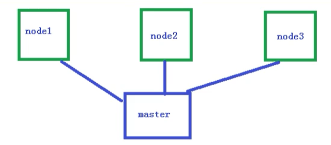
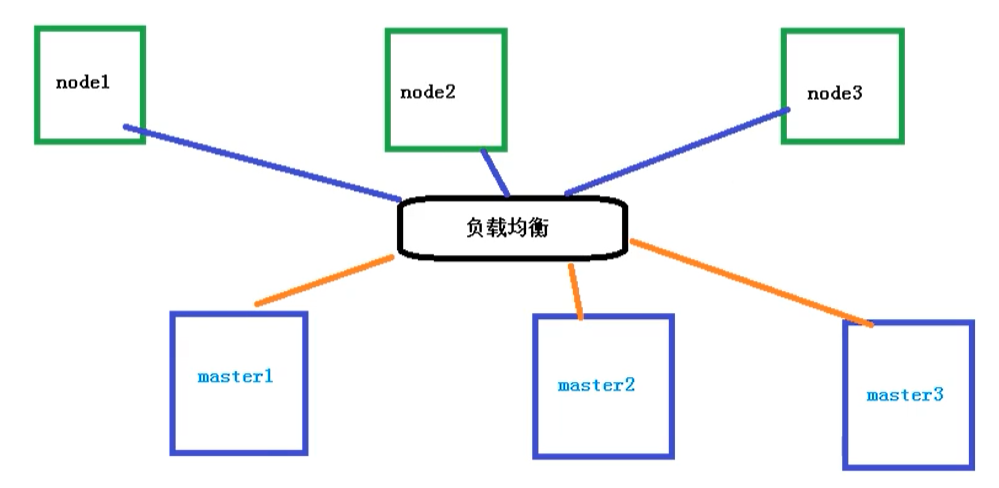

# 搭建K8S集群

## 搭建k8s环境平台规划

### 单master集群

单个master节点，然后管理多个node节点

### 多master集群

多个master节点，管理多个node节点，同时中间多了一个负载均衡的过程

## 服务器硬件配置要求

### 测试环境

master：2核  4G  20G

node：   4核  8G  40G

### 生产环境

master：8核  16G  100G

node：   16核  64G  200G

目前生产部署Kubernetes集群主要有两种方式

### kubeadm

kubeadm是一个K8S部署工具，提供kubeadm init 和 kubeadm join，用于快速部署Kubernetes集群

官网地址：[点我传送](https://kubernetes.io/zh/docs/setup/production-environment/tools/kubeadm/install-kubeadm/)

### 二进制包

从github下载发行版的二进制包，手动部署每个组件，组成Kubernetes集群。

Kubeadm降低部署门槛，但屏蔽了很多细节，遇到问题很难排查。如果想更容易可控，推荐使用二进制包部署Kubernetes集群，虽然手动部署麻烦点，期间可以学习很多工作原理，也利于后期维护。

## Kubeadm部署集群

kubeadm 是官方社区推出的一个用于快速部署kubernetes 集群的工具，这个工具能通过两条指令完成一个kubernetes 集群的部署：

- 创建一个Master 节点kubeadm init
- 将Node 节点加入到当前集群中$ kubeadm join <Master 节点的IP 和端口>

## 安装要求

在开始之前，部署Kubernetes集群机器需要满足以下几个条件

- 一台或多台机器，操作系统为Centos7.X
- 硬件配置：2GB或更多GAM，2个CPU或更多CPU，硬盘30G
- 集群中所有机器之间网络互通
- 可以访问外网，需要拉取镜像
- 禁止swap分区