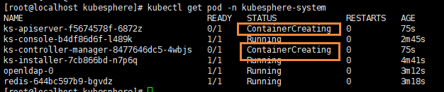
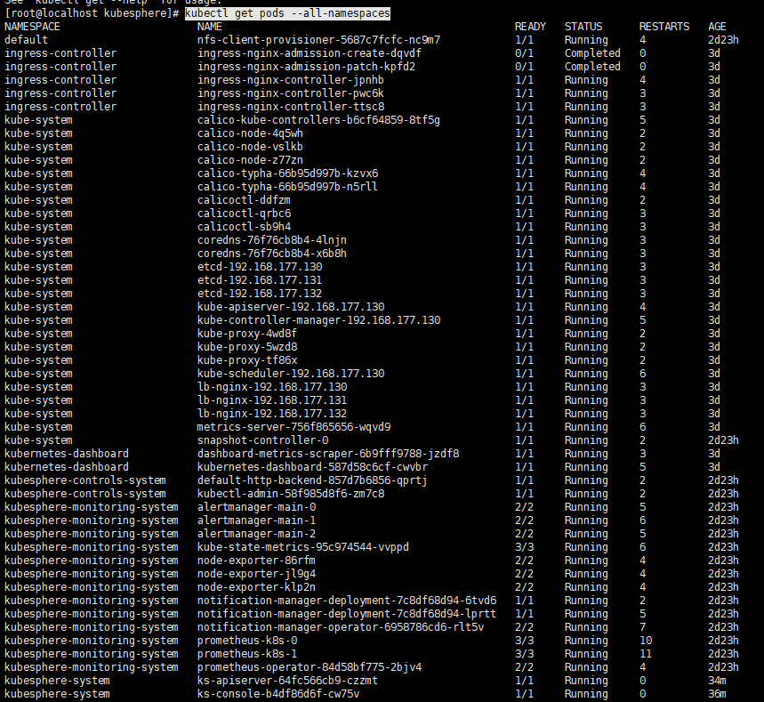
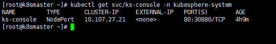
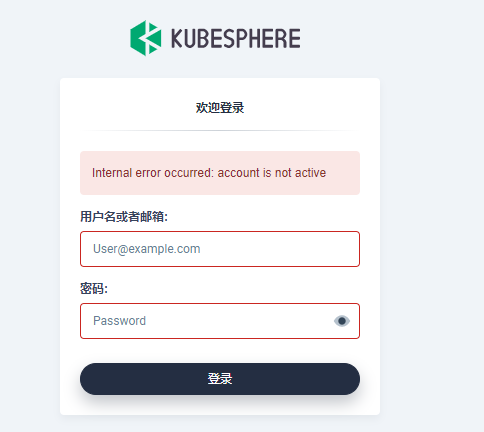

# Kubernetes可视化界面kubesphere

## 前言

Kubernetes也提供了默认的dashboard页面，但是功能不是很强大，这里就不使用了

而是采用Kubesphere大桶全部的devops链路，通过kubesphere集成了很多套件

- https://kubesphere.io/zh/ ：集群要求高
- https://kuboard.cn/：开源kuboard也不错，集群要求不高【轻量级】

## 简介

KubeSphere是一款面向云原生设计的开源项目，在目前主流容器调度平台Kubernetes之上构建的分布式多租户容器管理平台，提供简单易用的操作界面以及向导式操作方式，在降低用户使用容器调度平台学习成本的同时，极大降低开发、测试、运维的日常工作的复杂度。

## 安装

### 前提条件

https://kubesphere.com.cn/docs/quick-start/minimal-kubesphere-on-k8s/

- Kubernetes 版本必须为 “1.15.x，1.16.x，1.17.x 或 1.18.x”；
- 确保您的计算机满足最低硬件要求：CPU > 1 核，内存 > 2 G；
- 在安装之前，需要配置 Kubernetes 集群中的默认存储类；
- 当使用 `--cluster-signing-cert-file` 和 `--cluster-signing-key-file` 参数启动时，在 kube-apiserver 中会激活 CSR 签名功能。 请参阅 [RKE 安装问题](https://github.com/kubesphere/kubesphere/issues/1925#issuecomment-591698309)；
- 有关在 Kubernetes 上安装 KubeSphere 的前提条件的详细信息，请参阅[前提条件](https://kubesphere.com.cn/docs/installing-on-kubernetes/introduction/prerequisites/)。

### 安装helm

下面我们需要在 **master** 节点安装 **helm**

Helm是Kubernetes的包管理器。包管理器类似于我们在 **Ubuntu** 中使用的 **apt**。**Centos** 中使用的 **yum** 或者**Python** 中的 **pip** 一样，能快速查找、下载和安装软件包。Helm由客户端组件helm和服务端组件Tiller组成，能够将一组K8S资源打包统一管理，是查找、共享和使用为Kubernetes构建的软件的最佳方式。

安装3.0的 helm 首先我们需要去 [官网下载](https://helm.sh/docs/intro/quickstart/)

- 第一步，[下载helm](https://github.com/helm/helm/releases)安装压缩文件，上传到linux系统中
- 第二步，解压helm压缩文件，把解压后的helm目录复制到 usr/bin 目录中
- 使用命令：helm

## 部署KubeSphere

### 安装前

如果您的服务器无法访问 GitHub，则可以分别复制 [kubesphere-installer.yaml](https://github.com/kubesphere/ks-installer/releases/download/v3.0.0/kubesphere-installer.yaml) 和 [cluster-configuration.yaml](https://github.com/kubesphere/ks-installer/releases/download/v3.0.0/cluster-configuration.yaml) 中的内容并将其粘贴到本地文件中。然后，您可以对本地文件使用 `kubectl apply -f` 来安装 KubeSphere。

同时查看k8s集群的默认存储类

```bash
kubectl get storageclass
```


如果没有默认存储类，那么就需要安装默认的存储类，参考博客：[Kubernetes配置默认存储类](http://moguit.cn/#/info?blogOid=575)

因为我安装的是 **nfs**，所以在安装了 **nfs** 服务器启动

```bash
systemctl start nfs
```

### 开始安装

如果无法正常访问github，可以提前把文件下载到本地

```BASH
kubectl apply -f https://github.com/kubesphere/ks-installer/releases/download/v3.0.0/kubesphere-installer.yaml

kubectl apply -f https://github.com/kubesphere/ks-installer/releases/download/v3.0.0/cluster-configuration.yaml
```

如果下载到了本地，可以这样安装

```bash
# 安装
kubectl apply -f kubesphere-installer.yaml
kubectl apply -f cluster-configuration.yaml

# 卸载
kubectl delete -f kubesphere-installer.yaml
kubectl delete -f cluster-configuration.yaml
```

### 检查安装日志

```bash
kubectl logs -n kubesphere-system $(kubectl get pod -n kubesphere-system -l app=ks-install -o jsonpath='{.items[0].metadata.name}') -f
```

然后在查看pod运行状况

```bash
kubectl get pod -n kubesphere-system
```

能够发现，我们还有两个容器正在创建



使用 `kubectl get pod --all-namespaces` 查看所有 Pod 是否在 KubeSphere 的相关命名空间中正常运行。

```bash
kubectl get pods --all-namespaces
```

能够发现所有的节点已经成功运行



如果是，请通过以下命令检查控制台的端口：

```bash
kubectl get svc/ks-console -n kubesphere-system
```

能够看到我们的服务确保在安全组中打开了端口 30880，并通过 NodePort（IP：30880）



使用默认帐户和密码（admin/P@88w0rd）访问 Web 控制台。

```bash
# 图形化页面  admin  P@88w0rd
http://192.168.177.130:30880/
```

登录控制台后，您可以在组件中检查不同组件的状态。如果要使用相关服务，可能需要等待某些组件启动并运行。


## 错误排查

### 错误1

kubesphere无法登录，提示 account is not active



kubesphere 安装完成后会创建默认账户admin/P@88w0rd，待ks-controller-manager启动就绪，user controller 会将 user CRD中定义的password加密，user会被转换为active状态，至此账户才可以正常登录。

当安装完成后遇到默认账户无法登录，看到account is not active相关错误提示时，需要检查ks-controller-manager的运行状态和日志。常见问题及解决方式如下:

```bash
kubectl -n kubesphere-system get ValidatingWebhookConfiguration users.iam.kubesphere.io -o yaml >> users.iam.kubesphere.io.yaml

kubectl -n kubesphere-system get secret ks-controller-manager-webhook-cert -o yaml >> ks-controller-manager-webhook-cert.yaml

# edit ca as pr
kubectl -n kubesphere-system apply -f ks-controller-manager-webhook-cert.yaml
kubectl -n kubesphere-system apply -f users.iam.kubesphere.io.yaml

# restart
kubectl -n kubesphere-system rollout restart deploy ks-controller-manager
```

来源：https://kubesphere.com.cn/forum/d/2217-account-is-not-active

