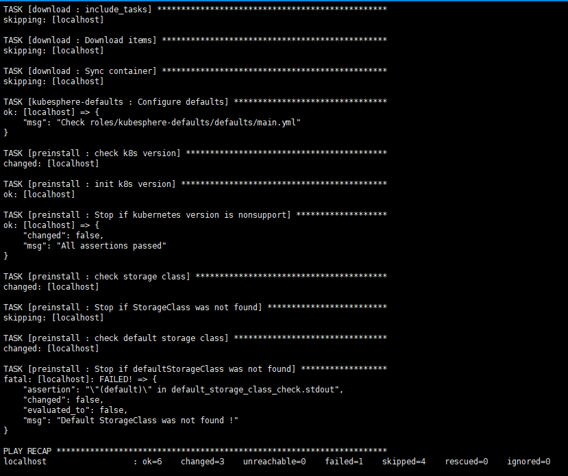
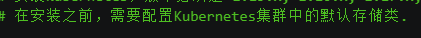
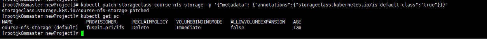

# Kubernetes配置默认存储类

## 前言

今天在配置Kubesphere的时候，出现了下面的错误



经过排查，发现是这个原因



我通过下面命令，查看Kubernetes集群中的默认存储类

```bash
kubectl get storageclass
```

发现空空如也，所以问题应该就出现在这里了~，下面我们给k8s集群安装上默认的存储类

## 安装nfs

我们使用的是nfs来作为k8s的存储类

首先找一台新的服务器，作为nfs服务端，然后进行 nfs的安装 【服务器：192.168.177.141】

然后使用命令安装nfs

```bash
yum install -y nfs-utils
```

首先创建存放数据的目录

```bash
mkdir -p /data/k8s
```

设置挂载路径

```bash
# 打开文件
vim /etc/exports
# 添加如下内容
/data/k8s *(rw,no_root_squash)
```

## node节点上安装

然后需要在k8s集群node节点上安装nfs，这里需要在 node1 和 node2节点上安装

```bash
yum install -y nfs-utils
```

执行完成后，会自动帮我们挂载上

## 启动nfs

在node节点上配置完成后，我们就接着到刚刚nfs服务器，启动我们的nfs

```bahs
systemctl start nfs
```

## 配置StorageClass

要使用StorageClass，我们就得安装对应的自动配置程序，比如上面我们使用的是nfs，那么我们就需要使用到一个 nfs-client 的自动配置程序，我们也叫它 Provisioner，这个程序使用我们已经配置的nfs服务器，来自动创建持久卷，也就是自动帮我们创建PV

```bash
自动创建的 PV 以${namespace}-${pvcName}-${pvName}这样的命名格式创建在 NFS 服务器上的共享数据目录中
而当这个 PV 被回收后会以archieved-${namespace}-${pvcName}-${pvName}这样的命名格式存在 NFS 服务器上。
```

当然在部署nfs-client之前，我们需要先成功安装上 nfs 服务器，上面已经安装好了，服务地址是192.168.177.141，共享数据目录是/data/k8s/，然后接下来我们部署 nfs-client 即可，我们也可以直接参考 [nfs-client 文档](https://github.com/kubernetes-incubator/external-storage/tree/master/nfs-client)，进行安装即可。

### 配置Deployment

首先配置 Deployment，将里面的对应的参数替换成我们自己的 nfs 配置（nfs-client.yaml）

```yaml
kind: Deployment
apiVersion: apps/v1
metadata:
  name: nfs-client-provisioner
spec:
  replicas: 1
  selector:
    matchLabels:
      app: nfs-client-provisioner
  strategy:
    type: Recreate
  template:
    metadata:
      labels:
        app: nfs-client-provisioner
    spec:
      serviceAccountName: nfs-client-provisioner
      containers:
        - name: nfs-client-provisioner
          image: quay.io/external_storage/nfs-client-provisioner:latest
          volumeMounts:
            - name: nfs-client-root
              mountPath: /persistentvolumes
          env:
            - name: PROVISIONER_NAME
              value: fuseim.pri/ifs
            - name: NFS_SERVER
              value: 192.168.177.141
            - name: NFS_PATH
              value: /data/k8s
      volumes:
        - name: nfs-client-root
          nfs:
            server: 192.168.177.141
            path: /data/k8s
```

### 替换配置

将环境变量 NFS_SERVER 和 NFS_PATH 替换，当然也包括下面的 nfs 配置，我们可以看到我们这里使用了一个名为 nfs-client-provisioner 的serviceAccount，所以我们也需要创建一个 sa，然后绑定上对应的权限：（nfs-client-sa.yaml）

```bash
apiVersion: v1
kind: ServiceAccount
metadata:
  name: nfs-client-provisioner

---
kind: ClusterRole
apiVersion: rbac.authorization.k8s.io/v1
metadata:
  name: nfs-client-provisioner-runner
rules:
  - apiGroups: [""]
    resources: ["persistentvolumes"]
    verbs: ["get", "list", "watch", "create", "delete"]
  - apiGroups: [""]
    resources: ["persistentvolumeclaims"]
    verbs: ["get", "list", "watch", "update"]
  - apiGroups: ["storage.k8s.io"]
    resources: ["storageclasses"]
    verbs: ["get", "list", "watch"]
  - apiGroups: [""]
    resources: ["events"]
    verbs: ["list", "watch", "create", "update", "patch"]
  - apiGroups: [""]
    resources: ["endpoints"]
    verbs: ["create", "delete", "get", "list", "watch", "patch", "update"]

---
kind: ClusterRoleBinding
apiVersion: rbac.authorization.k8s.io/v1
metadata:
  name: run-nfs-client-provisioner
subjects:
  - kind: ServiceAccount
    name: nfs-client-provisioner
    namespace: default
roleRef:
  kind: ClusterRole
  name: nfs-client-provisioner-runner
  apiGroup: rbac.authorization.k8s.io
```

我们这里新建的一个名为 nfs-client-provisioner 的ServiceAccount，然后绑定了一个名为 nfs-client-provisioner-runner 的ClusterRole，而该ClusterRole声明了一些权限，其中就包括对persistentvolumes的增、删、改、查等权限，所以我们可以利用该ServiceAccount来自动创建 PV。

### 创建StorageClass对象

nfs-client 的 Deployment 声明完成后，我们就可以来创建一个StorageClass对象了：（nfs-client-class.yaml）

```yaml
apiVersion: storage.k8s.io/v1
kind: StorageClass
metadata:
  name: course-nfs-storage
provisioner: fuseim.pri/ifs # or choose another name, must match deployment's env PROVISIONER_NAME'
```

我们声明了一个名为 course-nfs-storage 的StorageClass对象，注意下面的provisioner对应的值一定要和上面的Deployment下面的 PROVISIONER_NAME 这个环境变量的值一样

```yaml
apiVersion: storage.k8s.io/v1
kind: StorageClass
metadata:
  name: course-nfs-storage
provisioner: fuseim.pri/ifs # or choose another name, must match deployment's env PROVISIONER_NAME'
```

### 创建资源对象

在我们准备好上述的配置文件后，我们就可以开始创建我们的资源对象了

```bash
kubectl create -f nfs-client.yaml
kubectl create -f nfs-client-sa.yaml
kubectl create -f nfs-client-class.yaml
```

创建完成后，使用下面命令来查看资源状态

```bash
kubectl get pods
# 查看存储类
kubectl get storageclass
```



我们可以设置这个 course-nfs-storage 的 StorageClass 为 Kubernetes 的默认存储后端，我们可以用 kubectl patch 命令来更新

```bash
kubectl patch storageclass course-nfs-storage -p '{"metadata": {"annotations":{"storageclass.kubernetes.io/is-default-class":"true"}}}'
```

执行完命令后，我们默认存储类就配置成功了~