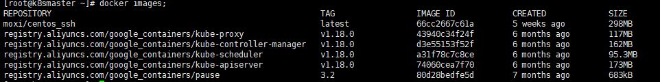
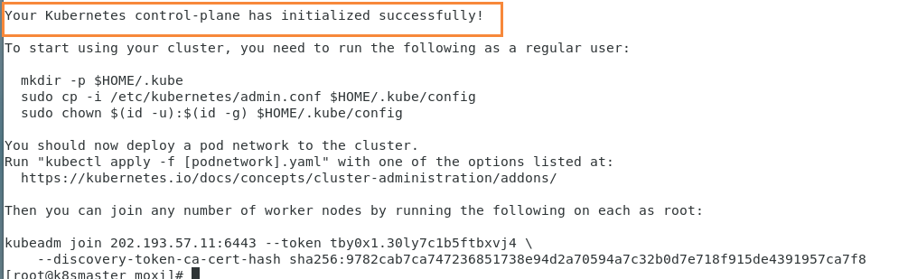
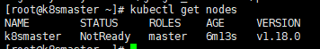

# 使用kubeadm方式搭建K8S集群

kubeadm是官方社区推出的一个用于快速部署kubernetes集群的工具。

这个工具能通过两条指令完成一个kubernetes集群的部署：

```bash
# 创建一个 Master 节点
kubeadm init

# 将一个 Node 节点加入到当前集群中
kubeadm join <Master节点的IP和端口 >
```

## 安装要求

在开始之前，部署Kubernetes集群机器需要满足以下几个条件：

- 一台或多台机器，操作系统 CentOS7.x-86_x64
- 硬件配置：2GB或更多RAM，2个CPU或更多CPU，硬盘30GB或更多【注意master需要两核】
- 可以访问外网，需要拉取镜像，如果服务器不能上网，需要提前下载镜像并导入节点
- 禁止swap分区

## 准备环境

| 角色   | IP             |
| ------ | -------------- |
| master | 202.193.57.11  |
| node1  | 202.193.57.198 |
| node2  | 202.193.57.92  |

```bash
# 关闭防火墙
systemctl stop firewalld
systemctl disable firewalld

# 关闭selinux
# 永久关闭
sed -i 's/enforcing/disabled/' /etc/selinux/config  
# 临时关闭
setenforce 0  

# 关闭swap
# 临时
swapoff -a 
# 临时
sed -ri 's/.*swap.*/#&/' /etc/fstab

# 根据规划设置主机名
hostnamectl set-hostname <hostname>

# 在master添加hosts
cat >> /etc/hosts << EOF
202.193.57.11 k8smaster
202.193.57.198 k8snode1
202.193.57.92 k8snode2
EOF

202.193.57.11
202.193.57.254
202.193.64.62

192.168.31.216
192.168.31.1
192.168.31.1


# 将桥接的IPv4流量传递到iptables的链
cat > /etc/sysctl.d/k8s.conf << EOF
net.bridge.bridge-nf-call-ip6tables = 1
net.bridge.bridge-nf-call-iptables = 1
EOF
# 生效
sysctl --system  

# 时间同步
yum install ntpdate -y
ntpdate time.windows.com
```

## 安装Docker/kubeadm/kubelet

所有节点安装Docker/kubeadm/kubelet 

Kubernetes默认CRI（容器运行时）为Docker，因此先安装Docker

### 安装Docker

首先配置一下Docker的阿里yum源

```bash
cat >/etc/yum.repos.d/docker.repo<<EOF
[docker-ce-edge]
name=Docker CE Edge - \$basearch
baseurl=https://mirrors.aliyun.com/docker-ce/linux/centos/7/\$basearch/edge
enabled=1
gpgcheck=1
gpgkey=https://mirrors.aliyun.com/docker-ce/linux/centos/gpg
EOF
```

然后yum方式安装docker

```bash
# yum安装
yum -y install docker-ce

# 查看docker版本
docker --version  

# 启动docker
systemctl enable docker
systemctl start docker
```

配置docker的镜像源

首先创建文件夹

```bash
mkdir /etc/docker/
```

然后添加

```bash
cat >> /etc/docker/daemon.json << EOF
{
  "registry-mirrors": ["https://b9pmyelo.mirror.aliyuncs.com"]
}
EOF
```

然后重启docker

```bash
systemctl restart docker
```

### 添加kubernetes软件源

然后我们还需要配置一下yum的k8s软件源

```bash
cat > /etc/yum.repos.d/kubernetes.repo << EOF
[kubernetes]
name=Kubernetes
baseurl=https://mirrors.aliyun.com/kubernetes/yum/repos/kubernetes-el7-x86_64
enabled=1
gpgcheck=0
repo_gpgcheck=0
gpgkey=https://mirrors.aliyun.com/kubernetes/yum/doc/yum-key.gpg https://mirrors.aliyun.com/kubernetes/yum/doc/rpm-package-key.gpg
EOF
```

###  安装kubeadm，kubelet和kubectl

由于版本更新频繁，这里指定版本号部署：

```bash
# 安装kubelet、kubeadm、kubectl，同时指定版本
yum install -y kubelet-1.18.0 kubeadm-1.18.0 kubectl-1.18.0
# 设置开机启动
systemctl enable kubelet
```

## 部署Kubernetes Master【master节点】

在202.193.57.11执行，也就是master节点

```bash
kubeadm init --apiserver-advertise-address=202.193.57.11 --image-repository registry.aliyuncs.com/google_containers --kubernetes-version v1.18.0 --service-cidr=10.96.0.0/12  --pod-network-cidr=10.244.0.0/16


kubeadm init --apiserver-advertise-address=192.168.31.216 --image-repository registry.aliyuncs.com/google_containers --kubernetes-version v1.18.0 --service-cidr=10.96.0.0/12  --pod-network-cidr=10.244.0.0/16
```

由于默认拉取镜像地址k8s.gcr.io国内无法访问，这里指定阿里云镜像仓库地址，【执行上述命令会比较慢，因为后台其实已经在拉取镜像了】，我们 docker images 命令即可查看已经拉取的镜像



当我们出现下面的情况时，表示kubernetes的镜像已经安装成功



使用kubectl工具 【master节点操作】

```bash
mkdir -p $HOME/.kube
sudo cp -i /etc/kubernetes/admin.conf $HOME/.kube/config
sudo chown $(id -u):$(id -g) $HOME/.kube/config
```

执行完成后，我们使用下面命令，查看我们正在运行的节点

```bash
kubectl get nodes
```



能够看到，目前有一个master节点已经运行了，但是还处于未准备状态

下面我们还需要在Node节点执行其它的命令，将node1和node2加入到我们的master节点上

## 加入Kubernetes Node

下面我们需要到 node1 和 node2服务器，执行下面的代码向集群添加新节点

执行在kubeadm init输出的kubeadm join命令：

> 注意，以下的命令是在master初始化完成后，每个人的都不一样！！！需要复制自己生成的

```bash
kubeadm join 202.193.57.11:6443 --token tby0x1.30ly7c1b5ftbxvj4 \
    --discovery-token-ca-cert-hash sha256:9782cab7ca747236851738e94d2a70594a7c32b0d7e718f915de4391957ca7f8
```

默认token有效期为24小时，当过期之后，该token就不可用了。这时就需要重新创建token，操作如下：

```
kubeadm token create --print-join-command
```

## 部署CNI网络插件

```
wget https://raw.githubusercontent.com/coreos/flannel/master/Documentation/kube-flannel.yml
```

默认镜像地址无法访问，sed命令修改为docker hub镜像仓库。

```
kubectl apply -f https://raw.githubusercontent.com/coreos/flannel/master/Documentation/kube-flannel.yml

kubectl get pods -n kube-system
NAME                          READY   STATUS    RESTARTS   AGE
kube-flannel-ds-amd64-2pc95   1/1     Running   0          72s
```

## 测试kubernetes集群

在Kubernetes集群中创建一个pod，验证是否正常运行：

```
$ kubectl create deployment nginx --image=nginx
$ kubectl expose deployment nginx --port=80 --type=NodePort
$ kubectl get pod,svc
```

访问地址：http://NodeIP:Port  

## 错误汇总

### 错误一

在执行Kubernetes  init方法的时候，出现这个问题

```bash
error execution phase preflight: [preflight] Some fatal errors occurred:
	[ERROR NumCPU]: the number of available CPUs 1 is less than the required 2
```

是因为VMware设置的核数为1，而K8S需要的最低核数应该是2，调整核数重启系统即可

### 错误二

我们在给node1节点使用 kubernetes join命令的时候，出现以下错误

```bash
error execution phase preflight: [preflight] Some fatal errors occurred:
	[ERROR Swap]: running with swap on is not supported. Please disable swap
```

错误原因是我们需要关闭swap

```bash
# 关闭swap
# 临时
swapoff -a 
# 临时
sed -ri 's/.*swap.*/#&/' /etc/fstab
```

### 错误三

在给node1节点使用 kubernetes join命令的时候，出现以下错误

```bash
The HTTP call equal to 'curl -sSL http://localhost:10248/healthz' failed with error: Get http://localhost:10248/healthz: dial tcp [::1]:10248: connect: connection refused
```

解决方法，首先需要到 master 节点，创建一个文件

```bash
# 创建文件夹
mkdir /etc/systemd/system/kubelet.service.d

# 创建文件
vim /etc/systemd/system/kubelet.service.d/10-kubeadm.conf

# 添加如下内容
Environment="KUBELET_SYSTEM_PODS_ARGS=--pod-manifest-path=/etc/kubernetes/manifests --allow-privileged=true --fail-swap-on=false"

# 重置
kubeadm reset
```

然后删除刚刚创建的配置目录

```bash
rm -rf $HOME/.kube
```

然后 在master重新初始化

```bash
kubeadm init --apiserver-advertise-address=202.193.57.11 --image-repository registry.aliyuncs.com/google_containers --kubernetes-version v1.18.0 --service-cidr=10.96.0.0/12  --pod-network-cidr=10.244.0.0/16
```

初始完成后，我们再到 node1节点，执行 kubeadm join命令，加入到master

```bash
kubeadm join 202.193.57.11:6443 --token c7a7ou.z00fzlb01d76r37s \
    --discovery-token-ca-cert-hash sha256:9c3f3cc3f726c6ff8bdff14e46b1a856e3b8a4cbbe30cab185f6c5ee453aeea5
```

添加完成后，我们使用下面命令，查看节点是否成功添加

```bash
kubectl get nodes
```

### 错误四

我们再执行查看节点的时候，  kubectl get nodes 会出现问题

```bash
Unable to connect to the server: x509: certificate signed by unknown authority (possibly because of "crypto/rsa: verification error" while trying to verify candidate authority certificate "kubernetes")
```

这是因为我们之前创建的配置文件还存在，也就是这些配置

```bash
mkdir -p $HOME/.kube
sudo cp -i /etc/kubernetes/admin.conf $HOME/.kube/config
sudo chown $(id -u):$(id -g) $HOME/.kube/config
```

我们需要做的就是把配置文件删除，然后重新执行一下

```bash
rm -rf $HOME/.kube
```

然后再次创建一下即可

```bash
mkdir -p $HOME/.kube
sudo cp -i /etc/kubernetes/admin.conf $HOME/.kube/config
sudo chown $(id -u):$(id -g) $HOME/.kube/config
```

这个问题主要是因为我们在执行 kubeadm reset 的时候，没有把 $HOME/.kube 给移除掉，再次创建时就会出现问题了

