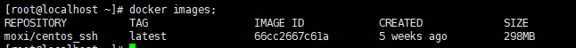
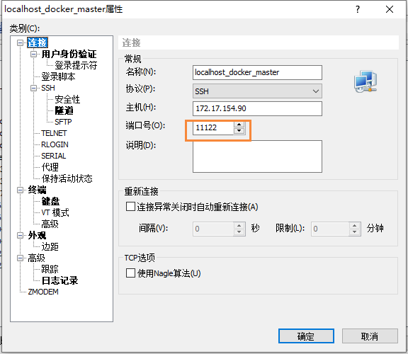
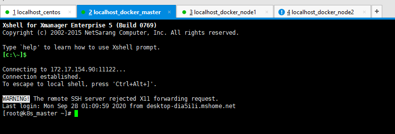

# 使用Docker搭建K8S集群

## 前言

今天打算使用Docker来搭建K8S集群，因为同时用VMware创建几个服务器，感觉比较麻烦，所以就打算使用Docker来把这些软件安装一波~

## 安装Docker

首先配置一下docker阿里云yum源

```bash
cat >>/etc/yum.repos.d/docker.repo<<EOF
[docker-ce-edge]
name=Docker CE Edge - \$basearch
baseurl=https://mirrors.aliyun.com/docker-ce/linux/centos/7/\$basearch/edge
enabled=1
gpgcheck=1
gpgkey=https://mirrors.aliyun.com/docker-ce/linux/centos/gpg
EOF
```

然后yum方式安装docker

```bash
# yum安装
yum -y install docker-ce

# 查看docker版本
docker --version  

# 启动docker
systemctl enable docker
systemctl start docker
```

## 拉取镜像

安装完docker后，我们就需要拉取我之前制作的Centos镜像了，该镜像带有ssh无密登录的

```bash
docker pull moxi/centos_ssh
```

然后在使用下面命令查看刚刚拉取的镜像

```bash
docker images;
```



下面我们就需要开始制作我们的容器了，本次需要制作三个容器，k8s_master、k8s_node1、k8s_node2

```bash
# 制作 k8s_master
docker run --privileged -d -it -h k8s_master --name k8s_master -v /etc/localtime:/etc/localtime:ro -p 11122:22 moxi/centos_ssh /usr/sbin/init

# 制作 k8s_node1
docker run --privileged -d -it -h k8s_node1 --name k8s_node1 -v /etc/localtime:/etc/localtime:ro -p 11222:22 moxi/centos_ssh /usr/sbin/init

# 制作 k8s_node2
docker run --privileged -d -it -h k8s_node2 --name k8s_node2 -v /etc/localtime:/etc/localtime:ro -p 11322:22 moxi/centos_ssh /usr/sbin/init
```

然后执行下面命令，就可以看到我们刚刚制作的容器了

```bash
docker ps -a
```


## 连接容器

下面我们需要使用xshell远程连接我们制作的3个容器



这里需要注意一下端口号，三个服务器的端口号分别如下所示

- 11122：k8s_master
- 11222：k8s_node1
- 11322：k8s_node2

然后点击确定，输入账号密码：root  mogu2018

即可连接到我们的docker容器中



> 上图打开的4个窗口，一个代表宿主机，其它三个就是我们创建的容器

## 操作容器

下面我们需要进入到每个容器里面，执行下面的代码

```bash
# 临时 关闭swap
swapoff -a  

# 根据规划设置主机名
hostnamectl set-hostname k8s_master
hostnamectl set-hostname k8s_node1
hostnamectl set-hostname k8s_node2

# 在master节点添加hosts
vi /etc/hosts
172.18.0.2      k8s_master
172.18.0.3      k8s_node1
172.18.0.4      k8s_node2

# 时间同步
yum install ntpdate -y
ntpdate time.windows.com
```

## 容器中安装软件

### 安装Docker

在我们制作好容器后，我们需要在容器中，继续安装Docker，然后在里面安装Kibernetes、Kubelet 和 Kubectl

安装Docker的步骤，和上面是一样的

首先配置一下docker阿里云yum源

```bash
cat >>/etc/yum.repos.d/docker.repo<<EOF
[docker-ce-edge]
name=Docker CE Edge - \$basearch
baseurl=https://mirrors.aliyun.com/docker-ce/linux/centos/7/\$basearch/edge
enabled=1
gpgcheck=1
gpgkey=https://mirrors.aliyun.com/docker-ce/linux/centos/gpg
EOF
```

然后yum方式安装

```bash
# 安装docker
yum -y install docker-ce

# 设置开机自启
systemctl enable docker
# 启动docker
systemctl start docker

# 查看docker版本
docker --version  
```

### 添加阿里云软件源

然后在添加阿里云的软件源，如kubernetes、Kubelet 等

```bash
cat >> /etc/yum.repos.d/kubernetes.repo << EOF
[kubernetes]
name=Kubernetes
baseurl=https://mirrors.aliyun.com/kubernetes/yum/repos/kubernetes-el7-x86_64
enabled=1
gpgcheck=0
repo_gpgcheck=0
gpgkey=https://mirrors.aliyun.com/kubernetes/yum/doc/yum-key.gpg https://mirrors.aliyun.com/kubernetes/yum/doc/rpm-package-key.gpg
EOF
```

### 安装Kubeadm

