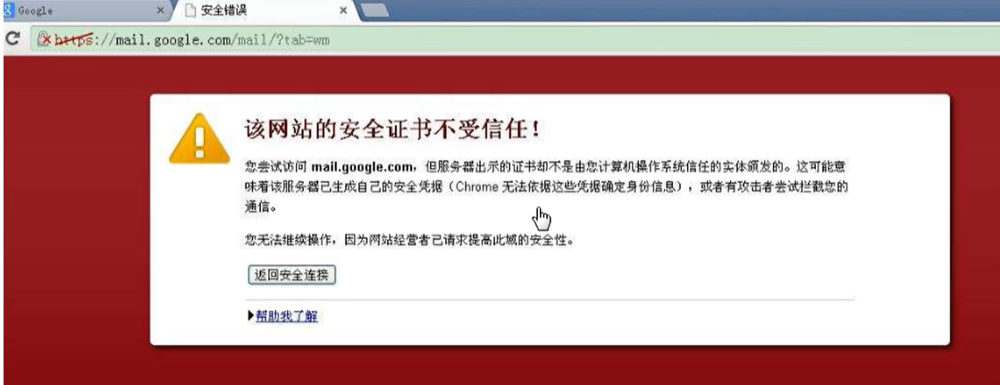
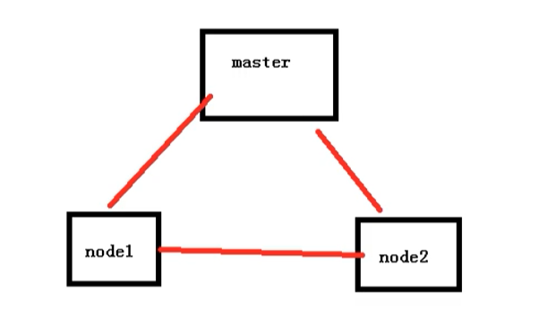
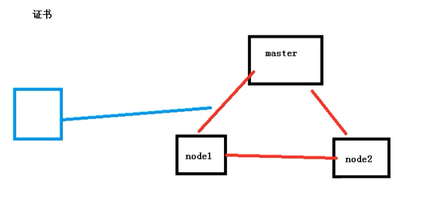

# 使用二进制方式搭建K8S集群

## 注意

**【暂时没有使用二进制方式搭建K8S集群，因此本章节内容不完整... 欢迎小伙伴能补充~】**


## 准备工作

在开始之前，部署Kubernetes集群机器需要满足以下几个条件

- 一台或多台机器，操作系统CentOS 7.x
- 硬件配置：2GB ，2个CPU，硬盘30GB
- 集群中所有机器之间网络互通
- 可以访问外网，需要拉取镜像，如果服务器不能上网，需要提前下载镜像导入节点
- 禁止swap分区

## 步骤

- 创建多台虚拟机，安装Linux系统
- 操作系统的初始化
- 为etcd 和 apiserver 自签证书
- 部署etcd集群
- 部署master组件【安装docker、kube-apiserver、kube-controller-manager、kube-scheduler、etcd】
- 部署node组件【安装kubelet、kube-proxy、docker、etcd】
- 部署集群网络

## 准备虚拟机

首先我们准备了两台虚拟机，来进行安装测试

| 主机名       | ip              |
| ------------ | --------------- |
| k8s_2_master | 192.168.177.140 |
| k8s_2_node   | 192.168.177.141 |

## 操作系统的初始化

然后我们需要进行一些系列的初始化操作

```bash
# 关闭防火墙
systemctl stop firewalld
systemctl disable firewalld

# 关闭selinux
# 永久关闭
sed -i 's/enforcing/disabled/' /etc/selinux/config  
# 临时关闭
setenforce 0  

# 关闭swap
# 临时
swapoff -a 
# 永久关闭
sed -ri 's/.*swap.*/#&/' /etc/fstab

# 根据规划设置主机名【master节点上操作】
hostnamectl set-hostname k8s_2_master
# 根据规划设置主机名【node1节点操作】
hostnamectl set-hostname k8s_2_node1


# 在master添加hosts
cat >> /etc/hosts << EOF
192.168.177.140 k8s_2_master
192.168.177.141 k8s_2_node1
EOF


# 将桥接的IPv4流量传递到iptables的链
cat > /etc/sysctl.d/k8s.conf << EOF
net.bridge.bridge-nf-call-ip6tables = 1
net.bridge.bridge-nf-call-iptables = 1
EOF
# 生效
sysctl --system  

# 时间同步
yum install ntpdate -y
ntpdate time.windows.com
```

## 部署Etcd集群

Etcd是一个分布式键值存储系统，Kubernetes使用Etcd进行数据存储，所以先准备一个Etcd数据库，为了解决Etcd单点故障，应采用集群方式部署，这里使用3台组建集群，可容忍一台机器故障，当然也可以使用5台组件集群，可以容忍2台机器故障

### 自签证书

提到证书，我们想到的就是下面这个情况



这个https证书，其实就是服务器颁发给网站的，代表这是一个安全可信任的网站。

而在我们K8S集群的内部，其实也是有证书的，如果不带证书，那么访问就会受限



同时在集群内部 和 外部的访问，我们也需要签发证书



如果我们使用二进制的方式，那么就需要自己手动签发证书。

自签证书：我们可以想象成在一家公司上班，然后会颁发一个门禁卡，同时一般门禁卡有两种，一个是内部员工的门禁卡，和外部访客门禁卡。这两种门禁卡的权限可能不同，员工的门禁卡可以进入公司的任何地方，而访客的门禁卡是受限的，这个门禁卡其实就是自签证书


### 准备cfssl证书生成工具

cfssl是一个开源的证书管理工具，使用json文件生成证书，相比openssl 更方便使用。找任意一台服务器操作，这里用Master节点。

```bash
wget https://pkg.cfssl.org/R1.2/cfssl_linux-amd64
wget https://pkg.cfssl.org/R1.2/cfssljson_linux-amd64
wget https://pkg.cfssl.org/R1.2/cfssl-certinfo_linux-amd64
chmod +x cfssl_linux-amd64 cfssljson_linux-amd64 cfssl-certinfo_linux-amd64
mv cfssl_linux-amd64 /usr/local/bin/cfssl
mv cfssljson_linux-amd64 /usr/local/bin/cfssljson
mv cfssl-certinfo_linux-amd64 /usr/bin/cfssl-certinfo
```

