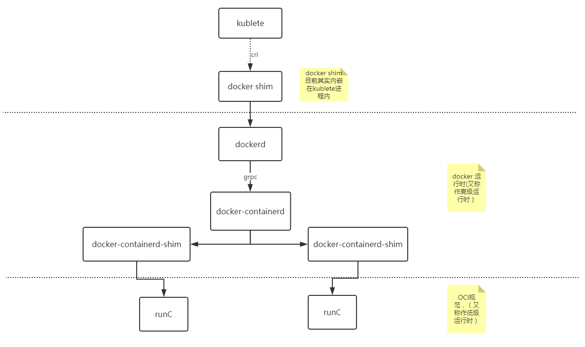

# Kubernetes中的CRI

## 前言

**Kubernetes** 节点的底层由一个叫做**容器运行时**的软件进行支撑，它主要负责启停容器。

**Docker** 是目前最广为人知的容器运行时软件，但是它并非唯一。在这几年中，容器运行时这个领域发展的迅速。为了使得 **Kubernetes** 的扩展变得更加容易，一直在打磨支持容器运行时的 **K8S**插件 **API**，也就是 容器运行时接口 ( Container Runtime Interface, CRI) 。

## k8s架构

这里通过分析 **k8s** 目前默认的一种容器运行时架构，来帮助我们更好的理解 **k8s** 运行时的背后逻辑，同时引出 **CRI** 和 **OCI** 提出的背景。

我们在创建 **k8s** 集群的时候，首先需要搭建 **master** 节点，其次需要创建 **node** 节点，并将 **node** 节点加入到 **k8s** 集群中。当我们构建好 **k8s** 集群后，可以通过 下面命令来创建应用对应的pod

```bash
kubectl create -f nginx.yml
```

执行完成后，该命令首先会提交给 **API Server** ，然后解析 **yml** 文件，并对其以 **API** 对象的形式存到 **etcd** 里。

这时候，**master** 组件中的 **Controller Manager** 会通过控制循环的方式来做编排工作，创建应用所需的Pod。同时 **Scheduler** 会 **watch etcd** 中新 **pod** 的变化，如果他发现有一个新的 **pod** 的变化。

如果 **Scheduler** 发现有一个新的 **pod** 出现，它会运行调度算法，然后选择出最佳的 **Node** 节点，并将这个节点的名字写到 **pod** 对象的 **NodeName** 字段上，这一步就是所谓的 **Bind Pod to Node**，然后把 **bind** 的结果写到 **etcd**。

其次，当我们在构建 **k8s** 集群的时候，默认每个节点都会初始化创建一个 **kubectl** 进程，**kubectl** 进程会  **watch etcd** 中 **pod** 的变化，当 **kubectl** 进程监听到 **pod** 的 **bind** 的更新操作，并且 **bind** 的节点是本节点时，它会接管接下来的所有事情，如镜像下载，创建容器等。


## k8s默认容器运行时架构

接下来将通过 **k8s** 默认集成的容器运行时架构，来看 **kubernetes** 如何创建一个容器 （如下图）

- **kubernetes** 通过 **CRI** (Container Runtime Interface) 接口调用 **dockershim**，请求创建一个容器。这一步中，**Kubectl** 可以视作一个简单的 **CRI Client**，而 **dockershim** 就是接收的 **Server**。
- **dockershim** 收到请求后，通过适配的方式，适配成 **Docker Daemon** 的请求格式，发到 **Docker Daemon** 上请求创建一个容器。在 docker 1.12 后的版本，docker daemon 被拆分成了 **dockerd** 和 **containerd**，其中，**containerd** 负责操作容器。
- **dockerd** 收到请求后，会调用 **containerd** 进程去创建一个容器
- **containerd** 收到请求后，并不会自己直接去操作容器，而是创建一个叫做 **containerd-shim** 的进程，让 **containerd-shim** 去操作容器，创建 **containerd-shim** 的目的主要有以下几个
  - 让 **containerd-shim** 做诸如收集状态，维持 stdin 等 fd 打开等工作。
  - 允许容器运行时( **runC** ) 启动容器后退出，不必为每个容器一直运行一个容器运行时的 **runC**
  - 即使在 **containerd** 和 **dockerd** 都挂掉的情况下，容器的标准 IO 和其它的文件描述符也是可以用的
  - 向 **containerd** 报告容器的退出状态
  - 在不中断容器运行时的情况下，升级或重启 **dockerd**
- 而 **containerd-shim** 在这一步需要调用 **runC** 这个命令行工具，来启动容器，**runC** 是 **OCI** (Open Container Initiative， 开放标准协议) 的一个参考实现。主要用来设置 **namespaces** 和 **cgroups**，挂载 root filesystem等操作。
- **runC** 启动完容器后，本身会直接退出。**containerd-shim** 则会成为容器进程的父进程，负责收集容器进程的状态，上报给 **containerd**，并在容器中的 **pid** 为 **1** 的进程退出后接管容器中的子进程进行清理，确保不会出现僵尸进程 (关闭进程描述符)。



## 容器与容器编排背景

从 **k8s** 的容器运行时可以看出，**kubectl** 启动容器的过程经过了很长的一段调用链路。这个是由于在容器及编排领域各大厂商与 **docker** 之间的竞争以及 **docker** 公司为了抢占 **Pass** ( Platform-as-a-service，平台服务)  领域市场，对架构做出的一系列调整。

其实 **k8s** 最开始的运行时架构链路调用没有这么复杂：kubelet想要创建容器直接通过 **docker api** 调用 **Docker Daemon** ， 然后Docker Daemon 调用 libcontainer 这个库来启动容器。

后面为了防止 **docker** 垄断以及受控 docker 运行时，各大厂商于是就联合起来，制订出 开放容器标准**OCI** ( Open Containers Initiative ) 。大家可以基于这个标准开发自己的容器运行时。Docker公司则把 **libcontainer** 做了一层封装，变成 **runC** 捐献给 **CNCF** 作为 **OCI** 的参考实现。

接下来就是 **Docker** 要搞 **Swarm** 进军 **PaaS** 市场，于是做了个架构切分，把容器操作都移动到一个单独的 **Daemon** 进程的 **containerd** 中去，让 Docker Daemon专门负责上层封装编排，但是最终 **Swarm** 败给了 **K8S** ，于是Docker公司就把 **Containerd** 捐给了 CNCF，专注于搞 **Docker** 企业版了。

与此同时，容器领域 **core os** 公司推出了 **rkt** 容器运行时，希望 **k8s** 原生支持 **rkt** 作为运行时，由于 **core os** 与 **Google** 的关系，最终 **rkt** 运行时的支持在 **2016** 年也被合并进 **kubelet** 主干代码里，这样做反而给 **k8s** 中负责维护 **kubelet** 的小组 **SIG-Node** 带来了更大的负担，每一次 **kubectl** 的更新都要维护 **docker** 和 **rkt** 作为两部分代码。与此同时，随着虚拟化技术强隔离容器技术 **runV** (Kata Containers 前身, 后与 intel clear container 合并)的逐渐成熟。**K8S** 上游对虚拟化容器的支持很快被提上日程。为了从集成每一种运行时都要维护的一份代码中解救出来，**K8S SIG-Node** 工作组决定对容器的操作统一地抽象成一个接口，这样 **kubelet** 只需要跟这个接口打交道，而具体地容器运行时，他们只需要实现该接口，并对kubelet暴露 **gRPC** 服务即可。这个统一地抽象的接口就是 **k8s** 中俗称的 **CRI**。

## CRI接口

**CRI** (容器运行时接口)基于 **gRPC** 定义了 **RuntimeService** 和 **ImageService** 等两个 **gRPC** 服务，分别用于容器运行时和镜像的管理。如下所示

```go
// Runtime service defines the public APIs for remote container runtimes
service RuntimeService {
    // Version returns the runtime name, runtime version, and runtime API version.
    rpc Version(VersionRequest) returns (VersionResponse) {}
 
    // RunPodSandbox creates and starts a pod-level sandbox. Runtimes must ensure
    // the sandbox is in the ready state on success.
    rpc RunPodSandbox(RunPodSandboxRequest) returns (RunPodSandboxResponse) {}
    // StopPodSandbox stops any running process that is part of the sandbox and
    // reclaims network resources (e.g., IP addresses) allocated to the sandbox.
    // If there are any running containers in the sandbox, they must be forcibly
    // terminated.
    // This call is idempotent, and must not return an error if all relevant
    // resources have already been reclaimed. kubelet will call StopPodSandbox
    // at least once before calling RemovePodSandbox. It will also attempt to
    // reclaim resources eagerly, as soon as a sandbox is not needed. Hence,
    // multiple StopPodSandbox calls are expected.
    rpc StopPodSandbox(StopPodSandboxRequest) returns (StopPodSandboxResponse) {}
    // RemovePodSandbox removes the sandbox. If there are any running containers
    // in the sandbox, they must be forcibly terminated and removed.
    // This call is idempotent, and must not return an error if the sandbox has
    // already been removed.
    rpc RemovePodSandbox(RemovePodSandboxRequest) returns (RemovePodSandboxResponse) {}
    // PodSandboxStatus returns the status of the PodSandbox. If the PodSandbox is not
    // present, returns an error.
    rpc PodSandboxStatus(PodSandboxStatusRequest) returns (PodSandboxStatusResponse) {}
    // ListPodSandbox returns a list of PodSandboxes.
    rpc ListPodSandbox(ListPodSandboxRequest) returns (ListPodSandboxResponse) {}
 
    // CreateContainer creates a new container in specified PodSandbox
    rpc CreateContainer(CreateContainerRequest) returns (CreateContainerResponse) {}
    // StartContainer starts the container.
    rpc StartContainer(StartContainerRequest) returns (StartContainerResponse) {}
    // StopContainer stops a running container with a grace period (i.e., timeout).
    // This call is idempotent, and must not return an error if the container has
    // already been stopped.
    // TODO: what must the runtime do after the grace period is reached?
    rpc StopContainer(StopContainerRequest) returns (StopContainerResponse) {}
    // RemoveContainer removes the container. If the container is running, the
    // container must be forcibly removed.
    // This call is idempotent, and must not return an error if the container has
    // already been removed.
    rpc RemoveContainer(RemoveContainerRequest) returns (RemoveContainerResponse) {}
    // ListContainers lists all containers by filters.
    rpc ListContainers(ListContainersRequest) returns (ListContainersResponse) {}
    // ContainerStatus returns status of the container. If the container is not
    // present, returns an error.
    rpc ContainerStatus(ContainerStatusRequest) returns (ContainerStatusResponse) {}
    // UpdateContainerResources updates ContainerConfig of the container.
    rpc UpdateContainerResources(UpdateContainerResourcesRequest) returns (UpdateContainerResourcesResponse) {}
    // ReopenContainerLog asks runtime to reopen the stdout/stderr log file
    // for the container. This is often called after the log file has been
    // rotated. If the container is not running, container runtime can choose
    // to either create a new log file and return nil, or return an error.
    // Once it returns error, new container log file MUST NOT be created.
    rpc ReopenContainerLog(ReopenContainerLogRequest) returns (ReopenContainerLogResponse) {}
 
    // ExecSync runs a command in a container synchronously.
    rpc ExecSync(ExecSyncRequest) returns (ExecSyncResponse) {}
    // Exec prepares a streaming endpoint to execute a command in the container.
    rpc Exec(ExecRequest) returns (ExecResponse) {}
    // Attach prepares a streaming endpoint to attach to a running container.
    rpc Attach(AttachRequest) returns (AttachResponse) {}
    // PortForward prepares a streaming endpoint to forward ports from a PodSandbox.
    rpc PortForward(PortForwardRequest) returns (PortForwardResponse) {}
 
    // ContainerStats returns stats of the container. If the container does not
    // exist, the call returns an error.
    rpc ContainerStats(ContainerStatsRequest) returns (ContainerStatsResponse) {}
    // ListContainerStats returns stats of all running containers.
    rpc ListContainerStats(ListContainerStatsRequest) returns (ListContainerStatsResponse) {}
 
    // UpdateRuntimeConfig updates the runtime configuration based on the given request.
    rpc UpdateRuntimeConfig(UpdateRuntimeConfigRequest) returns (UpdateRuntimeConfigResponse) {}
 
    // Status returns the status of the runtime.
    rpc Status(StatusRequest) returns (StatusResponse) {}
}
 
// ImageService defines the public APIs for managing images.
service ImageService {
    // ListImages lists existing images.
    rpc ListImages(ListImagesRequest) returns (ListImagesResponse) {}
    // ImageStatus returns the status of the image. If the image is not
    // present, returns a response with ImageStatusResponse.Image set to
    // nil.
    rpc ImageStatus(ImageStatusRequest) returns (ImageStatusResponse) {}
    // PullImage pulls an image with authentication config.
    rpc PullImage(PullImageRequest) returns (PullImageResponse) {}
    // RemoveImage removes the image.
    // This call is idempotent, and must not return an error if the image has
    // already been removed.
    rpc RemoveImage(RemoveImageRequest) returns (RemoveImageResponse) {}
    // ImageFSInfo returns information of the filesystem that is used to store images.
    rpc ImageFsInfo(ImageFsInfoRequest) returns (ImageFsInfoResponse) {}
}
```

具体容器运行时则需要实现 **CRI** 定义的接口（即 **gRPC Server**，通常称为 **CRI shim**）。容器运行时在启动 **gRPC server** 时需要监听在本地的 **Unix Socket** （Windows 使用 tcp 格式）。

## 参考

https://www.kubernetes.org.cn/1079.html

https://www.cnblogs.com/justinli/p/11578951.html    