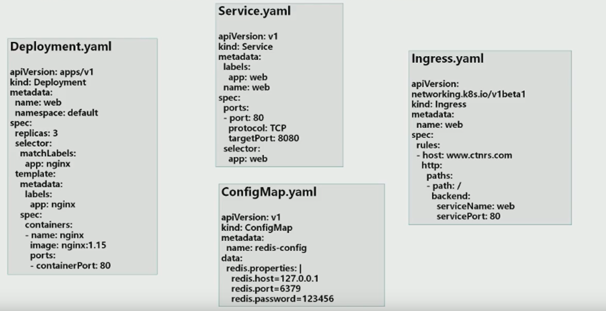
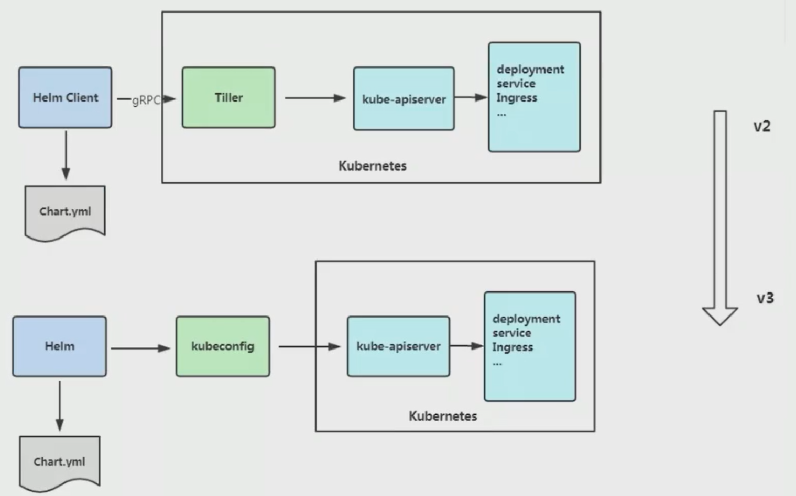
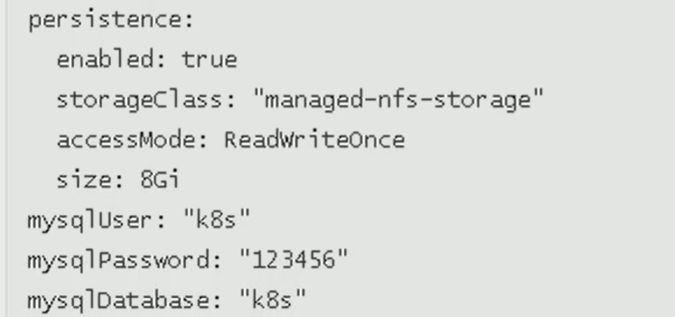
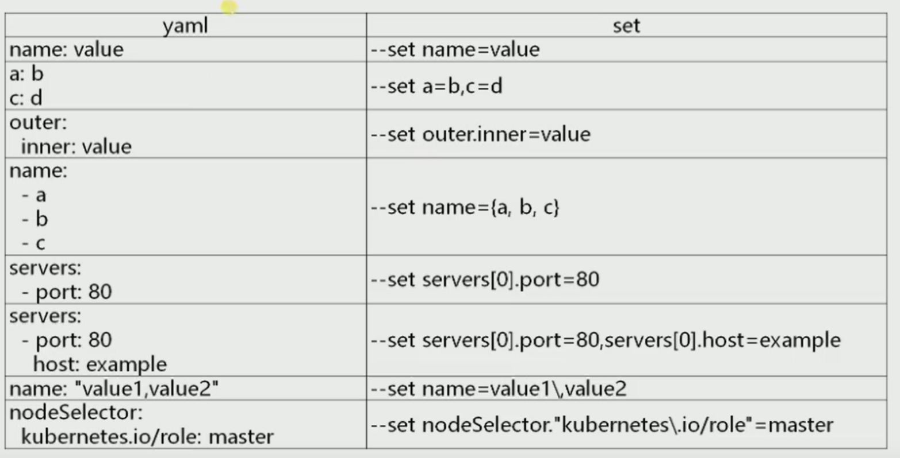
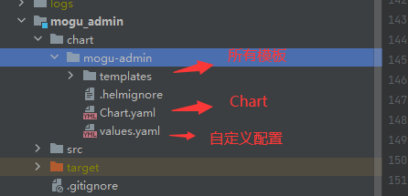

# Heml应用包管理器

helm学习文档：https://helm.sh/zh/docs/

## 为什么要使用Helm？

**K8S** 上的应用对象，都是由特定的资源描述组成，包括 **deployment**、**services** 等。都保存各自文件中或者集中写到
一个配置文件。然后 **kubectl apply -f** 部署。



 如果应用只由一个或几个这样的服务组成，上面部署方式足够了。

而对于一个复杂的应用，会有很多类似上面的资源描述文件，例如微服务架构应用，组成应用的服务可能多达十
个，几十个。如果有更新或回滚应用的需求，可能要修改和维护所涉及的大量资源文件，而这种组织和管理应用的
方式就显得力不从心了。

且由于缺少对发布过的应用版本管理和控制，使 **Kubernetes** 上的应用维护和更新等面临诸多的桃战，主要面临以下问题：

- 如何将这些服务作为一个整体管理
- 这些资源文件如何高效复用
- 不支持应用级别的版本管理

## Helm介绍

Helm是一个Kubernetes的包管理工具，就像 Linux下的包管理器，如 yml、apt等，可以方便将之前打包好的 yaml 文件部署到 Kubernetes 上

Heml 有两个重要的概念：

- heml：一个命令行客户端工具，主要用于 kubernetes 应用 chart 的创建、打包、发布和管理
- Chart：应用描述，一系列用于描述 k8s 资源相关文件的集合
- Release：基于Chart的部署实体，一个chart 被 helm 运行后将会生成一个release，将在 k8s 中创建出真实运行的资源对象

## Helm v3 变化

2019 年 11 月 13 日，Helm 团队发布 helm v3 的第一个稳定版本

该版本主要的变化如下：

### 架构变化

最明显的是 Tiller 的删除




- release 名称可以在不同命名空间重用

- 支持将Chart推送至Docker 镜像仓库中
- 使用JSONSchema验证 chart values

## 部署 helm 客户端

Helm客户端下载地址：Github 搜 heml

> https://github.com/helm/helm/releases/tag/v3.9.3

## Helm常用命令

| 命令       | 描述                                                         |
| ---------- | ------------------------------------------------------------ |
| create     | 创建一个chart并指定名称                                      |
| dependency | 管理chart依赖                                                |
| get        | 下载release，可用子命令：all、hooks、manifest、notes、value  |
| history    | 获取release历史                                              |
| install    | 安装一个chart                                                |
| list       | 列出release                                                  |
| package    | 将chart目录打包到chart存档文件中                             |
| pull       | 从远程仓库中下载chart并解压到本地； helm pull stable/mysql --untar |
| repo       | 添加、列出、移除、更新和索引chart仓库                        |
| rollback   | 从之前版本回滚                                               |
| search     | 根据关键字搜索Chart                                          |
| show       | 查看chart详细信息                                            |
| template   | 本地呈现模板                                                 |
| uninstall  | 卸载一个release                                              |
| upgrade    | 更新一个release                                              |
| version    | 查看helm客户端版本                                           |

## 配置国内 **chart** 仓库

- 微软仓库
- 阿里云仓库
- 官方仓库，官方chart仓库，国内不太好使

添加存储库

```bash
helm repo add stable http://xxxx.xxx
helm repo add aliyun http://xxx.xxx
helm repo update
```

查看配置的存储库

```bash
helm repo list
helm repo repo stable
```

一直在stable存储库中安装 charts，你可以配置其它存储库

删除存储库

```bash
helm repo remove aliyun
```

## helm基本使用

主要介绍三个命令

- chart install：安装
- chart upgrade：升级
- chart rollback：回滚

### 使用chart部署一个应用

查找chart

```bash
helm search repo
helm search repo mysql
```

为什么 mariadb 也在列表中？因为和mysql有关

```bash
helm show  stable/mysql values
```

部署 mysql

```bash
helm install my_db stable/mysql
```

查看 pod 的详细信息

```bash
kubectl get pods 
kubectl describe pod pod_name
```

需要绑定 pv

## 自定义chart配置选项

上面部署的mysql并没有成功，这是因为并不是所有的charts都能够按照默认配置运行成功，可能会依赖一些环境依赖，比如 PV

所有，我们需要自定义 chart 配置选项，安装过程中有两种方法可以传递配置数据：

- --values（或 -f）：指定带有覆盖的YAML文件，这里可以多次指定，最右边的文件优先
- --set：在命令行上指定替代，如果两者都用，--set优先级高

--values使用，先将修改的变量写到一个文件中

```BASH
heml show values stable/mysql
cat config.yaml
```

然后在 config.yaml 中，写上下面的数据



然后执行下列命令

```bash
helm install db -f config.yaml stable/mysql;
kubectl get pods;
```

以上，将创建具有名称的默认MySQL用户k8s，并授权此用户访问新创建的数据库的权限，但将接收该图标的数据所有其余默认值

命令行替换变量：

```bash
helm install db --set persistence.storageClass= "managed-ngf-storage" stable/mysql
```

也可以将chart包下载下来，查看详情

```bash
helm pull stable/mysql --untar
```

values yaml 与 set 使用




以蘑菇为例，如何制作 heml 包



## 构建一个Heml Chart

可以通过下面名， 创建一个 heml 目录

```bash
helm create mychart
```

最后生成的目录结构如上所示