# Kubernetes核心技术-Controller

## 内容

- 什么是Controller
- Pod和Controller的关系
- Deployment控制器应用场景
- yaml文件字段说明
- Deployment控制器部署应用
- 升级回滚
- 弹性伸缩

## 什么是Controller

Controller是在集群上管理和运行容器的对象，Controller是实际存在的，Pod是虚拟机的

## Pod和Controller的关系

Pod是通过Controller实现应用的运维，比如弹性伸缩，滚动升级等

Pod 和 Controller之间是通过label标签来建立关系，同时Controller又被称为控制器工作负载

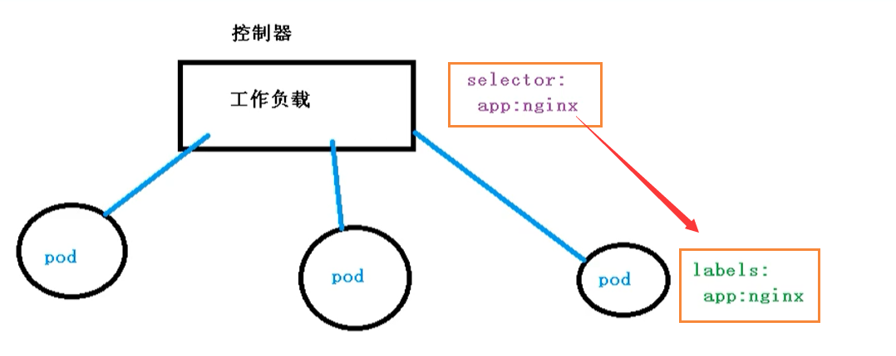

## Deployment控制器应用

- Deployment控制器可以部署无状态应用
- 管理Pod和ReplicaSet
- 部署，滚动升级等功能
- 应用场景：web服务，微服务

Deployment表示用户对K8S集群的一次更新操作。Deployment是一个比RS( Replica Set, RS) 应用模型更广的 API 对象，可以是创建一个新的服务，更新一个新的服务，也可以是滚动升级一个服务。滚动升级一个服务，实际是创建一个新的RS，然后逐渐将新 RS 中副本数增加到理想状态，将旧RS中的副本数减少到0的复合操作。

这样一个复合操作用一个RS是不好描述的，所以用一个更通用的Deployment来描述。以K8S的发展方向，未来对所有长期伺服型的业务的管理，都会通过Deployment来管理。

## Deployment部署应用

之前我们也使用Deployment部署过应用，如下代码所示

```bash
kubectrl create deployment web --image=nginx
```

但是上述代码不是很好的进行复用，因为每次我们都需要重新输入代码，所以我们都是通过YAML进行配置

但是我们可以尝试使用上面的代码创建一个镜像【只是尝试，不会创建】

```bash
kubectl create deployment web --image=nginx --dry-run -o yaml > nginx.yaml
```

然后输出一个yaml配置文件 `nginx.yml` ，配置文件如下所示

```bash
apiVersion: apps/v1
kind: Deployment
metadata:
  creationTimestamp: null
  labels:
    app: web
  name: web
spec:
  replicas: 1
  selector:
    matchLabels:
      app: web
  strategy: {}
  template:
    metadata:
      creationTimestamp: null
      labels:
        app: web
    spec:
      containers:
      - image: nginx
        name: nginx
        resources: {}
status: {}
```

我们看到的 selector 和 label 就是我们Pod 和 Controller之间建立关系的桥梁

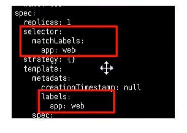

### 使用YAML创建Pod

通过刚刚的代码，我们已经生成了YAML文件，下面我们就可以使用该配置文件快速创建Pod镜像了

```bash
kubectl apply -f nginx.yaml
```

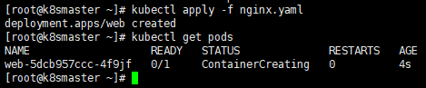

但是因为这个方式创建的，我们只能在集群内部进行访问，所以我们还需要对外暴露端口

```bash
kubectl expose deployment web --port=80 --type=NodePort --target-port=80 --name=web1
```

关于上述命令，有几个参数

- --port：就是我们内部的端口号
- --target-port：就是暴露外面访问的端口号
- --name：名称
- --type：类型

同理，我们一样可以导出对应的配置文件

```bash
kubectl expose deployment web --port=80 --type=NodePort --target-port=80 --name=web1 -o yaml > web1.yaml
```

得到的web1.yaml如下所示

```bash
apiVersion: v1
kind: Service
metadata:
  creationTimestamp: "2020-11-16T02:26:53Z"
  labels:
    app: web
  managedFields:
  - apiVersion: v1
    fieldsType: FieldsV1
    fieldsV1:
      f:metadata:
        f:labels:
          .: {}
          f:app: {}
      f:spec:
        f:externalTrafficPolicy: {}
        f:ports:
          .: {}
          k:{"port":80,"protocol":"TCP"}:
            .: {}
            f:port: {}
            f:protocol: {}
            f:targetPort: {}
        f:selector:
          .: {}
          f:app: {}
        f:sessionAffinity: {}
        f:type: {}
    manager: kubectl
    operation: Update
    time: "2020-11-16T02:26:53Z"
  name: web2
  namespace: default
  resourceVersion: "113693"
  selfLink: /api/v1/namespaces/default/services/web2
  uid: d570437d-a6b4-4456-8dfb-950f09534516
spec:
  clusterIP: 10.104.174.145
  externalTrafficPolicy: Cluster
  ports:
  - nodePort: 32639
    port: 80
    protocol: TCP
    targetPort: 80
  selector:
    app: web
  sessionAffinity: None
  type: NodePort
status:
  loadBalancer: {}
```

然后我们可以通过下面的命令来查看对外暴露的服务

```bash
kubectl get pods,svc
```

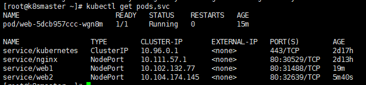

然后我们访问对应的url，即可看到 nginx了 `http://192.168.177.130:32639/`

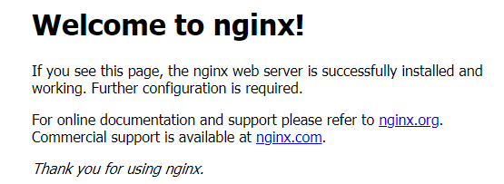

## 升级回滚和弹性伸缩

- 升级：  假设从版本为1.14 升级到 1.15 ，这就叫应用的升级【升级可以保证服务不中断】
- 回滚：从版本1.15 变成 1.14，这就叫应用的回滚
- 弹性伸缩：我们根据不同的业务场景，来改变Pod的数量对外提供服务，这就是弹性伸缩

### 应用升级和回滚

首先我们先创建一个 1.14版本的Pod

```bash
apiVersion: apps/v1
kind: Deployment
metadata:
  creationTimestamp: null
  labels:
    app: web
  name: web
spec:
  replicas: 1
  selector:
    matchLabels:
      app: web
  strategy: {}
  template:
    metadata:
      creationTimestamp: null
      labels:
        app: web
    spec:
      containers:
      - image: nginx:1.14
        name: nginx
        resources: {}
status: {}
```

我们先指定版本为1.14，然后开始创建我们的Pod

```bash
kubectl apply -f nginx.yaml
```

同时，我们使用docker images命令，就能看到我们成功拉取到了一个 1.14版本的镜像

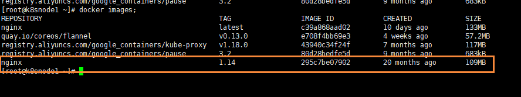

我们使用下面的命令，可以将nginx从 1.14 升级到 1.15

```bash
kubectl set image deployment web nginx=nginx:1.15
```

在我们执行完命令后，能看到升级的过程

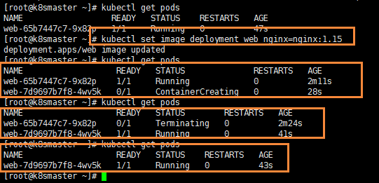

- 首先是开始的nginx 1.14版本的Pod在运行，然后 1.15版本的在创建
- 然后在1.15版本创建完成后，就会暂停1.14版本
- 最后把1.14版本的Pod移除，完成我们的升级

我们在下载 1.15版本，容器就处于ContainerCreating状态，然后下载完成后，就用 1.15版本去替换1.14版本了，这么做的好处就是：升级可以保证服务不中断

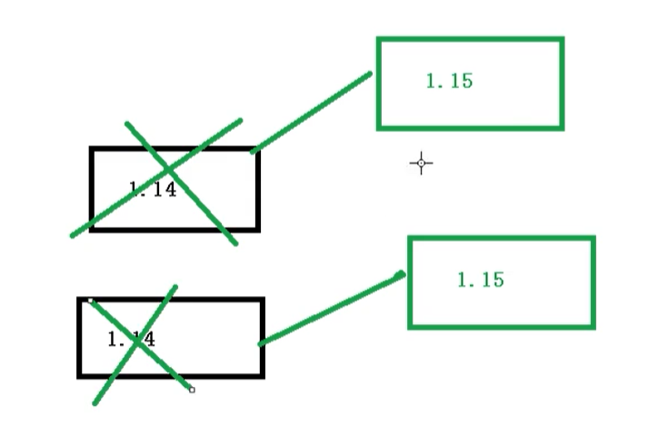

我们到我们的node2节点上，查看我们的 docker images;

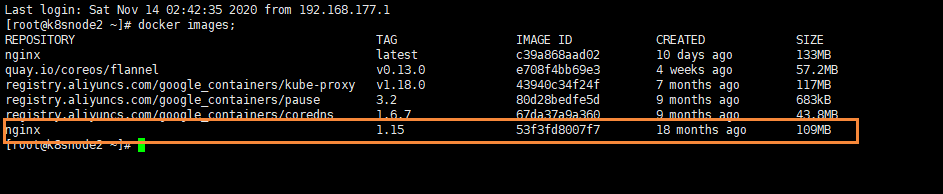

能够看到，我们已经成功拉取到了 1.15版本的nginx了

#### 查看升级状态

下面可以，查看升级状态

```bash
kubectl rollout status deployment web
```

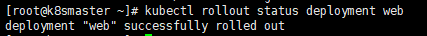

#### 查看历史版本

我们还可以查看历史版本

```bash
kubectl rollout history deployment web
```

#### 应用回滚

我们可以使用下面命令，完成回滚操作，也就是回滚到上一个版本

```bash
kubectl rollout undo deployment web
```

然后我们就可以查看状态

```bash
kubectl rollout status deployment web
```

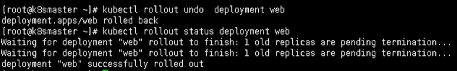

同时我们还可以回滚到指定版本

```bash
kubectl rollout undo deployment web --to-revision=2
```

### 弹性伸缩

弹性伸缩，也就是我们通过命令一下创建多个副本

```bash
kubectl scale deployment web --replicas=10
```

能够清晰看到，我们一下创建了10个副本

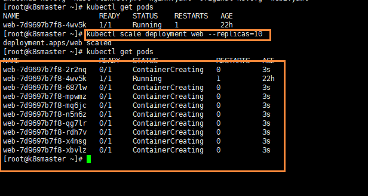