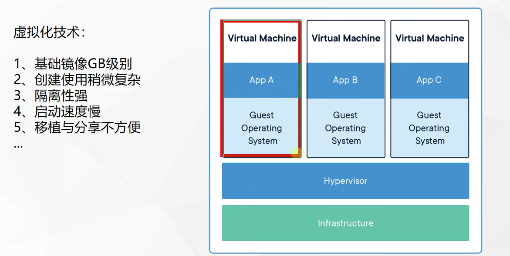
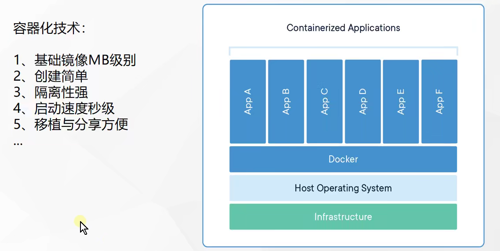
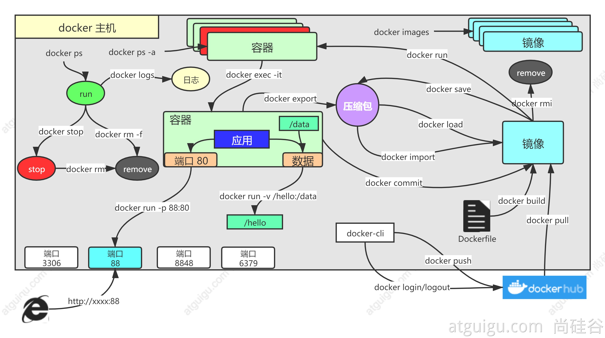
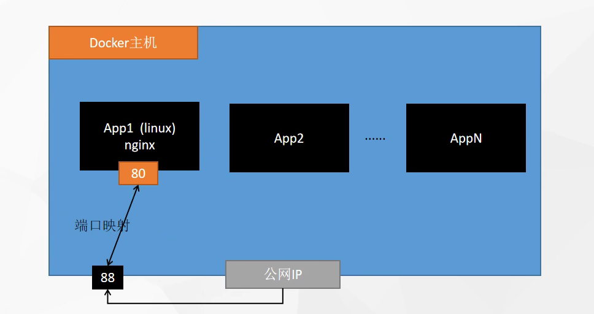
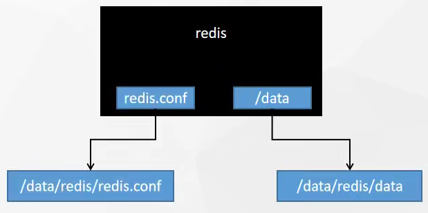

# Docker基本概念

# 1、解决的问题

## 1、统一标准

- 应用构建 

- - Java、C++、JavaScript
  - 打成软件包

- - .exe
  - docker build ：打包成镜像

- 应用分享

- - 所有软件的镜像放到一个指定地方：  dockerhub
  - 安卓：应用市场

- 应用运行

- - 统一标准的镜像**
  - 直接执行：docker run

- .......

> Docker的出现，进了容器化时代

 下面是虚拟化技术和容器化技术的对比

### 虚拟化技术

虚拟化技术的代表作是：VMware

- 基础镜像都是GB级别
- 创建使用稍微复杂
- 隔离性强
- 启动速度慢
- 移植与分享不方便



### 容器化技术

容器化技术：

- 基础镜像MB级别
- 创建简单
- 隔离性强
- 启动速度秒级
- 移植与分享方便



## 2、资源隔离

- cpu、memory资源隔离与限制
- 访问设备隔离与限制

- 网络隔离与限制
- 用户、用户组隔离限制

- ......


# 2、架构


- Docker_Host：

- - 安装Docker的主机

- Docker Daemon：

- - 运行在Docker主机上的Docker后台进程

- Client：

- - 操作Docker主机的客户端（命令行、UI等）

- Registry：

- - 镜像仓库
  - Docker Hub

- Images：

- - 镜像，带环境打包好的程序，可以直接启动运行

- Containers：

- - 容器，由镜像启动起来正在运行中的程序

交互逻辑

装好**Docker**，然后去 **软件市场** 寻找**镜像**，下载并运行，查看**容器**状态日志等排错 

# 3、安装

## 1、centos下安装docker

其他系统参照如下文档

https://docs.docker.com/engine/install/centos/


### 1、移除以前docker相关包

```bash
sudo yum remove docker \
                  docker-client \
                  docker-client-latest \
                  docker-common \
                  docker-latest \
                  docker-latest-logrotate \
                  docker-logrotate \
                  docker-engine
```

### 2、配置yum源

```bash
sudo yum install -y yum-utils
sudo yum-config-manager \
--add-repo \
http://mirrors.aliyun.com/docker-ce/linux/centos/docker-ce.repo
```


### 3、安装docker

```bash
sudo yum install -y docker-ce docker-ce-cli containerd.io


#以下是在安装k8s的时候使用
yum install -y docker-ce-20.10.7 docker-ce-cli-20.10.7  containerd.io-1.4.6
```

- docker-ce：是docker的社区版
- docker-ce-cli：操作docker的命令行程序
- containerd.io：docker的容器化运行环境

### 4、启动

```bash
systemctl enable docker --now
```


### 5、配置加速

这里额外添加了docker的生产环境核心配置cgroup，配置阿里云的镜像工具，镜像镜像加速 

```bash
sudo mkdir -p /etc/docker
sudo tee /etc/docker/daemon.json <<-'EOF'
{
  "registry-mirrors": ["https://82m9ar63.mirror.aliyuncs.com"],
  "exec-opts": ["native.cgroupdriver=systemd"],
  "log-driver": "json-file",
  "log-opts": {
    "max-size": "100m"
  },
  "storage-driver": "overlay2"
}
EOF
sudo systemctl daemon-reload
sudo systemctl restart docker
```


# Docker命令实战

# 常用命令 




# 基础实战

## 1、找镜像

去[docker hub](http://hub.docker.com)，找到nginx镜像

```bash
docker pull nginx  #下载最新版

镜像名:版本名（标签）

docker pull nginx:1.20.1


docker pull redis  #下载最新
docker pull redis:6.2.4

## 下载来的镜像都在本地
docker images  #查看所有镜像

redis = redis:latest

docker rmi 镜像名:版本号/镜像id
```

## 2、启动容器

启动 **nginx** 应用容器，并映射88端口，测试的访问

```bash
docker run [OPTIONS] IMAGE [COMMAND] [ARG...]

【docker run  设置项   镜像名  】 镜像启动运行的命令（镜像里面默认有的，一般不会写）

# -d：后台运行
# --restart=always: 开机自启
docker run --name=mynginx   -d  --restart=always -p  88:80   nginx

# 查看正在运行的容器
docker ps
# 查看所有
docker ps -a
# 删除停止的容器
docker rm  容器id/名字
docker rm -f mynginx   #强制删除正在运行中的

#停止容器
docker stop 容器id/名字
#再次启动
docker start 容器id/名字

#应用开机自启
docker update 容器 id/名字 --restart=always
```

## 3、修改容器内容

修改默认的index.html 页面

### 1、进容器内部修改

```bash
# 进入容器内部的系统，修改容器内容 
docker exec -it 容器id  /bin/bash
```


### 2、挂载数据到外部修改

```bash
docker run --name=mynginx   \
-d  --restart=always \
-p  88:80 -v /data/html:/usr/share/nginx/html:ro  \
nginx

# 修改页面只需要去 主机的 /data/html
```

将容器内部的端口号映射出来




## 4、提交改变

将自己修改好的镜像提交

```bash
docker commit [OPTIONS] CONTAINER [REPOSITORY[:TAG]]

docker commit -a "leifengyang"  -m "首页变化" 341d81f7504f guignginx:v1.0
```


### 1、镜像传输

```bash
# 将镜像保存成压缩包
docker save -o abc.tar guignginx:v1.0

# 远程拷贝到别的机器
scp abc.tar root@xxx.xxx.xx:/home

# 别的机器加载这个镜像
docker load -i abc.tar

# 离线安装
```

## 5、推送远程仓库

推送镜像到docker hub；应用市场

```bash
docker tag local-image:tagname new-repo:tagname
docker push new-repo:tagname
# 把旧镜像的名字，改成仓库要求的新版名字
docker tag guignginx:v1.0 leifengyang/guignginx:v1.0

# 登录到docker hub
docker login       


docker logout（推送完成镜像后退出）

# 推送
docker push leifengyang/guignginx:v1.0


# 别的机器下载
docker pull leifengyang/guignginx:v1.0
```


## 6、补充

```bash
# 查看日志
docker logs 容器名/id   排错

# 进入容器内部修改配置
docker exec -it 容器id /bin/bash


# docker 经常修改nginx配置文件
docker run -d -p 80:80 \
-v /data/html:/usr/share/nginx/html:ro \
-v /data/conf/nginx.conf:/etc/nginx/nginx.conf \
--name mynginx-02 \
nginx


#把容器指定位置的东西复制出来 
docker cp 5eff66eec7e1:/etc/nginx/nginx.conf  /data/conf/nginx.conf
#把外面的内容复制到容器里面
docker cp  /data/conf/nginx.conf  5eff66eec7e1:/etc/nginx/nginx.conf
```

# 进阶实战

## 1、编写自己的应用

编写一个HelloWorld应用

https://start.spring.io/

示例代码：  https://gitee.com/leifengyang/java-demo.git

## 2、将应用打包成镜像

编写 **Dockerfile** 将自己的应用打包镜像

### 1、以前

**Java** 为例

- **SpringBoot** 打包成可执行 **jar**

- 把 **jar** 包上传给服务

- 服务器运行 **java -jar**

### 2、现在

所有机器都安装 **Docker**，任何应用都是镜像，所有机器都可以运行

### 3、怎么打包-Dockerfile

```dockerfile
# Java基础环境 类似于 docker pull
FROM openjdk:8-jdk-slim
# 镜像的作者是谁
LABEL maintainer=leifengyang

COPY target/*.jar   /app.jar

ENTRYPOINT ["java","-jar","/app.jar"]
```

```bash
docker build -t java-demo:v1.0 .
```

思考：

每个应用每次打包，都需要本地编译、再上传服务器、再进行docker构建，如果有1000个应用要打包镜像怎么办？有没有更好的方式？

关于 **CMD** 和 **ENTRYPOINT** 的区别

```BASH
在 Dockerfile 中， 应该至少指定一个 CMD 和 ENTRYPOINT；
将 Docker 当作可执行程序时， 应该使用 ENTRYPOINT 进行配置；
CMD 可以用作 ENTRYPOINT 默认参数， 或者用作 Docker 的默认命令；
CMD 可以被 docker run 传入的参数覆盖；
docker run 传入的参数会附加到 ENTRYPOINT 之后， 前提是使用了exec格式 
```


## 3、启动容器

启动应用容器

```bash
docker run -d -p 8080:8080 --name myjava-app java-demo:v1.0 
```

分享镜像

```bash
# 登录docker hub
docker login

#给旧镜像起名
docker tag java-demo:v1.0  leifengyang/java-demo:v1.0

# 推送到docker hub
docker push leifengyang/java-demo:v1.0

# 别的机器
docker pull leifengyang/java-demo:v1.0

# 别的机器运行
docker run -d -p 8080:8080 --name myjava-app java-demo:v1.0 
```

## 4、部署中间件

部署一个Redis+应用，尝试应用操作Redis产生数据


```bash
docker run [OPTIONS] IMAGE [COMMAND] [ARG...]

#redis使用自定义配置文件启动

docker run -v /data/redis/redis.conf:/etc/redis/redis.conf \
-v /data/redis/data:/data \
-d --name myredis \
-p 6379:6379 \
redis:latest  redis-server /etc/redis/redis.conf
```

需要将redis的配置文件和数据挂载出来

