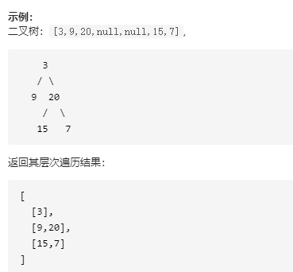

# 二叉树的层次遍历

## 来源

https://leetcode-cn.com/problems/binary-tree-level-order-traversal/

## 描述

给你一个二叉树，请你返回其按 层次遍历 得到的节点值（即逐层地，从做到右访问所有节点）



## 代码

通过两个数组来交替打印

```python
class Solution(object):
    def levelOrder(self, root):
        if root == None:
            return []
        stack = [root]
        secondStack = []
        ret = [[root.val]]
        while stack or secondStack:
            tempList = []
            while stack:                
                node = stack.pop(0)                
                if node.left:
                    secondStack.append(node.left)
                    tempList.append(node.left.val)
                if node.right:
                    secondStack.append(node.right)
                    tempList.append(node.right.val)

            if tempList != []:
                ret.append(tempList)
            
            tempList = []
            while secondStack:
                node = secondStack.pop(0)
                if node.left:
                    stack.append(node.left)
                    tempList.append(node.left.val)
                if node.right:
                    stack.append(node.right)
                    tempList.append(node.right.val)
            if tempList != []:
                ret.append(tempList)
        return ret
```

