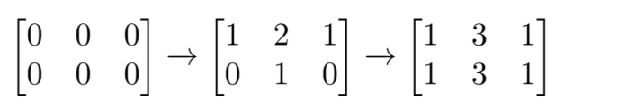
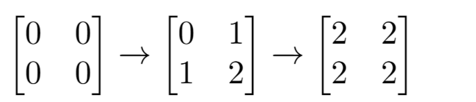

# 奇数值单元格的数目

## 题目

https://leetcode-cn.com/problems/cells-with-odd-values-in-a-matrix/

## 描述

给你一个 n 行 m 列的矩阵，最开始的时候，每个单元格中的值都是 0。

另有一个索引数组 indices，indices[i] = [ri, ci] 中的 ri 和 ci 分别表示指定的行和列（从 0 开始编号）。

你需要将每对 [ri, ci] 指定的行和列上的所有单元格的值加 1。

请你在执行完所有 indices 指定的增量操作后，返回矩阵中 「奇数值单元格」 的数目。



```
输入：n = 2, m = 3, indices = [[0,1],[1,1]]
输出：6
解释：最开始的矩阵是 [[0,0,0],[0,0,0]]。
第一次增量操作后得到 [[1,2,1],[0,1,0]]。
最后的矩阵是 [[1,3,1],[1,3,1]]，里面有 6 个奇数。
```

示例2：



```
输入：n = 2, m = 2, indices = [[1,1],[0,0]]
输出：0
解释：最后的矩阵是 [[2,2],[2,2]]，里面没有奇数。
```

## 代码

### 解法1

首先想到的就是暴力法

- 既然给我一个矩阵，那我就先构造一下呗
- 然后遍历indices里面每个元素，拆包ri和ci
- 根据要求，对构造的矩阵进行行列+1操作
- 最后对矩阵的内容进行遍历，数奇数的个数

```
class Solution(object):
    def oddCells(self, n, m, indices):
        matrix = [[0 for i in range(m)] for j in range(n)]
        
        for i in indices:
            for j in range(len(matrix[i[0]])):
                matrix[i[0]][j] += 1

            for j in range(len(matrix)):
                matrix[j][i[1]] += 1

        count = 0
        for i in range(len(matrix)):
            for j in range(len(matrix[0])):
                if matrix[i][j] % 2 == 1:
                    count += 1            
        return count
```

