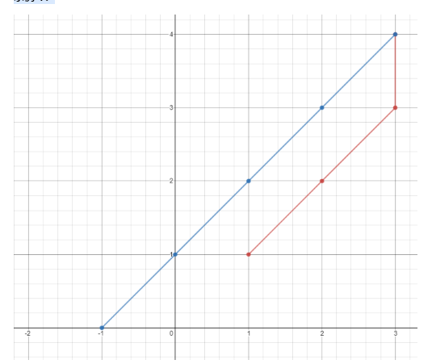

# 访问所有点的最小时间

## 题目

https://leetcode-cn.com/problems/minimum-time-visiting-all-points/

## 描述

平面上有 n 个点，点的位置用整数坐标表示 points[i] = [xi, yi]。请你计算访问所有这些点需要的最小时间（以秒为单位）。

你可以按照下面的规则在平面上移动：

每一秒沿水平或者竖直方向移动一个单位长度，或者跨过对角线（可以看作在一秒内向水平和竖直方向各移动一个单位长度）。
必须按照数组中出现的顺序来访问这些点。


示例 1：



```
输入：points = [[1,1],[3,4],[-1,0]]
输出：7
解释：一条最佳的访问路径是： [1,1] -> [2,2] -> [3,3] -> [3,4] -> [2,3] -> [1,2] -> [0,1] -> [-1,0]   
从 [1,1] 到 [3,4] 需要 3 秒 
从 [3,4] 到 [-1,0] 需要 4 秒
一共需要 7 秒

示例 2：
输入：points = [[3,2],[-2,2]]
输出：5
```

## 代码

```
class Solution(object):
    def minTimeToVisitAllPoints(self, points):
        time = 0
        for i in range(len(points) - 1):        
            time1 = abs(points[i][0] - points[i+1][0])
            time2 = abs(points[i][1] - points[i+1][1])
            if time1 > time2:
                time += time1
            else:
                time += time2
        return time
```

