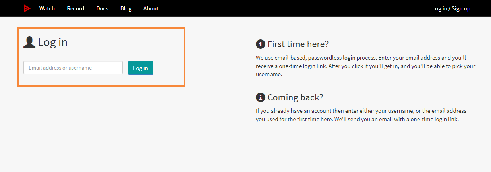
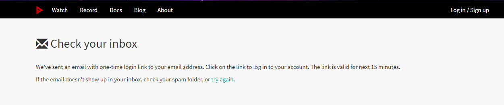
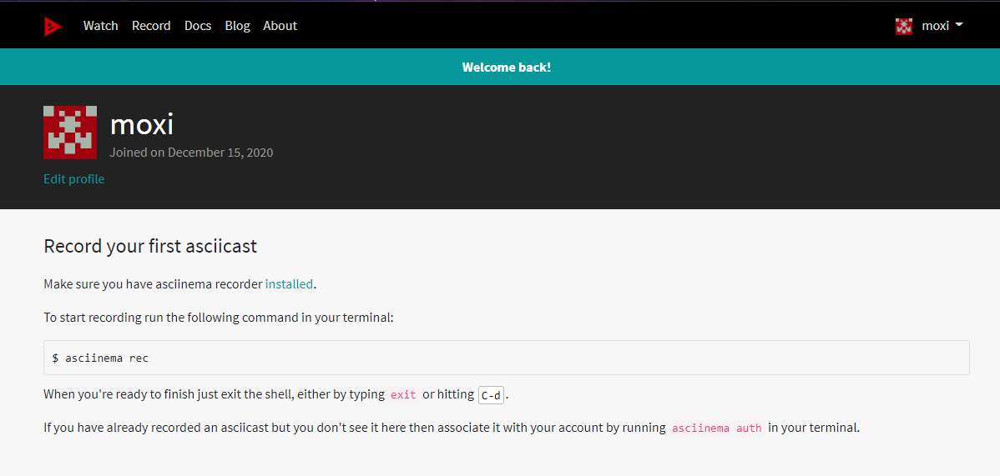
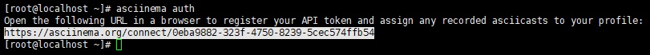
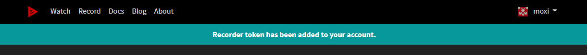
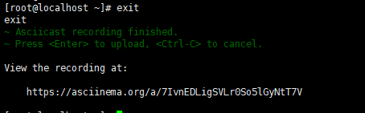
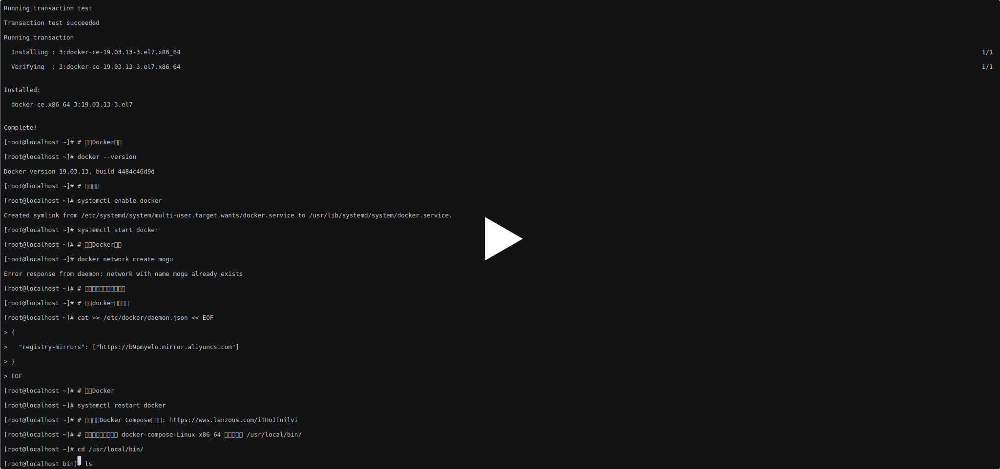

# Asciinema一种基于文本的终端录制方法

## 前言

在我之前写博客教程的时候，一般都是通过文档的形式来进行记录的具体的操作过程。但是很多时候文档并不能很好的记录我们每一步，所以为了更加直观的展示，一般我们会使用视频来进行记录。但是如果使用视频记录的话，需要小伙伴暂停视频，然后跟着视频敲代码，最后在自己环境下运行，很显然这个方法也不是特别友好【竟然要小伙伴手动敲代码，而不是copy】，这个时候 Asciinema 的出现，就是为了解决这个问题，它是基于文本的终端录制方法，能够拥有像看视频一样的体验，同时支持终端内容的复制。

## 介绍

Asciinema官网：[点我传送](https://asciinema.org/)

来自官网的话：以正确的方式记录并分享您的终端会话，忘记屏幕录音应用程序和模糊的视频吧。享受一种轻量级的、纯粹基于文本的终端录制方法。

Asciinema是Linux系统下一款"高级"终端会话记录和回放的神器, 它是一个在终端下非常棒的录制分享软件，基于文本的录屏工具，对终端输入输出进行捕捉， 然后以文本的形式来记录和回放！**这使其拥有非常炫酷的特性**：在播放过程中随时可以暂停， 然后对"播放器"中的文本进行复制或者其它操作！并且它支持各个操作系统（除了windows之外）

## 安装

目前Asciinema支持：`linux`、 `macOS` 和 `*BSD`

下面我将以Linux为例，讲解Asciinema的具体使用，下面将介绍多个安装的方式

### ubuntu安装

ubuntu系统使用的是apt作为包管理工具

```bash
sudo apt-add-repository ppa:zanchey/asciinema
sudo apt-get update
sudo apt-get install asciinema
```

### CentOS安装

CentOS系统使用的是yum作为包管理工具，下载过程如下

```bash
sudo yum install asciinema
```

### Docker安装

同时也支持使用Docker安装

```bash
docker run --rm -ti -v "$HOME/.config/asciinema":/root/.config/asciinema asciinema/asciinema
```

## 快速开始

下面我们就可以开始进行脚本的录制了

```bash
# 将终端记录到本地文件
asciinema rec demo.cast

# 开始一系列的录制操作
....

# 退出
eixt

# 播放录制的终端命令
asciinema play demo.cast
```

## 上传到Asciinema官网

但是只是在终端上查看，还是不能分享给其它的小伙伴们，所以我们需要将我们录制的内容上传Asciinema官网，首先需要注册账号：[点我传送](https://asciinema.org/)



我第一打开这个页面，没有找到注册的地方？？，根据边上的英语提示，告诉我们第一次过来的话，只需要输入你的邮箱，然后系统就会向该邮箱输入一串验证信息，然后点击该链接即可完成注册~



以后登录的话，操作也是一样的，输入邮箱号码，然后到邮箱的邮件点击登录即可



我们需要在我们终端输入下面的命令，给我们账号进行绑定

```bash
asciinema auth
```

然后会得到一个地址



我们把地址复制到浏览器上打开即可



绑定账号完成后，下面我们可以按照操作开始录制终端命令

```bash
# 开始录制
asciinema rec
# 退出录制【按下回车上传】
exit
```



下面访问这个地址，即可看到我们的内容了

```bash
https://asciinema.org/a/7IvnEDLigSVLr0So5lGyNtT7V
```

[](https://asciinema.org/a/KwyQLaLd99P6SjdytFpisci31)

## Asciinema常见命令

下面看看Asciinema的常见命令

```bash
# 登录【得到url，到浏览器打开即可，需要提前在浏览器登录Asciinema】
asciinema auth

# 记录终端并将其上传到asciinema.org【】
asciinema rec  

# 将终端记录到本地文件
asciinema rec mogu.cast

# 将终端记录到本地文件，将空闲时间限制到最大2秒
asciinema play -i 2 mogu.cast

# 以两倍速播放
asciinema play -s 2 mogu.cast

# 从本地文件重放终端记录
asciinema play demo.cast

# 打印记录的会话的全部输出
asciinema cat demo.cast

# 将本地文件上传
asciinema upload mogu.cast
```

## 修改配置

同时我们在录制脚本的时候，也可以修改asciinema的配置

```bash
vim ~/.config/asciinema/config
```

然后可以添加如下 内容，下是每个部分的所有可用选项列表

```bash
[api]
; API server URL, default: https://asciinema.org
; If you run your own instance of asciinema-server then set its address here
; It can also be overriden by setting ASCIINEMA_API_URL environment variable
url = https://asciinema.example.com

[record]

; Command to record, default: $SHELL
command = /bin/bash -l

; Enable stdin (keyboard) recording, default: no
stdin = yes

; List of environment variables to capture, default: SHELL,TERM
env = SHELL,TERM,USER

; Limit recorded terminal inactivity to max n seconds, default: off
idle_time_limit = 2

; Answer "yes" to all interactive prompts, default: no
yes = true

; Be quiet, suppress all notices/warnings, default: no
quiet = true

[play]

; Playback speed (can be fractional), default: 1
speed = 2

; Limit replayed terminal inactivity to max n seconds, default: off
idle_time_limit = 1
```

例如我需要限制播放的速度 和 空闲的时间

```bash
[record]
idle_time_limit = 2
[play]
speed = 2
```

配置完成后，我们就可以来进行录制了~

## 参考

-  [Linux终端回话记录和回放工具 - asciinema使用总结](https://www.cnblogs.com/kevingrace/p/10188283.html)
- [Asciinema官网](https://asciinema.org/)

