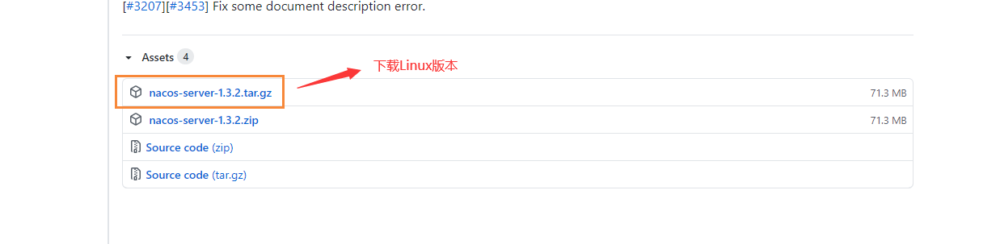
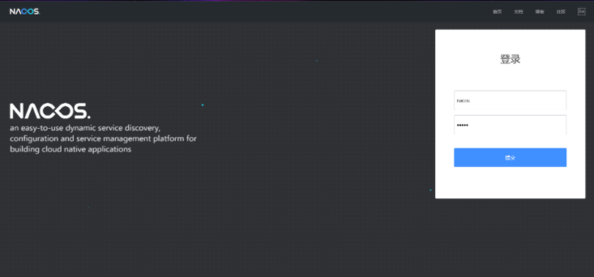
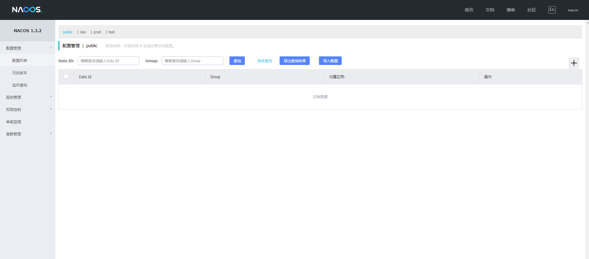

# CentOS下安装Nacos

## 前言

这阵子因为蘑菇博客的镜像越来越大，所以就打算重新构建一下蘑菇博客的Docker镜像，这里就打算在Centos下安装配置Nacos，之前写过一篇博客关于Window下配置蘑菇博客的Nacos，感兴趣的小伙伴可以参考一下

[Window蘑菇博客Nacos部署指南](http://moguit.cn/#/info?blogUid=8dc52bd61e36fa56cfc7699815375572)

[【SpringCloud】使用Nacos实现服务注册发现以及配置中心等功能](http://moguit.cn/#/info?blogUid=e6e619349d31dded928c9265c5a9c672)

## 下载Linux版Nacos

首先我们到Nacos的 [Github页面](https://github.com/alibaba/nacos/releases)，找到我们需要安装的版本



我们也可以右键复制到链接，然后通过wget命令进行下载

```bash
wget https://github.com/alibaba/nacos/releases/download/1.3.2/nacos-server-1.3.2.tar.gz
```

下载完成后，我们使用下面的命令进行解压

```bash
#解压
tar -zxvf nacos-server-1.3.2.tar.gz
```

解压完成后，进入nacos文件夹里

```bash
cd nacos/bin
```

然后修改startup.sh中jvm的内存大小，根据自己的机器情况决定。

```bash
vim startup.sh
```

这里我设置的是最小堆内存128m，最大堆内存256m

```bash
if [[ "${MODE}" == "standalone" ]]; then
    JAVA_OPT="${JAVA_OPT} -Xms128m -Xmx256m -Xmn256m"
    JAVA_OPT="${JAVA_OPT} -Dnacos.standalone=true"
else
    if [[ "${EMBEDDED_STORAGE}" == "embedded" ]]; then
        JAVA_OPT="${JAVA_OPT} -DembeddedStorage=true"
    fi
    JAVA_OPT="${JAVA_OPT} -server -Xms256m -Xmx512m -Xmn128m -XX:MetaspaceSize=128m -XX:MaxMetaspaceSize=320m"
    JAVA_OPT="${JAVA_OPT} -XX:-OmitStackTraceInFastThrow -XX:+HeapDumpOnOutOfMemoryError -XX:HeapDumpPath=${BASE_DIR}/logs/java_heapdump.hprof"
    JAVA_OPT="${JAVA_OPT} -XX:-UseLargePages"
```

## Nacos+MySQL配置持久化

原来的配置文件是存储在内置的数据库SQLite中，我们如果要移动起来，可能不方便，下面我们可以配置一下nacos的mysql存储，

我们找到数据库新建脚本nacos/conf/nacos-mysql.sql，创建数据库nacos_config并执行脚本

### 导入遇到问题

tip：我们在导入的时候，可能会遇到这个错误

>Error occured at:2020-08-22 11:37:11
>Line no.:190
>Error Code: 1071 - Specified key was too long; max key length is 767 bytes

先检查一下是不是数据库被限制了索引的大小

```
SHOW variables like 'innodb_large_prefix'
```

如果查询的值是OFF的话 执行下面命令

```
SET GLOBAL INNODB_LARGE_PREFIX = ON;
```

执行完了 之后 还得查看当前的innodb_file_format引擎格式类型是不是BARRACUDA执行

```
SHOW variables like 'innodb_file_format'
```

如果不是的话则需要修改

```
SET GLOBAL innodb_file_format = BARRACUDA;
```

然后再次尝试导入，则成功导入到数据库中

### 修改nacos配置

下面我们需要到nacos的配置目录

```bash
vim nacos/conf/application.properties
```

然后在末尾添加我们的mysql的配置信息

```bash
spring.datasource.platform=mysql
db.num=1
db.url.0=jdbc:mysql://127.0.0.1:3306/nacos_config?characterEncoding=utf8&connectTimeout=1000&socketTimeout=3000&autoReconnect=true&useUnicode=true&useSSL=false&serverTimezone=UTC
db.user=root
db.password=mogu2018
```

修改完成后，回到bin目录，启动nacos，启动命令standalone代表着单机模式运行，非集群模式):

```bash
sh startup.sh -m standalone
```

然后我们输入地址

```bash
http://youip:8848/nacos
```

会跳转到登录页面，输入默认账号和密码  nacos  nacos即可进入




到这里linux下的nacos已经成功安装~

