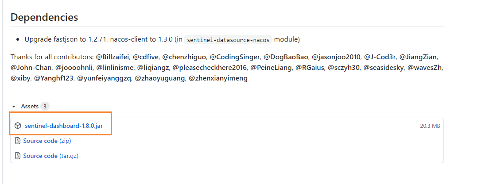
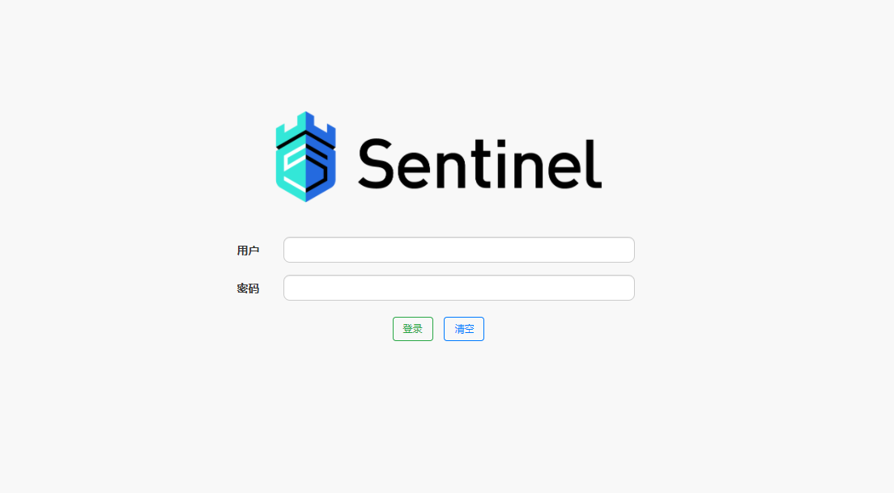

# CentOS下安装Sentinel

## 前言

Sentinel被称为分布式系统的流量防卫兵，这里主要讲的是CentOS下如何安装Sentinel，关于Windows下的安装以及Sentinel的介绍，可以参考下面的博客

[【SpringCloud】使用Sentinel实现熔断和限流](http://moguit.cn/#/info?blogUid=408e9c889ebf96a66af2adfdc258ba5f)

[Windows下蘑菇博客Sentinel安装指南](http://moguit.cn/#/info?blogUid=7135efc7f536769efd0d0483c687ba07)

## 下载Sentinel

Sentinel的安装非常简单，只需要去[官网](https://github.com/alibaba/Sentinel/releases)下载好对应的可执行jar包



然后在配置启动脚本和关闭脚本，同时设置启动端口号8070

启动脚本：startup.sh

```bash
#!/bin/bash     
nohup java -jar sentinel-dashboard-1.8.0.jar --server.port=8070  > catalina.out  2>&1 &
```

关闭脚本：shutdown.sh

```bash
#!/bin/bash
PID=$(ps -ef | grep sentinel-dashboard-1.8.0.jar  | grep -v grep | awk '{ print $2 }')
if [ -z "$PID" ]
then
    echo Application is already stopped
else
    echo kill $PID
    kill $PID
fi
```

启动成功后，访问地址：http://youip:8070，即可打开sentinel的管理页面



输入sentinel  sentinel进入即可