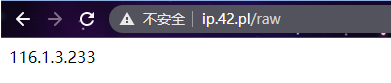
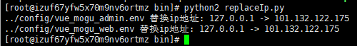

# CentOS中使用Python将文本中的IP地址替换为外网地址

## 前言

这阵子主要在做docker compose自动化部署，但是在修改前端的配置文件的时候，还需要小伙伴手动修改服务器的ip地址，本着给小伙伴能少动手，就少动手的态度，下面使用python编写脚本，用来更新服务器的ip地址，脚本主要分为了两部分

- 获取服务器的外网ip地址
- 读取配置文件，将旧ip地址 替换成 新的ip地址

## 获取外网ip

首先我们需要编写python代码，用于获取外网地址

```python
# -*- coding:utf-8 -*-
from urllib2 import urlopen
# 获取ip地址
myIp = urlopen('http://ip.42.pl/raw').read()
```

其实就是访问一个url 

```bash
http://ip.42.pl/raw
```

然后就会返回本机器的外网地址



最后用变量保存即可

## 读取配置文件

下面我们就需要继续编写代码，读取vue的配置文件，然后取出里面的ip地址

```python
# 替换ip地址
def replace(file, newStr):
    fileData = ""
    with io.open(file, 'r', encoding='utf-8') as f:
        lines = f.readlines()
        # 查找到ip地址
        for line in lines:
            ipList = re.findall(r"\b(?:[0-9]{1,3}\.){3}[0-9]{1,3}\b", line)
            if not ipList == []:
                oldStr = ipList[0]
                print file, "替换ip地址:", oldStr, "->", newStr
                break
        # 替换ip地址
        for line in lines:
            line = line.replace(oldStr, newStr)
            fileData += line

    with io.open(file,"w",encoding="utf-8") as f:
        f.write(fileData)
```

我们这里是使用了正则表达式，从文本中取出ip地址，因为re.findall获取到的是一个列表，所以我们只需要判断第一个元素，然后将文本中的旧ip地址，替换成服务器上获取到的，最后再将文本写入到源文件中，完成整个过程

## 完整代码

完整的 replaceIp.py 脚本如下所示

```python
# -*- coding:utf-8 -*-
from urllib2 import urlopen
import io
import re
# 获取ip地址
myIp = urlopen('http://ip.42.pl/raw').read()

# 替换ip地址
def replace(file, newStr):
    fileData = ""
    with io.open(file, 'r', encoding='utf-8') as f:
        lines = f.readlines()
        # 查找到ip地址
        for line in lines:
            ipList = re.findall(r"\b(?:[0-9]{1,3}\.){3}[0-9]{1,3}\b", line)
            if not ipList == []:
                oldStr = ipList[0]
                print file, "替换ip地址:", oldStr, "->", newStr
                break
        # 替换ip地址
        for line in lines:
            line = line.replace(oldStr, newStr)
            fileData += line

    with io.open(file,"w",encoding="utf-8") as f:
        f.write(fileData)

replace("../config/vue_mogu_admin.env", myIp)
replace("../config/vue_mogu_web.env", myIp)
```

其中 `vue_mogu_admin.env` 文件内容如下所示【替换前】

```bash
NODE_ENV=production
ADMIN_API=http://127.0.0.1:8607/mogu-admin
PICTURE_API=http://127.0.0.1:8607/mogu-picture
WEB_API=http://127.0.0.1:8607/mogu-web
Search_API=http://127.0.0.1:8607/mogu-search
FILE_API=http://127.0.0.1:8600/
BLOG_WEB_URL=http://127.0.0.1:9527
SOLR_API=http://127.0.0.1:8080/solr
ELASTIC_SEARCH=http://127.0.0.1:5601
```

然后我们执行下面命令，开始替换ip地址

```bash
python2 replaceIp.py
```



最后我们再次查看 `vue_mogu_admin.env`  文件

```bash
NODE_ENV=production
ADMIN_API=http://101.132.122.175:8607/mogu-admin
PICTURE_API=http://101.132.122.175:8607/mogu-picture
WEB_API=http://101.132.122.175:8607/mogu-web
Search_API=http://101.132.122.175:8607/mogu-search
FILE_API=http://101.132.122.175:8600/
BLOG_WEB_URL=http://101.132.122.175:9527
SOLR_API=http://101.132.122.175:8080/solr
ELASTIC_SEARCH=http://101.132.122.175:5601
```

我们能够发现，ip地址已经成功被替换成了外网的地址了~

