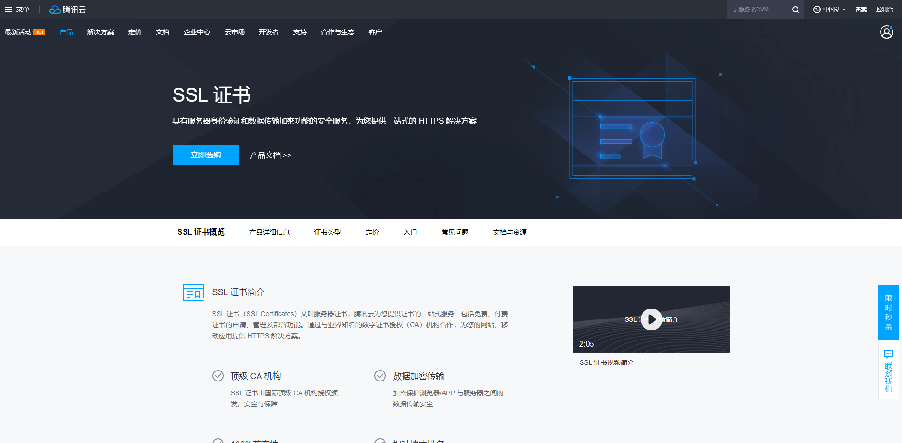
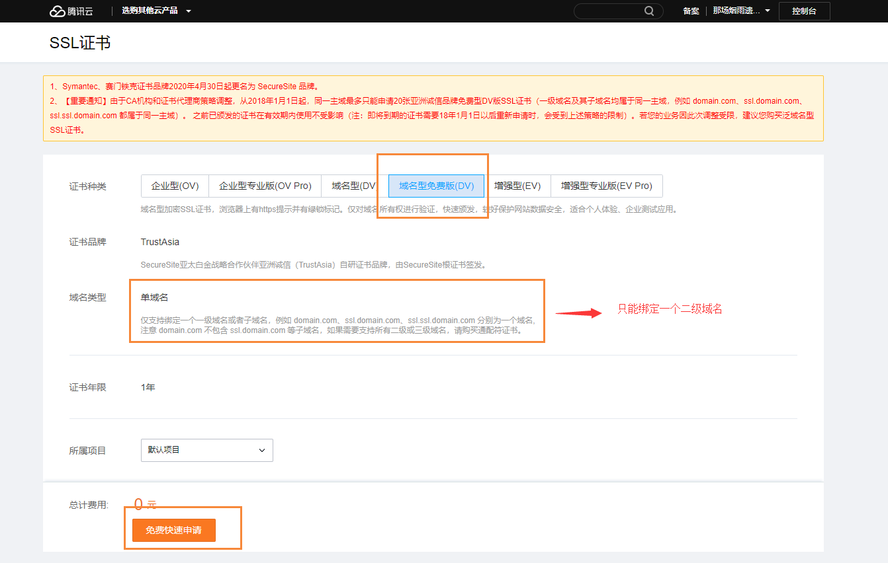
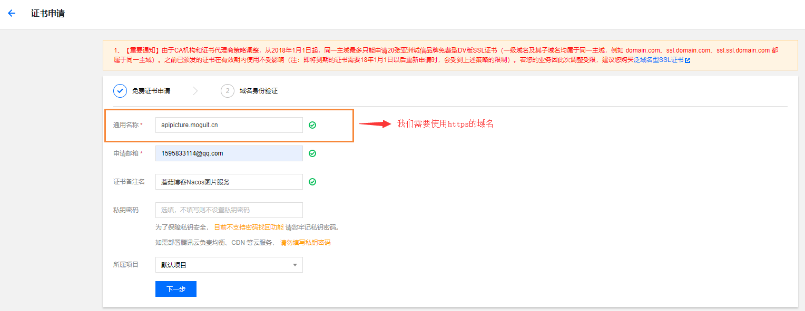
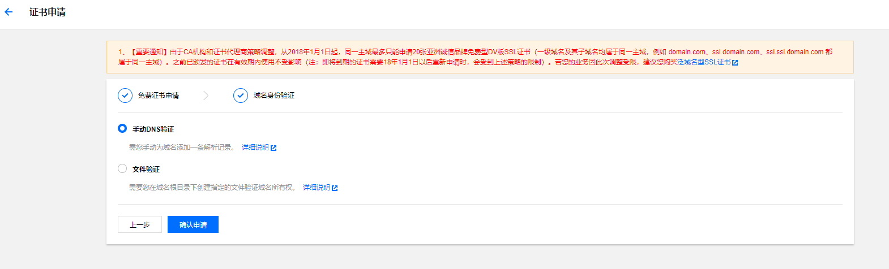
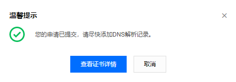
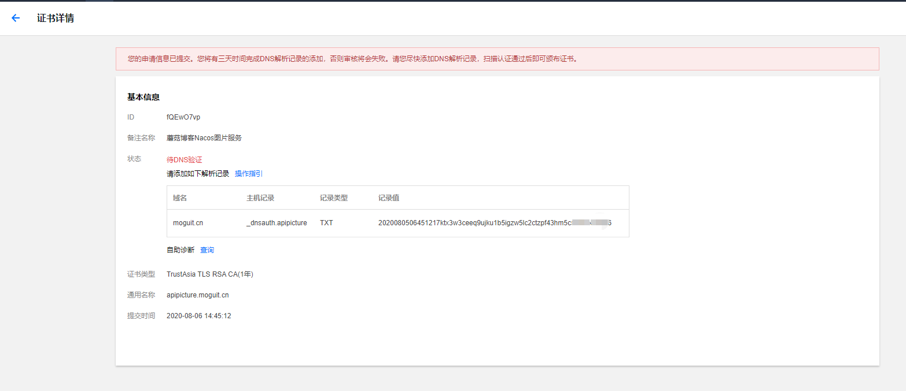
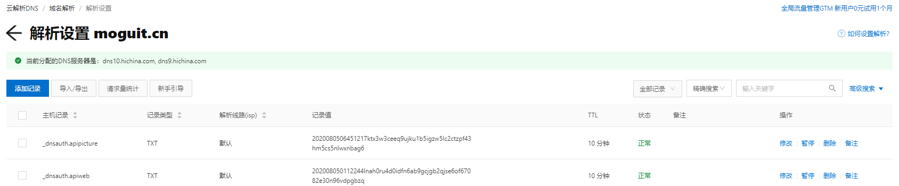
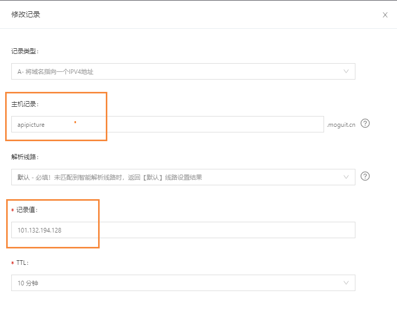
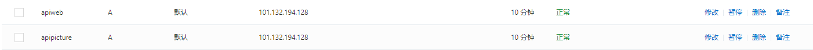
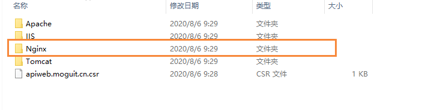

# Linux下通过nginx配置https

## 前言

这阵子在做蘑菇博客的小程序端，因为小程序的发布需要接口采用https加密的方式，因此打算通过nginx配置一下ssl安全证书

## 证书购买

证书一般都需要到对应的云服务厂商进行购买，当然貌似也可以自己生成证书，但是好像生成的证书也会出现不安全的提示，所以还是去云服务厂商购买

本着能不花钱就不花钱的态度，我们来到了 [腾讯云SSL证书](https://cloud.tencent.com/product/ssl) （ps：阿里云免费的证书找了一阵子没找到）



我们点击立即选购按钮，来到了我们的购买页面



需要注意的是，免费型的域名证书，只能支持单个域名，也就是如果我们多个域名需要绑定SSL的话，那么就需要购买多个证书，下面就是填写我们哪个域名需要用到https，这是我是图片服务用到了，所以就填写图片服务器



然后我们选择手动DNS验证，然后确认



确认后，我们就需要到我们的域名管理添加一条解析





因为我的域名是在阿里云购买的，所以我需要到阿里云的域名解析处进行配置，添加上述的记录到阿里云解析中


然后点击确定



同时我们还需要让域名解析到我们的服务器上，我们在添加一条记录，指向的是我们的服务器（ipv4地址）



添加完成后的效果



然后在等待一段时间后，即可完成证书域名证书的认证


认证完成后，我们需要下载我们的证书，点击右侧的下载按钮，下载完成后，有多个方式的配置，我们进入nginx文件夹



然后把里面的内容拷贝到我们的服务器上，首先我们先到服务器中，创建一个目录

```bash
mkdir /home/ssl/uniapp/web
```

创建完成后，将刚刚nginx文件夹中的公钥和私钥拷贝到该目录下

然后我们就需要安装nginx的https模块了，关于nginx的https模块的安装可以参考下面的博客

 [CentOS下如何安装Nginx？](http://moguit.cn/#/info?blogUid=e8d3e38ba35b4765ae128256eb44e341)

然后使用下面的配置

```bash
./configure \
--prefix=/soft/nginx \
--pid-path=/var/run/nginx/nginx.pid \
--lock-path=/var/lock/nginx.lock \
--error-log-path=/var/log/nginx/error.log \
--http-log-path=/var/log/nginx/access.log \
--with-http_gzip_static_module \
--http-client-body-temp-path=/var/temp/nginx/client \
--http-proxy-temp-path=/var/temp/nginx/proxy \
--http-fastcgi-temp-path=/var/temp/nginx/fastcgi \
--http-uwsgi-temp-path=/var/temp/nginx/uwsgi \
--http-scgi-temp-path=/var/temp/nginx/scgi \
--with-http_ssl_module 
```

然后在进行make  和 make install，安装完成nginx后，我们进入到nginx的配置文件中

```bash
    server {
        listen       443 ssl;
        server_name  apiweb.moguit.cn;
        ssl on;

        ssl_certificate  /home/ssl/uniapp/web/1_apiweb.moguit.cn_bundle.crt;
        ssl_certificate_key /home/ssl/uniapp/web/2_apiweb.moguit.cn.key;

        ssl_session_timeout  5m;
        ssl_ciphers ECDHE-RSA-AES128-GCM-SHA256:ECDHE:ECDH:AES:HIGH:!NULL:!aNULL:!MD5:!ADH:!RC4;

        ssl_protocols TLSv1 TLSv1.1 TLSv1.2;
        ssl_prefer_server_ciphers  on;
        location / {
           proxy_pass   http://127.0.0.1:8603;
        }

    }
```

配置完成后，我们通过https，即可访问我们的项目了~

同理，如果配置  https://apipicture.moguit.cn 我们也是按照上述的操作再次执行一遍，然后最后在nginx中添加如下的配置信息

```bash
    server {
        listen       443 ssl;
        server_name  apipicture.moguit.cn;
        ssl on;

        ssl_certificate  /home/ssl/uniapp/picture/1_apipicture.moguit.cn_bundle.crt;
        ssl_certificate_key /home/ssl/uniapp/picture/2_apipicture.moguit.cn.key;

        ssl_session_timeout  5m;
        ssl_ciphers ECDHE-RSA-AES128-GCM-SHA256:ECDHE:ECDH:AES:HIGH:!NULL:!aNULL:!MD5:!ADH:!RC4;

        ssl_protocols TLSv1 TLSv1.1 TLSv1.2;
        ssl_prefer_server_ciphers  on;
        location / {
           proxy_pass   http://127.0.0.1:8602;
        }

    }
```

