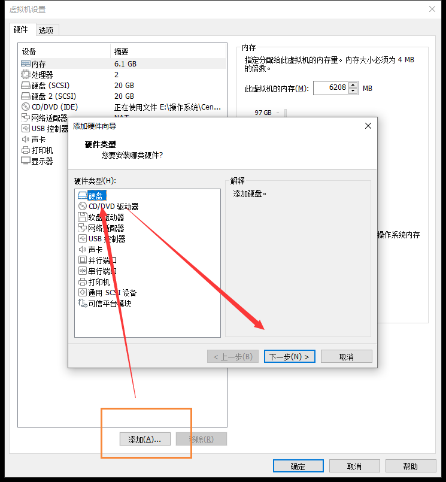
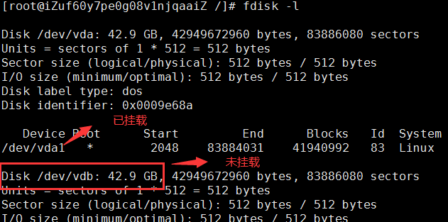
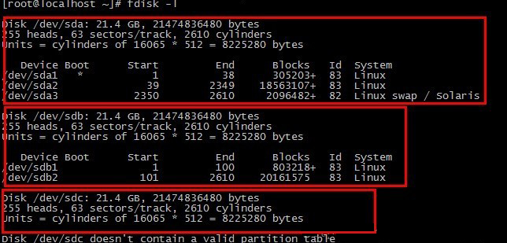
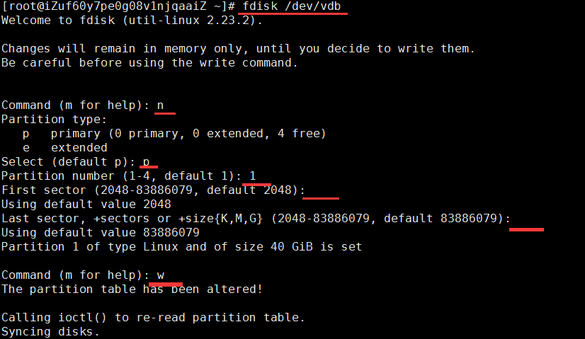
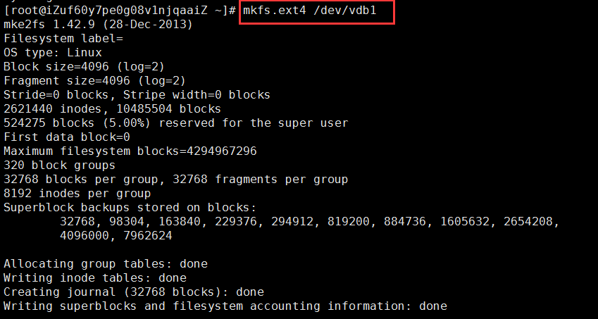
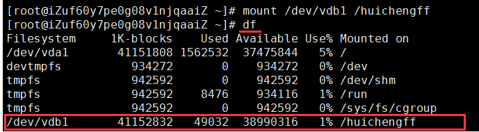
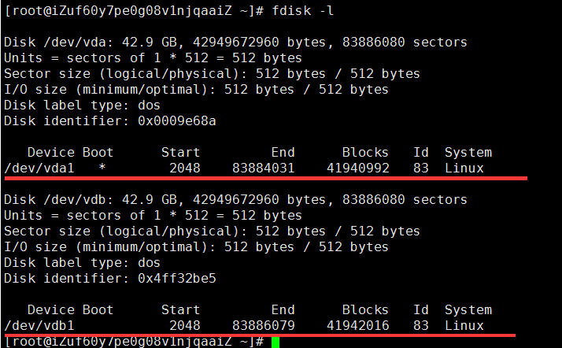

# VMWare给CentOS扩容

## 前言

今天因为自己的虚拟机满了，无法继续创建Docker镜像，就想着给虚拟机扩容，从原来的20G提升到40G

## 添加新磁盘

首先我们需要关闭我们正在运行的虚拟机，然后找到设置页面，新添加一个20G的硬盘



## 进入系统

然后我们进入系统

```bash
#查看服务器未挂载的磁盘
fdisk -l
```



从上图可以看出，服务器的 /dev/vdb 42.9GB 此磁盘未挂载

> 如果此磁盘未挂载最下面会出一类似的话：Disk /dev/sdc doesn't contain a valid partition table

从下图可以清楚的看到第三个硬盘sdc没有分区。sda和sdb都分区过了。

>sda：sda1 sda2 sda3
>
>sdb：sdb1 sdb2



## 磁盘分区

下面我们需要对未挂载的磁盘进行分区

```bash
# 查看分区
fdisk /dev/vdb 
```

然后执行下面操作

> n -> p -> 回车 -> 回车 -> w
>
> 大概意思如下：
>
> - n：添加一个分区
> - P：主分区
> - 两个回车指是开始和结束的磁盘扇区大小
> - w：写入磁盘



此时虽然已经进行了分区，但是还没有文件系统，所以磁盘依然不能使用

## 格式化磁盘

下面我们需要格式化磁盘，然后写入文件系统

```bash
# 格式化磁盘，写入文件系统
mkfs.ext4 /dev/vdb1 
```

出现如下图这们的界面，就是格式化磁盘写入文件成功：



## 挂载新磁盘

```bash
# 创建一个新目录
mkdir /huichengff
# 挂载
mount /dev/vdb1  /huichengff
```

如果挂载成功，会出现如下图这样的界面



## 查看磁盘信息

当我们再来查所有分区时，用fdisk -l 命令就会多了一个主分区，/dev/vdb1；如下图：

``

## 开启自动挂载

新创建的分区不能开机自动挂载，每次重启机器都要手动挂载。

设置开机自动挂载需要修改/etc/fstab文件 ；命令如下：

```bash
# 编辑
vim /etc/fstab
# 打开后，在最后一行加入以下代码
/dev/vdb1 /huichengff ext4 defaults 0 1
```

