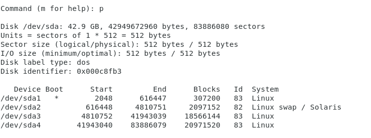

# VMWare给CentOS扩容

## 前言

今天因为自己的虚拟机满了，无法继续创建Docker镜像，就想着给虚拟机扩容，从原来的20G提升到40G


## 扩容步骤

首先我们需要关闭我们正在运行的虚拟机，然后找到设置页面

## 取消分区

因为之前把分区错误的挂载了，所以我们需要取消分区

```bash
# 取消挂载
umount /disk4
```

然后删除分区

```bash
fdisk /dev/sda
```

然后选择p



在选择 d，输入4, 然后按w保存即可

然后删除我们刚刚创建的

最后打开下面的文件，把我们添加的删除了

```bash
vim /etc/fstab
```


