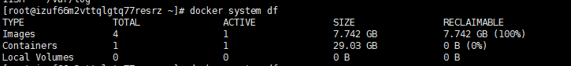
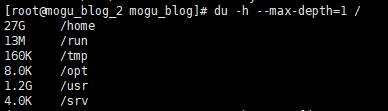
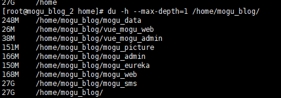
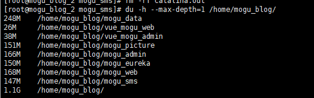
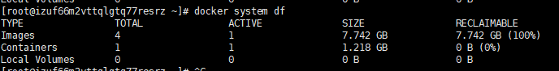

# 记一次因代码出错不断输出日志占满Docker容器硬盘的排查经历

## 前言

今天蘑菇博客突然宕机，进入页面后，发现很多内容无法正常显示，开始不知道是什么原因而引起的，然后想要启动mogu_web的日志进行查看

```
tail -f catalina.out
```

启动后，发现卡死，无法正常输出日志，这时候我以为是因为那里出了问题，然后想着可能是因为项目那里出现问题了，还是先把现在的镜像提交一下

```
docker commit -m "bak" XXXXX  moxi/mogu_blog
```

然后突然出现下面的错误：

```
Error response from daemon: mkdir /var/lib/docker/overlay2/f53be9948dcd7fb15d9d05b6ab523a3e25d3ab213d884a2282dea4dfd5bb8059: no space left on device
```

大概意思就是说没有硬盘空间了，然后想着既然没有空间了，那就把一些镜像删除吧

```
docker images;
```

选择一些没用的镜像，然后删除，发现删除也不能删除，这个时候想着，可能不是因为镜像的缘故，而造成空间不够的，会不会是其它文件的原因，先遍历一下文件的所占空间

```
df -h
```

得到下面的信息：

```
Filesystem      Size  Used Avail Use% Mounted on
devtmpfs        910M     0  910M   0% /dev
tmpfs           920M     0  920M   0% /dev/shm
tmpfs           920M  105M  816M  12% /run
tmpfs           920M     0  920M   0% /sys/fs/cgroup
/dev/vda1        40G   40G     0 100% /
overlay          40G   40G     0 100% /var/lib/docker/overlay2/ad1a22ed400f8a753167934d5ba4455266871718f00654038ba6b59b3b8e26bc/merged
shm              64M     0   64M   0% /var/lib/docker/containers/4344540fce1ecf3a2b801f8edb2a235c56e892946f2ea517a408467fdffb2174/shm
tmpfs           184M     0  184M   0% /run/user/0
```

从这里能够看到 40G的空间，全部被docker占用了，既然不是docker镜像所占用了，那肯定就只有容器了，使用下列命令，查看docker的镜像和容器所占空间

```
docker system df
```

看到这里，瞬间就得出答案了，果然是因为运行的容器而造成空间不够了



因为一个容器就占用了29.03GB的容量，下面我们就需要进入容器里面看看，到底是什么东西，占用了这么多内存了，我们使用du命令，查看占用空间，这篇博客讲了一些常用的命令：[Linux下查看文件和文件夹占用空间大小](http://moguit.cn/#/info?blogUid=511728a04972c18865dc4b7a52feddd0)

```
du -h --max-depth=1 /
```



我们发现是 /home目录里面的内容，占用了27G的空间，我们接着深入的查看

```
du -h --max-depth=1 /home/mogu_blog/
```

到这里就明白了，是因为mogu_sms项目，占用了27G的空间



通过排查，是一个日志文件而造成的，想着可能是因为这个日志文件不断输出错误，而造成空间不够用的问题，所以我们现在需要解决这个错误后，然后把对应的日志输出文件给删除

```
rm -rf catalina.out
```

再次查看，恢复正常了



我们回到宿主机，继续查看，空间也已经变成了1G了



我们再次启动项目，发现可以查看日志