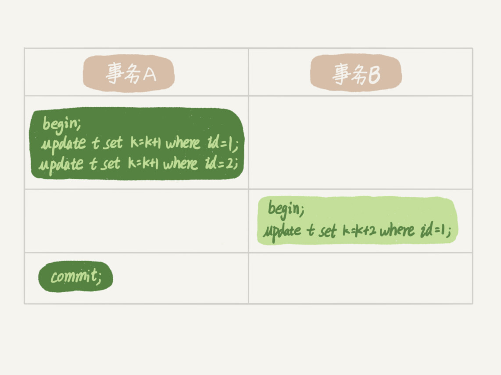
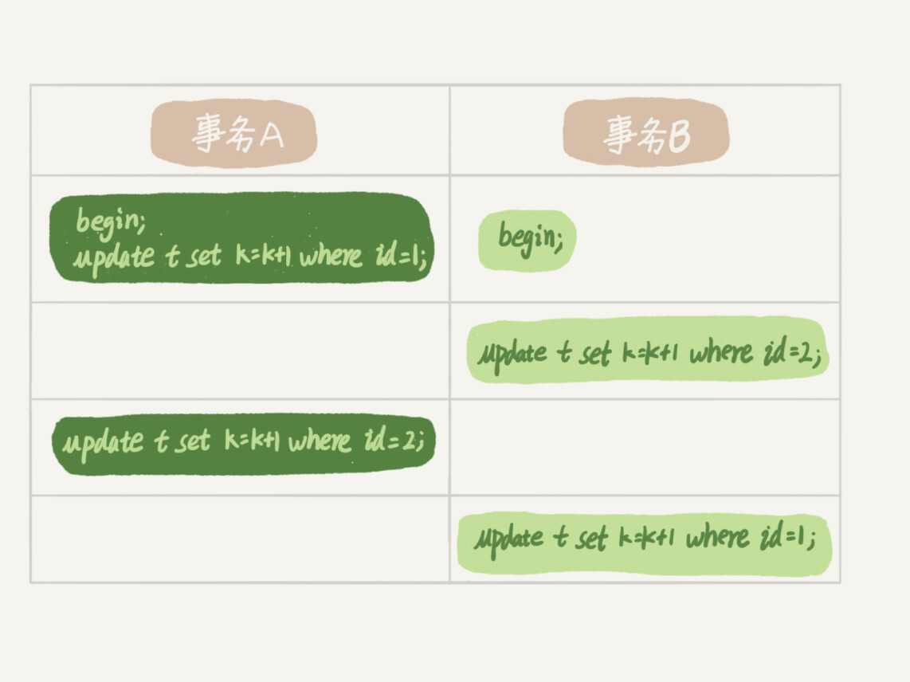

在上一篇文章中，我跟你介绍了 MySQL 的全局锁和表级锁，今天我们就来讲讲 MySQL 的行锁。

MySQL 的行锁是在引擎层由各个引擎自己实现的。但并不是所有的引擎都支持行锁，比如 MyISAM 引擎就不支持行锁。不支持行锁意味着并发控制只能使用表锁，对于这种引擎的表，同一张表上任何时刻只能有一个更新在执行，这就会影响到业务并发度。InnoDB 是支持行锁的，这也是 MyISAM 被 InnoDB 替代的重要原因之一。

我们今天就主要来聊聊 InnoDB 的行锁，以及如何通过减少锁冲突来提升业务并发度。

顾名思义，行锁就是针对数据表中行记录的锁。这很好理解，比如事务 A 更新了一行，而这时候事务 B 也要更新同一行，则必须等事务 A 的操作完成后才能进行更新。

当然，数据库中还有一些没那么一目了然的概念和设计，这些概念如果理解和使用不当，容易导致程序出现非预期行为，比如两阶段锁。

## 从两阶段锁说起

我先给你举个例子。在下面的操作序列中，事务 B 的 update 语句执行时会是什么现象呢？假设字段 id 是表 t 的主键。

这个问题的结论取决于事务 A 在执行完两条 update 语句后，持有哪些锁，以及在什么时候释放。你可以验证一下：实际上事务 B 的 update 语句会被阻塞，直到事务 A 执行 commit 之后，事务 B 才能继续执行。

知道了这个答案，你一定知道了事务 A 持有的两个记录的行锁，都是在 commit 的时候才释放的。

也就是说，**在 InnoDB 事务中，行锁是在需要的时候才加上的，但并不是不需要了就立刻释放，而是要等到事务结束时才释放。这个就是两阶段锁协议。**

知道了这个设定，对我们使用事务有什么帮助呢？那就是，如果你的事务中需要锁多个行，要把最可能造成锁冲突、最可能影响并发度的锁尽量往后放。我给你举个例子。

假设你负责实现一个电影票在线交易业务，顾客 A 要在影院 B 购买电影票。我们简化一点，这个业务需要涉及到以下操作：

1. 从顾客 A 账户余额中扣除电影票价；
2. 给影院 B 的账户余额增加这张电影票价；
3. 记录一条交易日志。

也就是说，要完成这个交易，我们需要 update 两条记录，并 insert 一条记录。当然，为了保证交易的原子性，我们要把这三个操作放在一个事务中。那么，你会怎样安排这三个语句在事务中的顺序呢？

试想如果同时有另外一个顾客 C 要在影院 B 买票，那么这两个事务冲突的部分就是语句 2 了。因为它们要更新同一个影院账户的余额，需要修改同一行数据。

根据两阶段锁协议，不论你怎样安排语句顺序，所有的操作需要的行锁都是在事务提交的时候才释放的。所以，如果你把语句 2 安排在最后，比如按照 3、1、2 这样的顺序，那么影院账户余额这一行的锁时间就最少。这就最大程度地减少了事务之间的锁等待，提升了并发度。

好了，现在由于你的正确设计，影院余额这一行的行锁在一个事务中不会停留很长时间。但是，这并没有完全解决你的困扰。

如果这个影院做活动，可以低价预售一年内所有的电影票，而且这个活动只做一天。于是在活动时间开始的时候，你的 MySQL 就挂了。你登上服务器一看，CPU 消耗接近 100%，但整个数据库每秒就执行不到 100 个事务。这是什么原因呢？

这里，我就要说到死锁和死锁检测了。

## 死锁和死锁检测

当并发系统中不同线程出现循环资源依赖，涉及的线程都在等待别的线程释放资源时，就会导致这几个线程都进入无限等待的状态，称为死锁。这里我用数据库中的行锁举个例子。

这时候，事务 A 在等待事务 B 释放 id=2 的行锁，而事务 B 在等待事务 A 释放 id=1 的行锁。 事务 A 和事务 B 在互相等待对方的资源释放，就是进入了死锁状态。当出现死锁以后，有两种策略：

- 一种策略是，直接进入等待，直到超时。这个超时时间可以通过参数 innodb_lock_wait_timeout 来设置。
- 另一种策略是，发起死锁检测，发现死锁后，主动回滚死锁链条中的某一个事务，让其他事务得以继续执行。将参数 innodb_deadlock_detect 设置为 on，表示开启这个逻辑。

在 InnoDB 中，innodb_lock_wait_timeout 的默认值是 50s，意味着如果采用第一个策略，当出现死锁以后，第一个被锁住的线程要过 50s 才会超时退出，然后其他线程才有可能继续执行。对于在线服务来说，这个等待时间往往是无法接受的。

但是，我们又不可能直接把这个时间设置成一个很小的值，比如 1s。这样当出现死锁的时候，确实很快就可以解开，但如果不是死锁，而是简单的锁等待呢？所以，超时时间设置太短的话，会出现很多误伤。

所以，正常情况下我们还是要采用第二种策略，即：主动死锁检测，而且 innodb_deadlock_detect 的默认值本身就是 on。主动死锁检测在发生死锁的时候，是能够快速发现并进行处理的，但是它也是有额外负担的。

你可以想象一下这个过程：每当一个事务被锁的时候，就要看看它所依赖的线程有没有被别人锁住，如此循环，最后判断是否出现了循环等待，也就是死锁。

那如果是我们上面说到的所有事务都要更新同一行的场景呢？

每个新来的被堵住的线程，都要判断会不会由于自己的加入导致了死锁，这是一个时间复杂度是 O(n) 的操作。假设有 1000 个并发线程要同时更新同一行，那么死锁检测操作就是 100 万这个量级的。虽然最终检测的结果是没有死锁，但是这期间要消耗大量的 CPU 资源。因此，你就会看到 CPU 利用率很高，但是每秒却执行不了几个事务。

根据上面的分析，我们来讨论一下，怎么解决由这种热点行更新导致的性能问题呢？问题的症结在于，死锁检测要耗费大量的 CPU 资源。

**一种头痛医头的方法，就是如果你能确保这个业务一定不会出现死锁，可以临时把死锁检测关掉。**但是这种操作本身带有一定的风险，因为业务设计的时候一般不会把死锁当做一个严重错误，毕竟出现死锁了，就回滚，然后通过业务重试一般就没问题了，这是业务无损的。而关掉死锁检测意味着可能会出现大量的超时，这是业务有损的。

**另一个思路是控制并发度。**根据上面的分析，你会发现如果并发能够控制住，比如同一行同时最多只有 10 个线程在更新，那么死锁检测的成本很低，就不会出现这个问题。一个直接的想法就是，在客户端做并发控制。但是，你会很快发现这个方法不太可行，因为客户端很多。我见过一个应用，有 600 个客户端，这样即使每个客户端控制到只有 5 个并发线程，汇总到数据库服务端以后，峰值并发数也可能要达到 3000。

因此，这个并发控制要做在数据库服务端。如果你有中间件，可以考虑在中间件实现；如果你的团队有能修改 MySQL 源码的人，也可以做在 MySQL 里面。基本思路就是，对于相同行的更新，在进入引擎之前排队。这样在 InnoDB 内部就不会有大量的死锁检测工作了。

可能你会问，**如果团队里暂时没有数据库方面的专家，不能实现这样的方案，能不能从设计上优化这个问题呢？**

你可以考虑通过将一行改成逻辑上的多行来减少锁冲突。还是以影院账户为例，可以考虑放在多条记录上，比如 10 个记录，影院的账户总额等于这 10 个记录的值的总和。这样每次要给影院账户加金额的时候，随机选其中一条记录来加。这样每次冲突概率变成原来的 1/10，可以减少锁等待个数，也就减少了死锁检测的 CPU 消耗。

这个方案看上去是无损的，但其实这类方案需要根据业务逻辑做详细设计。如果账户余额可能会减少，比如退票逻辑，那么这时候就需要考虑当一部分行记录变成 0 的时候，代码要有特殊处理。

## 小结

今天，我和你介绍了 MySQL 的行锁，涉及了两阶段锁协议、死锁和死锁检测这两大部分内容。

其中，我以两阶段协议为起点，和你一起讨论了在开发的时候如何安排正确的事务语句。这里的原则 / 我给你的建议是：如果你的事务中需要锁多个行，要把最可能造成锁冲突、最可能影响并发度的锁的申请时机尽量往后放。

但是，调整语句顺序并不能完全避免死锁。所以我们引入了死锁和死锁检测的概念，以及提供了三个方案，来减少死锁对数据库的影响。减少死锁的主要方向，就是控制访问相同资源的并发事务量。

最后，我给你留下一个问题吧。如果你要删除一个表里面的前 10000 行数据，有以下三种方法可以做到：

- 第一种，直接执行 delete from T limit 10000;
- 第二种，在一个连接中循环执行 20 次 delete from T limit 500;
- 第三种，在 20 个连接中同时执行 delete from T limit 500。

你会选择哪一种方法呢？为什么呢？

你可以把你的思考和观点写在留言区里，我会在下一篇文章的末尾和你讨论这个问题。感谢你的收听，也欢迎你把这篇文章分享给更多的朋友一起阅读。

## 上期问题时间

上期我给你留的问题是：当备库用–single-transaction 做逻辑备份的时候，如果从主库的 binlog 传来一个 DDL 语句会怎么样？

假设这个 DDL 是针对表 t1 的， 这里我把备份过程中几个关键的语句列出来：

```sql
Q1:SET SESSION TRANSACTION ISOLATION LEVEL REPEATABLE READ;
Q2:START TRANSACTION  WITH CONSISTENT SNAPSHOT；
/* other tables */
Q3:SAVEPOINT sp;
/* 时刻 1 */
Q4:show create table `t1`;
/* 时刻 2 */
Q5:SELECT * FROM `t1`;
/* 时刻 3 */
Q6:ROLLBACK TO SAVEPOINT sp;
/* 时刻 4 */
/* other tables */
```

在备份开始的时候，为了确保 RR（可重复读）隔离级别，再设置一次 RR 隔离级别 (Q1);

启动事务，这里用 WITH CONSISTENT SNAPSHOT 确保这个语句执行完就可以得到一个一致性视图（Q2)；

设置一个保存点，这个很重要（Q3）；

show create 是为了拿到表结构 (Q4)，然后正式导数据 （Q5），回滚到 SAVEPOINT sp，在这里的作用是释放 t1 的 MDL 锁 （Q6）。当然这部分属于“超纲”，上文正文里面都没提到。

DDL 从主库传过来的时间按照效果不同，我打了四个时刻。题目设定为小表，我们假定到达后，如果开始执行，则很快能够执行完成。

参考答案如下：

1. 如果在 Q4 语句执行之前到达，现象：没有影响，备份拿到的是 DDL 后的表结构。
2. 如果在“时刻 2”到达，则表结构被改过，Q5 执行的时候，报 Table definition has changed, please retry transaction，现象：mysqldump 终止；
3. 如果在“时刻 2”和“时刻 3”之间到达，mysqldump 占着 t1 的 MDL 读锁，binlog 被阻塞，现象：主从延迟，直到 Q6 执行完成。
4. 从“时刻 4”开始，mysqldump 释放了 MDL 读锁，现象：没有影响，备份拿到的是 DDL 前的表结构。