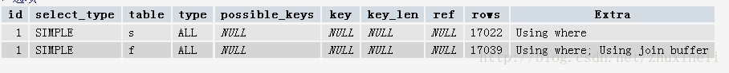
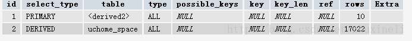
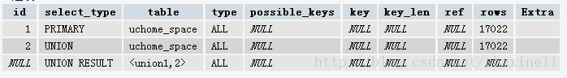
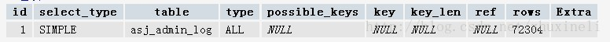
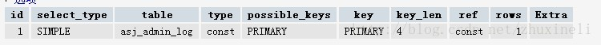
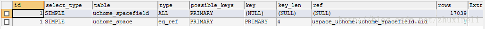
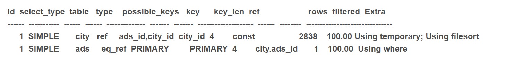
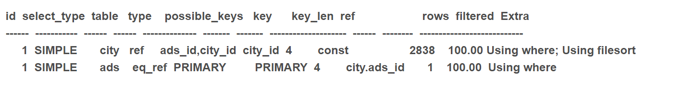

在聊到MySQL索引优化的时候，都会提到 **explain** ，但是对 **explain** 的各个参数可能一知半解

下面咱们就来好好聊一下 **explain** 的各个参数，来帮助我们以后能够更好的进行 **MySQL** 调优

## 一句话介绍 explain

**EXPLAIN** 是 **MySQL** 必不可少的一个分析工具，主要用来测试 **SQL** 语句的性能及对 **SQL** 语句的优化，或者说模拟优化器执行 **SQL** 语句。

在 **Select** 语句之前增加 **explain** 关键字，执行后 **MySQL** 就会返回执行计划的信息，而不是执行 **SQL** 。但如果 **from** 中包含子查询，**MySQL** 仍会执行该子查询，并把子查询的结果放入临时表中。它显示了 **MySQL** 如何使用索引来处理 **Select** 语句以及连接表，可以帮助选择更好的索引和写出更优化的查询语句。

## explain 用法

首先，我们看下面这个例子

```bash
EXPLAIN SELECT s.uid, s.username, s.name, f.email, f.mobile, f.phone, f.postalcode, f.address
FROM uchome_space AS s, uchome_spacefield AS f
WHERE 1
AND s.groupid=0
AND s.uid=f.uid
```

执行后的结果，如下图所示



这里面有下面几个结果，下面我们一个个来看一下

## 1、id

**SELECT** 识别符。这是 **SELECT** 查询序列号。这个不重要,查询序号，即为 **SQL** 语句执行的顺序

```sql
EXPLAIN SELECT * FROM (SELECT* FROM uchome_space LIMIT 10)AS s
```

它的执行结果为：



可以看到这时的id变化了

## 2、select_type

**select** 类型，它有以下几种值

- **simple**：它表示简单的 **select**，没有 **union** 和 子查询
- **primary**：最外面的 **select**，在没有子查询的语句中，最外面的 **select** 查询就是 **primary**，上图中就是这样。
- **union**：union语句的第二个或者说后面那一个，现执行一条语句：

```sql
explain select  *  from uchome_space limit 10 union select * from uchome_space limit 10,10
```

会有如下结果



第二条语句使用了**union**

- **dependent union**：union 中的第二个或后面的 **Select** 语句，取决于外面的查询
- **union result**：union的结果，如上面所示

## 3、table

表示的是输出行所用的表

## 4、type

连接类型，有多个参数，先从最佳类型到最差类型介绍，重要且困难

### system

表仅有一行，这是 **const** 类型的特列，平时不会出现，这个可以忽略

### const

表最多有一个匹配行，const 用于比较 **primary key** 或者 **unique**。因为只匹配一行数据，所以很快记住一定是用到 **primary key** 或者 **unique** ，并且只检索出两条数据的情况下，才会是 **const** ，看下面这条语句

```sql
explain select * from `asj_admin_log` limit 1
```

结果如下



虽然只搜索一条数据，但是因为没有用到指定的索引，所以不会使用 **const**，继续看下面这个

```sql
explain SELECT * FROM `asj_admin_log` where log_id = 111
```



**log_id** 是主键，所以使用了 **const**。所以说可以理解为 **const** 是最优化的

### eq_ref

对于 **eq_ref** 的解释，**mysql** 手册是这样说的:"对于每个来自于前面的表的行组合，从该表中读取一行。这可能是最好的联接类型，除了const类型。它用在一个索引的所有部分被联接使用并且索引是 **UNIQUE** 或 **PRIMARY KEY** "。**eq_ref** 可以用于使用=比较带索引的列。看下面的语句

```sql
explain select * from uchome_spacefield,uchome_space where uchome_spacefield.uid = uchome_space.uid
```

得到的结果是下图所示。很明显，**mysql** 使用 **eq_ref** 联接来处理 **uchome_space** 表。



### ref

对于每个来自于前面的表的行组合，所有有匹配索引值的行将从这张表中读取。如果联接只使用键的最左边的前缀，或如果键不是 **UNIQUE** 或 **PRIMARY KEY**（换句话说，如果联接不能基于关键字选择单个行的话），则使用ref。如果使用的键仅仅匹配少量行，该联接类型是不错的。


## 5、possible_keys

提示使用哪个索引会在该表中找到行

## 6、keys

MySQL使用的哪个索引，简单且重要

## 7、key_len

MySQL 使用的索引长度

## 8、ref

ref列显示使用哪个列或常数与key一起从表中选择行

## 9、rows

显示MySQL执行查询的行数，简单且重要，数值越大越不好，说明没有用好索引

## 10、Extra

该列包含MySQL解决查询的详细信息

- Distinct：**MySQL** 发现第 1 个匹配行后，停止为当前的行组合搜索更多的行
- Not exists：不存在
- range checked for each：没有找到合适的索引
- using filesort ：如果存在排序并且取出的列包括text类型会使用到using filesort，这会非常慢

> MYSQL手册是这么解释的“MySQL需要额外的一次传递，以找出如何按排序顺序检索行。通过根据联接类型浏览所有行并为所有匹配WHERE子句的行保存排序关键字和行的指针来完成排序。然后关键字被排序，并按排序顺序检索行

-  using index：只使用索引树中的信息而不需要进一步搜索读取实际的行来检索表中的信息。这个比较容易理解，就是说明是否使用了索引
- using temporary：为了解决查询，MySQL需要创建一个临时表来容纳结果。典型情况如查询包含可以按不同情况列出列的GROUP BY和ORDER BY子句时。

出现using temporary就说明语句需要优化了，举个例子来说

```sql
EXPLAIN SELECT ads.id FROM ads, city WHERE   city.city_id = 8005   AND ads.status = 'online'   AND city.ads_id=ads.id ORDER BY ads.id desc
```



这条语句会使用using temporary,而下面这条语句则不会

```sql
EXPLAIN SELECT ads.id FROM ads, city WHERE   city.city_id = 8005   AND ads.status = 'online'   AND city.ads_id=ads.id ORDER BYcity.ads_id desc
```



这是为什么呢？他俩之间只是一个order by不同，MySQL 表关联的算法是 Nest Loop Join，是通过驱动表的结果集作为循环基础数据，然后一条一条地通过该结果集中的数据作为过滤条件到下一个表中查询数据，然后合并结果。EXPLAIN 结果中，第一行出现的表就是驱动表（Important!）以上两个查询语句，驱动表都是 city，如上面的执行计划所示！

对驱动表可以直接排序，对非驱动表（的字段排序）需要对循环查询的合并结果（临时表）进行排序 （Important!）

因此，order by ads.id desc 时，就要先 using temporary 了！

驱动表的定义：

[wwh999](http://blog.csdn.net/wwh999/article/details/643493) 在 2006年总结说，当进行多表连接查询时， [驱动表] 的定义为：
1）指定了联接条件时，满足查询条件的记录行数少的表为[驱动表]；
2）未指定联接条件时，行数少的表为[驱动表]（Important!）。

**永远用小结果集驱动大结果集**

今天学到了一个很重要的一点：当不确定是用哪种类型的 **join** 时，让 **mysql** 优化器自动去判断

我们只需写 **select * from t1,t2 where t1.field = t2.field**

通俗解释：**select * from table order by field**

其中 **filed** 建普通索引，这种情况会使用到using temporary,因为虽然这时候使用到了索引，但因为扫描的是全表，mysql优化器会判断：反正是搜索全表而且要排序，因为这时候要回行，我还不如不沿着索引找数据，直接全部检索出所有数据来在排序。如果语句这么写 select * from table where field > 1 order by field.mysql优化器就会这么判断：这时候不是搜全表，我需要先根据where条件,沿着索引树搜出想要的相应索引数据，在回行（一边找索引一边回行）。这时候就不需要临时表了

## 参考

https://blog.csdn.net/asd051377305/article/details/113979657