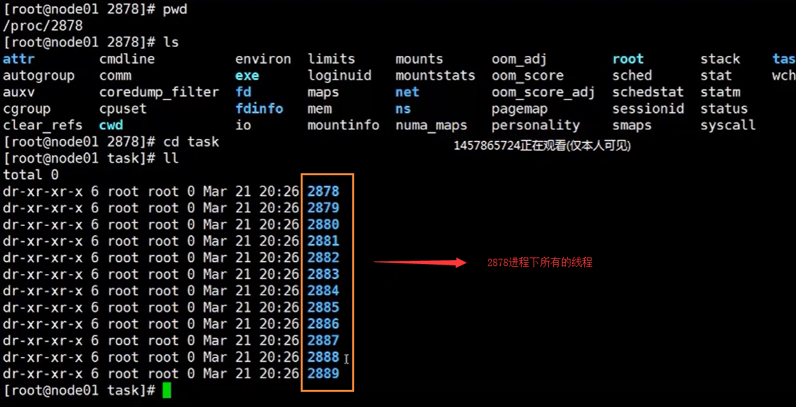
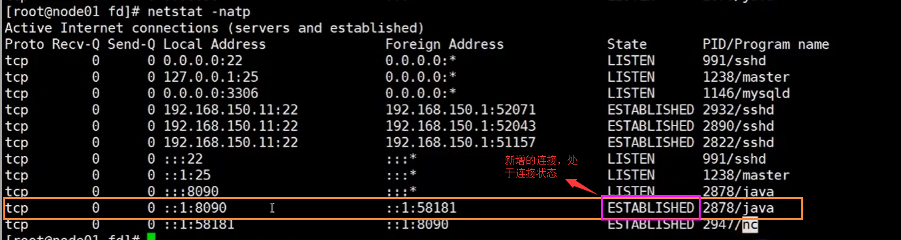
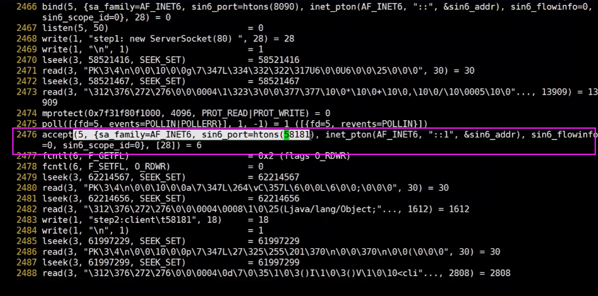
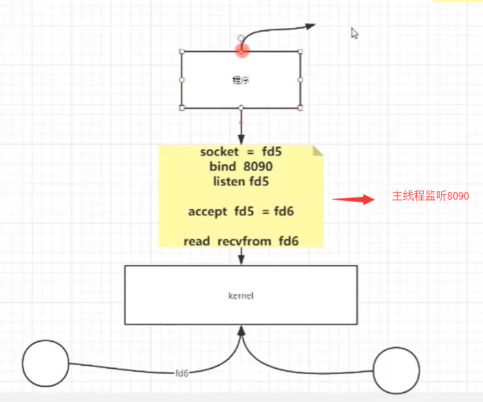
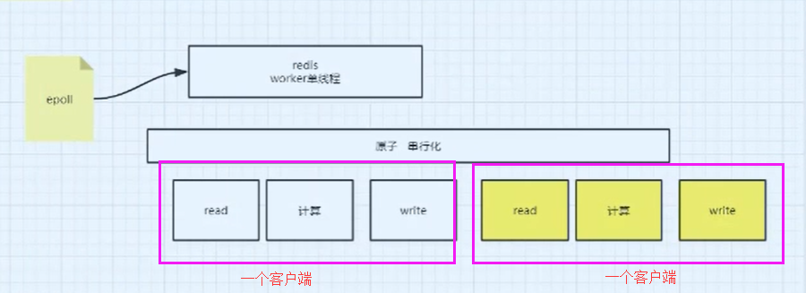
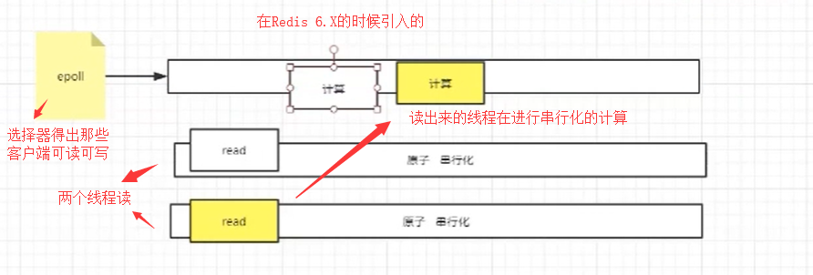

# 从底层了解IO多路复用模型

## 前言

当我们去面试的时候，问到了 redis，nginx，netty他们的底层模型分别是什么？

- redis -> epoll
- nginx-> epoll
- netty-> epoll?

需要从操作系统的层面上来谈

## BIO

当我们开机的时候，首先被加载进内存的是我们的Kernel（内核），内核是用于管理我们的硬件的，同时内核还会创建一个GDT表，然后划分两个空间（用户空间和内核空间），同时空间中的内容是开启了保护模式，无法被修改的。

同时还有一个CPU的概念，CPU有自己的指令集，并且指令集是分了几个级别的，分别是从0~3的，Kernel属于0级别。APP只能用级别为3的指令集。

从上面我们可以知道，我们的应用程序是无法直接访问我们的Kernel的，也就是程序不能直接访问我们的磁盘，声卡，网卡等设备，只有内核才可以访问，那我们怎么办？

只有APP通过调用Kernel提供的 syscall（系统软中断和硬中断）来获取硬件中的内容。

- 软中断
- 硬中断：硬中断指的是我们的键盘，按下一个按键的时候，就会触发我们的硬中断，也就是内核会有一个中断号，然后得到一个callback的回调函数

说到这里，其实就是为了引出一个 概念，就是 IO 和 内核之间的成本问题


```java
/**
 * 服务器读取文件
 * @author: 陌溪
 * @create: 2020-07-01-20:40
 */
public class TestSocket {
    public static void main(String[] args) throws IOException {
        ServerSocket server = new ServerSocket(8090);
        System.out.println("step1: new ServerSocket(8090)");
        while(true) {
            Socket client = server.accept();
            System.out.println("step2: client " + client.getPort());
            new Thread(() -> {
                try {
                    InputStream in = client.getInputStream();
                    BufferedReader reader = new BufferedReader(new InputStreamReader(in));
                    while(true) {
                        System.out.println(reader.readLine());
                    }
                } catch (IOException e) {
                    e.printStackTrace();
                }
            }, "t1").start();
        }
    }
}
```

抓取程序对内核有没有系统调用，然后输出

```
strace -ff -o ./ooxx java TestSocket
```

然后我们执行上面的程序，得到我们的结果


然后我们在通过jps命令，查看当前TestSocket的进程号

```
jps

2912 Jps
2878 TestSocket
```

然后我们在进入下面的这个目录下，启动2878是线程的id号，这个目录就是存放该线程的一些信息

```bash
cd /proc/2878
```

我们可以看到2878进程下的，通过查看task目录，可以看到所有线程数



还有一个目录，就是 fd目录，在该目录下，就是我们的一些IO流


上面的0,1,2，分别对应着 输入流，输出流和错误流。在java里面我们流就是对象，而在linux系统中，流就是一个个的文件。后面的4,5 就对应着我们的socket通信，分别对应着ipv4 和 ipv6


通过netstat命令查看


然后我们使用nc连接 8090端口

```bash
nc localhost 8090
```

我们执行完后，通过netstat命令查看  ，发现多了个连接的状态



然后在看文件里面，也多了一个socket


我们查看系统调用，发现通过系统调用接收了一个58181端口号的请求，在前面我们还能够看到5，这个5其实就是对应的上图里面的socket，走的是ipv4。



从这里其实我们就可以知道了，我们原来调用中写的代码

```java
Socket client = server.accept();
```

对应到系统层面，也是调用了系统的方法。

同时关于系统调用，有以下几种方式

- bind
- connect
- listen
- select
- socket

首先我们需要知道，java其实是一种解释型语言，通过JVM 虚拟机将我们的.java文件转换为字节码文件，然后调用我们os中的syscall方法，我们必须明确的是，无论怎么调用，一定最后要通过调用内核的方法，然后调用我们的硬件。



上述的模型，就是BIO的通信，是这里面有很多阻塞，我们只能够通过多个线程来避免主线程的阻塞。

但是从上面我们可以知道，如果有大量的连接过来，那服务器需要创建很多个线程与之对应，并且线程的创建也是需要消耗资源的，因为线程使用的栈是独占的（栈大小默认1MB），同时CPU的资源调度也是需要浪费。

最根本的原因就是因为 BIO是阻塞的，才会造成上面的问题。

## NIO

因为BIO存在线程阻塞的问题，后面就提出了NIO的概念，在NIO中，有C10K的问题，C10K = 10000个客户端。但是在和你连接的服务器中，其实没有多少给你发送数据了，所以我们需要做的就是，每当有人发送消息的时候，我才和它进行连接。


也就是每次都需要遍历10000个客户端，是非常耗费时间呢，因为很多客户端可能就没有请求的发送。

## 多路复用

这个时候，我们就不需要遍历10K个客户端了，而是把我们的fds文件发送给内核，然后内核去判断最后需要连接诶的客户端，这样就不用遍历全部的了。所以这里的Select就是多路复用器，通过多路复用返回的是状态，然后我们需要程序去判断这些状态。

说白了，就是通过一个多路复用器，来判断哪些路可以走通，然后不需要轮询全部的。


这个模型，是通过select，将fds文件交给内核来做了，也就是内核需要完成10K个文件的主动遍历，这个10K个调用，对比之前的10K次系统调用来说，是更省时间的，存在以下的问题

- 每次传递很多数据（重复劳动）
- 然后内核需要主动去遍历（ 复杂度O(N) ）

解决方法，通过在内核中，开辟一个空间，当每次来一个客户端，就把这个文件丢到内核中，这样不需要每次把10K个文件传递到内核了。

然后在使用一个基于事件驱动的模型，如下图所示就是一个异步事件驱动的流程


## 同样使用epoll，Redis是轮询，Nginx是阻塞？

我们通过strace命令，查看nginx 和 redis的运行流程，能够发现 同样是使用了 epoll，但是nginx是阻塞的，而redis它是轮询（非阻塞）的。

首先那是因为Redis只有一个线程，而这个线程要做很多事情，例如 接收客户端，LRU，LFU（淘汰过滤）、RDB/AOF（fork线程进行数据备份）。

也就是说对于Redis中的C10K问题，redis也是通过epoll的事件驱动来进行处理的，也就是通过epoll将每个需要读取的客户端的操作放在一个原子串行化的队列中，并且一个客户端包含以下的几个操作：read、计算、write等



在redis 6.X版本中，还有一个IO threads的概念，首先它为了留住串行化原子性的特点，也就是计算的时候还是串行化的处理，但是在读取数据的时候，使用的是多线程进行并发IO读取

为什么要多线程读呢？首先因为读操作需要发生CPU的系统调用，如果通过多个线程读取，能够充分发挥CPU的多核作用



而nginx只需要做一件事，就是等着客户端过来，不需要做其他的事情，所以也就设置成阻塞。

## 零拷贝

用kafka来讲，首先这里面有两个角色，一个是消息生产者，一个是消息消费者


也就是说，我们通过开辟了一个内存空间，能够直接抵达磁盘，能够减少kernel的系统调用。

在读取的时候，如果是原来的做法，就需要首先请求kernel，然后kernel发起一个read请求，读取磁盘的文件到内核中，然后kafka在读取kernel中的信息。

那么什么是零拷贝呢？零拷贝就是不发生拷贝的情况，零拷贝的前提就是数据不需要加工，在JVM中有一个RandomAccessFile，它能够直接开辟一个堆内空间，或者堆外空间。


