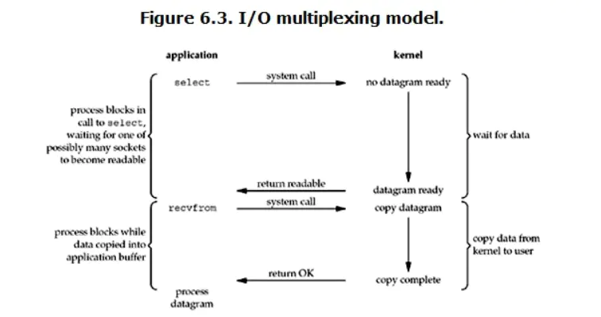

# 通俗理解多种IO模型

## 前言

我们以故事来讲我们经常遇到的多种IO模型，首先故事的情节是

> 老李去买火车票，三天后买到一张退票，其中往返车站耗时1小时。
>
> 里面主要包含的人员有：老李，黄牛，售票员，快递员

## 多种IO模型

### 阻塞IO模型

老李去火车站买票，排了三天队买到一张退票

> 耗费：在火车站等了三天，其它一件事都没做

### 非阻塞IO模型

老李去火车站买票，每隔12个小时去火车站问有没有退票，然后在三天后买到一张票。

> 耗费：往返车站6次，路上6小时，其它时间做了很多事

### IO复用模型

#### select 和 poll

老李去火车站买票，委托黄牛，然后每个6小时打电话给黄牛咨询，黄牛在三天内买到票，然后老李去火车站交钱取票。

> 耗费：花费时间打电话17次，并往返火车站2次，黄牛手续费100元

#### epoll

老李去火车站买票，委托黄牛，黄牛买到票后立即通知老李去领，然后老李去火车站交钱领取

> 耗费：无需打电话，但是还需要往返火车站2次，黄牛手续费100元

### 信号驱动IO模型

老李火车站买票，给售票员留下电话，有票后，售票员打电话通知老李，然后老李去火车站交钱领票

> 耗费：往返车站2次，路上2小时，不需要黄牛费，以及打电话

### 异步IO模型

老李去火车站买票，给售票员留下电话，有票后，售票员通知老李并快递送票上门

> 耗费：往返车站1次，无需黄牛费和电话费

### 总结

- 1和2的区别是：自己轮询
- 2和3的区别是：委托黄牛
- 3和4的区别是：电话代替黄牛
- 4和5的区别是：电话通知还是送票上门

## Linux操作系统中的基础概念

在介绍select、poll、epoll之前，我们首先了解一下linux的基础概念

### 用户空间/内核空间

现在操作系统都是采用虚拟存储器，那么对32位操作系统而言，它的寻址空间（虚拟存储空间）为4G（2^32）

而操作系统的核心是内核，独立于普通的应用程序，可以访问受保护的内存空间，也有访问底层硬件设备的所有权限。为了保证用户进程不能直接操作内核（Kernel），保证内核的安全，操作系统将虚拟空间划分为两部分，一部分是内核空间，一部分是用户空间

### 进程切换

为了控制进程的执行，内核必须有能力挂起正在CPU上运行的进程，并恢复以前挂起的某个进程的执行。这种行为被称为进程切换。因此可以说，任何进程都是在操作系统内核的支持下运行的，是与内核紧密相关的，并且经常切换是非常耗费资源的。

### 进程阻塞

正在执行的进程，由于期待的某些事情未发生，如请求系统资源失败、等待某种操作的完成、新数据尚未到达或无新工作做等，则由系统自动执行阻塞原语（Block），使自己由运行状态变成阻塞状态。可见进程的阻塞是进程自身的一种主动行为，也因此只有处于运行态的进程（获得了CPU资源），才可以将其转换为阻塞状态，当进程进入阻塞状态，是不占用CPU资源的。

### 文件描述符

文件描述符（File Descriptor）是计算机科学中的一个术语，是用一个表述指向文件的引用的抽象化概念。

文件描述符在形式上是一个非负函数。实际上，它是一个索引，指向内核中每一个进程所维护的该进程打开文件的记录表，当程序打开一个现有文件或者创建一个新文件时，内核向进程返回一个文件描述符。在程序设计中，一些涉及底层的程序编写往往会围绕着文件描述符展开。但是文件描述符这一概念只适用于Unix和Linux这样的操作系统。

### 缓存IO

缓存IO又称为标准IO，大多数文件系统的默认IO操作都是缓存IO，在Linux的缓存IO机制中，操作系统会将IO的数据缓存在文件系统的页缓存中，即数据会先被拷贝到操作系统内核的缓冲区中，然后才会从操作系统内核缓冲区拷贝到应用程序的内存地址。

## IO多路复用

如果一个IO流进来，我们就开启一个进程处理这个IO流，那么假设现在有100万个IO流进来，那我们就需要开启100万个进程去处理这些IO流了（这就是传统意义上的多进程并发处理）。思考一下，一百万个进程，你的CPU占有率会多高，这种实现方式极其不合理。所以我们提出了IO多路复用模型，一个线程，通过记录IO流的状态来同时管理多个IO，可以提高服务器的吞吐能力。

我们通过分析一下上面的这张图

- 当进程调用select，进程就会被阻塞
- 此时内核会监视所有select负责的socket，当socket的数据准备好后，就立即返回
- 进程再调用read操作，数据就会从内核拷贝到进程

而多路复用的实现有多种方式，select，poll，epoll

### select

#### 概念

select() 的机制中提供一种fd_set的数据结构，实际上是一个long类型的数组，每一个数组元素都能与一打开的文件句柄（不管是Sokect句柄，还是其它文件、命名管道、设备句柄）建立联系，建立联系的工作由程序员完成，当调用select()时，由内核根据IO状态修改fd_set的内容，由此来通知执行了select()的进程哪一Socket或文件可读。

从流程上来看，使用Select函数进行IO请求时  和 同步阻塞模型 没有太大的区别，甚至还多了添加监视Socket，以及调用select函数的额外操作，效率更差。但是使用select以后最大的优势是用户可以通过在同一个线程内同时处理多个socket的IO请求，用户可以注册多个Socket，然后不断地调用select读取被激活的socket，即可达到在同一线程内同时处理多个IO请求的目的。而在同步阻塞模型中，必须通过多线程的方式才能达到这个目的。

#### select机制存在的问题

- 每次调用select，都需要把fd_set集合从用户态拷贝到内核态，如果fd_set集合很大时，那这个开销也会很大
- 同时每次调用select都需要在内核遍历所有传递过来的fd_set，如果fd_set很大时，那这个开销也很大
- 为了减少数据拷贝带来的性能破坏，内核对监控的fd_set集合大小做了限制，并且这个是通过宏控制的，大小不可改变（限制为1024）

### Poll

Poll的机制和Select类似，与Select在本质上没有多大的差别，管理多个描述符也是进行轮询，根据描述符的状态进行处理，但是poll没有最大文件描述符数量的限制，也就是说，poll只是解决了上面说的第三个问题，并没有解决问题1和问题2

### Epoll

epoll在Linux2.6内核正式提出，是基于事件驱动的IO方式，相对于Select来说，epoll没有描述符个数限制，使用一个文件描述符管理多个描述符，将用户关心的文件描述符的事件存放到内核的一个事件表中，这样在用户空间和内核空间的copy只需一次。

epoll是Linux内核为大批量文件描述符而做了改进的poll，是Linux下多路复用IO接口select、poll的增强版本，它能显著的提高程序在大量并发连接中只有少量活跃的情况下的系统CPU利用率。原因就是获取事件的时候，它无需遍历整个被监听的描述符集，只需要遍历那些被内核IO事件异步唤醒而加入Ready队列的描述符集合就行了

- 水平触发：默认工作模式，即当epoll_wait检测到某描述符事件就绪并通知应用程序时，应用程序可以不立即处理该事件，下次调用epoll_wait时，会再次通知此事件
- 边缘触发：当epoll_wait检测到某描述符事件就绪并通知应用程序时，应用程序必须立即处理该事件，如果不处理，下次调用epoll_wait时，不会再次通知此事件。（直到你做了某些操作导致该描述符变成未就绪状态，也就是说边缘触发只在状态由未就绪变成就绪时只通知一次）

## 总结

一个epoll场景：一个酒吧服务员（一个线程），前面趴了一群醉汉，突然一个吼一声“倒酒”（事件），你小跑过去给他倒一杯，然后随他去吧，突然又一个要倒酒，你又过去倒上，就这样一个服务员服务好多人，有时没人喝酒，服务员处于空闲状态，可以干点别的玩玩手机。

至于epoll与select，poll的区别在于后两者的场景中醉汉不说话，你要挨个问要不要酒，没时间玩手机了。io多路复用大概就是指这几个醉汉共用一个服务员。

我们使用一张图来总结select、poll、epoll的区别

|            | select                                             | poll                                             | epoll                                                        |
| ---------- | -------------------------------------------------- | ------------------------------------------------ | ------------------------------------------------------------ |
| 操作方式   | 遍历                                               | 遍历                                             | 回调                                                         |
| 底层实现   | 数组                                               | 链表                                             | 哈希表                                                       |
| IO效率     | 每次调用都进行线性遍历，时间复杂度为O(n)           | 每次调用都进行线性遍历，时间复杂度为O(n)         | 事件通知方式，每当fd就绪，系统注册的回调函数就会被调用，将就绪fd放到readyList里面，时间复杂度为O(1) |
| 最大连接数 | 1024或2048                                         | 无上限                                           | 无上限                                                       |
| fd拷贝     | 每次调用select，都需要把fd集合从用户态拷贝到内核态 | 每次调用poll，都需要把fd集合从用户态拷贝到内核态 | 调用epoll_ctl时，拷贝进内核并保存，之后每次epoll_wait不拷贝  |

select和poll即使只有一个描述符就绪，也要遍历整个集合。如果集合中活跃的描述符很少，遍历过程的开销就会变得很大，而如果集合中大部分的描述符都是活跃的，遍历过程的开销又可以忽略。

epoll的实现每次只遍历活跃的描述符（如果是水平触发，也会遍历先前活跃的描述符），在活跃描述符较少的情况下，就会很有优势，在代码的分析过程中，可以看到epoll的实现过于复杂并且实现过程中需要同步处理（锁），如果大部分描述符都是活跃的，epoll的效率可能不如select 或者 poll

内核将就绪的文件描述符放在传入的就绪队列中，所以只用遍历依次处理即可。这里返回的文件描述符是通过mmap让内核和用户空间共享同一块内存实现传递的，减少了不必要的拷贝。

epoll是Linux目前大规模网络并发程序开发的首选模型，在绝大数情况下，性能远远超过select 和 poll。目前流行的高性能web服务器Nginx 正式依赖于epoll提供的高效网络套接字轮询服务，但是在并发连接不高的情况下，多线程 + 阻塞IO的方式可能会更好。