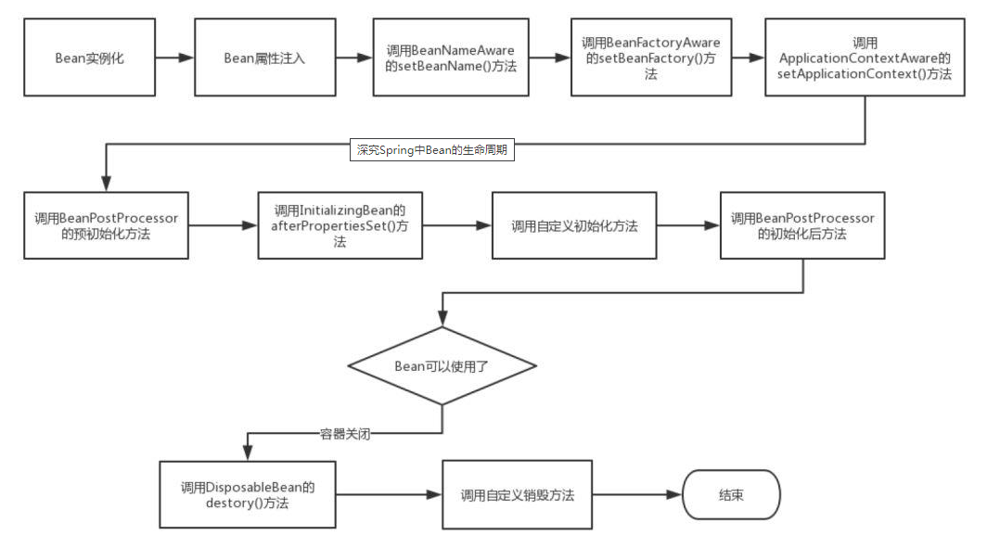

# Bean的生命周期

## 前言

在我们没有使用Spring框架之前，创建对象一般都是使用new关键字进行创建，当然除了new关键字外，还有

- 运用反射手段，使用Class类的newInstance方法 或者 Constructor类中的newInstance方法
- 使用clone方法
- 使用反序列化（ObjectInputStream）

一旦对象不再被使用的时候，将有可能被JVM垃圾回收器进行回收。

但是在Spring通过IOC容器进行管理之后，Bean 的生命周期就变得更加复杂了，下图展示了Bean的构造过程



## Bean的生命周期

我们对上图的每个步骤进行文字说明

- Spring启动，查找并加载需要被Spring管理的bean，进行Bean的实例化
- Bean实例化后对将Bean的引入和值注入到Bean的属性中
- 如果Bean实现了BeanNameAware接口的话，Spring将Bean的Id传递给setBeanName()方法
- 如果Bean实现了BeanFactoryAware接口的话，Spring将调用setBeanFactory()方法，将BeanFactory容器实例传入
- 如果Bean实现了ApplicationContextAware接口的话，Spring将调用Bean的setApplicationContext()方法，将bean所在应用上下文引用传入进来。
- 如果Bean实现了BeanPostProcessor接口，Spring就将调用他们的postProcessBeforeInitialization()方法。
- 如果Bean 实现了InitializingBean接口，Spring将调用他们的afterPropertiesSet()方法。类似的，如果bean使用init-method声明了初始化方法，该方法也会被调用
- 如果Bean 实现了BeanPostProcessor接口，Spring就将调用他们的postProcessAfterInitialization()方法。
- 此时，Bean已经准备就绪，可以被应用程序使用了。他们将一直驻留在应用上下文中，直到应用上下文被销毁。
- 如果bean实现了DisposableBean接口，Spring将调用它的destory()接口方法，同样，如果bean使用了destory-method 声明销毁方法，该方法也会被调用。

## 接口方法的分类

 Bean的完整生命周期经历了各种方法的调用，这些方法可以分类一下三类

### Bean自身的方法：

这个包括了Bean本身调用的方法和通过配置文件中<bean>的init-method和destroy-method指定的方法

### Bean级生命周期的方法

这个包括了BeanNameAware、BeanFactoryAware、InitializingBean和DiposableBean这些接口的方法

### 容器级生命周期的方法

这个包括了InstantiationAwareBeanPostProcessor 和 BeanPostProcessor 这两个接口实现，一般称它们的实现类为“后处理器”。

### 工程后处理器接口方法

这个包括了AspectJWeavingEnabler, ConfigurationClassPostProcessor, CustomAutowireConfigurer等等非常有用的工厂后处理器　　接口的方法。工厂后处理器也是容器级的。在应用上下文装配配置文件之后立即调用。

## DEMO举例

我们用一个简单的Spring Bean来演示一下Spring Bean的生命周期。

首先是一个简单的Spring Bean，调用Bean自身的方法和Bean级生命周期接口方法，为了方便演示，它实现了BeanNameAware、BeanFactoryAware、InitializingBean和DiposableBean这4个接口，同时有2个方法，对应配置文件中<bean>的init-method和destroy-method。如下：

```
package springBeanTest;

import org.springframework.beans.BeansException;
import org.springframework.beans.factory.BeanFactory;
import org.springframework.beans.factory.BeanFactoryAware;
import org.springframework.beans.factory.BeanNameAware;
import org.springframework.beans.factory.DisposableBean;
import org.springframework.beans.factory.InitializingBean;

public class Person implements BeanFactoryAware, BeanNameAware,
        InitializingBean, DisposableBean {

    private String name;
    private String address;
    private int phone;

    private BeanFactory beanFactory;
    private String beanName;

    public Person() {
        System.out.println("【构造器】调用Person的构造器实例化");
    }

    public String getName() {
        return name;
    }

    public void setName(String name) {
        System.out.println("【注入属性】注入属性name");
        this.name = name;
    }

    public String getAddress() {
        return address;
    }

    public void setAddress(String address) {
        System.out.println("【注入属性】注入属性address");
        this.address = address;
    }

    public int getPhone() {
        return phone;
    }

    public void setPhone(int phone) {
        System.out.println("【注入属性】注入属性phone");
        this.phone = phone;
    }

    @Override
    public String toString() {
        return "Person [address=" + address + ", name=" + name + ", phone="
                + phone + "]";
    }

    // 这是BeanFactoryAware接口方法
    @Override
    public void setBeanFactory(BeanFactory arg0) throws BeansException {
        System.out
                .println("【BeanFactoryAware接口】调用BeanFactoryAware.setBeanFactory()");
        this.beanFactory = arg0;
    }

    // 这是BeanNameAware接口方法
    @Override
    public void setBeanName(String arg0) {
        System.out.println("【BeanNameAware接口】调用BeanNameAware.setBeanName()");
        this.beanName = arg0;
    }

    // 这是InitializingBean接口方法
    @Override
    public void afterPropertiesSet() throws Exception {
        System.out
                .println("【InitializingBean接口】调用InitializingBean.afterPropertiesSet()");
    }

    // 这是DiposibleBean接口方法
    @Override
    public void destroy() throws Exception {
        System.out.println("【DiposibleBean接口】调用DiposibleBean.destory()");
    }

    // 通过<bean>的init-method属性指定的初始化方法
    public void myInit() {
        System.out.println("【init-method】调用<bean>的init-method属性指定的初始化方法");
    }

    // 通过<bean>的destroy-method属性指定的初始化方法
    public void myDestory() {
        System.out.println("【destroy-method】调用<bean>的destroy-method属性指定的初始化方法");
    }
}
```

接下来是演示BeanPostProcessor接口的方法，如下：

```
package springBeanTest;

import org.springframework.beans.BeansException;
import org.springframework.beans.factory.config.BeanPostProcessor;

public class MyBeanPostProcessor implements BeanPostProcessor {

    public MyBeanPostProcessor() {
        super();
        System.out.println("这是BeanPostProcessor实现类构造器！！");
        // TODO Auto-generated constructor stub
    }

    @Override
    public Object postProcessAfterInitialization(Object arg0, String arg1)
            throws BeansException {
        System.out
        .println("BeanPostProcessor接口方法postProcessAfterInitialization对属性进行更改！");
        return arg0;
    }

    @Override
    public Object postProcessBeforeInitialization(Object arg0, String arg1)
            throws BeansException {
        System.out
        .println("BeanPostProcessor接口方法postProcessBeforeInitialization对属性进行更改！");
        return arg0;
    }
}
```

如上，BeanPostProcessor接口包括2个方法postProcessAfterInitialization和postProcessBeforeInitialization，这两个方法的第一个参数都是要处理的Bean对象，第二个参数都是Bean的name。返回值也都是要处理的Bean对象。这里要注意。

InstantiationAwareBeanPostProcessor 接口本质是BeanPostProcessor的子接口，一般我们继承Spring为其提供的适配器类InstantiationAwareBeanPostProcessor Adapter来使用它，如下：

```
package springBeanTest;

import java.beans.PropertyDescriptor;

import org.springframework.beans.BeansException;
import org.springframework.beans.PropertyValues;
import org.springframework.beans.factory.config.InstantiationAwareBeanPostProcessorAdapter;

public class MyInstantiationAwareBeanPostProcessor extends
        InstantiationAwareBeanPostProcessorAdapter {

    public MyInstantiationAwareBeanPostProcessor() {
        super();
        System.out
                .println("这是InstantiationAwareBeanPostProcessorAdapter实现类构造器！！");
    }

    // 接口方法、实例化Bean之前调用
    @Override
    public Object postProcessBeforeInstantiation(Class beanClass,
            String beanName) throws BeansException {
        System.out
                .println("InstantiationAwareBeanPostProcessor调用postProcessBeforeInstantiation方法");
        return null;
    }

    // 接口方法、实例化Bean之后调用
    @Override
    public Object postProcessAfterInitialization(Object bean, String beanName)
            throws BeansException {
        System.out
                .println("InstantiationAwareBeanPostProcessor调用postProcessAfterInitialization方法");
        return bean;
    }

    // 接口方法、设置某个属性时调用
    @Override
    public PropertyValues postProcessPropertyValues(PropertyValues pvs,
            PropertyDescriptor[] pds, Object bean, String beanName)
            throws BeansException {
        System.out
                .println("InstantiationAwareBeanPostProcessor调用postProcessPropertyValues方法");
        return pvs;
    }
}
```


## 参考

https://www.cnblogs.com/zrtqsk/p/3735273.html

https://www.cnblogs.com/javazhiyin/p/10905294.html