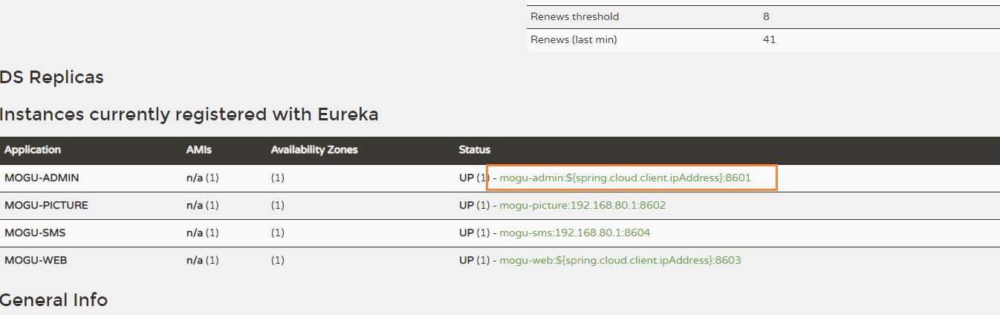
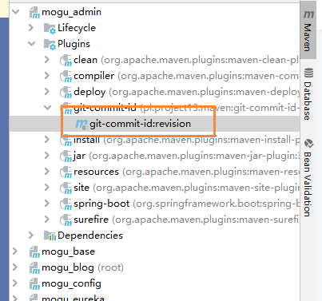
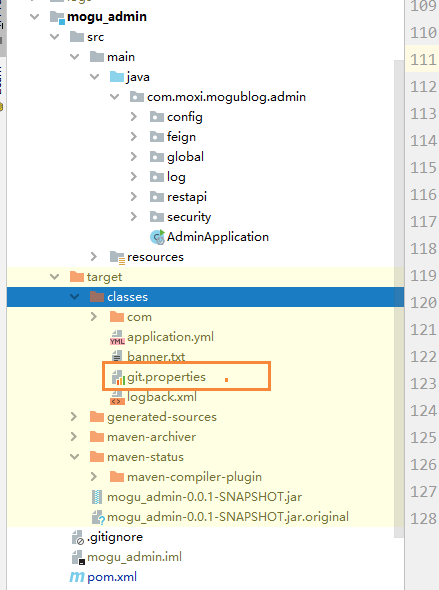
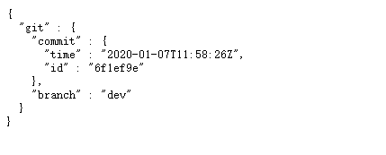

# Eureka管理页面配置/actuator/info接口返回git信息

## 前言

这阵子在弄监控页面，我点击eureka里面的地址



发现进去的页面没有 任何内容显示，后面想想可能是没有什么东西没有配置而引起的

通过查阅资料发现，微服务若是用git管理，当前微服务部署的git的版本信息是不可或缺的信息，spring boot admin中通过/actuator/info接口返回git基本信息。该接口若要返回git信息，首先需要引入Actuator依赖

```
<!-- 使用Actuator的/info端点输出Git版本 -->
<dependency>
    <groupId>org.springframework.boot</groupId>
    <artifactId>spring-boot-starter-actuator</artifactId>
</dependency>
```

同时需要添加git-commit-id-plugin插件

```
            <plugin>
                <groupId>pl.project13.maven</groupId>
                <artifactId>git-commit-id-plugin</artifactId>
                <version>2.1.15</version>
                <executions>
                    <execution>
                        <goals>
                            <goal>revision</goal>
                        </goals>
                    </execution>
                </executions>
                <configuration>
                    <dotGitDirectory>${project.basedir}/.git</dotGitDirectory>
                </configuration>
            </plugin>
```

添加完成后，我们查看IDEA的Maven，能够发现多出了一个 git-commit-id:revision



我们点击后，在`target/classes`目录下，我们可以发现产生了一个`git.properties`配置信息：



里面的内容就是当前项目的git信息：

```
#Generated by Git-Commit-Id-Plugin
#Tue Jan 07 21:25:46 CST 2020
git.build.user.email=xzx19950624@qq.com
git.build.host=DESKTOP-DIA5I1I
git.dirty=true
git.remote.origin.url=https\://github.com/moxi624/mogu_blog_v2.git
git.closest.tag.name=
git.commit.id.describe-short=6f1ef9e-dirty
git.commit.user.email=xzx19950624@qq.com
git.commit.time=2020-01-07T19\:58\:26+0800
git.commit.message.full=update banner
git.build.version=0.0.1-SNAPSHOT
git.commit.message.short=update banner
git.commit.id.abbrev=6f1ef9e
git.branch=dev
git.build.user.name=陌溪_
git.closest.tag.commit.count=
git.commit.id.describe=6f1ef9e-dirty
git.commit.id=6f1ef9e48bbd0f3cb825b7934152dde21d821456
git.tags=
git.build.time=2020-01-07T21\:25\:46+0800
git.commit.user.name=陌溪_

```

然后启动eureka页面，在点击刚刚的a标签，发现能够成功获取到git信息了

