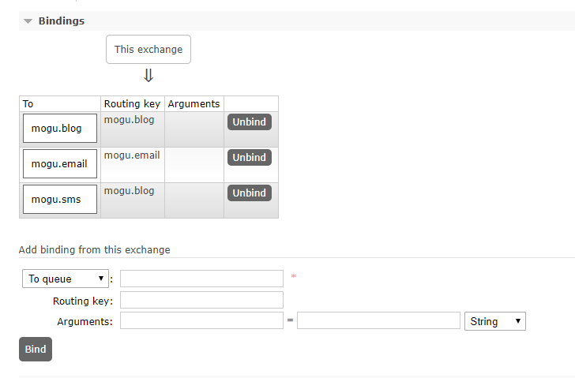

# SpringBoot中使用注解的方式创建队列和交换机

## 前言

最开始蘑菇博客在进行初始化配置的时候，需要手动的创建交换机，创建队列，然后绑定交换机，这个步骤是非常繁琐的，而且一不小心的话，还可能就出了错误，之前就有个小伙伴在创建交换机的时候 , 将交换机的名称`exchange.direct`写成了 `exchanges.direct`。然后导致消息无法正常被消费，后面通过排查了很久才发现这个问题，下面为了解决这个手动创建的痛苦，使用了注解的方式来进行队列和交换机的创建

## 创建交换机

交换机的声明比较简单，通过ExchangeBuilder创建一个路由交换机

```java
public static final  String EXCHANGE_DIRECT = "exchange.direct";

/**
* 申明交换机
*/
@Bean(EXCHANGE_DIRECT)
public Exchange EXCHANGE_DIRECT() {
    // 申明路由交换机，durable:在rabbitmq重启后，交换机还在
    return ExchangeBuilder.directExchange(EXCHANGE_DIRECT).durable(true).build();
}
```

## 创建队列

队列的话，我们直接使用new Queue() 传入队列名称即可

```java
public static final  String MOGU_BLOG = "mogu.blog";
public static final  String MOGU_EMAIL = "mogu.email";
public static final  String MOGU_SMS = "mogu.sms";

/**
* 申明Blog队列
* @return
*/
@Bean(MOGU_BLOG)
public Queue MOGU_BLOG() {
    return new Queue(MOGU_BLOG);
}

/**
* 申明Email队列
* @return
*/
@Bean(MOGU_EMAIL)
public Queue MOGU_EMAIL() {
    return new Queue(MOGU_EMAIL);
}

/**
* 申明SMS队列
* @return
*/
@Bean(MOGU_SMS)
public Queue MOGU_SMS() {
    return new Queue(MOGU_SMS);	
}
```

## 绑定交换机和队列

在我们创建完交换机和队列后，我们就需要将其绑定起来，在这里需要使用`@Qualifie` 从Spring容器中加载前面创建的Bean，也就是队列和交换机，然后通过 `BindingBuilder.bind(queue).to(exchange)`  进行绑定，同时我们还需要配置RoutingKey，也就是路由

```java
public static final  String ROUTING_KEY_BLOG = "mogu.blog";
public static final  String ROUTING_KEY_EMAIL = "mogu.email";
public static final  String ROUTING_KEY_SMS = "mogu.sms";

/**
* mogu.blog 队列绑定交换机，指定routingKey
* @param queue
* @param exchange
* @return
*/
@Bean
public Binding BINDING_QUEUE_INFORM_BLOG(@Qualifier(MOGU_BLOG) Queue queue, @Qualifier(EXCHANGE_DIRECT) Exchange exchange) {
    return BindingBuilder.bind(queue).to(exchange).with(ROUTING_KEY_BLOG).noargs();
}

/**
* mogu.mail 队列绑定交换机，指定routingKey
* @param queue
* @param exchange
* @return
*/
@Bean
public Binding BINDING_QUEUE_INFORM_EMAIL(@Qualifier(MOGU_EMAIL) Queue queue, @Qualifier(EXCHANGE_DIRECT) Exchange exchange) {
    return BindingBuilder.bind(queue).to(exchange).with(ROUTING_KEY_EMAIL).noargs();
}

/**
* mogu.sms 队列绑定交换机，指定routingKey
* @param queue
* @param exchange
* @return
*/
@Bean
public Binding BINDING_QUEUE_INFORM_SMS(@Qualifier(MOGU_SMS) Queue queue, @Qualifier(EXCHANGE_DIRECT) Exchange exchange) {
    return BindingBuilder.bind(queue).to(exchange).with(ROUTING_KEY_BLOG).noargs();
}


```

下面我们把之前手动创建的Exchange和Queue删除后，然后重新运行mogu_sms项目，发现已经能够通过注解的方式成功创建队列和交换机了，并且如下图所示，成功绑定了起来



## 完整代码

```java
package com.moxi.mogublog.sms.config;

import org.springframework.amqp.core.*;
import org.springframework.amqp.support.converter.Jackson2JsonMessageConverter;
import org.springframework.amqp.support.converter.MessageConverter;
import org.springframework.beans.factory.annotation.Qualifier;
import org.springframework.context.annotation.Bean;
import org.springframework.context.annotation.Configuration;

/**
 * RabbitMQ配置文件
 */
@Configuration
public class RabbitMqConfig {

    public static final  String MOGU_BLOG = "mogu.blog";
    public static final  String MOGU_EMAIL = "mogu.email";
    public static final  String MOGU_SMS = "mogu.sms";
    public static final  String EXCHANGE_DIRECT = "exchange.direct";

    public static final  String ROUTING_KEY_BLOG = "mogu.blog";
    public static final  String ROUTING_KEY_EMAIL = "mogu.email";
    public static final  String ROUTING_KEY_SMS = "mogu.sms";


    /**
     * 申明交换机
     */
    @Bean(EXCHANGE_DIRECT)
    public Exchange EXCHANGE_DIRECT() {
        // 申明路由交换机，durable:在rabbitmq重启后，交换机还在
        return ExchangeBuilder.directExchange(EXCHANGE_DIRECT).durable(true).build();
    }

    /**
     * 申明Blog队列
     * @return
     */
    @Bean(MOGU_BLOG)
    public Queue MOGU_BLOG() {
        return new Queue(MOGU_BLOG);
    }

    /**
     * 申明Email队列
     * @return
     */
    @Bean(MOGU_EMAIL)
    public Queue MOGU_EMAIL() {
        return new Queue(MOGU_EMAIL);
    }

    /**
     * 申明SMS队列
     * @return
     */
    @Bean(MOGU_SMS)
    public Queue MOGU_SMS() {
        return new Queue(MOGU_SMS);
    }

    /**
     * mogu.blog 队列绑定交换机，指定routingKey
     * @param queue
     * @param exchange
     * @return
     */
    @Bean
    public Binding BINDING_QUEUE_INFORM_BLOG(@Qualifier(MOGU_BLOG) Queue queue, @Qualifier(EXCHANGE_DIRECT) Exchange exchange) {
        return BindingBuilder.bind(queue).to(exchange).with(ROUTING_KEY_BLOG).noargs();
    }

    /**
     * mogu.mail 队列绑定交换机，指定routingKey
     * @param queue
     * @param exchange
     * @return
     */
    @Bean
    public Binding BINDING_QUEUE_INFORM_EMAIL(@Qualifier(MOGU_EMAIL) Queue queue, @Qualifier(EXCHANGE_DIRECT) Exchange exchange) {
        return BindingBuilder.bind(queue).to(exchange).with(ROUTING_KEY_EMAIL).noargs();
    }

    /**
     * mogu.sms 队列绑定交换机，指定routingKey
     * @param queue
     * @param exchange
     * @return
     */
    @Bean
    public Binding BINDING_QUEUE_INFORM_SMS(@Qualifier(MOGU_SMS) Queue queue, @Qualifier(EXCHANGE_DIRECT) Exchange exchange) {
        return BindingBuilder.bind(queue).to(exchange).with(ROUTING_KEY_BLOG).noargs();
    }


    @Bean
    public MessageConverter messageConverter() {
        return new Jackson2JsonMessageConverter();
    }

}
```

