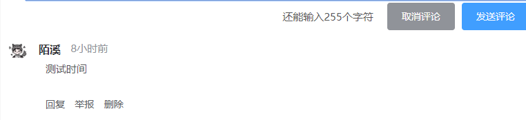
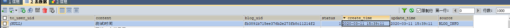
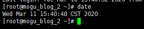

# SpringBoot解决时区问题

## 前言

蘑菇博客一直存在时区不正确的问题，让我苦不堪言，比如刚刚发表的评论会显示八小时前



但是我们查看数据库的和服务器的时间能够发现，时间显示是正常的

刚刚发表的评论的时间：



以及服务器的时间



## 解决方法

最近通过热心的小伙伴提出，打算彻底解决这个时区的问题，进过查阅相关博客，总结出下面有效的配置

1、我们设置mysql连接，在连接语句后面加上

```
&serverTimezone=Asia/Shanghai
```

2、然后修改jackson配置

```
#spring
spring:
  jackson:
    date-format: yyyy-MM-dd HH:mm:ss
    time-zone: Asia/Shanghai
```

3、修改启动类

在启动类中，添加这个方法

```
    /**
     * 设置时区
     */
    @PostConstruct
    void setDefaultTimezone() {
        TimeZone.setDefault(TimeZone.getTimeZone("Asia/Shanghai"));
    }

```

然后在启动类的main方法中，设置时区

```
    public static void main(String[] args) {
        TimeZone.setDefault(TimeZone.getTimeZone("Asia/Shanghai"));
        SpringApplication.run(AdminApplication.class, args);
    }

```

