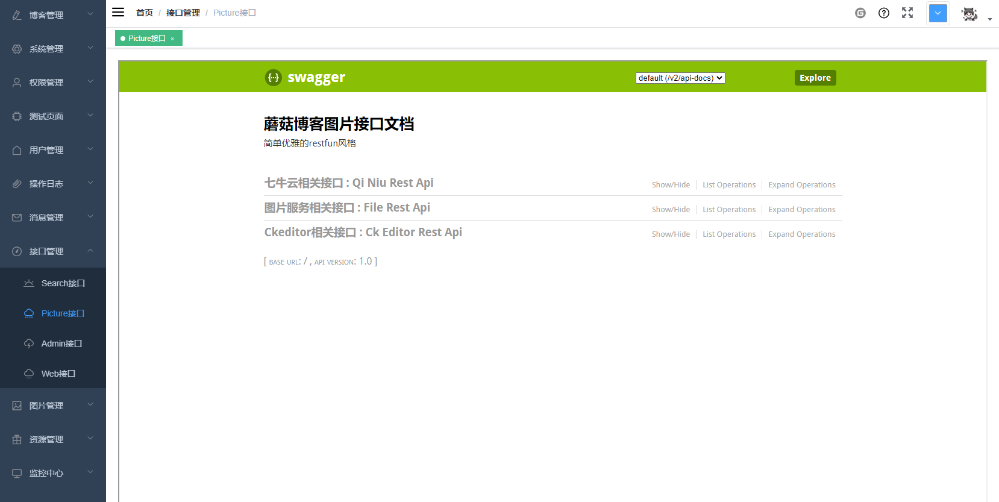

# Swagger-ui.html页面出现404

## 前言

首先感谢群里小伙伴@Major_Tom的反馈，今天排查了一下mogu_picture的 swagger-ui.html页面打不开了，显示的是404。因为 swagger-ui的引入比较简单，所以我先排查了一下依赖和配置，以及对应方法上的注解，都是正常的，并且同样的配置在mogu_web和mogu_admin项目是正常的，所以非常好奇问题出来哪里？

## 排查过程

首先排除的是配置的问题，因为原来mogu_picture是能够正常使用的，但是这阵子因为加了一些新功能，所以引入了拦截器。

我们通过查看mogu_picture的日志记录，能够看到下面的信息

```bash
No mapping found for HTTP request with URI [/swagger-ui.html] in DispatcherServlet with name 'dispatcherServlet'
```

这个错误其实很明显，就是没有 /swagger-ui.html 的映射

对于一个正常的接口类来说，例如我们在Controller类中，只需要配置了RequestMapper("/user/getInfo")，那么我们请求  /user/info 就能够直接调用，而上面这段信息告诉我们，就是没有RequestMapper这个东西，但是因为Swagger-ui是属于静态资源，那么原本也会有对应的静态资源映射的处理机制。

突然想起来，之前引入了拦截器，主要就是为了登录拦截的功能

```java
/**
 * @author: 陌溪
 * @create: 2020-06-14-21:55
 */
@Configuration
public class InterceptorConfig implements WebMvcConfigurer {

    /**
     * 注册自定义拦截器
     */
    @Override
    public void addInterceptors(InterceptorRegistry registry) {
        registry.addInterceptor(new TokenInterceptor()).addPathPatterns("/**");
    }
}

```

会不会是因为上面的代码把我们的静态资源给拦截了呢？

首先我们可以知道的是，注册的动作最终还是由实现了`WebMvcConfigurer`接口的实例来实现的，这些实例当中肯定有注册资源处理器的，现在的项目中肯定就是缺少这个实例。

通过查看 `WebMvcConfigurer` 的实现，发现了`WebMvcAutoConfigurationAdapter`，这是springboot里的自动装配，而且它有`addResourceHandlers`的实现，可能需要它，那接下来就要看这个自动装配为啥没有生效了

来看看生效的条件，因为WebMvcAutoConfigurationAdapter是一个嵌套的配置，所以看它的依附类WebMvcAutoConfiguration的一个条件：@ConditionalOnMissingBean(WebMvcConfigurationSupport.class)，可能就是WebMvcConfigurationSupport的实例存在，才导致自动装配失效。

也就是说，因为通过引入了 `WebMvcConfigurer` 可能就造成了原来SpringBoot中无法自动装配静态资源映射了，那么就需要我们在原来的基础上，手动进行添加

```java
/**
 * @author: 陌溪
 * @create: 2020-06-14-21:55
 */
@Configuration
public class InterceptorConfig implements WebMvcConfigurer {

    /**
     * 注册自定义拦截器
     */
    @Override
    public void addInterceptors(InterceptorRegistry registry) {
        registry.addInterceptor(new TokenInterceptor()).addPathPatterns("/**");
    }

    /**
     * 注册资源映射
     * @param registry
     */
    @Override
    public void addResourceHandlers(ResourceHandlerRegistry registry) {
        registry.addResourceHandler("/**").addResourceLocations(
                "classpath:/static/");
        registry.addResourceHandler("swagger-ui.html").addResourceLocations(
                "classpath:/META-INF/resources/");
        registry.addResourceHandler("/webjars/**").addResourceLocations(
                "classpath:/META-INF/resources/webjars/");
    }
}
```

我们在原来的配置类中，重写静态资源映射的代码，然后重启项目，发现Swagger-ui项目能够正常访问了~

