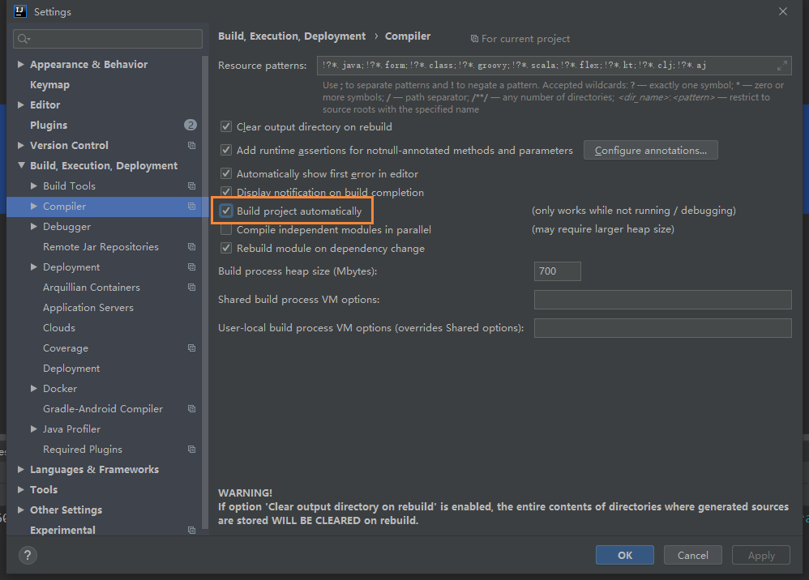
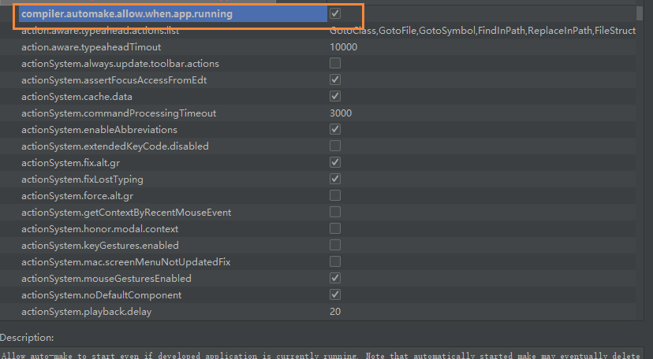

# 使用DevTools实现SpringBoot项目热部署

## 前言

最近在开发的时候，每次改动代码都需要启动项目，因为有的时候改动的服务比较多，所以重启的次数也就比较多了，想着每次重启等待也挺麻烦的，就打算使用DevTools工具实现项目的热部署

## 热部署是什么

大家都知道在项目开发过程中，常常会改动页面数据或者修改数据结构，为了显示改动效果，往往需要重启应用查看改变效果，其实就是重新编译生成了新的Class文件，这个文件里记录着和代码等对应的各种信息，然后Class文件将被虚拟机的ClassLoader加载。

而热部署正是利用了这个特点，它监听到如果有Class文件改动了，就会创建一个新的ClaassLoader进行加载该文件，经过一系列的过程，最终将结果呈现在我们眼前

## 类加载机制

Java中的类经过编译器可以把代码编译为存储字节码的Class文件，该Class文件存储了各种信息，最终要加载到虚拟机中运行使用。类加载机制（摘自《深入理解 Java 虚拟机》）虚拟机把描述类的数据从Class文件加载到内存中，并对数据进行校验、转换解析和初始化，最终形成可以被虚拟机直接使用的Java类型。

## 添加依赖

```
<dependency>
	<groupId>org.springframework.boot</groupId>
	<artifactId>spring-boot-devtools</artifactId>
	<optional>true</optional>
</dependency>
```

## DevTools的配置

```
#热部署生效
spring.devtools.restart.enabled: true

#设置重启的目录
spring.devtools.restart.additional-paths: src/main/java

#classpath目录下的WEB-INF文件夹内容修改不重启
spring.devtools.restart.exclude: WEB-INF/**
```

## IDEA需要的配置

当我们修改了Java类后，IDEA默认是不自动编译的，而spring-boot-devtools又是监测classpath下的文件发生变化才会重启应用，所以需要设置IDEA的自动编译：

- File-Settings-Compiler-Build Project automatically

  

- ctrl + shift + alt + /,选择Registry,勾上 compiler.automake.allow.when.app.running



