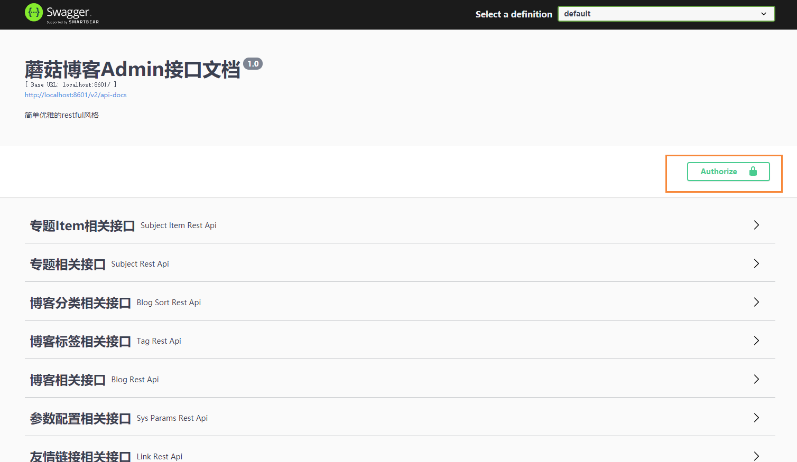
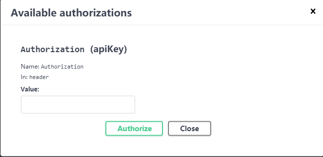

# SpringBoot项目将Swagger升级3.0

## 前言

这阵子观察到Swagger官方已经升级到了3.0的版本，想着升级体验一下最新的版本

## 新特性

- 移除了2.x版本的冲突版本，移除了guava等
- 移除了@EnableSwagger2
- 新增了springfox-boot-starter
- .....

## 引入依赖

新版本中，将改成starter的方式，所以我们一来是这样引入的

```pom
<dependency>
    <groupId>io.springfox</groupId>
    <artifactId>springfox-boot-starter</artifactId>
    <version>3.0.0</version>
</dependency>
```

同时引用主类的注解已经修改了

```bash
# 原来注解
@EnableSwagger2

# 修改后的注解
@EnableOpenApi
```

## 修改配置文件

```bash
@Configuration
public class Swagger3Config {
    @Bean
    public Docket createRestApi() {
        return new Docket(DocumentationType.OAS_30)
                .apiInfo(apiInfo())
                .select()
                .apis(RequestHandlerSelectors.withMethodAnnotation(ApiOperation.class))
                .paths(PathSelectors.any())
                .build();
    }

    private ApiInfo apiInfo() {
        return new ApiInfoBuilder()
                .title("Swagger3接口文档")
                .description("文档描述")
                .contact(new Contact("fanl", "#", "862844083@qq.com"))
                .version("1.0")
                .build();
    }
}
```

然后在原来的SpringSecurity配置文件里面，允许对于网站静态资源的无授权访问

```java
.antMatchers(
    "/swagger-ui.html",
    "/swagger-ui/*",
    "/swagger-resources/**",
    "/v2/api-docs",
    "/v3/api-docs",
    "/webjars/**",
    "/actuator/**",
    "/druid/**"
).permitAll()
```

然后我们运行我们的项目程序，然后输入下面的网址访问swagger-ui页面

```bash
# 注意，新版的swagger页面和2.x版本是有区别的
http://localhost:8601/swagger-ui/index.html
```

就能看到最新版的页面了


但是我们有些接口还需要授权，因此我们还要配置携带token进行访问，因此我们还需要修改一下配置信息

```java
@Configuration
class Swagger3Config {
    @Bean
    public Docket createRestApi() {

        return new Docket(DocumentationType.SWAGGER_2).
                useDefaultResponseMessages(false)
                .apiInfo(apiInfo())
                .select()
                .apis(RequestHandlerSelectors.withMethodAnnotation(ApiOperation.class))
                .paths(PathSelectors.regex("^(?!auth).*$"))
                .build()
                .securitySchemes(securitySchemes())
                .securityContexts(securityContexts());
    }

    private List<SecurityScheme> securitySchemes() {
        return Lists.newArrayList(
                new ApiKey("Authorization", "Authorization", "header"));
    }

    List<SecurityReference> defaultAuth() {
        AuthorizationScope authorizationScope = new AuthorizationScope("global", "accessEverything");
        AuthorizationScope[] authorizationScopes = new AuthorizationScope[1];
        authorizationScopes[0] = authorizationScope;
        return Lists.newArrayList(
                new SecurityReference("Authorization", authorizationScopes));
    }

    private List<SecurityContext> securityContexts() {
        return Lists.newArrayList(
                SecurityContext.builder()
                        .securityReferences(defaultAuth())
                        .forPaths(PathSelectors.regex("^(?!auth).*$"))
                        .build()
        );
    }

    private ApiInfo apiInfo() {
        return new ApiInfoBuilder()
                .title("蘑菇博客Admin接口文档")
                .description("简单优雅的restful风格")
                .version("1.0")
                .build();
    }
}
```

修改完成后，即可进行授权的安全验证了



点击按钮，添加对应的token，然后我们在请求接口的时候，就会携带对应的请求头信息了



## 参考

https://blog.csdn.net/qq_15973399/article/details/107436089