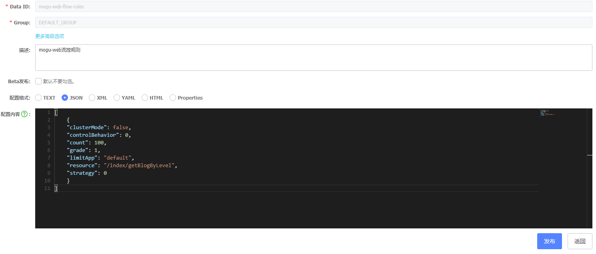

# Feign配置全局Sentinel流控异常和降级异常

## 前言

最近在使用feign调用的时候，因为加入了sentinel进行流控和降级机制，在我们如果没有对Sentinel异常处理进行封装的话，默认返回的信息如下所示

```bash
Blocked by Sentinel(flow limiting)
```

很显然上述的异常信息，对我们目前的项目来说不太适用，所以就打算在对异常进行封装，使其返回我们项目中统一的格式

## Feign全局兜底异常处理

之前提到过通过 [配置Sentinel规则持久化到Nacos中](http://www.moguit.cn/#/info?blogUid=6473a200c9986f45af2ae9f12534ec93) 提到将Sentinel规则持久化到数据库中，但是我们在通过feign调用时，不能很好的处理由sentinel产生的流控异常，当然我们可以通过 @SentinelResource 注解来解决，如下所示，我们通过在需要处理的方法上，编写一个异常处理的方法即可

```bash
@GetMapping("/testHotKey")
@SentinelResource(value = "testHotKey",blockHandler = "deal_testHotKey")
public String testHotKey(String p1, String p2)
{
    int age = 10/0;
    return "------testHotKey";
}

// 和上面的参数一样，不错需要加入 BlockException
public String deal_testHotKey (String p1, String p2, BlockException exception)
{
	return "------deal_testHotKey,o(╥﹏╥)o";  //  兜底的方法
}
```

但是这个解决的方法比较麻烦，因为如果我们的接口很多的话，那么需要在每个需要处理的接口上都进行添加，因此可以考虑定义一个全局的兜底异常处理。

我们需要做的就是在feign上在编写一套全局的异常处理，首先我们有一个已经写好的feign接口PictureFeignClient.Java，在下面的 @Feign注解上，我们需要添加全局fallback类

```bash
/**
 * 图片服务feign远程调用
 *
 * @author 陌溪
 * @date 2020年10月3日21:16:34
 */
@FeignClient(name = "mogu-picture", fallback = PictureFeignFallback.class)
public interface PictureFeignClient {

    /**
     * 获取文件的信息接口
     */
    @RequestMapping(value = "/file/getPicture", method = RequestMethod.GET)
    String getPicture(@RequestParam("fileIds") String fileIds, @RequestParam("code") String code);

    /**
     * 通过URL List上传图片
     * @param fileVO
     * @return
     */
    @RequestMapping(value = "/file/uploadPicsByUrl2", method = RequestMethod.POST)
    String uploadPicsByUrl(FileVO fileVO);
}
```

然后我们需要在编写一个全局fallback类：PictureFeignFallback.java，在这里类中，就会对我们feign调用服务有一个兜底的方法，当我们的Picture服务宕机的时候，导致接口不可用时，就会自动触发该方法

```bash
/**
 * 图片服务降级兜底方法【当服务不可用时会触发】
 *
 * @author: 陌溪
 * @create: 2020-10-03-20:54
 */
@Component
@Slf4j
public class PictureFeignFallback implements PictureFeignClient {

    @Override
    public String getPicture(String fileIds, String code) {
        HttpServletRequest request = RequestHolder.getRequest();
        StringBuffer requestURL = request.getRequestURL();
        log.error("图片服务出现异常，服务降级返回，请求路径: {}", requestURL);
        return ResultUtil.errorWithMessage("获取图片服务降级返回");
    }

    @Override
    public String uploadPicsByUrl(FileVO fileVO) {
        HttpServletRequest request = RequestHolder.getRequest();
        StringBuffer requestURL = request.getRequestURL();
        log.error("图片服务出现异常，更新图片失败，服务降级返回，请求路径: {}", requestURL);
        return ResultUtil.errorWithMessage("更新图片服务降级返回");
    }
}
```

同时，我们使用了自定义的返回方式，对我们的错误返回进行了封装，达到了全局兜底异常的处理

我们还需要修改一下配置，在我们的yml文件中 激活Sentinel对Feign的支持

```yml
# 激活Sentinel对Feign的支持
feign:
  sentinel:
    enabled: true
```

## Feign处理全局流控异常

上面提到的异常指的就是当服务不可用或者服务出现业务异常时触发的，也就是满足我们的降级规则时触发的全局兜底异常。但是除了降级异常之外，还有我们通过配置的规则，设置的流控规则



如上图所示，就是对我们某个接口配置的流控规则，其中流控规则主要分为一下几种

- 请求接口被限流
- 请求接口被降级
- 请求接口被热点限流
- 请求接口被授权规则限制访问
- 请求接口被系统规则限制

针对不同的异常，抛出的错误也是不一样的，但是错误的格式都是如下所示

```bash
Blocked by Sentinel (XXXX)
```

所以针对如上所示的各种异常，我们也需要进行全局流控异常的捕获和处理，首先创建 全局feign异常处理

FeignBlockHandler.java

```java
/**
 * 全局feign异常处理类
 * @author: 陌溪
 * @date: 2020-10-03-21:56
 */
@Component
@Slf4j
public class FeignBlockHandler implements UrlBlockHandler {

    @Override
    public void blocked(HttpServletRequest httpServletRequest, HttpServletResponse httpServletResponse, BlockException e) throws IOException {
        httpServletResponse.setContentType("application/json;charset=UTF-8");
        StringBuffer requestURL = httpServletRequest.getRequestURL();
        String message = null;
        if (e instanceof FlowException) {
            message = "请求接口被限流";
        } else if (e instanceof DegradeException) {
            message = "请求接口被降级";
        } else if (e instanceof ParamFlowException) {
            message = "请求接口被热点限流";
        } else if (e instanceof AuthorityException) {
            message = "请求接口被授权规则限制访问";
        } else if (e instanceof SystemBlockException) {
            message = "请求接口被系统规则限制";
        }
        log.error("{}, 请求路径为:{}", message, requestURL);
        String result = ResultUtil.errorWithMessage(message);
        httpServletResponse.setContentType("application/json;charset=utf-8");
        httpServletResponse.getWriter().write(result);
    }
}
```

配置完成后，我们只需要让我们的服务提供者能够扫描到该类即可

```bash
@EnableTransactionManagement
@SpringBootApplication
@EnableOpenApi
@EnableDiscoveryClient
@EnableFeignClients("com.moxi.mogublog.commons.feign")
@ComponentScan(basePackages = {
        "com.moxi.mogublog.commons.config.feign",
        "com.moxi.mogublog.commons.handler"})
public class PictureApplication {
    public static void main(String[] args) {
        SpringApplication.run(PictureApplication.class, args);
    }
}
```


