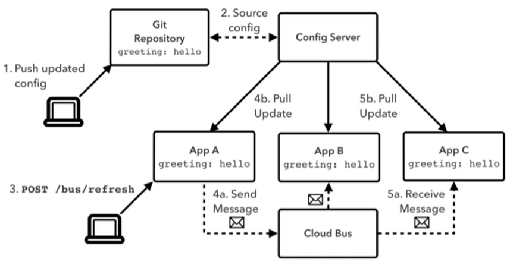
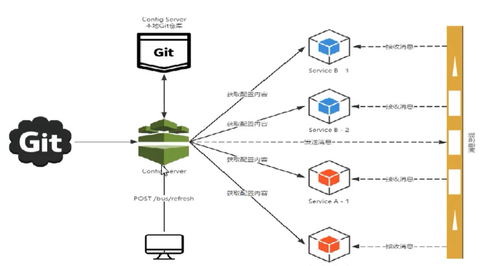
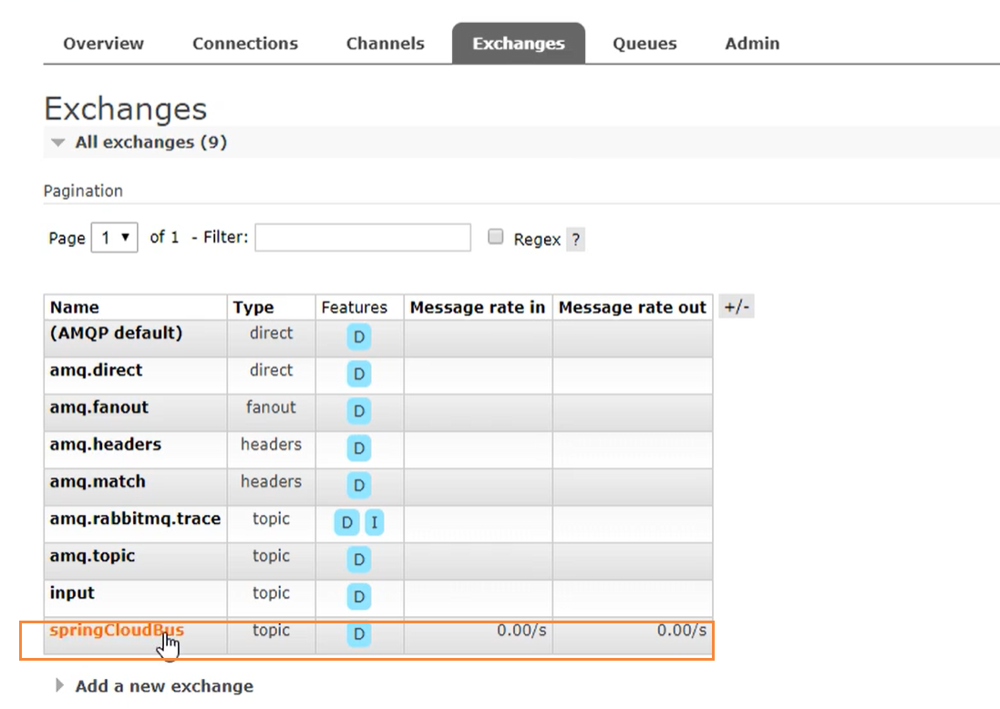
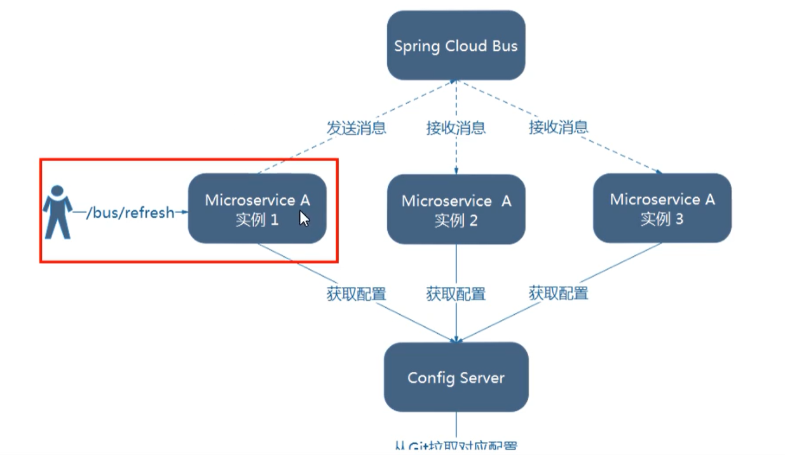
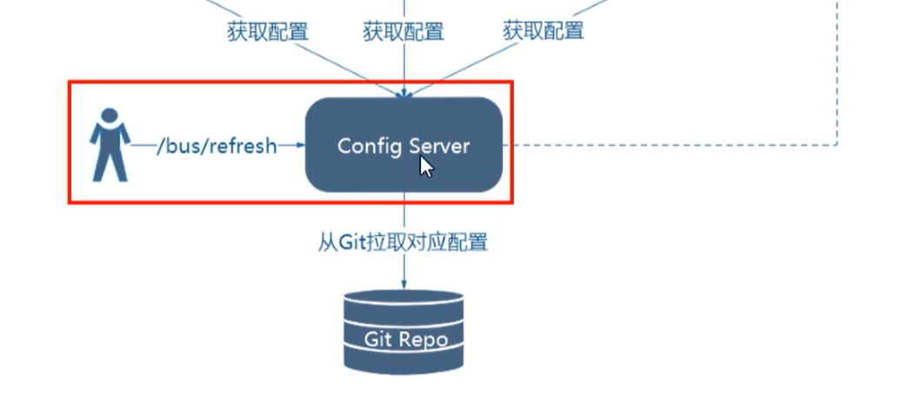
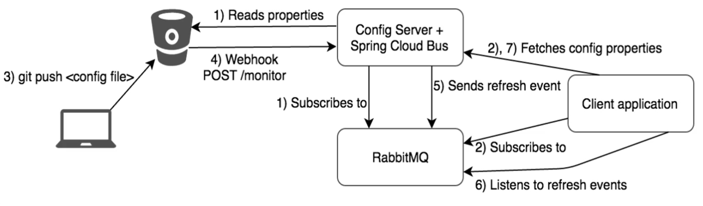

# 消息总线SpringCloudBUS

消息总线一般是配合SpringCloudConfig一起使用的

## 概述

分布式自动刷新配置功能，SpringCloudBus配合SpringCloudConfig使用可以实现配置的动态刷新

Bus支持两种消息代理：RabbitMQ和Kafka



SpringCloudBus是用来将分布式系统的节点与轻量级消息系统链接起来的框架，它整合了Java的事件处理机制和消息中间件的功能。

SpringCloudBus能管理和传播分布式系统的消息，就像一个分布式执行器，可用于广播状态更改，事件推送等，也可以当做微服务的通信通道。



### 什么是总线

在微服务架构的系统中，通常会使用轻量级的消息代理来构建一个共用的消息主题，并让系统中所有微服务实例都连接上来。由于该主题中产生的消息会被所有实例监听和消费，所以被称为消息总线。在总线上的各个实例，都可以方便的广播一些需要让其它连接在该主题上的实例都知道的消息。

### 基本原理

ConfigClient实例都监听MQ中同一个topic（默认是SpringCloudBus），但一个服务刷新数据的时候，它会被这个消息放到Topic中，这样其它监听同一个Topic的服务就能够得到通知，然后去更新自身的配置



通过topic进行广播通知

## RabbitMQ环境配置

[蘑菇博客配置RabbitMQ](http://moguit.cn/#/info?blogUid=995e0fccd2b240aabd56a10a688e42d4)

## SpringCloudBus动态刷新全局广播

### 配置

首先需要搭建好rabbitmq环境

然后引入RabbitMQ依赖

```
<!--添加消息总线Rabbitmq支持-->
<dependency>
    <groupId>org.springframework.cloud</groupId>
    <artifactId>spring-cloud-starter-bus-amqp</artifactId>
</dependency>
```

增加yml中的rabbitmq配置

```
spring:
  application:
    name: config-client
  cloud:
    config:
      label: master #分支名称
      name: config #配置文件名称
      profile: dev #读取后缀文件名，即 master分支config-dev.yml
      uri: http://localhost:3344 #配置中心地址
  rabbitmq: #mq相关配置
    host: localhost
    port: 5672
    username: guest
    password: guest
```

### 设计思想

- 利用消息总线触发一个客户端/bus/refresh，而刷新所有客户端配置



- 利用消息总线出发一个服务端ConfigServer的/bus/refresh断点，而刷新所有客户端的配置



- 图二的架构更加适合，图一不适合的原因有
  - 图一打破了微服务的职责单一性，因为微服务本身是业务模块，他不应该承担配置刷新的之职责
  - 打破了微服务各节点的对等性
  - 有一定的局限性，例如，微服务在迁移时，它的网络地址常常发生变化，此时如果想要做到自动刷新，那就会增加更多的修改。

## 服务端添加消息总线

### 引入依赖

```
        <!--添加消息总线Rabbitmq支持-->
        <dependency>
            <groupId>org.springframework.cloud</groupId>
            <artifactId>spring-cloud-starter-bus-amqp</artifactId>
        </dependency>
```

### 增加配置

```
spring:
  application:
    name: cloud-config-center
  cloud:
    config:
      server:
        git:
          uri: https://github.com/boytian/springcloud-config.git
          search-paths:
            - springcloud-config
      label: master
  rabbitmq: #mq相关配置
    host: localhost
    port: 5672
    username: guest
    password: guest
    
# rabbitmq相关配置，暴露bus刷新点
management:
  endpoints: #暴露bus刷新配置的端点
    web:
      exposure:
        include: 'bus-refresh'    
```

注意，上面的 `bus-refresh` 就是actuator的刷新机制，相当于提供了一个  /bus-refresh的post方法，当我们调用的时候，会刷新配置，然后一次发送，处处生效。

## 客户端引入消息总线支持

### 引入依赖

```
<!--添加消息总线Rabbitmq支持-->
<dependency>
    <groupId>org.springframework.cloud</groupId>
    <artifactId>spring-cloud-starter-bus-amqp</artifactId>
</dependency>
```

### 修改yml

```
spring:
  application:
    name: config-client
  cloud:
    config:
      label: master #分支名称
      name: config #配置文件名称
      profile: dev #读取后缀文件名，即 master分支config-dev.yml
      uri: http://localhost:3344 #配置中心地址
  rabbitmq: #mq相关配置
    host: localhost
    port: 5672
    username: guest
    password: guest

#暴露监控端点
management:
  endpoints:
    web:
      exposure:
        include: "*"
```

这里的暴露端点和上面的不太一样


## 测试

当我们的服务端配置中心 和 客户端都增加完上述配置后，我们需要做的就是手动发送一个POST请求到服务端

```
curl -X POST "http://localhsot:33444/actuator/bus-refresh"
```

执行完成后，配置中心会通过BUS消息总线，发送到所有的客户端，并完成配置的刷新操作。

完成了一次修改，广播通知，处处生效的效果


## SpringCloudBus动态刷新定点通知

就是我想通知的目标是有差异化，有些客户端需要通过，有些不通知，也就是10个客户端，我只通知1个

简单一句话，就是指定某一个实例生效而不是全部

公式：`http://localhost:配置中心端口/actuator/bus-refresh/{destination}`

`/bus/refresh`请求不再发送到具体的服务实例上，而是发送给config server并通过destination参数类指定需要更新配置的服务或实例。

### 案例

以刷新运行在3355端口上的config-client为例，只通知3355，不通知3366，可以使用下面命令

```
curl -X POST "http://localhsot:33444/actuator/bus-refresh/config-client:3355"
```




