# SpringCloud Stream 消息驱动

## 为什么引入消息驱动？

首先看到消息驱动，我们会想到，消息中间件

- ActiveMQ
- RabbitMQ
- RocketMQ
- Kafka

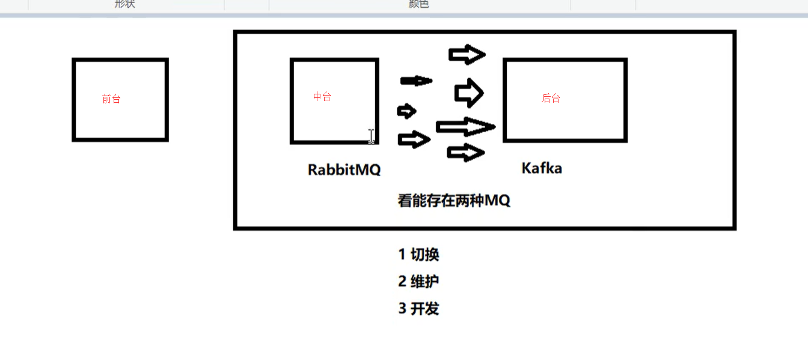

存在的问题就是，中台和后台 可能存在两种MQ，那么他们之间的实现都是不一样的，这样会导致多种问题出现，而且上述我们也看到了，目前主流的MQ有四种，我们不可能每个都去学习

这个时候的痛点就是：有没有一种新的技术诞生，让我们不在关注具体MQ的细节，我们只需要用一种适配绑定的方式，自动的给我们在各种MQ内切换。

这个时候，SpringCloudStream就运营而生，解决的痛点就是屏蔽了消息中间件的底层的细节差异，我们操作Stream就可以操作各种消息中间件了，从而降低开发人员的开发成本。

## 消息驱动概述

### 是什么

屏蔽底层消息中间件的差异，降低切换成本，统一消息的编程模型

这就有点像Hibernate，它同时支持多种数据库，同时还提供了Hibernate Session的语法，也就是HQL语句，这样屏蔽了SQL具体实现细节，我们只需要操作HQL语句，就能够操作不同的数据库。

### 什么是SpringCloudStream

官方定义 SpringCloudStream是一个构件消息驱动微服务的框架

应用程序通过inputs或者outputs来与SpringCloudStream中binder对象（绑定器）交互。

通过我们配置来binding(绑定)，而SpringCloudStream的binder对象负责与消息中间件交互

所以，我们只需要搞清楚如何与SpringCloudStream交互，就可以方便的使用消息驱动的方式。

通过使用SpringIntegration来连接消息代理中间件以实现消息事件驱动。

SpringCloudStream为一些供应商的消息中间件产品提供了个性化的自动化配置实现，引用了发布-订阅，消费组，分区的三个核心概念

目前仅支持RabbitMQ 和 Kafka

### SpringCloudStrem设计思想

#### 标准MQ

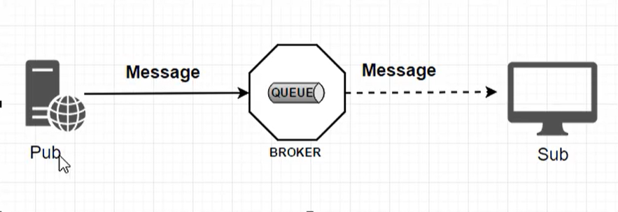

- 生产者/消费者之间靠消息媒介传递消息内容：Message
- 消息必须走特定的通道：Channel
- 消息通道里的消息如何被消费呢，谁负责收发处理
  - 消息通道MessageChannel的子接口SubscribableChannel，由MessageHandler消息处理器所订阅

#### 为什么用SpringCloudStream

RabbitMQ和Kafka，由于这两个消息中间件的架构上不同

像RabbitMQ有exchange，kafka有Tpic和Partitions分区

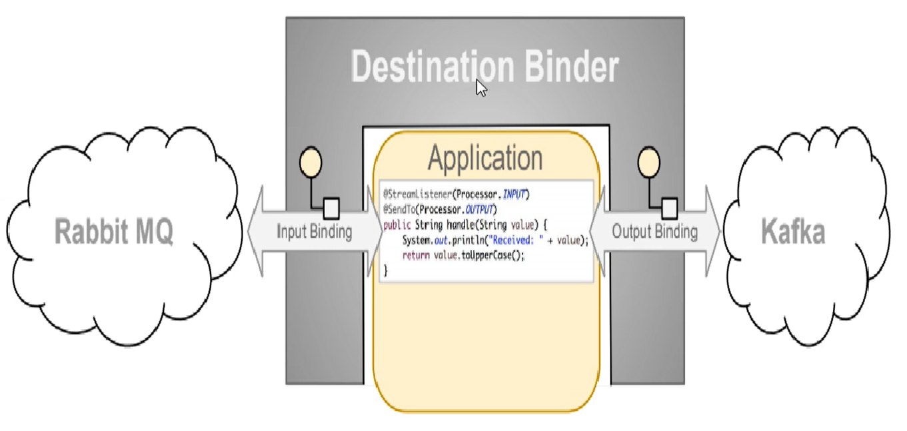

这些中间件的差异导致我们实际项目开发给我们造成了一定的困扰，我们如果用了两个消息队列的其中一种，后面的业务需求，我们想往另外一种消息队列进行迁移，这时候无疑就是灾难性的，一大堆东西都要推到重新做，因为它根我们的系统耦合了，这时候SpringCloudStream给我们提供了一种解耦的方式

这个时候，我们就需要一个绑定器，可以想成是翻译官，用于实现两种消息之间的转换

#### SpringCloudStream为什么能屏蔽底层差异

在没有绑定器这个概念的情况下，我们的SpringBoot应用要直接与消息中间件进行消息交互的时候，由于各消息中间件构建的初衷不同，它们的实现细节上会有较大的差异性。通过定义绑定器作为中间件，完美的实现了应用程序与消息中间件细节之间的隔离。

通过向应用程序暴露统一的Channel通道，使得应用程序不需要在考虑各种不同消息中间件的实现。

通过定义绑定器Binder作为中间层，实现了应用程序与消息中间件细节之间的隔离。

#### Binder

- input：对应消费者
- output：对应生产者

Stream对消息中间件的进一步封装，可以做到代码层面对中间件的无感知，甚至于动态的切换中间件（RabbitMQ切换Kafka），使得微服务开发的高度解耦，服务可以关注更多的自己的业务流程。

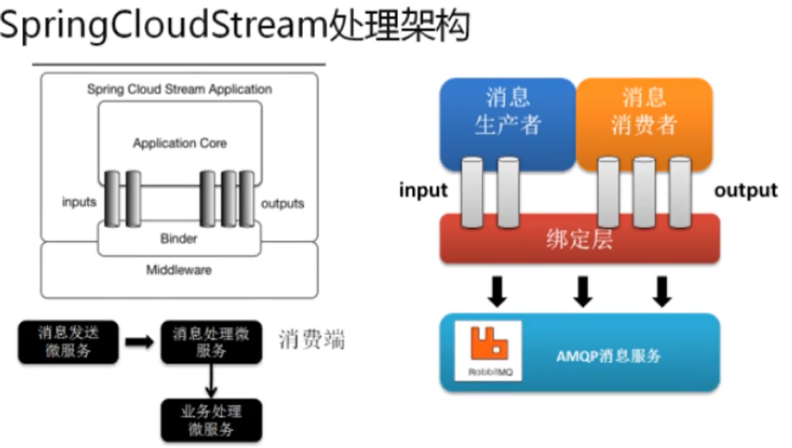

通过定义绑定器Binder作为中间层，实现了应用程序与消息中间件细节之间的隔离。

Stream中的消息通信方式遵循了发布-订阅模式，Topic主题进行广播，在RabbitMQ中就是Exchange，在Kafka中就是Topic

#### Stream标准流程套路

我们的消息生产者和消费者只和Stream交互

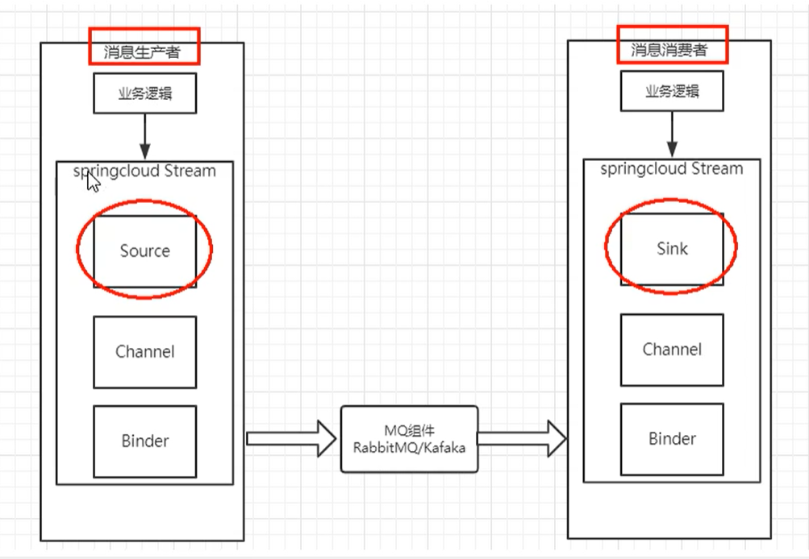

- Binder：很方便的连接中间件，屏蔽差异
- Channel：通道，是队列Queue的一种抽象，在消息通讯系统中就是实现存储和转发的没接，通过Channel对队列进行配置
- Source和Sink：简单的可以理解为参照对象是SpringCloudStream自身，从Stream发布消息就是输出，接受消息就是输入。

#### 编码中的注解

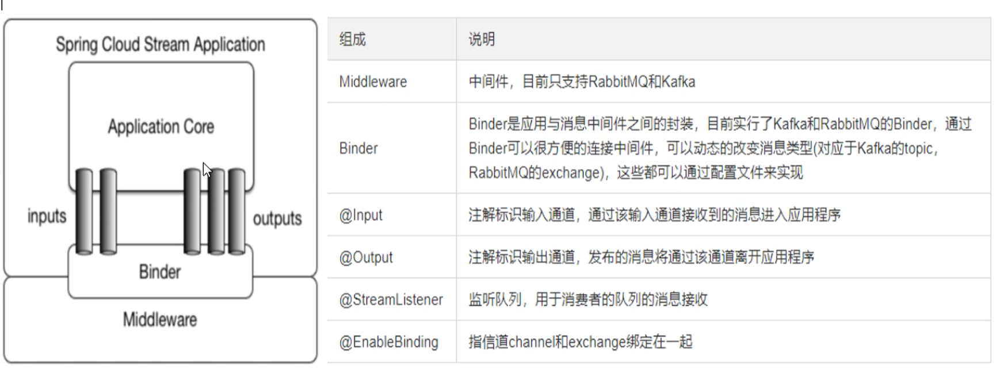


## 案例说明

前提是已经安装好了RabbitMQ

- cloud-stream-rabbitmq-procider8801，作为消息生产者进行发消息模块
- cloud-stream-rabbitmq-procider8802，消息接收模块
- cloud-stream-rabbitmq-procider8803，消息接收模块


## 消息驱动之生产者

### 引入依赖

```
<!--Stream-->
<dependency>
    <groupId>org.springframework.cloud</groupId>
    <artifactId>spring-cloud-starter-stream-rabbit</artifactId>
</dependency>
```

### 修改yml

```
spring:
  application:
    name: cloud-stream-provider
  cloud:
    stream:
      binders: # 在此处配置要绑定的rabbitMQ的服务信息
        defaultRabbit: # 表示定义的名称，用于binding的整合
          type: rabbit # 消息中间件类型
          environment: # 设置rabbitMQ的相关环境配置
            spring:
              rabbitmq:
                host: localhost
                port: 5672
                username: guest
                password: guest
      bindings: # 服务的整合处理
        output: # 这个名字是一个通道的名称
          destination: studyExchange # 表示要使用的exchange名称定义
          content-type: application/json # 设置消息类型，本次为json，文本则设为text/plain
          binder: defaultRabbit # 设置要绑定的消息服务的具体设置
```

### 业务类

#### 发送消息的接口

```
public interface IMassageProvider {
    // 定义一个发送方法
    public String send();
}
```

#### 发送消息的接口实现类

```
// @EnableBinding： 指信道channel 和 exchange绑定在一起
@EnableBinding(Source.class) //定义消息的推送管道
public class MessageProviderImpl implements IMassageProvider {

    @Resource
    private MessageChannel output; //消息发送管道（原来这里是操作dao，现在是操作消息中间件发送消息）

    @Override
    public String send() {
        String serial= UUID.randomUUID().toString();
        // 消息构建器构建一个消息 MessageBuilder
        output.send(MessageBuilder.withPayload(serial).build());
        System.out.println("***********serial"+serial);
        return null;
    }
}
```

#### Controller

```
@RestController
public class SendMessageController {
    @Resource
    private IMassageProvider massageProvider;

    @GetMapping("/sendMessage")
    public String sendMessage(){
        return massageProvider.send();
    }
}
```

定义一个REST接口，调用的时候，发送一个消息

#### 测试

我们进入RabbitAdmin页面  `http://localhost:15672`

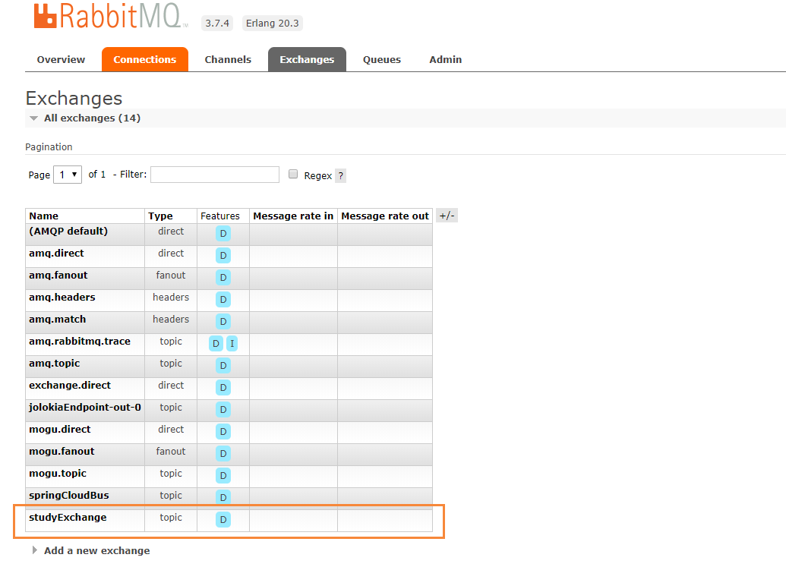

会发现它已经成功创建了一个studyExchange的交换机，这个就是我们上面配置的

```
      bindings: # 服务的整合处理
        output: # 这个名字是一个通道的名称
          destination: studyExchange # 表示要使用的exchange名称定义
          content-type: application/json # 设置消息类型，本次为json，文本则设为text/plain
          binder: defaultRabbit # 设置要绑定的消息服务的具体设置
```

以后就会通过这个交换机进行消息的消费

我们运行下列代码，进行测试消息发送 `http://localhost:8801/sendMessage`

能够发现消息已经成功被RabbitMQ捕获，这个时候就完成了消息的发送

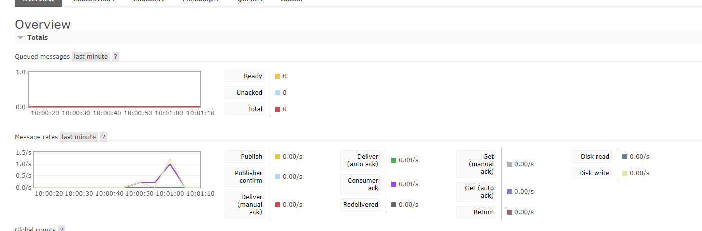


## 消息驱动之消费者

### 引入依赖

```
<!--Stream-->
<dependency>
    <groupId>org.springframework.cloud</groupId>
    <artifactId>spring-cloud-starter-stream-rabbit</artifactId>
</dependency>
```

### 修改yml

```
spring:
  application:
    name: cloud-stream-consumer
  cloud:
    stream:
      binders: # 在此处配置要绑定的rabbitMQ的服务信息
        defaultRabbit: # 表示定义的名称，用于binding的整合
          type: rabbit # 消息中间件类型
          environment: # 设置rabbitMQ的相关环境配置
            spring:
              rabbitmq:
                host: localhost
                port: 5672
                username: guest
                password: guest
      bindings: # 服务的整合处理
        input: # 这个名字是一个通道的名称
          destination: studyExchange # 表示要使用的exchange名称定义
          content-type: application/json # 设置消息类型，本次为json，文本则设为text/plain
          binder: defaultRabbit # 设置要绑定的消息服务的具体设置
          group: atguiguA
```

### 业务类

```
@Component
@EnableBinding(Sink.class)  // 绑定通道
public class ReceiveMessageListenerController {

    @Value("${server.port}")
    private String serverPort;

    // 监听队列，用于消费者队列的消息接收
    @StreamListener(Sink.INPUT)
    public void input(Message<String> message) {
        System.out.println("消费者1号，0------>接收到消息："+message.getPayload()+"\t port:"+serverPort);
    }
}
```


## 分组消费

我们在创建一个8803的消费者服务，需要启动的服务

- RabbitMQ：消息中间件
- 7001：服务注册
- 8801：消息生产
- 8802：消息消费
- 8803：消息消费

### 运行后有两个问题

- 有重复消费问题
- 消息持久化问题

### 消费

目前8802 、8803同时都收到了，存在重复消费的问题

如何解决：使用分组和持久化属性 group来解决

比如在如下场景中，订单系统我们做集群部署，都会从RabbitMQ中获取订单信息，那如果一个订单同时被两个服务获取到，那么就会造成数据错误，我们得避免这种情况，这时我们就可以使用Stream中的消息分组来解决。

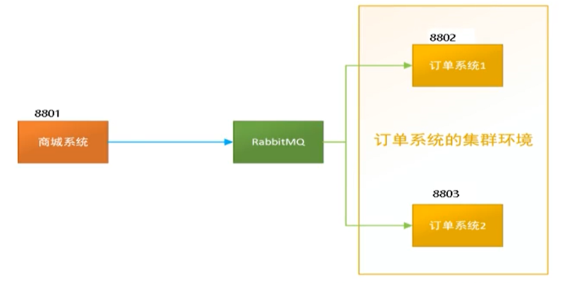

注意：在Stream中处于同一个group中的多个消费者是竞争关系，就能够保证消息只能被其中一个消费一次

不同组是可以全面消费的（重复消费）

同一组会发生竞争关系，只能其中一个可以消费

分布式微服务应用为了实现高可用和负载均衡，实际上都会部署多个实例，这里部署了8802 8803

多数情况下，生产者发送消息给某个具体微服务时，只希望被消费一次，按照上面我们启动两个应用的例子，虽然它们同属一个应用，但是这个消息出现了被重复消费两次的情况，为了解决这个情况，在SpringCloudStream中，就提供了 消费组 的概念

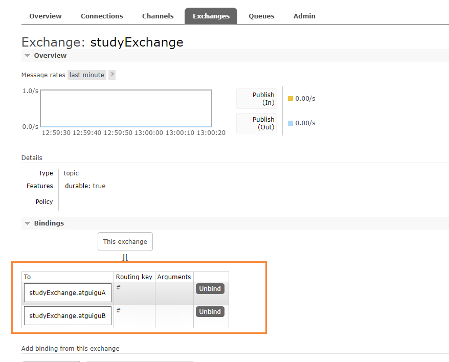

### 分组

#### 原理

微服务应用放置于同一个group中，就能够保证消息只会被其中一个应用消费一次，不同的组是可以消费的，同一组内会发生竞争关系，只有其中一个可以被消费。

我们将8802和8803划分为同一组

```yml
spring:
  application:
    name: cloud-stream-consumer
  cloud:
    stream:
      binders: # 在此处配置要绑定的rabbitMQ的服务信息
        defaultRabbit: # 表示定义的名称，用于binding的整合
          type: rabbit # 消息中间件类型
          environment: # 设置rabbitMQ的相关环境配置
            spring:
              rabbitmq:
                host: localhost
                port: 5672
                username: guest
                password: guest
      bindings: # 服务的整合处理
        input: # 这个名字是一个通道的名称
          destination: studyExchange # 表示要使用的exchange名称定义
          content-type: application/json # 设置消息类型，本次为json，文本则设为text/plain
          binder: defaultRabbit # 设置要绑定的消息服务的具体设置
          group: atguiguA
```

引入：`group: atguiguA `

然后我们执行消息发送的接口：`http://localhost:8801/sendMessage`

我们在8801服务，同时发送了6条消息

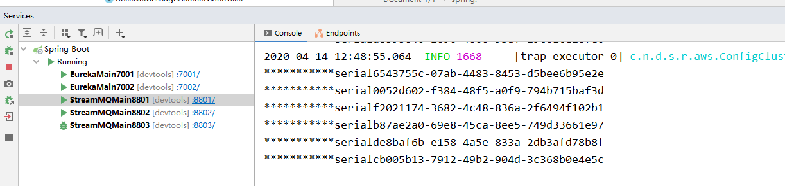

然后看8802服务，接收到了3条

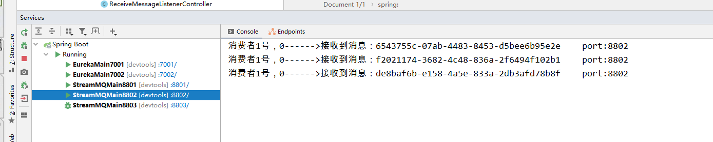

8803服务，也接收到了3条

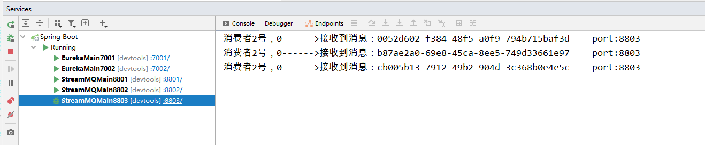

这个时候，就通过分组，避免了消息的重复消费问题

8802、8803通过实现轮询分组，每次只有一个消费者，最后发送的消息只能够被一个接受

如果将他们的group变成两个不同的组，那么消息就会被重复消费


## 消息持久化

通过上面的方式，我们解决了重复消费的问题，再看看持久化

### 案例

- 停止8802和8803，并移除8802的group，保留8803的group
- 8801先发送4条消息到RabbitMQ
- 先启动8802，无分组属性，后台没有打出来消息
- 在启动8803，有分组属性，后台打出来MQ上的消息

这就说明消息已经被持久化了，等消费者登录后，会自动从消息队列中获取消息进行消费

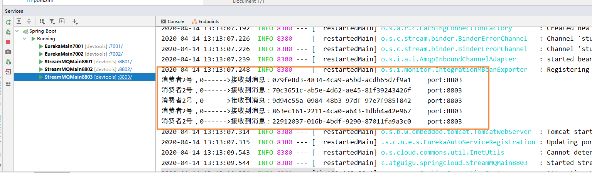