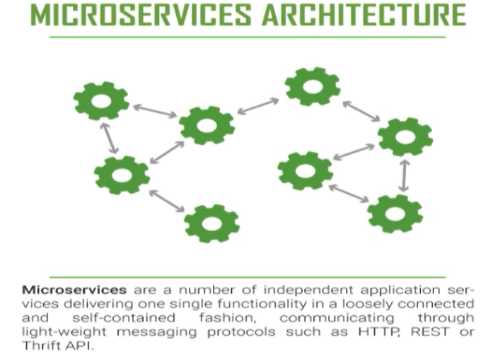
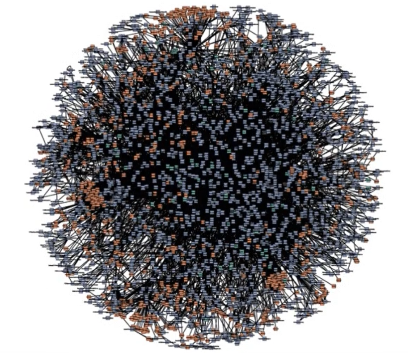
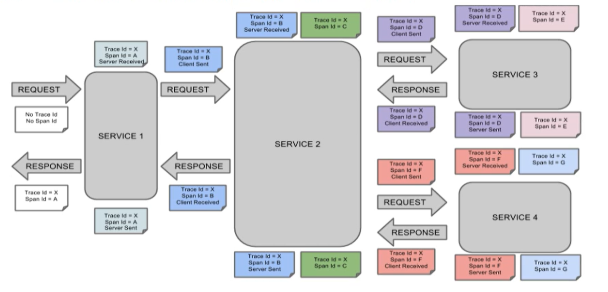
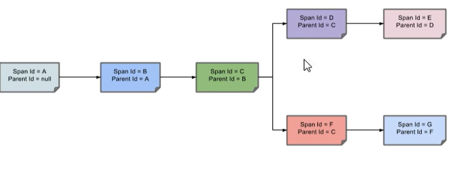
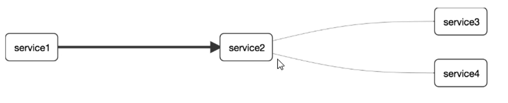

# SpringCloudSleuth分布式请求链路跟踪

## 概述

详细可以参考：[使用Zipkin搭建蘑菇博客链路追踪](http://moguit.cn/#/info?blogUid=35bd93cabc08611c7f74ce4564753ef9)

在微服务框架中，一个由客户端发起的请求在后端系统中会经过多个不同的服务节点调用来协同产生最后的请求结果，每一个前端请求都会形成一条复杂的分布式服务调用链路，链路中的任何一环出现高延时或错误都会引起整个请求最后的失败。



当链路特别多的时候



就需要有一个用于调用链路的监控和服务跟踪的解决方案

SpringCloudSleuth提供了一套完整的服务跟踪解决方案，在分布式系统中，提供了追踪解决方案，并且兼容支持了zipkin。

## 搭建

### zipkin

SpringCloud从F版起，已经不需要自己构建Zipkin Server了，只需要调用jar包即可

#### 运行

```
java -jar zipkin.jar
```

#### 打开

```
http://localhost:9441/zipkin
```

### 名词解释

- Trace：类似于树结构的Span集合，表示一条调用链路，存在唯一标识
- Span：表示调用链路来源，通俗的理解span就是一次请求信息

#### 完整的调用链路

表示一请求链路， 一条链路通过Trace ID唯一标识，Span标识发起请求信息，各span通过parent id关联起来。



一条链路通过Trace Id唯一标识，Span表示发起的请求信息，各span通过parent id关联起来



整个链路的依赖关系如下：



### 引入依赖

```
<!--链路监控包含sleuth+zipkin-->
<dependency>
    <groupId>org.springframework.cloud</groupId>
    <artifactId>spring-cloud-starter-zipkin</artifactId>
</dependency>
```

### 修改yml

```
spring:
  application:
    name: cloud-order-service
  zipkin:
    base-url: http://localhost:9411
  sleuth:
    sampler:
      # 采集率介于0到1之间，1表示全部采集
      probability: 1
```

