# Nacos

## SpringCloud Alibaba简介

SpringCloud Alibaba诞生的主要原因是：因为Spring Cloud Netflix项目进入了维护模式

### 维护模式

将模块置为维护模式，意味着SpringCloud团队将不再向模块添加新功能，我们将恢复block级别的bug以及安全问题，我们也会考虑并审查社区的小型pull request

我们打算继续支持这些模块，知道Greenwich版本被普遍采用至少一年

### 意味着

Spring Cloud Netflix将不再开发新的组件，我们都知道Spring Cloud项目迭代算是比较快，因此出现了很多重大issue都还来不及Fix，就又推出了另一个Release。进入维护模式意思就是以后一段时间Spring Cloud Netflix提供的服务和功能就这么多了，不在开发新的组件和功能了，以后将以维护和Merge分支Pull Request为主，新组件将以其他替代

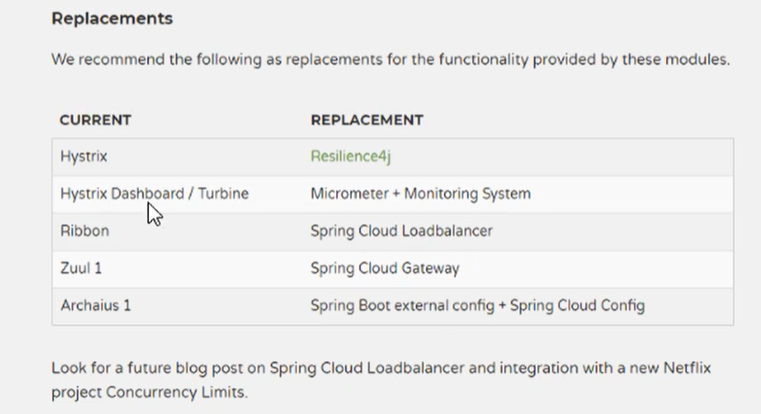

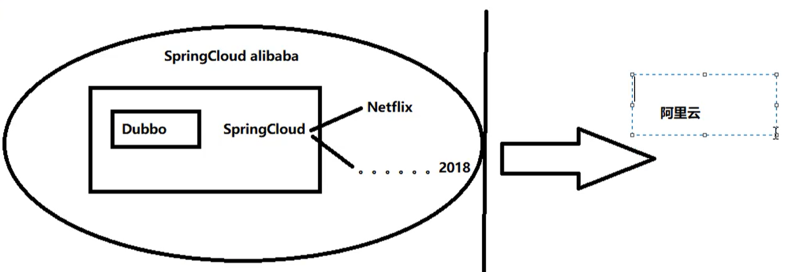

### 诞生

官网：[SpringCloud Alibaba](https://github.com/alibaba/spring-cloud-alibaba/blob/master/README-zh.md)

2018.10.31，Spring Cloud Alibaba正式入驻Spring Cloud官方孵化器，并在Maven仓库发布了第一个

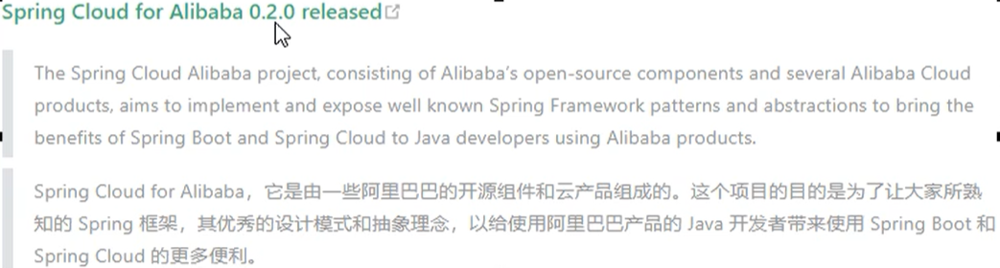

### 能做啥

- 服务限流降级：默认支持servlet，Feign，RestTemplate，Dubbo和RocketMQ限流降级功能的接入，可以在运行时通过控制台实时修改限流降级规则，还支持查看限流降级Metrics监控
- 服务注册与发现：适配Spring Cloud服务注册与发现标准，默认集成了Ribbon的支持
- 分布式配置管理：支持分布式系统中的外部化配置，配置更改时自动刷新
- 消息驱动能力：基于Spring Cloud Stream （内部用RocketMQ）为微服务应用构建消息驱动能力
- 阿里云对象存储：阿里云提供的海量、安全、低成本、高可靠的云存储服务，支持在任何应用、任何时间、任何地点存储和访问任意类型的数据。
- 分布式任务调度：提供秒级，精准、高可靠、高可用的定时（基于Cron表达式）任务调度服务，同时提供分布式的任务执行模型，如网格任务，网格任务支持海量子任务均匀分配到所有Worker

### 引入依赖版本控制

```
<dependencyManagement>
    <dependencies>
        <dependency>
            <groupId>com.alibaba.cloud</groupId>
            <artifactId>spring-cloud-alibaba-dependencies</artifactId>
            <version>2.2.0.RELEASE</version>
            <type>pom</type>
            <scope>import</scope>
        </dependency>
    </dependencies>
</dependencyManagement>
```

### 怎么玩

- Sentinel：阿里巴巴开源产品，把流量作为切入点，从流量控制，熔断降级，系统负载 保护等多个维度保护系统服务的稳定性
- Nacos：阿里巴巴开源产品，一个更易于构建云原生应用的动态服务发现、配置管理和服务管理平台
- RocketMQ：基于Java的高性能，高吞吐量的分布式消息和流计算平台
- Dubbo：Apache Dubbo是一款高性能Java RPC框架
- Seata：一个易于使用的高性能微服务分布式事务解决方案
- Alibaba Cloud OOS：阿里云对象存储（Object Storage Service，简称OOS），是阿里云提供的海量，安全，低成本，高可靠的云存储服务，您可以在任何应用，任何时间，任何地点存储和访问任意类型的数据。
- Alibaba Cloud SchedulerX：阿里中间件团队开发的一款分布式任务调度产品，支持周期的任务与固定时间点触发

## Nacos简介

Nacos服务注册和配置中心，兼顾两种

### 为什么叫Nacos

前四个字母分别为：Naming（服务注册） 和 Configuration（配置中心） 的前两个字母，后面的s 是 Service

### 是什么

一个更易于构建云原生应用的动态服务发现，配置管理和服务

Nacos：Dynamic Naming and Configuration Server

Nacos就是注册中心 + 配置中心的组合

等价于：Nacos = Eureka + Config

### 能干嘛

替代Eureka做服务注册中心

替代Config做服务配置中心

### 下载

官网：https://github.com/alibaba/nacos

nacos文档：https://nacos.io/zh-cn/docs/what-is-nacos.html

### 比较

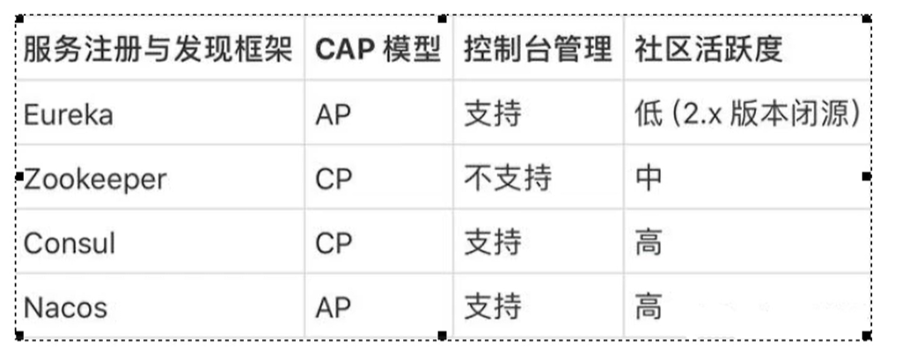

Nacos在阿里巴巴内部有超过10万的实例运行，已经过了类似双十一等各种大型流量的考验

### 安装并运行

本地需要 java8 + Maven环境

下载：[地址](https://github.com/alibaba/nacos/releases/tag/1.1.4)

github经常抽风，可以使用：https://blog.csdn.net/buyaopa/article/details/104582141

解压后：运行bin目录下的：startup.cmd

打开：`http://localhost:8848/nacos`

结果页面

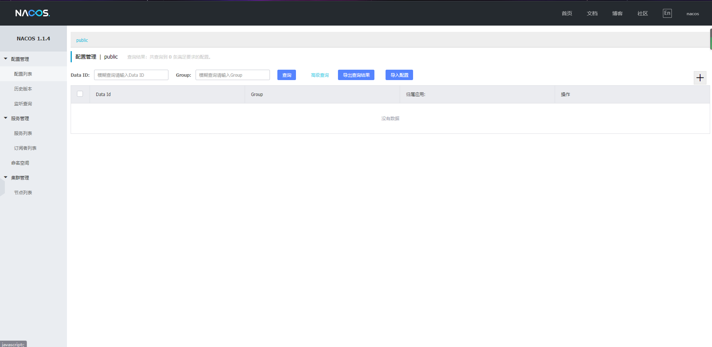


## Nacos作为服务注册中心

### 服务提供者注册Nacos

#### 引入依赖

```
<!--SpringCloud alibaba nacos-->
<dependency>
    <groupId>com.alibaba.cloud</groupId>
    <artifactId>spring-cloud-starter-alibaba-nacos-discovery</artifactId>
</dependency>
```

#### 修改yml

```
server:
  port: 9002
spring:
  application:
    name: nacos-payment-provider
  cloud:
    nacos:
      discovery:
        server-addr: 127.0.0.1:8848   # 配置nacos地址
management:
  endpoints:
    web:
      exposure:
        include: '*'
```

#### 主启动类

添加 `@EnableDiscoveryClient` 注解

```
@SpringBootApplication
@EnableDiscoveryClient
public class PaymentMain9002 {
    public static void main(String[] args) {
        SpringApplication.run(PaymentMain9002.class);
    }
}
```

#### 业务类

```
@RestController
public class PaymentController {
    @Value("${server.port}")
    private String serverPort;

    @GetMapping("/payment/nacos/{id}")
    public String getPayment(@PathVariable("id") Integer id) {
        return "nacos registry ,serverPore:"+serverPort+"\t id:"+id;
    }
}
```

#### 启动

nacos-payment-provider已经成功注册了

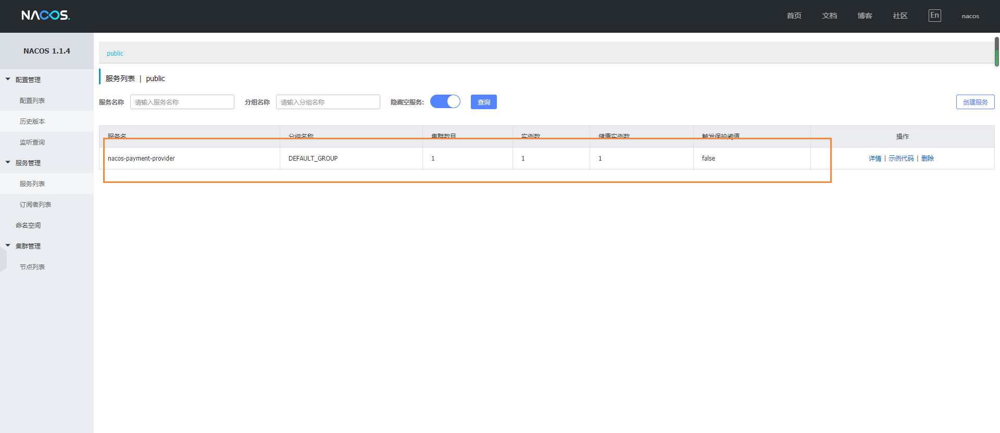

这个时候 nacos服务注册中心 + 服务提供者 9001 都OK了

通过IDEA的拷贝映射

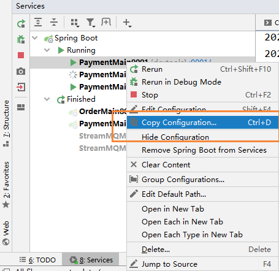

添加

```
-DServer.port=9003
```

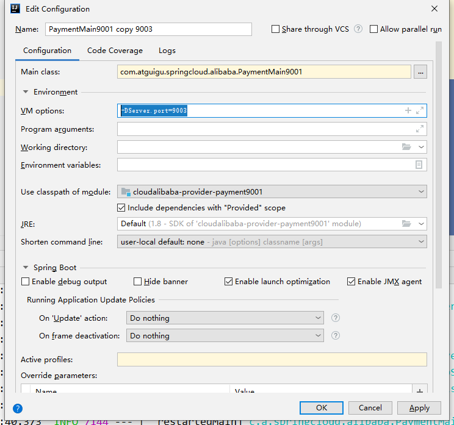

最后能够看到两个实例


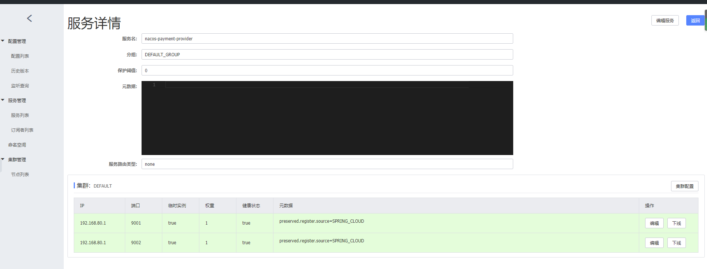


### 服务消费者注册到Nacos

Nacos天生集成了Ribbon，因此它就具备负载均衡的能力

#### 引入依赖

```
<!--SpringCloud alibaba nacos-->
<dependency>
    <groupId>com.alibaba.cloud</groupId>
    <artifactId>spring-cloud-starter-alibaba-nacos-discovery</artifactId>
</dependency>
```

#### 修改yml

```
server:
  port: 83
spring:
  application:
    name: nacos-order-consumer
  cloud:
    nacos:
      discovery:
        server-addr: localhost:8848

# 消费者将要去访问的微服务名称（注册成功进nacos的微服务提供者）
service-url:
  nacos-user-service: http://nacos-payment-provider
```

#### 增加配置类

因为nacos集成了Ribbon，因此需要配置RestTemplate，同时通过注解 `@LoadBalanced`实现负载均衡，默认是轮询的方式

```
@Configuration
public class ApplicationContextConfig {
    @Bean
    @LoadBalanced
    public RestTemplate getRestTemple() {
        return new RestTemplate();
    }
}
```

#### 业务类

```
@RestController
@Slf4j
public class OrderNacosController {

    @Resource
    private RestTemplate restTemplate;

    @Value("${service-url.nacos-user-service}")
    private String serverURL;

    @GetMapping(value = "/consumer/payment/nacos/{id}")
    public String paymentInfo(@PathVariable("id")Long id){
       return restTemplate.getForObject(serverURL+"/payment/nacos/" + id, String.class);
    }
}
```

测试

```
http://localhost:83/consumer/payment/nacos/13
```

得到的结果

```
nacos registry ,serverPore:9001 id:13
nacos registry ,serverPore:9002 id:13
```

我们发现只需要配置了nacos，就轻松实现负载均衡


### 服务中心对比

之前我们提到的注册中心对比图

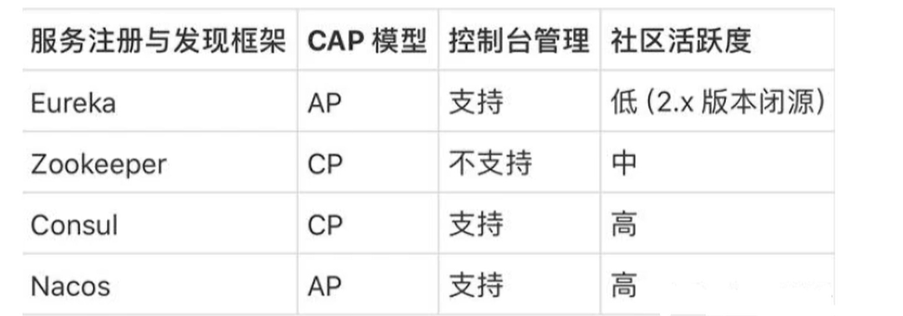

但是其实Nacos不仅支持AP，而且还支持CP，它的支持模式是可以切换的，我们首先看看Spring Cloud Alibaba的全景图，

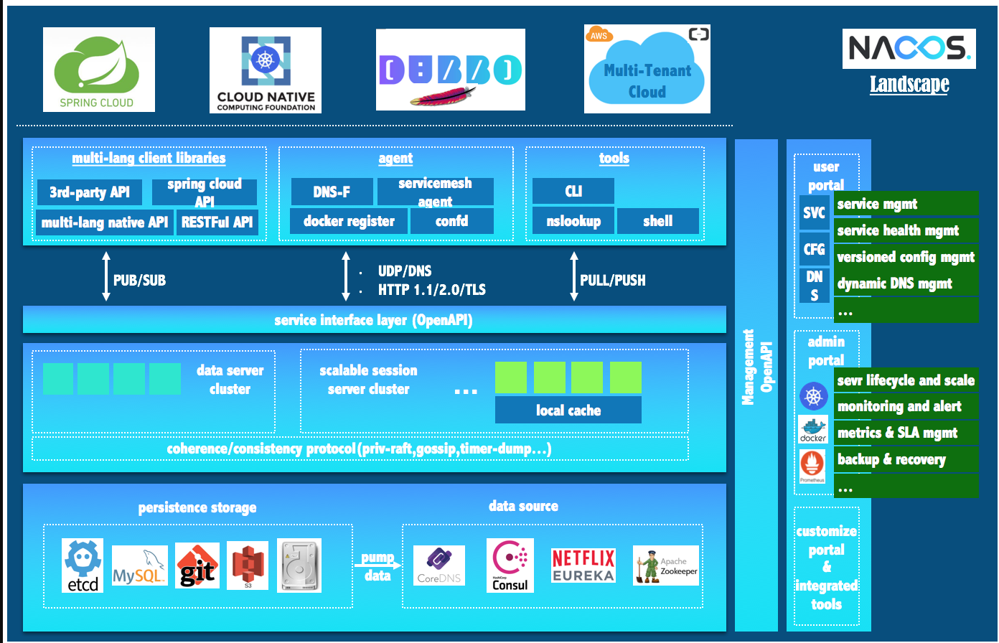

#### Nacos和CAP

CAP：分别是一致性，可用性，分容容忍

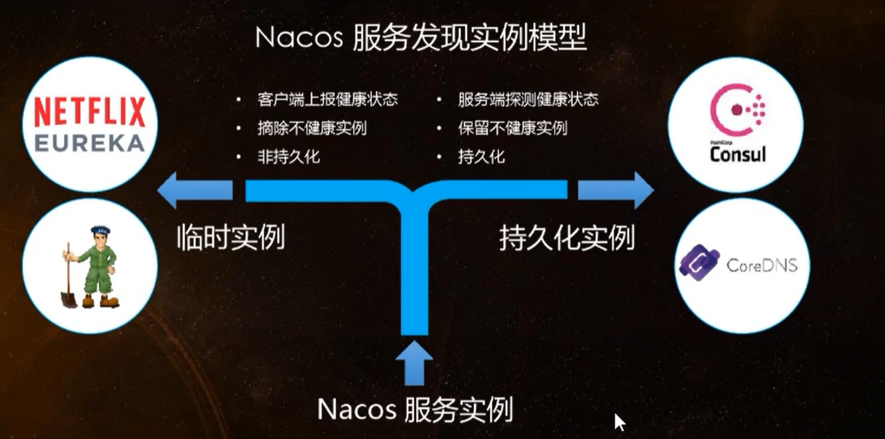

我们从下图能够看到，nacos不仅能够和Dubbo整合，还能和K8s，也就是偏运维的方向

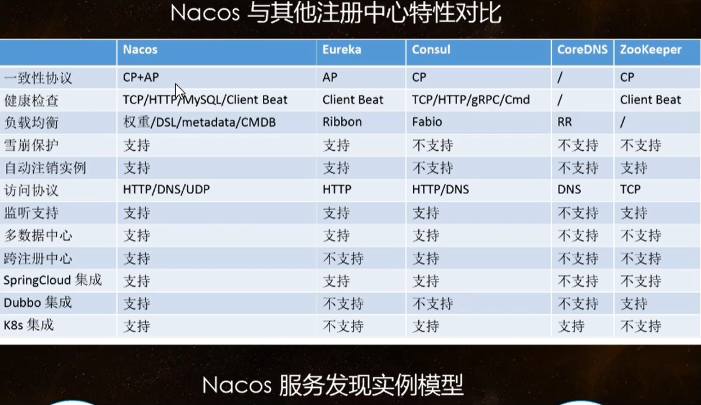

#### Nacos支持AP和CP切换

C是指所有的节点同一时间看到的数据是一致的，而A的定义是所有的请求都会收到响应

合适选择何种模式？

一般来说，如果不需要存储服务级别的信息且服务实例是通过nacos-client注册，并能够保持心跳上报，那么就可以选择AP模式。当前主流的服务如Spring Cloud 和 Dubbo服务，都是适合AP模式，AP模式为了服务的可用性而减弱了一致性，因此AP模式下只支持注册临时实例。

如果需要在服务级别编辑或存储配置信息，那么CP是必须，K8S服务和DNS服务则适用于CP模式。

CP模式下则支持注册持久化实例，此时则是以Raft协议为集群运行模式，该模式下注册实例之前必须先注册服务，如果服务不存在，则会返回错误。


## Nacos作为服务配置中心演示

我们将我们的配置写入Nacos，然后以Spring Cloud Config的方式，用于抓取配置

### Nacos作为配置中心 - 基础配置

#### 引入依赖

```
<!--引入nacos config-->
<dependency>
    <groupId>com.alibaba.cloud</groupId>
    <artifactId>spring-cloud-starter-alibaba-nacos-config</artifactId>
</dependency>
```

#### 修改YML

Nacos同SpringCloud Config一样，在项目初始化时，要保证先从配置中心进行配置拉取，拉取配置之后，才能保证项目的正常运行。

SpringBoot中配置文件的加载是存在优先级顺序的：bootstrap优先级 高于 application

**application.yml配置**

```
spring:
  profiles:
 #   active: dev # 开发环境
 #   active: test # 测试环境
    active: info # 开发环境
```

**bootstrap.yml配置**

```
server:
  port: 3377
spring:
  application:
    name: nacos-config-client
  cloud:
    nacos:
      discovery:
        server-addr: localhost:8848 # 注册中心
      config:
        server-addr: localhost:8848 # 配置中心
        file-extension: yml # 这里指定的文件格式需要和nacos上新建的配置文件后缀相同，否则读不到
        group: TEST_GROUP
        namespace: 1bdf1418-3ed4-442c-97c1-f525b6a85b34

#  ${spring.application.name}-${spring.profile.active}.${spring.cloud.nacos.config.file-extension}
```

#### 主启动类

```
@SpringBootApplication
@EnableDiscoveryClient
public class NacosConfigClientMain3377 {
    public static void main(String[] args) {
        SpringApplication.run(NacosConfigClientMain3377.class, args);
    }
}
```

#### 业务类

```
@RestController
@RefreshScope // 支持nacos的动态刷新
public class ConfigClientController {
    @Value("${config.info}")
    private String configInfo;

    @GetMapping("/config/info")
    public String getConfigInfo(){
        return configInfo;
    }
}
```

通过SpringCloud原生注解 `@RefreshScope` 实现配置自动刷新

#### 在Nacos中添加配置信息

##### Nacos中匹配规则

Nacos中的dataid的组成格式及与SpringBoot配置文件中的匹配规则

```
${spring.application.name}-${spring.profile.active}.${spring.cloud.nacos.config.file-extension}
```

这样，就对应我们Nacos中的这样一个配置

```
nacos-config-client-dev.yml
```

配置说明


我们在Nacos中添加配置

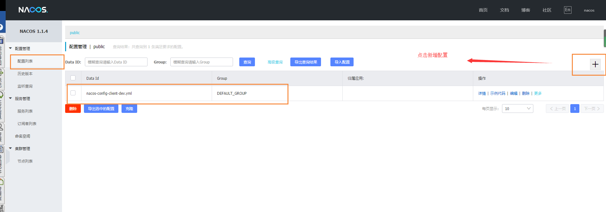

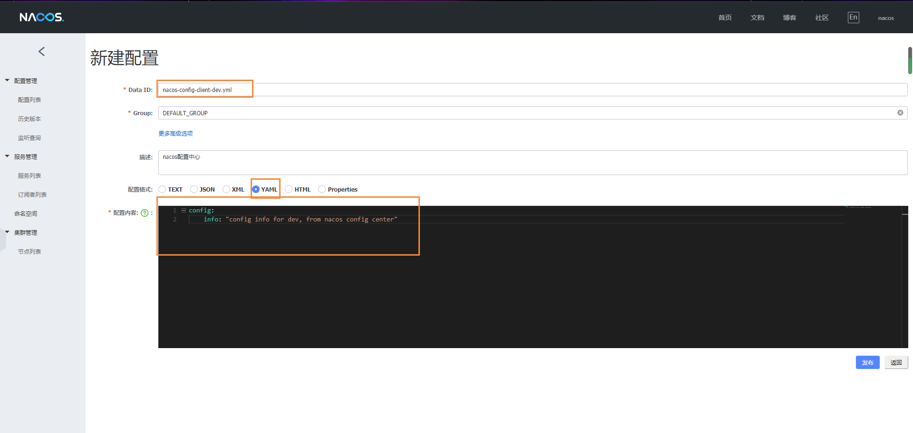

这里需要注意的是，在`config:` 的后面必须加上一个空格

#### 测试

启动前需要在nacos客户端-配置管理下有对应的yml配置文件，然后运行cloud-config-nacos-client:3377的主启动类，调用接口查看配置信息。

启动的时候出现问题

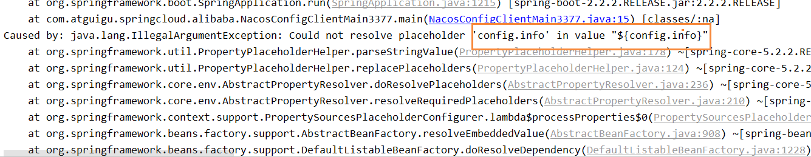

这是因为无法读取配置所引起的，解决方案就是我们的文件名不能用 .yml 而应该是 .yaml

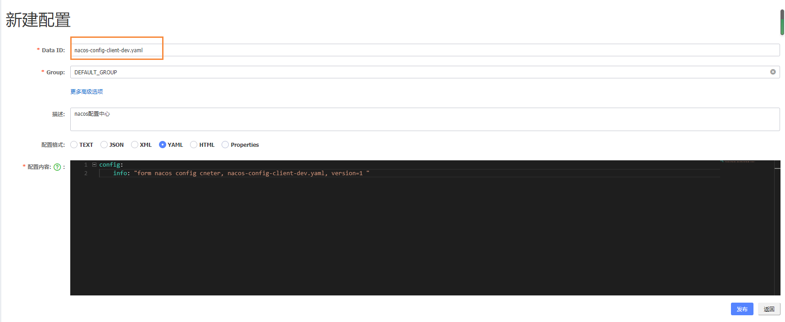

我们需要删除重新建立。

#### 自带动态刷新

修改Nacos中的yaml配置文件，再次查看配置的接口，就会发现配置已经刷新了


### Nacos作为配置中心 - 分类配置

从上面的配置中心 + 动态刷新 ， 就相当于 有了 SpringCloud Config + Spring Cloud Bus的功能

作为后起之秀的Nacos，还具备分类配置的功能

#### 问题

用于解决多环境多项目管理

在实际开发中，通常一个系统会准备

- dev开发环境
- test测试环境
- prod生产环境

如何保证指定环境启动时，服务能正确读取到Nacos上相应环境的配置文件呢？

同时，一个大型分布式微服务系统会有很多微服务子项目，每个微服务子项目又都会有相应的开发环境，测试环境，预发环境，正式环境，那怎么对这些微服务配置进行管理呢？

#### Nacos图形化界面

配置管理:

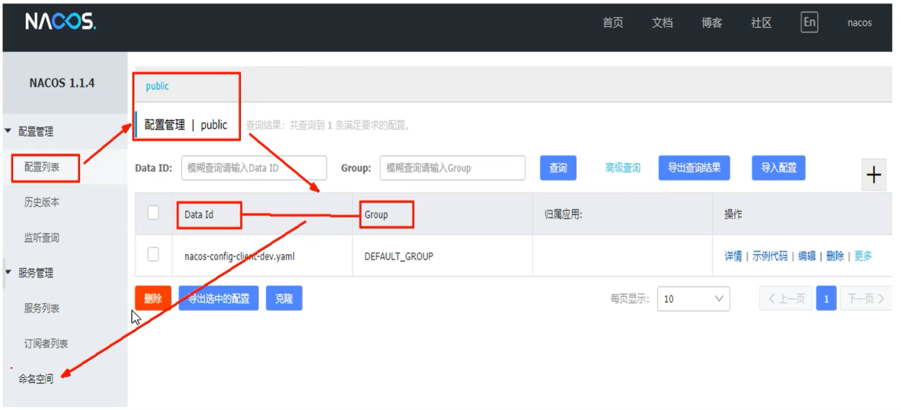

命名空间：

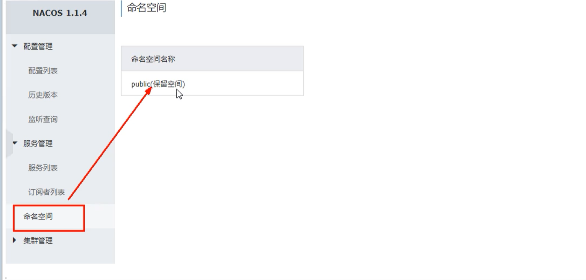


#### Namespace + Group + Data ID 三者关系

这种分类的设计思想，就类似于java里面的package名 和 类名，最外层的namespace是可以用于区分部署环境的，Group 和 DataID逻辑上区分两个目标对象

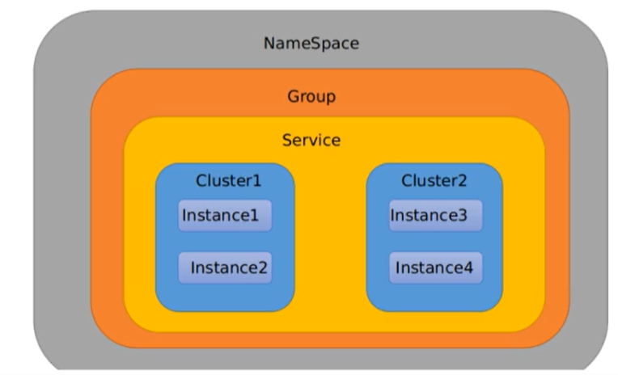

默认情况：

Namespace=public，Group=DEFAULT_GROUP，默认Cluster是DEFAULT

Nacos默认的命名空间是public，Namespace主要用来实现隔离

比如说我们现在有三个环境：开发，测试，生产环境，我们就可以建立三个Namespace，不同的Namespace之间是隔离的。

Group默认是DEFAULT_GROUP，Group可以把不同微服务划分到同一个分组里面去

Service就是微服务，一个Service可以包含多个Cluster（集群），Nacos默认Cluster是DEFAULT，Cluster是对指定微服务的一个虚拟划分。比如说为了容灾，将Service微服务分别部署在了杭州机房，这时就可以给杭州机房的Service微服务起一个集群名称（HZ），给广州机房的Service微服务起一个集群名称，还可以尽量让同一个机房的微服务相互调用，以提升性能，最后Instance，就是微服务的实例。


#### 三种方案加载配置

##### DataID方案

- 指定spring.profile.active 和 配置文件的DataID来使不同环境下读取不同的配置
- 默认空间 + 默认分组 + 新建dev 和 test两个DataID

##### Group方案

在创建的时候，添加分组信息

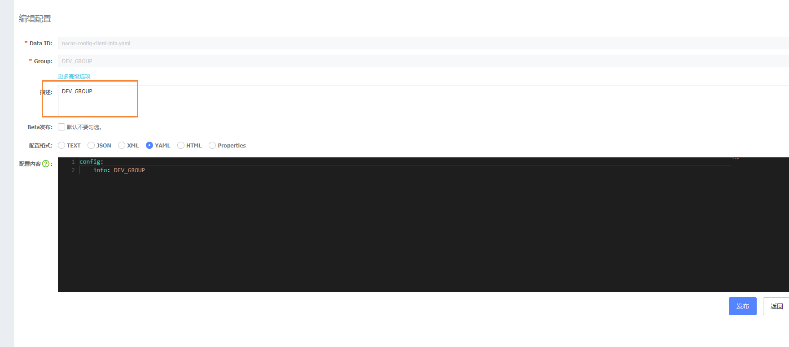

然后就可以添加分组

```
server:
  port: 3377
spring:
  application:
    name: nacos-config-client
  cloud:
    nacos:
      discovery:
        server-addr: localhost:8848 # 注册中心
      config:
        server-addr: localhost:8848 # 配置中心
        file-extension: yaml # 这里指定的文件格式需要和nacos上新建的配置文件后缀相同，否则读不到
        group: TEST_GROUP
```


##### Namspace方案

首先我们需要新建一个命名空间

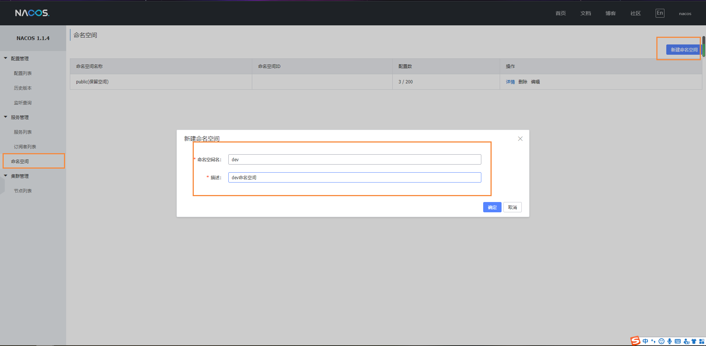

新建完成后，能够看到有命名空间id


创建完成后，我们会发现，多出了几个命名空间切换

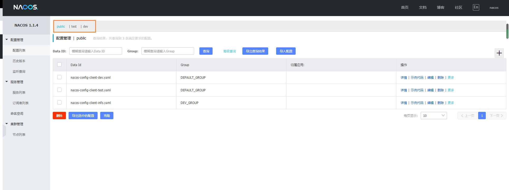

同时，我们到服务列表，发现也多了命名空间的切换

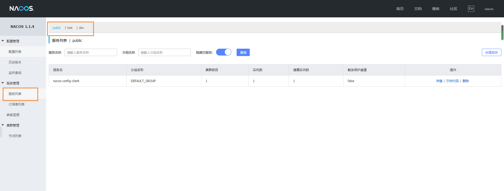

下面我们就可以通过引入namespaceI，来创建到指定的命名空间下

```
server:
  port: 3377
spring:
  application:
    name: nacos-config-client
  cloud:
    nacos:
      discovery:
        server-addr: localhost:8848 # 注册中心
      config:
        server-addr: localhost:8848 # 配置中心
        file-extension: yaml # 这里指定的文件格式需要和nacos上新建的配置文件后缀相同，否则读不到
        group: DEV_GROUP
        namespace: bbf379fb-f979-4eab-8947-2f38cfae6c0c
```

最后通过 namespace + group + DataID 形成三级分类


## Nacos集群和持久化配置

### 官网说明

用于部署生产中的集群模式

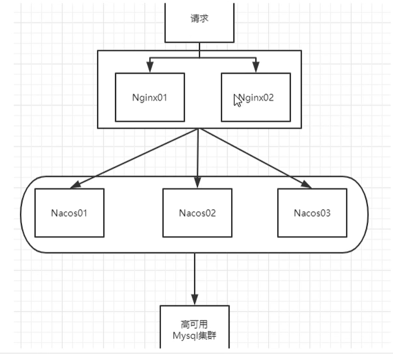

默认Nacos使用嵌入数据库实现数据的存储，所以，如果启动多个默认配置下的Nacos节点，数据存储是存在一致性问题的。为了解决这个问题，Nacos采用了集中式存储的方式来支持集群化部署，目前只支持MySQL的存储。

Nacos支持三种部署模式

- 单机模式：用于测试和单机使用
- 集群模式：用于生产环境，确保高可用
- 多集群模式：用于多数据中心场景

### 单机模式支持mysql

在0.7版本之前，在单机模式下nacos使用嵌入式数据库实现数据的存储，不方便观察数据存储的基本情况。0.7版本增加了支持mysql数据源能力，具体的操作流程：

- 安装数据库，版本要求：5.6.5 + 
- 初始化数据库，数据库初始化文件：nacos-mysql.sql
- 修改conf/application.properties文件，增加mysql数据源配置，目前仅支持mysql，添加mysql数据源的url，用户名和密码

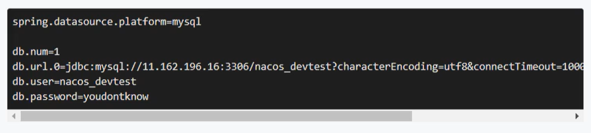

再次以单机模式启动nacos，nacos所有写嵌入式数据库的数据都写到了mysql中。

### Nacos持久化配置解释

Nacos默认自带的是嵌入式数据库derby

因此我们需要完成derby到mysql切换配置步骤

- 在nacos\conf目录下，找到SQL脚本

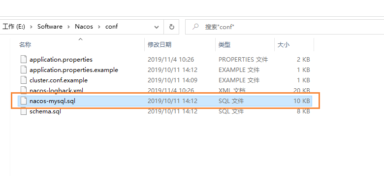

然后执行SQL脚本，同时修改application.properties目录

[官网地址](https://nacos.io/zh-cn/docs/deployment.html)

```
spring.datasource.platform=mysql

db.num=1
db.url.0=jdbc:mysql://127.0.0.1:3306/nacos_devtest?characterEncoding=utf8&connectTimeout=1000&socketTimeout=3000&autoReconnect=true
db.user=root
db.password=root
```

修改完成后，启动nacos，可以看到是一个全新的空记录页面，以前是记录进derby


### Linux版Nacos + Mysql生产环境配置

#### 配置

预计需要：1个Nginx + 3个nacos注册中心 + 1个mysql

所有的请求过来，首先先打到nginx上

#### Nacos下载Linux版本

在nacos github下载：`https://github.com/alibaba/nacos/releases`

选择Linux版本下载


#### 集群配置

如果是一个nacos：启动 8848即可

如果是多个nacos：3333,4444,5555

那么就需要修改startup.sh里面的，传入端口号


步骤：

- Linux服务器上mysql数据库配置
- application.properties配置
- Linux服务器上nacos的集群配置cluster.conf
  - 梳理出3台nacos集群的不同服务端口号
  - 复制出cluster.conf（备份）
  - 修改

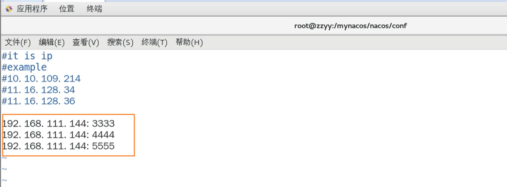

- 编辑Nacos的启动脚本startup.sh，使它能够接受不同的启动端口

  - /nacos/bin 目录下有startup.sh
  - 平时单机版的启动，直接./startup.sh
  - 但是集群启动时，我们希望可以类似其它软件的shell命令，传递不同的端口号启动不同的nacos实例，命令：./startup.sh -p 3333表示启动端口号为3333的nacos服务器实例，和上一步的cluster.conf配置一样。

  修改启动脚本，添加P，这样能够明确nacos启动的什么脚本

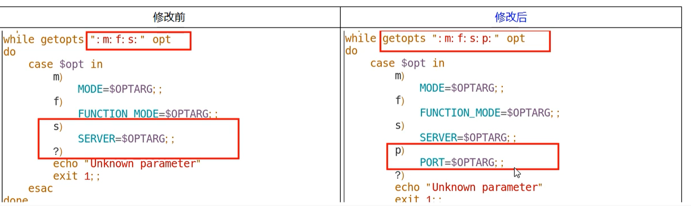

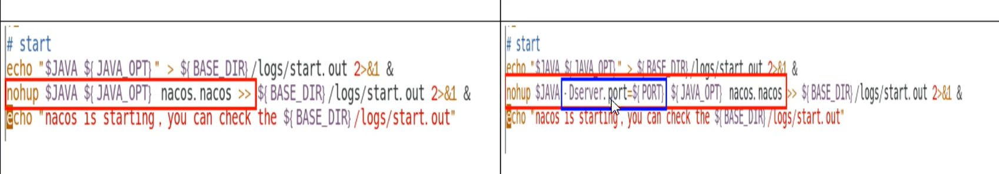

修改完成后，就能够使用下列命令启动集群了

```
./startup.sh -p 3333
./startup.sh -p 4444
./startup.sh -p 5555
```

- Nginx的配置，由它作为负载均衡器
  - 修改nginx的配置文件

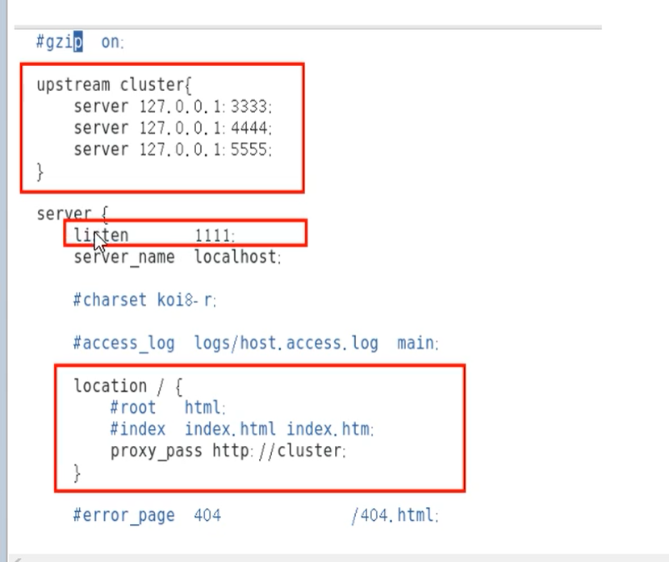

作为负载均衡分流，同时upstream 支持weight

通过nginx访问nacos节点：`http://192.168.111.144:1111/nacos/#/login`

微服务注册进集群中

```
server:
  port: 9002
spring:
  application:
    name: nacos-payment-provider
  cloud:
    nacos:
      discovery:
        server-addr: 192.168.111.144:1111 # 换成nginx的1111端口，做负债均衡
management:
  endpoints:
    web:
      exposure:
        include: '*'
```

#### 总结

Nginx + 3个Nacos + mysql的集群化配置

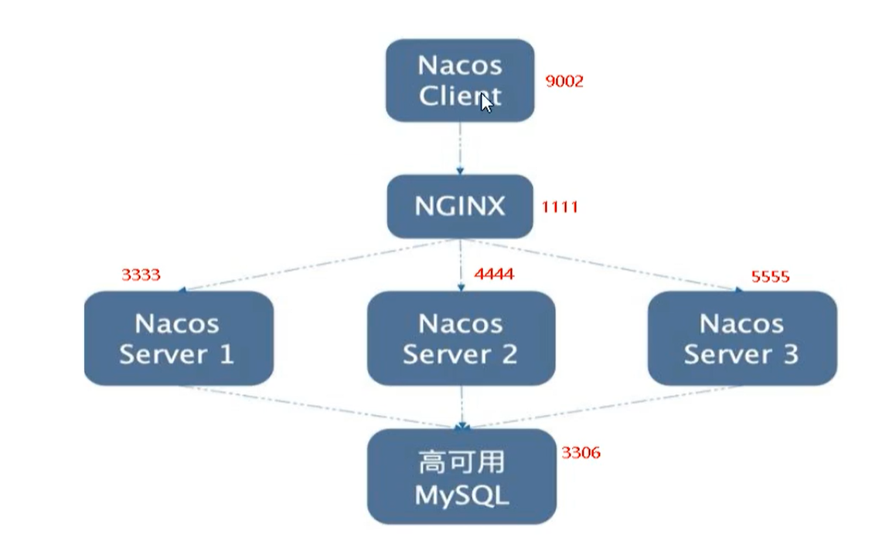

