# SpringCloudAlibabaSentinel实现熔断和限流

## Sentinel

### 官网

Github：https://github.com/alibaba/Sentinel

Sentinel：分布式系统的流量防卫兵，相当于Hystrix

Hystrix存在的问题

- 需要我们程序员自己手工搭建监控平台
- 没有一套web界面可以给我们进行更加细粒度化的配置，流量控制，速率控制，服务熔断，服务降级。。

这个时候Sentinel运营而生

- 单独一个组件，可以独立出来
- 直接界面化的细粒度统一配置

约定 > 配置 >编码，都可以写在代码里，但是尽量使用注解和配置代替编码

### 是什么

随着微服务的流行，服务和服务之间的稳定性变得越来越重要。Sentinel 以流量为切入点，从流量控制、熔断降级、系统负载保护等多个维度保护服务的稳定性。

Sentinel 具有以下特征:

- **丰富的应用场景**：Sentinel 承接了阿里巴巴近 10 年的双十一大促流量的核心场景，例如秒杀（即突发流量控制在系统容量可以承受的范围）、消息削峰填谷、集群流量控制、实时熔断下游不可用应用等。
- **完备的实时监控**：Sentinel 同时提供实时的监控功能。您可以在控制台中看到接入应用的单台机器秒级数据，甚至 500 台以下规模的集群的汇总运行情况。
- **广泛的开源生态**：Sentinel 提供开箱即用的与其它开源框架/库的整合模块，例如与 Spring Cloud、Dubbo、gRPC 的整合。您只需要引入相应的依赖并进行简单的配置即可快速地接入 Sentinel。
- **完善的 SPI 扩展点**：Sentinel 提供简单易用、完善的 SPI 扩展接口。您可以通过实现扩展接口来快速地定制逻辑。例如定制规则管理、适配动态数据源等。

### 主要特征

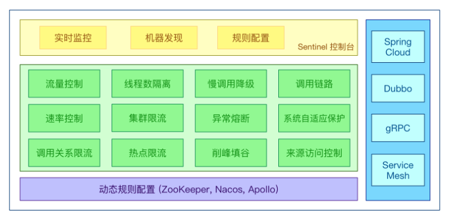

### 生态圈

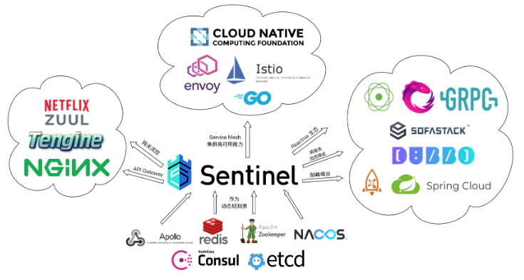

### 下载

Github：https://github.com/alibaba/Sentinel/releases

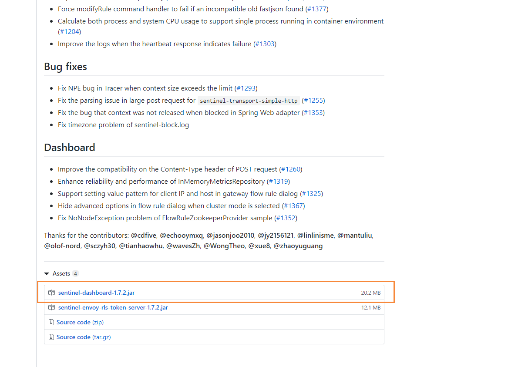

## 安装Sentinel控制台

sentinel组件由两部分组成，后台和前台8080

Sentinel分为两部分

- 核心库（Java客户端）不依赖任何框架/库，能够运行在所有Java运行时环境，同时对Dubbo、SpringCloud等框架也有较好的支持。
- 控制台（Dashboard）基于SpringBoot开发，打包后可以直接运行，不需要额外的Tomcat等应用容器

使用 `java -jar` 启动，同时Sentinel默认的端口号是8080，因此不能被占用

注意，下载时候，由于Github经常抽风，因此可以使用Gitee进行下，首先先去Gitee下载源码

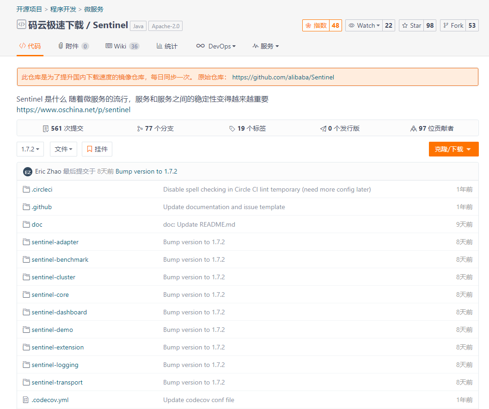

然后执行`mvn package` 进行构建，本博客同级目录下了，已经有个已经下载好的，欢迎自取

## 初始化演示工程

启动Nacos8848成功

### 引入依赖

```
<!--SpringCloud ailibaba sentinel-datasource-nacos 后续做持久化用到-->
<dependency>
    <groupId>com.alibaba.csp</groupId>
    <artifactId>sentinel-datasource-nacos</artifactId>
</dependency>

<!--SpringCloud ailibaba sentinel -->
<dependency>
    <groupId>com.alibaba.cloud</groupId>
    <artifactId>spring-cloud-starter-alibaba-sentinel</artifactId>
</dependency>
```

### 修改YML

```
server:
  port: 8401

spring:
  application:
    name: cloudalibaba-sentinel-service
  cloud:
    nacos:
      discovery:
        server-addr: localhost:8848 #Nacos服务注册中心地址
    sentinel:
      transport:
        dashboard: localhost:8080 #配置Sentinel dashboard地址
        port: 8719
```

### 增加业务类

```
@RestController
@Slf4j
public class FlowLimitController
{
    @GetMapping("/testA")
    public String testA()
    {
        return "------testA";
    }

    @GetMapping("/testB")
    public String testB()
    {
        log.info(Thread.currentThread().getName()+"\t"+"...testB");
        return "------testB";
    }
}
```

启动8401微服务，查看Sentinel控制台

我们会发现Sentinel里面空空如也，什么也没有，这是因为Sentinel采用的懒加载

执行一下访问即可：`http://localhost:8401/testA` `http://localhost:8401/testB`

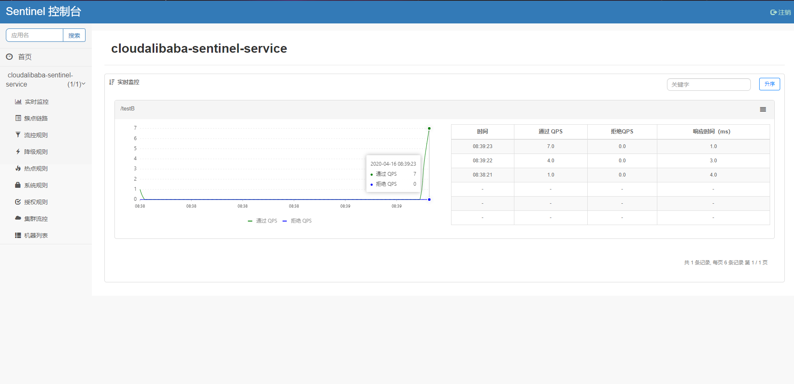


## 流控规则

### 基本介绍

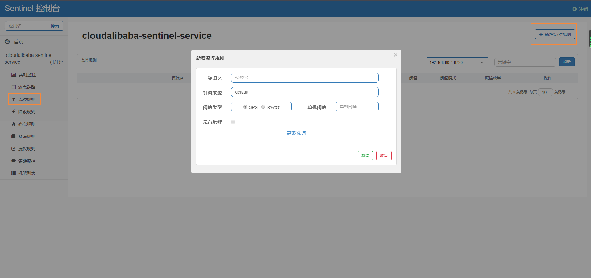

**字段说明**

- 资源名：唯一名称，默认请求路径
- 针对来源：Sentinel可以针对调用者进行限流，填写微服务名，默认default（不区分来源）
- 阈值类型 / 单机阈值
  - QPS：（每秒钟的请求数量）：但调用该API的QPS达到阈值的时候，进行限流
  - 线程数：当调用该API的线程数达到阈值的时候，进行限流
- 是否集群：不需要集群
- 流控模式
  - 直接：api都达到限流条件时，直接限流
  - 关联：当关联的资源达到阈值，就限流自己
  - 链路：只记录指定链路上的流量（指定资源从入口资源进来的流量，如果达到阈值，就进行限流）【API级别的针对来源】
- 流控效果
  - 快速失败：直接失败，抛异常
  - Warm UP：根据codeFactory（冷加载因子，默认3），从阈值/CodeFactor，经过预热时长，才达到设置的QPS阈值
  - 排队等待：匀速排队，让请求以匀速的速度通过，阈值类型必须设置QPS，否则无效

### 流控模式

#### 直接（默认）

我们给testA增加流控

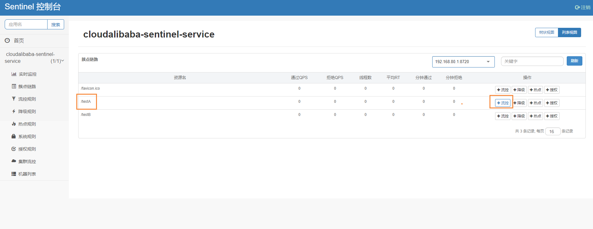

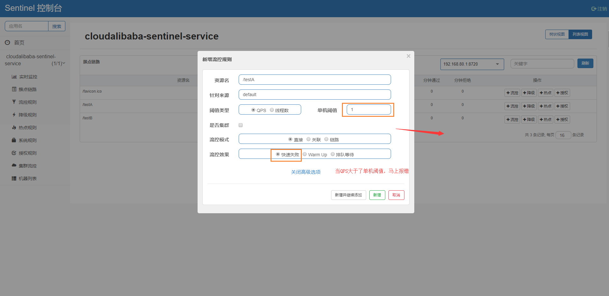

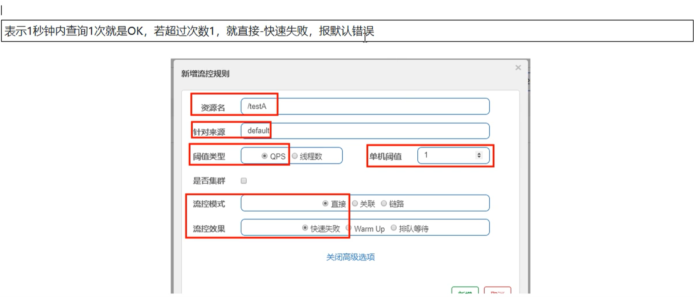

然后我们请求 `http://localhost:8401/testA`，就会出现失败，被限流，快速失败


思考：

直接调用的是默认报错信息，能否有我们的后续处理，比如更加友好的提示，类似有hystrix的fallback方法


线程数

这里的线程数表示一次只有一个线程进行业务请求，当前出现请求无法响应的时候，会直接报错，例如，在方法的内部增加一个睡眠，那么后面来的就会失败

```
    @GetMapping("/testD")
    public String testD()
    {
        try { TimeUnit.SECONDS.sleep(1); } catch (InterruptedException e) { e.printStackTrace(); }
        return "------testD";
    }
```


#### 关联

当关联的资源达到阈值时，就限流自己

当与A关联的资源B达到阈值后，就限流A自己，B惹事，A挂了

场景：支付接口达到阈值后，就限流下订单的接口

设置：

当关联资源 /testB的QPS达到阈值超过1时，就限流/testA的Rest访问地址，当关联资源达到阈值后，限制配置好的资源名

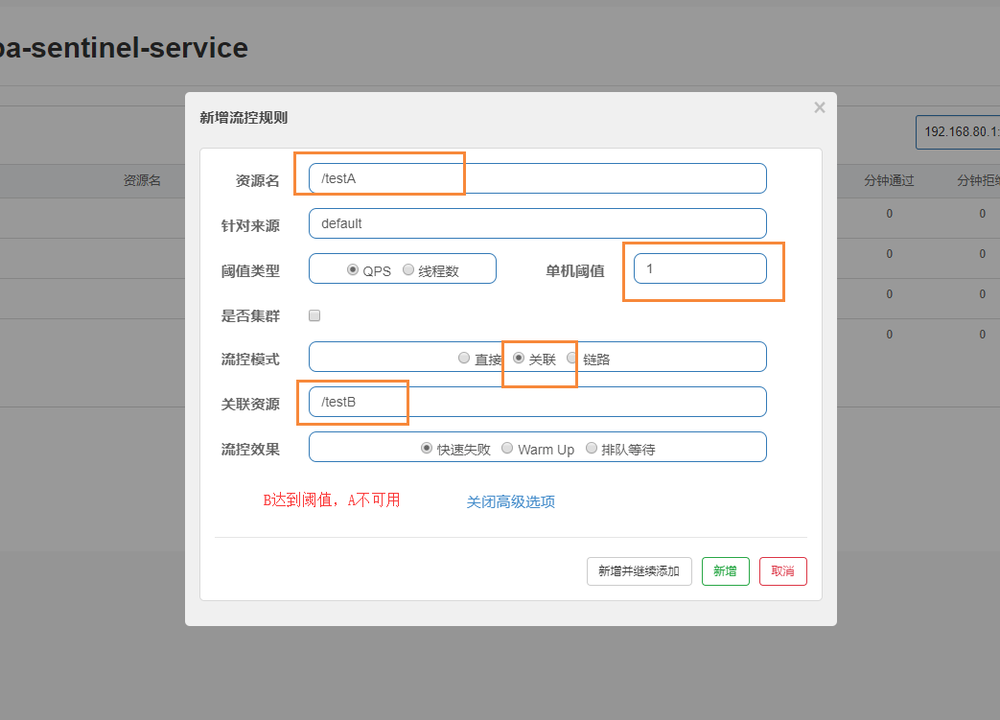

这个使用我们利用postman模拟并发密集访问`testB`

首先我们需要使用postman，创建一个请求

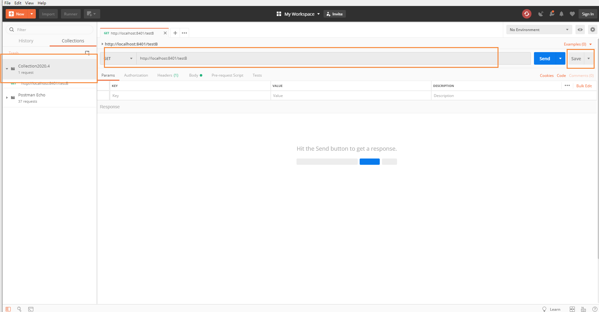

同时将请求保存在 Collection中

然后点击箭头，选中接口，选择run

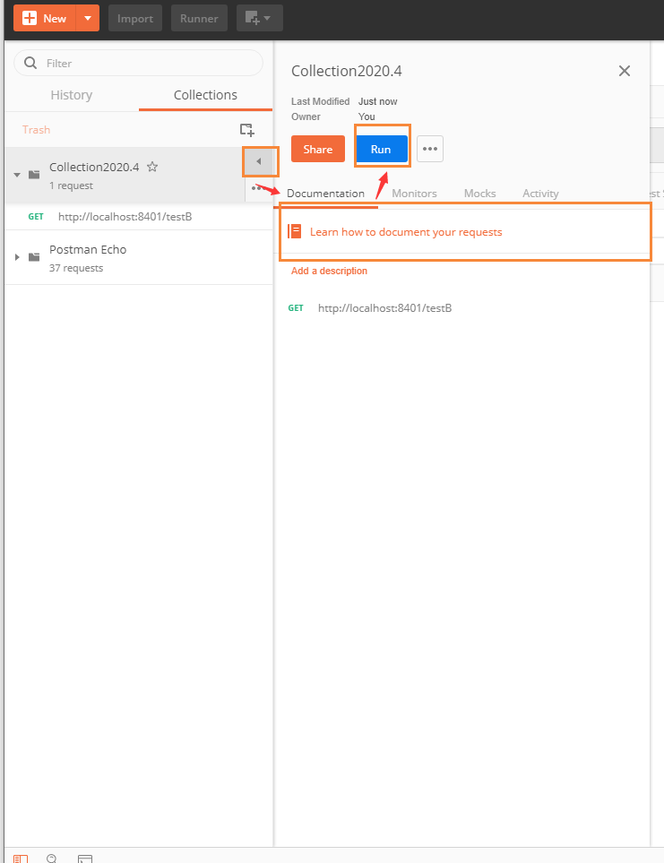

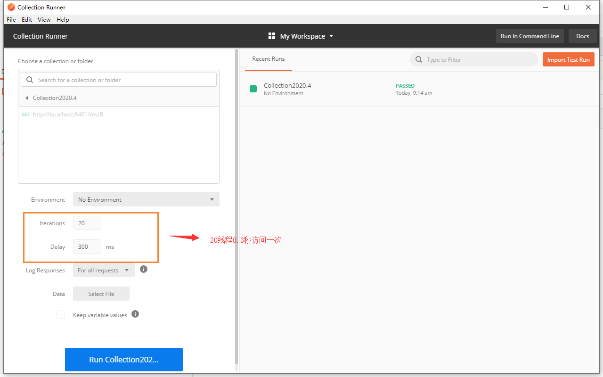

点击运行，大批量线程高并发访问B，导致A失效了，同时我们点击访问 `http://localhost:8401/testA`，结果发现，我们的A已经挂了

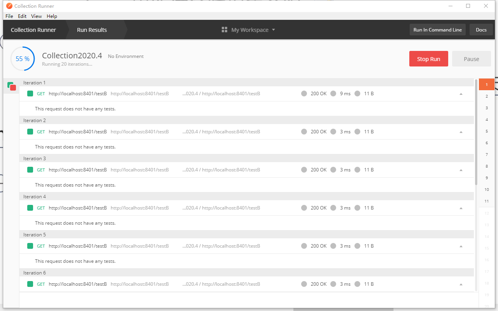

在测试A接口

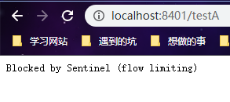

这就是我们的关联限流


#### 链路

多个请求调用了同一个微服务


### 流控效果

#### 直接

快速失败，默认的流控处理

- 直接失败，抛出异常：Blocked by Sentinel（Flow limiting）

#### 预热

系统最怕的就是出现，平时访问是0，然后突然一瞬间来了10W的QPS

公式：阈值 除以 clodFactor（默认值为3），经过预热时长后，才会达到阈值

Warm Up方式，即预热/冷启动方式，当系统长期处于低水位的情况下，当流量突然增加时，直接把系统拉升到高水位可能会瞬间把系统压垮。通过冷启动，让通过的流量缓慢增加，在一定时间内逐渐增加到阈值，给冷系统一个预热的时间，避免冷系统被压垮。通常冷启动的过程系统允许的QPS曲线如下图所示

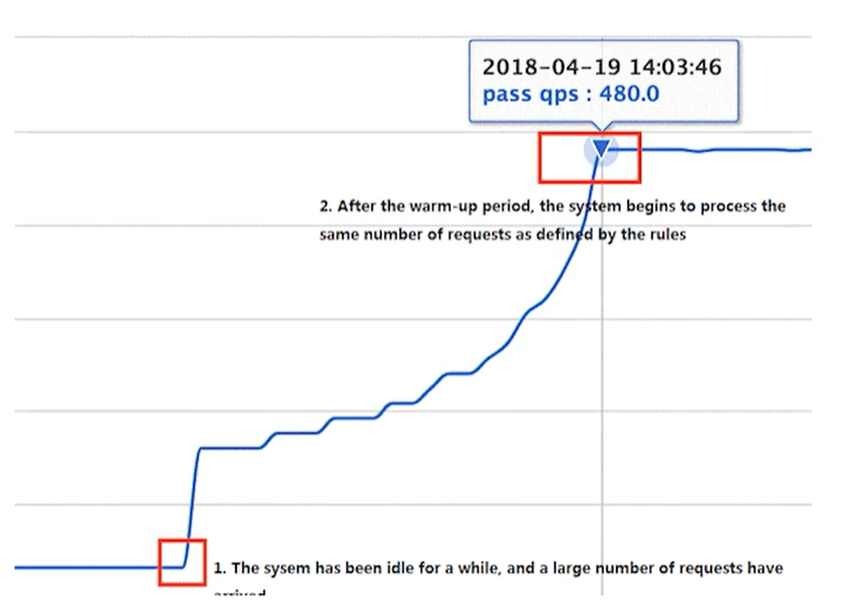

默认clodFactor为3，即请求QPS从threshold / 3开始，经预热时长逐渐提升至设定的QPS阈值

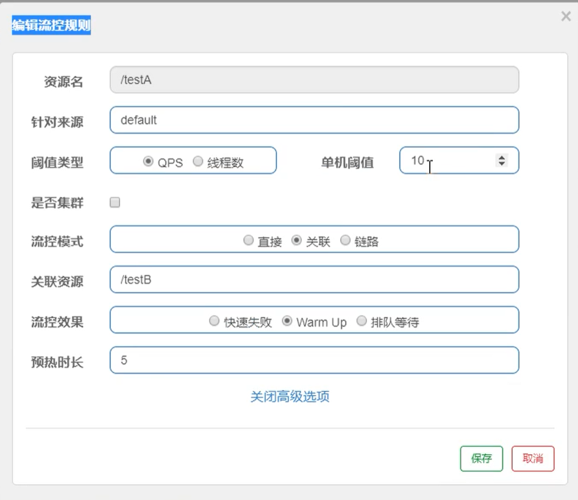

假设这个系统的QPS是10，那么最开始系统能够接受的 QPS  = 10 / 3 = 3，然后从3逐渐在5秒内提升到10

应用场景：

秒杀系统在开启的瞬间，会有很多流量上来，很可能把系统打死，预热的方式就是为了保护系统，可能慢慢的把流量放进来，慢慢的把阈值增长到设置的阈值。

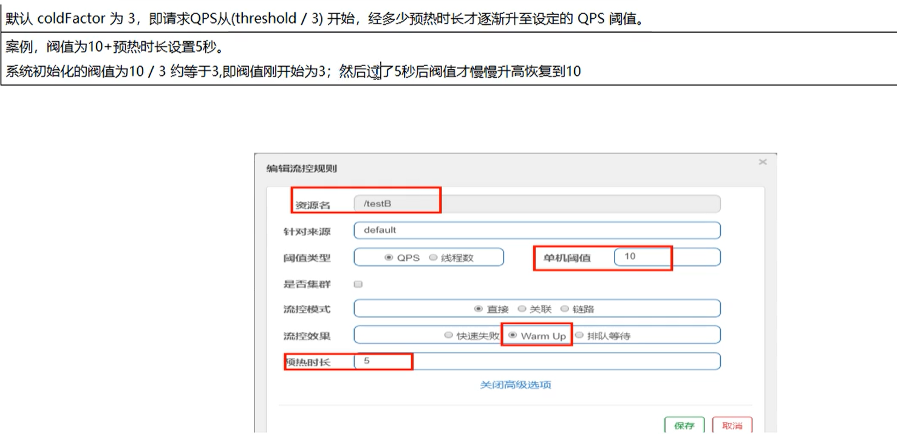

#### 排队等待

大家均速排队，让请求以均匀的速度通过，阈值类型必须设置成QPS，否则无效

均速排队方式必须严格控制请求通过的间隔时间，也即让请求以匀速的速度通过，对应的是漏桶算法。

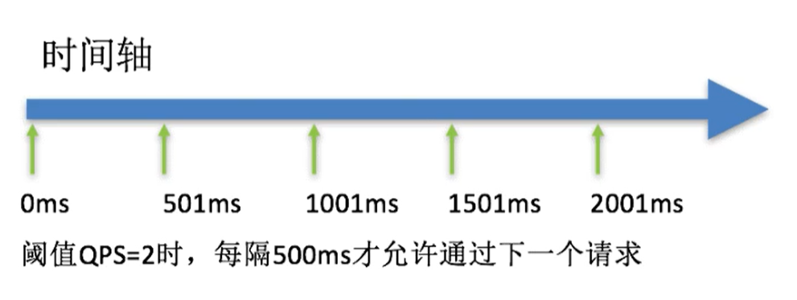

这种方式主要用于处理间隔性突发的流量，例如消息队列，想象一下这样的场景，在某一秒有大量的请求到来，而接下来的几秒处于空闲状态，我们系统系统能够接下来的空闲期间逐渐处理这些请求，而不是在第一秒直接拒绝多余的请求。

设置含义：/testA 每秒1次请求，超过的话，就排队等待，等待时间超过20000毫秒

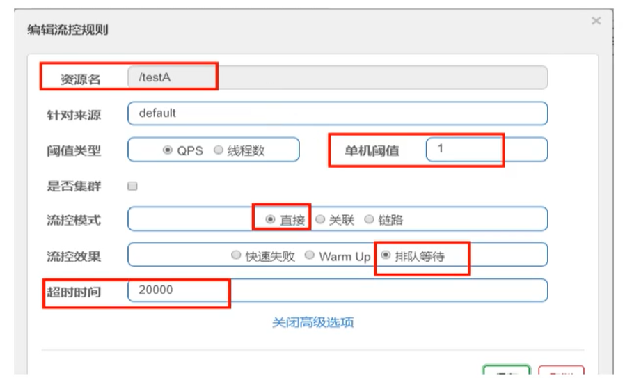


## 降级规则

### 名词介绍

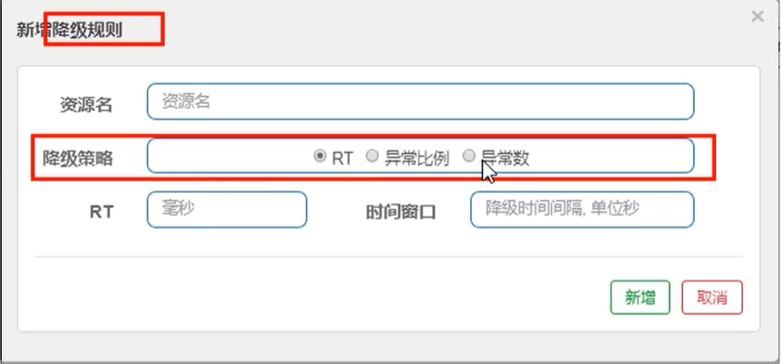


- RT（平均响应时间，秒级）
  - 平均响应时间，超过阈值 且 时间窗口内通过的请求 >= 5，两个条件同时满足后出发降级
  - 窗口期过后，关闭断路器
  - RT最大4900（更大的需要通过 -Dcsp.sentinel.staticstic.max.rt=XXXXX才能生效）

- 异常比例（秒级）
  - QPA >= 5 且异常比例（秒级）超过阈值时，触发降级；时间窗口结束后，关闭降级
- 异常数（分钟级）
  - 异常数（分钟统计）超过阈值时，触发降级，时间窗口结束后，关闭降级


### 概念

Sentinel熔断降级会在调用链路中某个资源出现不稳定状态时（例如调用超时或异常异常比例升高），对这个资源的调用进行限制，让请求快速失败，避免影响到其它的资源而导致级联错误。

当资源被降级后，在接下来的降级时间窗口之内，对该资源的调用都进行自动熔断（默认行为是抛出DegradeException）

Sentinel的断路器是没有半开状态

半开的状态，系统自动去检测是否请求有异常，没有异常就关闭断路器恢复使用，有异常则继续打开断路器不可用，具体可以参考hystrix

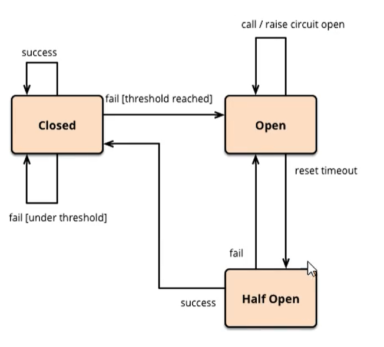

### 降级策略实战

#### RT

平均响应时间 (`DEGRADE_GRADE_RT`)：当 1s 内持续进入 N 个请求，对应时刻的平均响应时间（秒级）均超过阈值（`count`，以 ms 为单位），那么在接下的时间窗口（`DegradeRule` 中的 `timeWindow`，以 s 为单位）之内，对这个方法的调用都会自动地熔断（抛出 `DegradeException`）。注意 Sentinel 默认统计的 RT 上限是 4900 ms，**超出此阈值的都会算作 4900 ms**，若需要变更此上限可以通过启动配置项 `-Dcsp.sentinel.statistic.max.rt=xxx` 来配置。

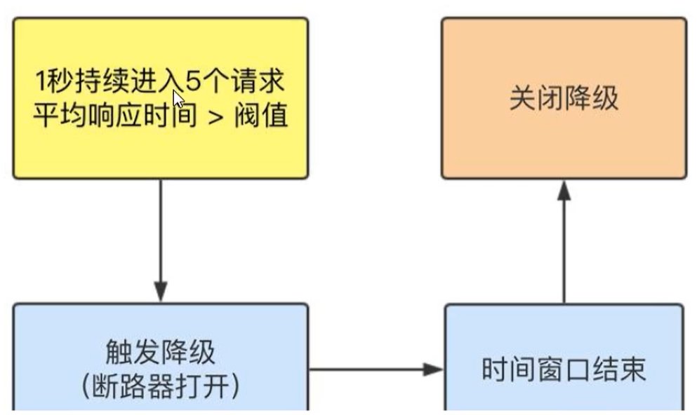

代码测试

```
    @GetMapping("/testD")
    public String testD()
    {
        try { TimeUnit.SECONDS.sleep(1); } catch (InterruptedException e) { e.printStackTrace(); }
        log.info("testD 异常比例");
        return "------testD";
    }
```

然后使用Jmeter压力测试工具进行测试

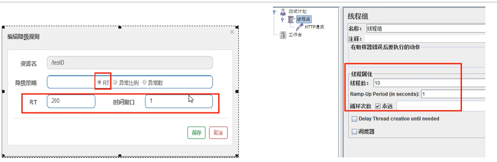

按照上述操作，永远1秒种打进来10个线程，大于5个了，调用tesetD，我们希望200毫秒内处理完本次任务，如果200毫秒没有处理完，在未来的1秒的时间窗口内，断路器打开（保险丝跳闸）微服务不可用，保险丝跳闸断电

```
Blocked by Sentinel (flow limiting)
```

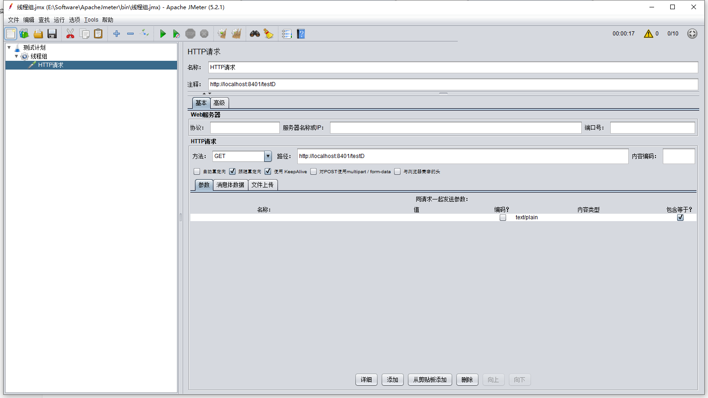

后续我们停止使用jmeter，没有那么大的访问量了，断路器关闭（保险丝恢复），微服务恢复OK

#### 异常比例

异常比例 (`DEGRADE_GRADE_EXCEPTION_RATIO`)：当资源的每秒请求量 >= N（可配置），并且每秒异常总数占通过量的比值超过阈值（`DegradeRule` 中的 `count`）之后，资源进入降级状态，即在接下的时间窗口（`DegradeRule` 中的 `timeWindow`，以 s 为单位）之内，对这个方法的调用都会自动地返回。异常比率的阈值范围是 `[0.0, 1.0]`，代表 0% - 100%。

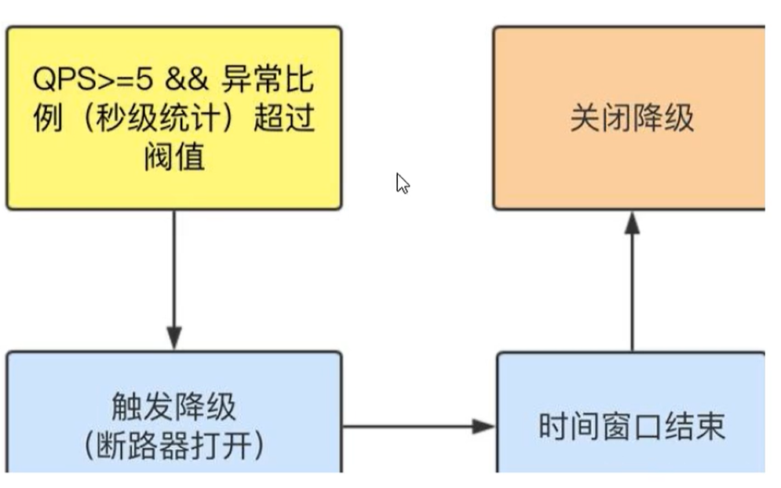

单独访问一次，必然来一次报错一次，开启jmeter后，直接高并发发送请求，多次调用达到我们的配置条件了，断路器开启（保险丝跳闸），微服务不可用，不在报错，而是服务降级了

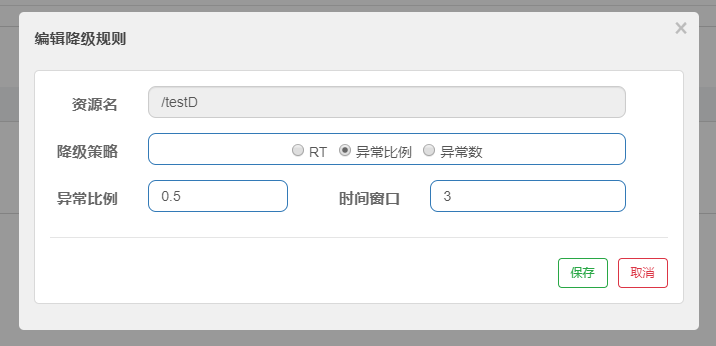

设置3秒内，如果请求百分50出错，那么就会熔断

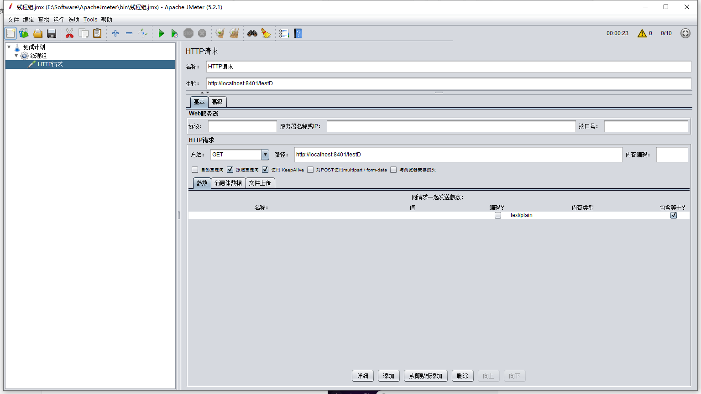

我们用jmeter每秒发送10次请求，3秒后，再次调用  `localhost:8401/testD` 出现服务降级

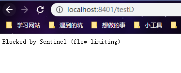

#### 异常数

异常数 (`DEGRADE_GRADE_EXCEPTION_COUNT`)：当资源近 1 分钟的异常数目超过阈值之后会进行熔断。注意由于统计时间窗口是分钟级别的，若 `timeWindow` 小于 60s，则结束熔断状态后仍可能再进入熔断状态

时间窗口一定要大于等于60秒

异常数是按分钟来统计的

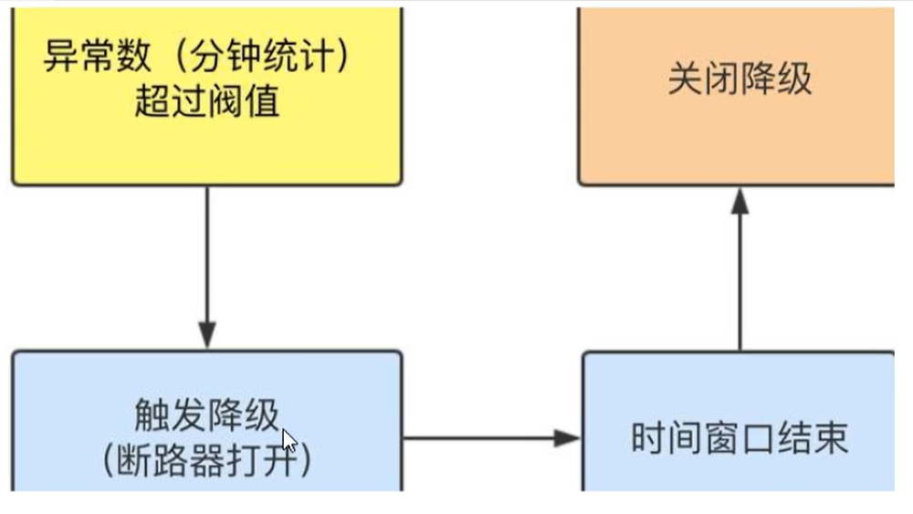

下面设置是，一分钟内出现5次，则熔断

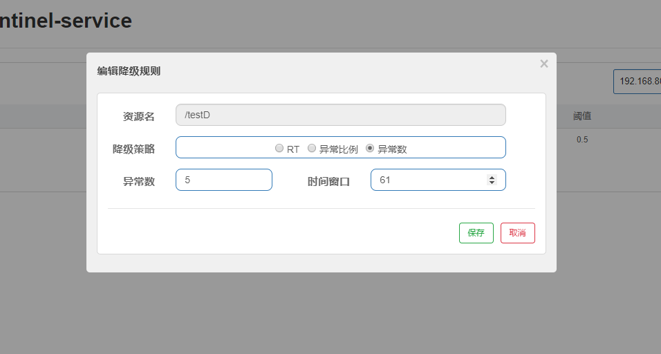

首先我们再次访问 `http://localhost:8401/testE`，第一次访问绝对报错，因为除数不能为0，我们看到error窗口，但是达到5次报错后，进入熔断后的降级


## Sentinel热点规则

### 什么是热点数据

[Github文档传送门](https://github.com/alibaba/Sentinel/wiki/%E7%83%AD%E7%82%B9%E5%8F%82%E6%95%B0%E9%99%90%E6%B5%81)

何为热点？热点即经常访问的数据。很多时候我们希望统计某个热点数据中访问频次最高的 Top K 数据，并对其访问进行限制。比如：

- 商品 ID 为参数，统计一段时间内最常购买的商品 ID 并进行限制
- 用户 ID 为参数，针对一段时间内频繁访问的用户 ID 进行限制

热点参数限流会统计传入参数中的热点参数，并根据配置的限流阈值与模式，对包含热点参数的资源调用进行限流。热点参数限流可以看做是一种特殊的流量控制，仅对包含热点参数的资源调用生效。

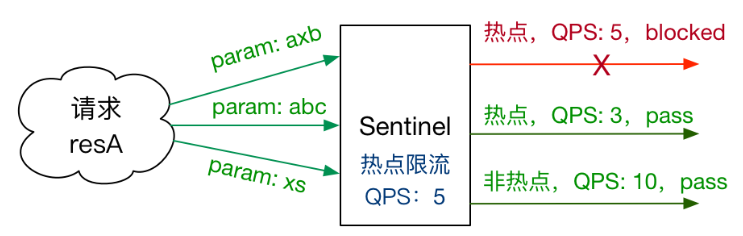

Sentinel 利用 LRU 策略统计最近最常访问的热点参数，结合令牌桶算法来进行参数级别的流控。热点参数限流支持集群模式。

### 兜底的方法

分为系统默认的和客户自定义的，两种，之前的case中，限流出现问题了，都用sentinel系统默认的提示：Blocked By Sentinel，我们能不能自定义，类似于hystrix，某个方法出现问题了，就找到对应的兜底降级方法。

从 `@HystrixCommand` 到 `@SentinelResource`

### 配置

@SentinelResource的value，就是我们的资源名，也就是对哪个方法配置热点规则

```
    @GetMapping("/testHotKey")
    @SentinelResource(value = "testHotKey",blockHandler = "deal_testHotKey")
    public String testHotKey(@RequestParam(value = "p1",required = false) String p1,
                             @RequestParam(value = "p2",required = false) String p2)
    {
        //int age = 10/0;
        return "------testHotKey";
    }
    
    // 和上面的参数一样，不错需要加入 BlockException
    public String deal_testHotKey (String p1, String p2, BlockException exception)
    {
        return "------deal_testHotKey,o(╥﹏╥)o";  //  兜底的方法
    }
```

我们对参数0，设置热点key进行限流

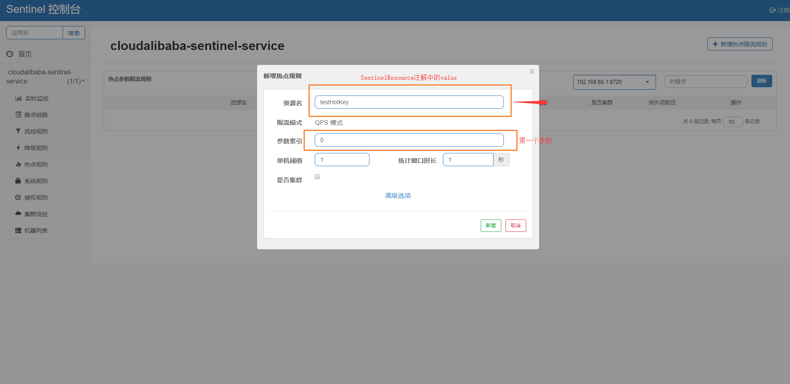

配置完成后

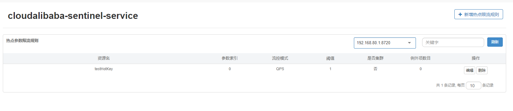

当我们不断的请求时候，也就是以第一个参数为目标，请求接口，我们会发现多次请求后

```
http://localhost:8401/testHotKey?p1=a
```

就会出现以下的兜底错误

```
------deal_testHotKey,o(╥﹏╥)o
```

这是因为我们针对第一个参数进行了限制，当我们QPS超过1的时候，就会触发兜底的错误

假设我们请求的接口是：`http://localhost:8401/testHotKey?p2=a` ，我们会发现他就没有进行限流

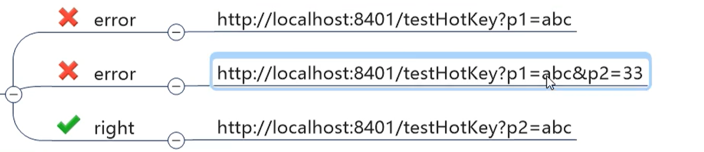

### 参数例外项

上述案例演示了第一个参数p1，当QPS超过1秒1次点击狗，马上被限流

- 普通：超过一秒1个后，达到阈值1后马上被限流
- 我们期望p1参数当它达到某个特殊值时，它的限流值和平时不一样
- 特例：假设当p1的值等于5时，它的阈值可以达到200
- 一句话说：当key为特殊值的时候，不被限制

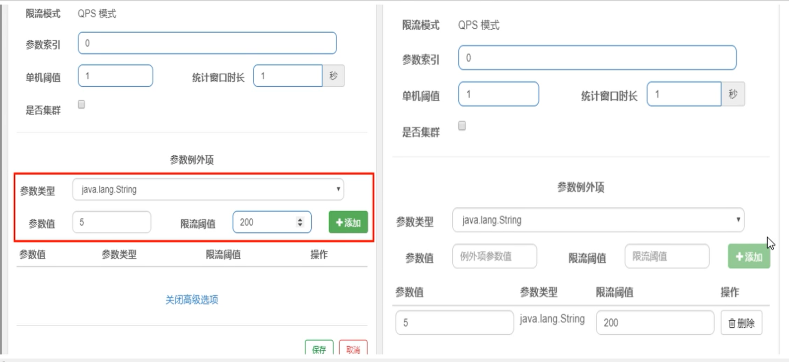

平时的时候，参数1的QPS是1，超过的时候被限流，但是有特殊值，比如5，那么它的阈值就是200

我们通过 `http://localhost:8401/testHotKey?p1=5` 一直刷新，发现不会触发兜底的方法，这就是参数例外项

热点参数的注意点，参数必须是基本类型或者String

### 结语

`@SentinelResource` 处理的是Sentinel控制台配置的违规情况，有blockHandler方法配置的兜底处理

RuntimeException，如  int a = 10/0 ; 这个是java运行时抛出的异常，RuntimeException，@RentinelResource不管

也就是说：`@SentinelResource` 主管配置出错，运行出错不管。

如果想要有配置出错，和运行出错的话，那么可以设置 fallback

```
    @GetMapping("/testHotKey")
    @SentinelResource(value = "testHotKey",blockHandler = "deal_testHotKey", fallback = "fallBack")
    public String testHotKey(@RequestParam(value = "p1",required = false) String p1,
                             @RequestParam(value = "p2",required = false) String p2)
    {
        //int age = 10/0;
        return "------testHotKey";
    }
```


## Sentinel系统配置

Sentinel 系统自适应限流从整体维度对应用入口流量进行控制，结合应用的 Load、CPU 使用率、总体平均 RT、入口 QPS 和并发线程数等几个维度的监控指标，通过自适应的流控策略，让系统的入口流量和系统的负载达到一个平衡，让系统尽可能跑在最大吞吐量的同时保证系统整体的稳定性。

系统保护规则是从应用级别的入口流量进行控制，从单台机器的 load、CPU 使用率、平均 RT、入口 QPS 和并发线程数等几个维度监控应用指标，让系统尽可能跑在最大吞吐量的同时保证系统整体的稳定性。

系统保护规则是应用整体维度的，而不是资源维度的，并且**仅对入口流量生效**。入口流量指的是进入应用的流量（`EntryType.IN`），比如 Web 服务或 Dubbo 服务端接收的请求，都属于入口流量。

系统规则支持以下的模式：

- **Load 自适应**（仅对 Linux/Unix-like 机器生效）：系统的 load1 作为启发指标，进行自适应系统保护。当系统 load1 超过设定的启发值，且系统当前的并发线程数超过估算的系统容量时才会触发系统保护（BBR 阶段）。系统容量由系统的 `maxQps * minRt` 估算得出。设定参考值一般是 `CPU cores * 2.5`。
- **CPU usage**（1.5.0+ 版本）：当系统 CPU 使用率超过阈值即触发系统保护（取值范围 0.0-1.0），比较灵敏。
- **平均 RT**：当单台机器上所有入口流量的平均 RT 达到阈值即触发系统保护，单位是毫秒。
- **并发线程数**：当单台机器上所有入口流量的并发线程数达到阈值即触发系统保护。
- **入口 QPS**：当单台机器上所有入口流量的 QPS 达到阈值即触发系统保护。


这样相当于设置了全局的QPS过滤


## @SentinelResource注解

- 按资源名称限流 + 后续处理
- 按URL地址限流 + 后续处理

### 问题

- 系统默认的，没有体现我们自己的业务要求
- 依照现有条件，我们自定义的处理方法又和业务代码耦合在一块，不直观
- 每个业务方法都添加一个兜底方法，那代码膨胀加剧
- 全局统一的处理方法没有体现
- 关闭8401，发现流控规则已经消失，说明这个是没有持久化

### 客户自定义限流处理逻辑

创建CustomerBlockHandler类用于自定义限流处理逻辑

```
public class CustomerBlockHandler
{
    public static CommonResult handlerException(BlockException exception)
    {
        return new CommonResult(4444,"按客戶自定义,global handlerException----1");
    }
    public static CommonResult handlerException2(BlockException exception)
    {
        return new CommonResult(4444,"按客戶自定义,global handlerException----2");
    }
}
```

那么我们在使用的时候，就可以首先指定是哪个类，哪个方法

```
    @GetMapping("/rateLimit/customerBlockHandler")
    @SentinelResource(value = "customerBlockHandler",
            blockHandlerClass = CustomerBlockHandler.class,
            blockHandler = "handlerException2")
    public CommonResult customerBlockHandler()
    {
        return new CommonResult(200,"按客戶自定义",new Payment(2020L,"serial003"));
    }
```

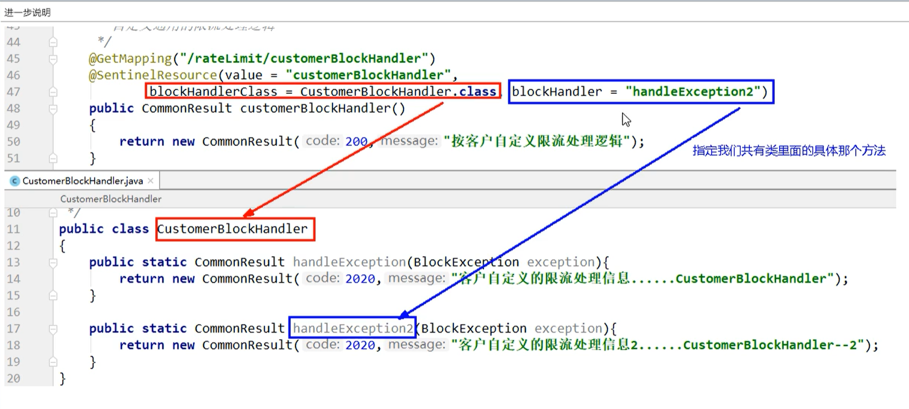

### 更多注解属性说明

所有的代码都要用try - catch - finally 进行处理

sentinel主要有三个核心API

- Sphu定义资源
- Tracer定义统计
- ContextUtil定义了上下文


## 服务熔断

sentinel整合Ribbon + openFeign + fallback

搭建 9003 和 9004 服务提供者

### 不设置任何参数

然后在使用 84作为服务消费者，当我们值使用 `@SentinelResource`注解时，不添加任何参数，那么如果出错的话，是直接返回一个error页面，对前端用户非常不友好，因此我们需要配置一个兜底的方法

```
    @RequestMapping("/consumer/fallback/{id}")
    @SentinelResource(value = "fallback") //没有配置
    public CommonResult<Payment> fallback(@PathVariable Long id)
    {
        CommonResult<Payment> result = restTemplate.getForObject(SERVICE_URL + "/paymentSQL/"+id,CommonResult.class,id);

        if (id == 4) {
            throw new IllegalArgumentException ("IllegalArgumentException,非法参数异常....");
        }else if (result.getData() == null) {
            throw new NullPointerException ("NullPointerException,该ID没有对应记录,空指针异常");
        }

        return result;
    }
```

### 设置fallback

```
    @RequestMapping("/consumer/fallback/{id}")
    @SentinelResource(value = "fallback",fallback = "handlerFallback") //fallback只负责业务异常
    public CommonResult<Payment> fallback(@PathVariable Long id)
    {
        CommonResult<Payment> result = restTemplate.getForObject(SERVICE_URL + "/paymentSQL/"+id,CommonResult.class,id);

        if (id == 4) {
            throw new IllegalArgumentException ("IllegalArgumentException,非法参数异常....");
        }else if (result.getData() == null) {
            throw new NullPointerException ("NullPointerException,该ID没有对应记录,空指针异常");
        }

        return result;
    }
    
    //本例是fallback
    public CommonResult handlerFallback(@PathVariable  Long id,Throwable e) {
        Payment payment = new Payment(id,"null");
        return new CommonResult<>(444,"兜底异常handlerFallback,exception内容  "+e.getMessage(),payment);
    }
```

加入fallback后，当我们程序运行出错时，我们会有一个兜底的异常执行，但是服务限流和熔断的异常还是出现默认的

### 设置blockHandler

```
    @RequestMapping("/consumer/fallback/{id}")
    @SentinelResource(value = "fallback",blockHandler = "blockHandler" ,fallback = "handlerFallback") //blockHandler只负责sentinel控制台配置违规
    public CommonResult<Payment> fallback(@PathVariable Long id)
    {
        CommonResult<Payment> result = restTemplate.getForObject(SERVICE_URL + "/paymentSQL/"+id,CommonResult.class,id);

        if (id == 4) {
            throw new IllegalArgumentException ("IllegalArgumentException,非法参数异常....");
        }else if (result.getData() == null) {
            throw new NullPointerException ("NullPointerException,该ID没有对应记录,空指针异常");
        }

        return result;
    }
    
    //本例是blockHandler
    public CommonResult blockHandler(@PathVariable  Long id,BlockException blockException) {
        Payment payment = new Payment(id,"null");
        return new CommonResult<>(445,"blockHandler-sentinel限流,无此流水: blockException  "+blockException.getMessage(),payment);
    }
```

### blockHandler和fallback一起配置

```
    @RequestMapping("/consumer/fallback/{id}")
    @SentinelResource(value = "fallback",blockHandler = "blockHandler") //blockHandler只负责sentinel控制台配置违规
    public CommonResult<Payment> fallback(@PathVariable Long id)
    {
        CommonResult<Payment> result = restTemplate.getForObject(SERVICE_URL + "/paymentSQL/"+id,CommonResult.class,id);

        if (id == 4) {
            throw new IllegalArgumentException ("IllegalArgumentException,非法参数异常....");
        }else if (result.getData() == null) {
            throw new NullPointerException ("NullPointerException,该ID没有对应记录,空指针异常");
        }
        return result;
    }
```

若blockHandler 和 fallback都进行了配置，则被限流降级而抛出 BlockException时，只会进入blockHandler处理逻辑


### 异常忽略

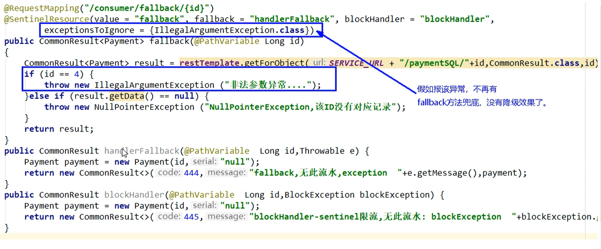


## Feign系列

#### 引入依赖

```
<!--SpringCloud openfeign -->
<dependency>
    <groupId>org.springframework.cloud</groupId>
    <artifactId>spring-cloud-starter-openfeign</artifactId>
</dependency>
```

#### 修改YML

```
server:
  port: 84

spring:
  application:
    name: nacos-order-consumer
  cloud:
    nacos:
      discovery:
        server-addr: localhost:8848
    sentinel:
      transport:
        #配置Sentinel dashboard地址
        dashboard: localhost:8080
        #默认8719端口，假如被占用会自动从8719开始依次+1扫描,直至找到未被占用的端口
        port: 8719

#消费者将要去访问的微服务名称(注册成功进nacos的微服务提供者)
service-url:
  nacos-user-service: http://nacos-payment-provider

# 激活Sentinel对Feign的支持
feign:
  sentinel:
    enabled: true
```

#### 启动类激活Feign

```
@EnableDiscoveryClient
@SpringBootApplication
@EnableFeignClients
public class OrderNacosMain84
{
    public static void main(String[] args) {
        SpringApplication.run(OrderNacosMain84.class, args);
    }
}
```

#### 引入Feign接口

```
@FeignClient(value = "nacos-payment-provider",fallback = PaymentFallbackService.class)
public interface PaymentService
{
    @GetMapping(value = "/paymentSQL/{id}")
    public CommonResult<Payment> paymentSQL(@PathVariable("id") Long id);
}
```

#### 加入fallback兜底方法实现

```
@Component
public class PaymentFallbackService implements PaymentService
{
    @Override
    public CommonResult<Payment> paymentSQL(Long id)
    {
        return new CommonResult<>(44444,"服务降级返回,---PaymentFallbackService",new Payment(id,"errorSerial"));
    }
}
```

#### 测试

请求接口：`http://localhost:84/consumer/paymentSQL/1`

测试84调用9003，此时故意关闭9003微服务提供者，看84消费侧自动降级

我们发现过了一段时间后，会触发服务降级，返回失败的方法

## 熔断框架对比

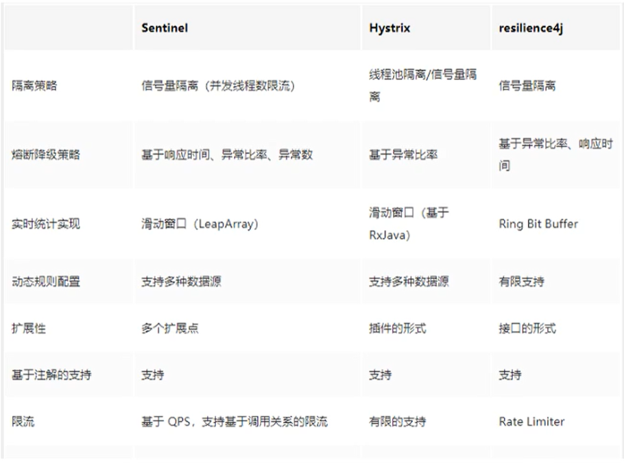


## Sentinel规则持久化

### 是什么

一旦我们重启应用，sentinel规则将会消失，生产环境需要将规则进行持久化

### 怎么玩

将限流配置规则持久化进Nacos保存，只要刷新8401某个rest地址，sentinel控制台的流控规则就能看到，只要Nacos里面的配置不删除，针对8401上的流控规则持续有效

### 解决方法

使用nacos持久化保存

#### 引入依赖

```
<!--SpringCloud ailibaba sentinel-datasource-nacos 后续做持久化用到-->
<dependency>
    <groupId>com.alibaba.csp</groupId>
    <artifactId>sentinel-datasource-nacos</artifactId>
</dependency>
```

#### 修改yml

```
server:
  port: 8401

spring:
  application:
    name: cloudalibaba-sentinel-service
  cloud:
    nacos:
      discovery:
        server-addr: localhost:8848 #Nacos服务注册中心地址
    sentinel:
      transport:
        dashboard: localhost:8080 #配置Sentinel dashboard地址
        port: 8719
      datasource:
        ds1:
          nacos:
            server-addr: localhost:8848
            dataId: cloudalibaba-sentinel-service
            groupId: DEFAULT_GROUP
            data-type: json
            rule-type: flow

management:
  endpoints:
    web:
      exposure:
        include: '*'

feign:
  sentinel:
    enabled: true # 激活Sentinel对Feign的支持
```

#### 添加nacos配置

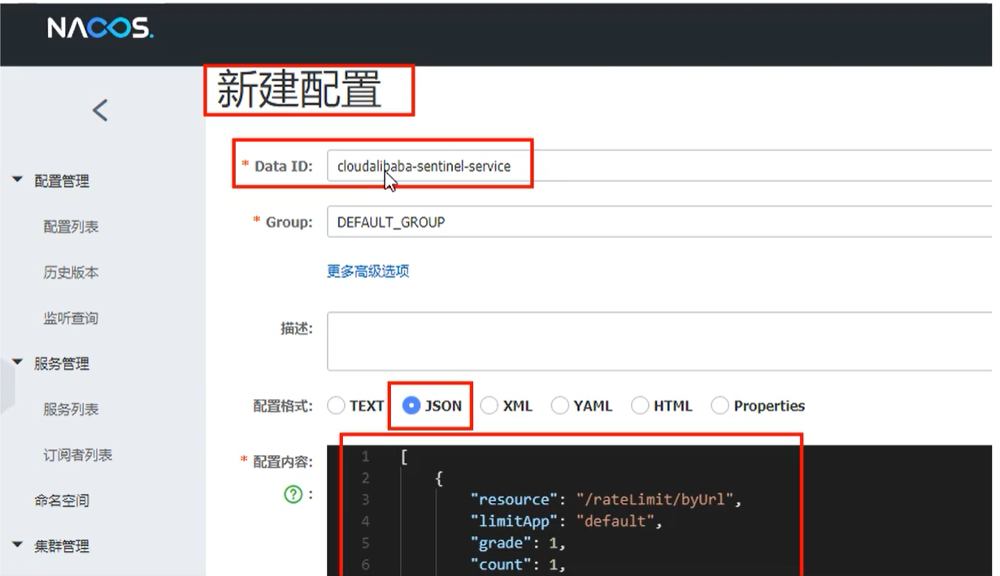

内容解析

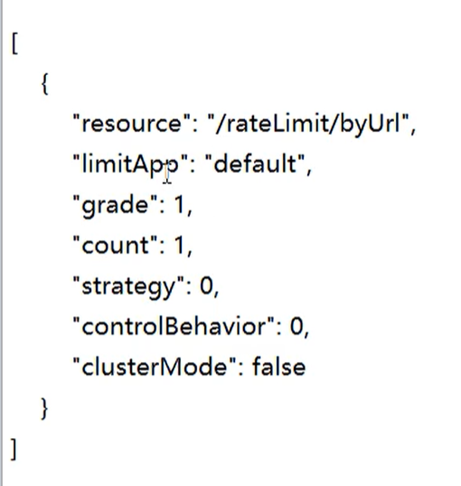

- resource：资源名称
- limitApp：来源应用
- grade：阈值类型，0表示线程数，1表示QPS
- count：单机阈值
- strategy：流控模式，0表示直接，1表示关联，2表示链路
- controlBehavior：流控效果，0表示快速失败，1表示Warm，2表示排队等待
- clusterMode：是否集群


这样启动的时候，调用一下接口，我们的限流规则就会重新出现~