# SpringCloudAlibabaSeata处理分布式事务

基于分布式的事务管理

## 分布式事务

分布式之前，单机单库没有这个问题，从 1:1 -> 1:N -> N:N

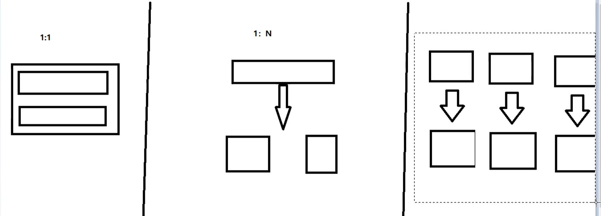

跨数据库，多数据源的统一调度，就会遇到分布式事务问题

如下图，单体应用被拆分成微服务应用，原来的三个模板被拆分成三个独立的应用，分别使用三个独立的数据源，业务操作需要调用三个服务来完成。此时每个服务内部的数据一致性由本地事务来保证，但是全局的数据一致性问题没法保证。

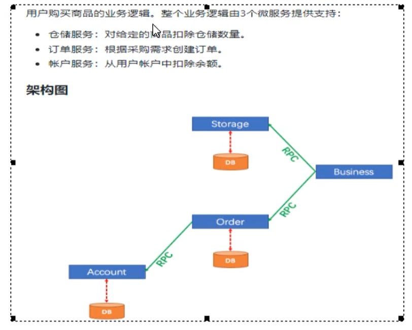


## Seata简介

官方文档：[点我传送](https://seata.io/zh-cn/docs/overview/what-is-seata.html)

Seata 是一款开源的分布式事务解决方案，致力于提供高性能和简单易用的分布式事务服务。Seata 将为用户提供了 AT、TCC、SAGA 和 XA 事务模式，为用户打造一站式的分布式解决方案。

分布式事务处理过程的一致性ID + 三组件模型

- Transaction ID XID：全局唯一的事务ID
- 三组件的概念
  - Transaction  Coordinator（TC）：事务协调器，维护全局事务，驱动全局事务提交或者回滚
  - Transaction Manager（TM）：事务管理器，控制全局事务的范围，开始全局事务提交或回滚全局事务
  - Resource Manager（RM）：资源管理器，控制分支事务，负责分支注册分支事务和报告

### 处理过程

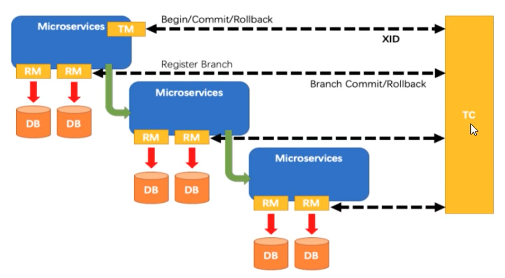

- TM向TC申请开启一个全局事务，全局事务创建成功并生成一个全局唯一的XID
- XID在微服务调用链路的上下文中传播
- RM向TC注册分支事务，将其纳入XID对应全局事务的管辖
- TM向TC发起针对XID的全局提交或回滚决议
- TM调度XID下管辖的全部分支事务完成提交或回滚请求

### 下载

地址：https://github.com/seata/seata/releases

下载 1.1版本完成后，修改conf目录下的file.conf配置文件

#### 修改file.conf

首先我们需要备份原始的file.conf文件

主要修改，自定义事务组名称 + 事务日志存储模式为db + 数据库连接信息，也就是修改存储的数据库

#### 修改service模块

修改服务模块中的分组

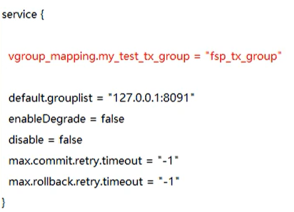

#### 修改store模块

修改存储模块

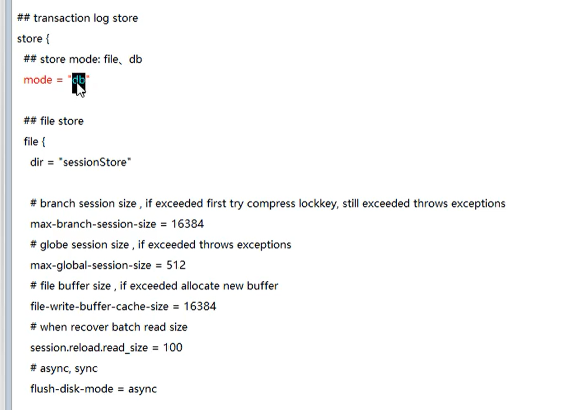

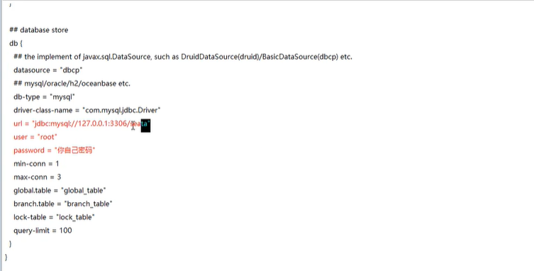

#### 创建一个seata数据库

在seata数据库中建表，建表语句在 seata/conf目录下的 db_store.sql

#### 修改seata-server的registry.conf配置文件


目的是：指明注册中心为nacos，及修改nacos连接信息

然后启动nacos 和 seata-server

### 怎么玩

- 本地：@Transaction 
- 全局：@GlobalTransaction

Spring自带的是 @Transaction 控制本地事务

而 @GlobalTransaction控制的是全局事务

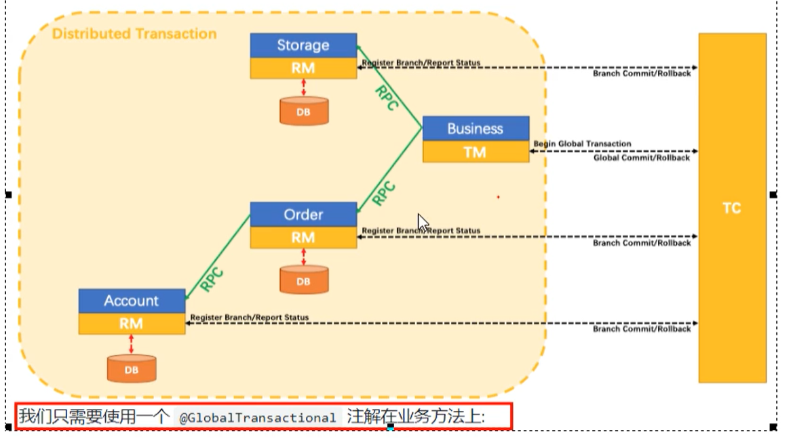

我们只需要在需要支持分布式事务的业务类上，使用该注解即可


## 订单/库存/账户业务微服务准备

在这之前首先需要先启动Nacos，然后启动Seata，保证两个都OK

### 分布式事务的业务说明

这里我们会创建三个微服务，一个订单服务，一个库存服务，一个账户服务。

当用户下单时，会在订单服务中创建一个订单，然后通过远程调用库存服务来扣减下单商品的库存，在通过远程调用账户服务来扣减用户账户里面的金额，最后在订单服务修改订单状态为已完成

该操作跨越了三个数据库，有两次远程调用，很明显会有分布式事务的问题。

一句话：下订单 -> 扣库存 -> 减余额

### 创建数据库

- seata_order：存储订单的数据库
- seata_storage：存储库存的数据库
- seata_account：存储账户信息的数据库

建库SQL

```
create database seata_order;
create database seata_storage;
create database seata_account;
```

### 建立业务表

- seata_order库下建立t_order表
- seata_storage库下建t_storage表
- seata_account库下建t_account表

```
DROP TABLE IF EXISTS `t_order`;
CREATE TABLE `t_order`  (
  `int` bigint(11) NOT NULL AUTO_INCREMENT,
  `user_id` bigint(20) DEFAULT NULL COMMENT '用户id',
  `product_id` bigint(11) DEFAULT NULL COMMENT '产品id',
  `count` int(11) DEFAULT NULL COMMENT '数量',
  `money` decimal(11, 0) DEFAULT NULL COMMENT '金额',
  `status` int(1) DEFAULT NULL COMMENT '订单状态:  0:创建中 1:已完结',
  PRIMARY KEY (`int`) USING BTREE
) ENGINE = InnoDB CHARACTER SET = utf8 COLLATE = utf8_general_ci COMMENT = '订单表' ROW_FORMAT = Dynamic;

DROP TABLE IF EXISTS `t_storage`;
CREATE TABLE `t_storage`  (
  `int` bigint(11) NOT NULL AUTO_INCREMENT,
  `product_id` bigint(11) DEFAULT NULL COMMENT '产品id',
  `total` int(11) DEFAULT NULL COMMENT '总库存',
  `used` int(11) DEFAULT NULL COMMENT '已用库存',
  `residue` int(11) DEFAULT NULL COMMENT '剩余库存',
  PRIMARY KEY (`int`) USING BTREE
) ENGINE = InnoDB CHARACTER SET = utf8 COLLATE = utf8_general_ci COMMENT = '库存' ROW_FORMAT = Dynamic;
INSERT INTO `t_storage` VALUES (1, 1, 100, 0, 100);

CREATE TABLE `t_account`  (
  `id` bigint(11) NOT NULL COMMENT 'id',
  `user_id` bigint(11) DEFAULT NULL COMMENT '用户id',
  `total` decimal(10, 0) DEFAULT NULL COMMENT '总额度',
  `used` decimal(10, 0) DEFAULT NULL COMMENT '已用余额',
  `residue` decimal(10, 0) DEFAULT NULL COMMENT '剩余可用额度',
  PRIMARY KEY (`id`) USING BTREE
) ENGINE = InnoDB CHARACTER SET = utf8 COLLATE = utf8_general_ci COMMENT = '账户表' ROW_FORMAT = Dynamic;
 
INSERT INTO `t_account` VALUES (1, 1, 1000, 0, 1000);
```

### 创建回滚日志表

订单 - 库存 - 账户 3个库都需要建各自的回滚日志表，目录在 db_undo_log.sql

```
-- the table to store seata xid data
-- 0.7.0+ add context
-- you must to init this sql for you business databese. the seata server not need it.
-- 此脚本必须初始化在你当前的业务数据库中，用于AT 模式XID记录。与server端无关（注：业务数据库）
-- 注意此处0.3.0+ 增加唯一索引 ux_undo_log
DROP TABLE `undo_log`;
CREATE TABLE `undo_log` (
  `id` BIGINT(20) NOT NULL AUTO_INCREMENT,
  `branch_id` BIGINT(20) NOT NULL,
  `xid` VARCHAR(100) NOT NULL,
  `context` VARCHAR(128) NOT NULL,
  `rollback_info` LONGBLOB NOT NULL,
  `log_status` INT(11) NOT NULL,
  `log_created` DATETIME NOT NULL,
  `log_modified` DATETIME NOT NULL,
  `ext` VARCHAR(100) DEFAULT NULL,
  PRIMARY KEY (`id`),
  UNIQUE KEY `ux_undo_log` (`xid`,`branch_id`)
) ENGINE=INNODB AUTO_INCREMENT=1 DEFAULT CHARSET=utf8;
```


## 订单/库存/账户业务微服务准备

### 业务需求

下订单 -> 减库存 -> 扣余额 -> 改（订单）状态

### 新建Order-Module表

#### 约定

entity，domain：相当于实体类层

vo：view object，value object

dto：前台传到后台的数据传输类

#### 新建module2001

#### 引入POM

```
		<!--seata-->
        <dependency>
            <groupId>com.alibaba.cloud</groupId>
            <artifactId>spring-cloud-starter-alibaba-seata</artifactId>
            <exclusions>
                <exclusion>
                    <artifactId>seata-all</artifactId>
                    <groupId>io.seata</groupId>
                </exclusion>
            </exclusions>
        </dependency>
        <dependency>
            <groupId>io.seata</groupId>
            <artifactId>seata-all</artifactId>
            <version>0.9.0</version>
        </dependency>
```

#### 修改yml

```
server:
  port: 2001

spring:
  application:
    name: seata-order-service
  cloud:
    alibaba:
      seata:
        #自定义事务组名称需要与seata-server中的对应
        tx-service-group: fsp_tx_group
    nacos:
      discovery:
        server-addr: localhost:8848
  datasource:
    driver-class-name: com.mysql.jdbc.Driver
    url: jdbc:mysql://localhost:3306/seata_order
    username: root
    password: 123456

feign:
  hystrix:
    enabled: false

logging:
  level:
    io:
      seata: info

mybatis:
  mapperLocations: classpath:mapper/*.xml
```

#### 增加file.conf

在resources目录下，创建file.conf文件

```
transport {
  # tcp udt unix-domain-socket
  type = "TCP"
  #NIO NATIVE
  server = "NIO"
  #enable heartbeat
  heartbeat = true
  #thread factory for netty
  thread-factory {
    boss-thread-prefix = "NettyBoss"
    worker-thread-prefix = "NettyServerNIOWorker"
    server-executor-thread-prefix = "NettyServerBizHandler"
    share-boss-worker = false
    client-selector-thread-prefix = "NettyClientSelector"
    client-selector-thread-size = 1
    client-worker-thread-prefix = "NettyClientWorkerThread"
    # netty boss thread size,will not be used for UDT
    boss-thread-size = 1
    #auto default pin or 8
    worker-thread-size = 8
  }
  shutdown {
    # when destroy server, wait seconds
    wait = 3
  }
  serialization = "seata"
  compressor = "none"
}

service {

  vgroup_mapping.fsp_tx_group = "default" #修改自定义事务组名称

  default.grouplist = "127.0.0.1:8091"
  enableDegrade = false
  disable = false
  max.commit.retry.timeout = "-1"
  max.rollback.retry.timeout = "-1"
  disableGlobalTransaction = false
}


client {
  async.commit.buffer.limit = 10000
  lock {
    retry.internal = 10
    retry.times = 30
  }
  report.retry.count = 5
  tm.commit.retry.count = 1
  tm.rollback.retry.count = 1
}

## transaction log store
store {
  ## store mode: file、db
  mode = "db"

  ## file store
  file {
    dir = "sessionStore"

    # branch session size , if exceeded first try compress lockkey, still exceeded throws exceptions
    max-branch-session-size = 16384
    # globe session size , if exceeded throws exceptions
    max-global-session-size = 512
    # file buffer size , if exceeded allocate new buffer
    file-write-buffer-cache-size = 16384
    # when recover batch read size
    session.reload.read_size = 100
    # async, sync
    flush-disk-mode = async
  }

  ## database store
  db {
    ## the implement of javax.sql.DataSource, such as DruidDataSource(druid)/BasicDataSource(dbcp) etc.
    datasource = "dbcp"
    ## mysql/oracle/h2/oceanbase etc.
    db-type = "mysql"
    driver-class-name = "com.mysql.jdbc.Driver"
    url = "jdbc:mysql://127.0.0.1:3306/seata"
    user = "root"
    password = "123456"
    min-conn = 1
    max-conn = 3
    global.table = "global_table"
    branch.table = "branch_table"
    lock-table = "lock_table"
    query-limit = 100
  }
}
lock {
  ## the lock store mode: local、remote
  mode = "remote"

  local {
    ## store locks in user's database
  }

  remote {
    ## store locks in the seata's server
  }
}
recovery {
  #schedule committing retry period in milliseconds
  committing-retry-period = 1000
  #schedule asyn committing retry period in milliseconds
  asyn-committing-retry-period = 1000
  #schedule rollbacking retry period in milliseconds
  rollbacking-retry-period = 1000
  #schedule timeout retry period in milliseconds
  timeout-retry-period = 1000
}

transaction {
  undo.data.validation = true
  undo.log.serialization = "jackson"
  undo.log.save.days = 7
  #schedule delete expired undo_log in milliseconds
  undo.log.delete.period = 86400000
  undo.log.table = "undo_log"
}

## metrics settings
metrics {
  enabled = false
  registry-type = "compact"
  # multi exporters use comma divided
  exporter-list = "prometheus"
  exporter-prometheus-port = 9898
}

support {
  ## spring
  spring {
    # auto proxy the DataSource bean
    datasource.autoproxy = false
  }
}
```

#### registry.conf 注册器

```
registry {
  # file 、nacos 、eureka、redis、zk、consul、etcd3、sofa
  type = "nacos"

  nacos {
    serverAddr = "localhost:8848"
    namespace = ""
    cluster = "default"
  }
  eureka {
    serviceUrl = "http://localhost:8761/eureka"
    application = "default"
    weight = "1"
  }
  redis {
    serverAddr = "localhost:6379"
    db = "0"
  }
  zk {
    cluster = "default"
    serverAddr = "127.0.0.1:2181"
    session.timeout = 6000
    connect.timeout = 2000
  }
  consul {
    cluster = "default"
    serverAddr = "127.0.0.1:8500"
  }
  etcd3 {
    cluster = "default"
    serverAddr = "http://localhost:2379"
  }
  sofa {
    serverAddr = "127.0.0.1:9603"
    application = "default"
    region = "DEFAULT_ZONE"
    datacenter = "DefaultDataCenter"
    cluster = "default"
    group = "SEATA_GROUP"
    addressWaitTime = "3000"
  }
  file {
    name = "file.conf"
  }
}

config {
  # file、nacos 、apollo、zk、consul、etcd3
  type = "file"

  nacos {
    serverAddr = "localhost"
    namespace = ""
  }
  consul {
    serverAddr = "127.0.0.1:8500"
  }
  apollo {
    app.id = "seata-server"
    apollo.meta = "http://192.168.1.204:8801"
  }
  zk {
    serverAddr = "127.0.0.1:2181"
    session.timeout = 6000
    connect.timeout = 2000
  }
  etcd3 {
    serverAddr = "http://localhost:2379"
  }
  file {
    name = "file.conf"
  }
}
```

#### domain

```
@Data
@AllArgsConstructor
@NoArgsConstructor
public class CommonResult<T>
{
    private Integer code;
    private String  message;
    private T       data;

    public CommonResult(Integer code, String message)
    {
        this(code,message,null);
    }
}


@Data
@AllArgsConstructor
@NoArgsConstructor
public class Order
{
    private Long id;

    private Long userId;

    private Long productId;

    private Integer count;

    private BigDecimal money;

    private Integer status; //订单状态：0：创建中；1：已完结
}
```

#### Dao接口及实现

```
@Mapper
public interface OrderDao
{
    //1 新建订单
    void create(Order order);

    //2 修改订单状态，从零改为1
    void update(@Param("userId") Long userId,@Param("status") Integer status);
}
```

```
<?xml version="1.0" encoding="UTF-8" ?>
<!DOCTYPE mapper PUBLIC "-//mybatis.org//DTD Mapper 3.0//EN" "http://mybatis.org/dtd/mybatis-3-mapper.dtd" >

<mapper namespace="com.atguigu.springcloud.alibaba.dao.OrderDao">

    <resultMap id="BaseResultMap" type="com.atguigu.springcloud.alibaba.domain.Order">
        <id column="id" property="id" jdbcType="BIGINT"/>
        <result column="user_id" property="userId" jdbcType="BIGINT"/>
        <result column="product_id" property="productId" jdbcType="BIGINT"/>
        <result column="count" property="count" jdbcType="INTEGER"/>
        <result column="money" property="money" jdbcType="DECIMAL"/>
        <result column="status" property="status" jdbcType="INTEGER"/>
    </resultMap>

    <insert id="create">
        insert into t_order (id,user_id,product_id,count,money,status)
        values (null,#{userId},#{productId},#{count},#{money},0);
    </insert>

    <update id="update">
        update t_order set status = 1
        where user_id=#{userId} and status = #{status};
    </update>

</mapper>
```

#### Service实现类

OrderService接口

```
public interface OrderService
{
    void create(Order order);
}
```

StorageService的Feign接口，

```
@FeignClient(value = "seata-storage-service")
public interface StorageService
{
    @PostMapping(value = "/storage/decrease")
    CommonResult decrease(@RequestParam("productId") Long productId, @RequestParam("count") Integer count);
}
```

AccountService的Feign接口，账户接口

```
@FeignClient(value = "seata-account-service")
public interface AccountService
{
    @PostMapping(value = "/account/decrease")
    CommonResult decrease(@RequestParam("userId") Long userId, @RequestParam("money") BigDecimal money);
}
```


OrderServiceImpl实现类

```
@Service
@Slf4j
public class OrderServiceImpl implements OrderService
{
    @Resource
    private OrderDao orderDao;
    @Resource
    private StorageService storageService;
    @Resource
    private AccountService accountService;

    /**
     * 创建订单->调用库存服务扣减库存->调用账户服务扣减账户余额->修改订单状态
     * 简单说：下订单->扣库存->减余额->改状态
     */
    @Override
    @GlobalTransactional(name = "fsp-create-order",rollbackFor = Exception.class)
    public void create(Order order)
    {
        log.info("----->开始新建订单");
        //1 新建订单
        orderDao.create(order);

        //2 扣减库存
        log.info("----->订单微服务开始调用库存，做扣减Count");
        storageService.decrease(order.getProductId(),order.getCount());
        log.info("----->订单微服务开始调用库存，做扣减end");

        //3 扣减账户
        log.info("----->订单微服务开始调用账户，做扣减Money");
        accountService.decrease(order.getUserId(),order.getMoney());
        log.info("----->订单微服务开始调用账户，做扣减end");

        //4 修改订单状态，从零到1,1代表已经完成
        log.info("----->修改订单状态开始");
        orderDao.update(order.getUserId(),0);
        log.info("----->修改订单状态结束");

        log.info("----->下订单结束了，O(∩_∩)O哈哈~");

    }
}
```

#### 业务类

```
@RestController
public class OrderController
{
    @Resource
    private OrderService orderService;


    @GetMapping("/order/create")
    public CommonResult create(Order order)
    {
        orderService.create(order);
        return new CommonResult(200,"订单创建成功");
    }
}
```

#### Config配置

Mybatis DataSourceProxyConfig配置，这里是使用Seata对数据源进行代理

```
@Configuration
public class DataSourceProxyConfig {

    @Value("${mybatis.mapperLocations}")
    private String mapperLocations;

    @Bean
    @ConfigurationProperties(prefix = "spring.datasource")
    public DataSource druidDataSource(){
        return new DruidDataSource();
    }

    @Bean
    public DataSourceProxy dataSourceProxy(DataSource dataSource) {
        return new DataSourceProxy(dataSource);
    }

    @Bean
    public SqlSessionFactory sqlSessionFactoryBean(DataSourceProxy dataSourceProxy) throws Exception {
        SqlSessionFactoryBean sqlSessionFactoryBean = new SqlSessionFactoryBean();
        sqlSessionFactoryBean.setDataSource(dataSourceProxy);
        sqlSessionFactoryBean.setMapperLocations(new PathMatchingResourcePatternResolver().getResources(mapperLocations));
        sqlSessionFactoryBean.setTransactionFactory(new SpringManagedTransactionFactory());
        return sqlSessionFactoryBean.getObject();
    }

}
```

Mybatis配置

```
@Configuration
@MapperScan({"com.atguigu.springcloud.alibaba.dao"})
public class MyBatisConfig {
}
```

#### 启动类

```
@EnableDiscoveryClient
@EnableFeignClients
@SpringBootApplication(exclude = DataSourceAutoConfiguration.class)//取消数据源的自动创建
public class SeataOrderMainApp2001
{

    public static void main(String[] args)
    {
        SpringApplication.run(SeataOrderMainApp2001.class, args);
    }
}
```

### 新建Storage-Module

参考项目：seata-storage-service2002

### 新建账户Account-Module

参考项目：seata-account-service2003

### 测试

#### 数据库初始情况

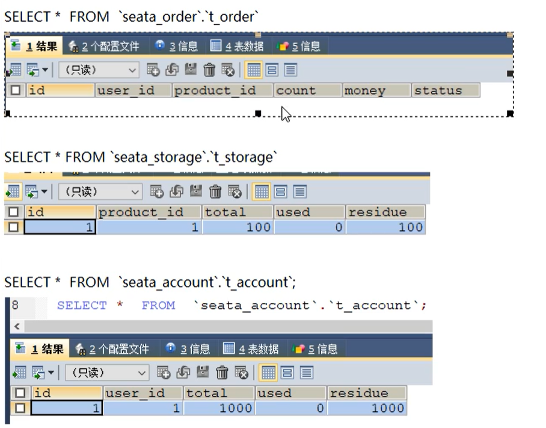

#### 正常下单

访问

```
http://localhost:2001/order/create?userId=1&productId=1&count=10&money=100
```


#### 超时异常，没加@GlobalTransaction

我们在account-module模块，添加睡眠时间20秒，因为openFeign默认时间是1秒

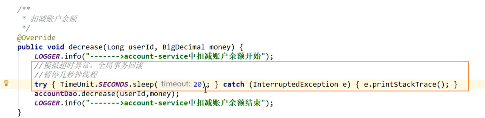

出现了数据不一致的问题

故障情况

- 当库存和账户金额扣减后，订单状态并没有设置成已经完成，没有从零改成1
- 而且由于Feign的重试机制，账户余额还有可能被多次扣除

#### 超时异常，添加@GlobalTransaction

```
@GlobalTransactional(name = "fsp-create-order",rollbackFor = Exception.class)
```

rollbackFor表示，什么什么错误就会回滚

添加这个后，发现下单后的数据库并没有改变，记录都添加不进来


## 一部分补充

### Seata

2019年1月份，蚂蚁金服和阿里巴巴共同开源的分布式事务解决方案

Seata：Simple Extensible Autonomous Transaction Architecture，简单可扩展自治事务框架

2020起始，参加工作以后用1.0以后的版本。

### 再看TC/TM/RM三大组件

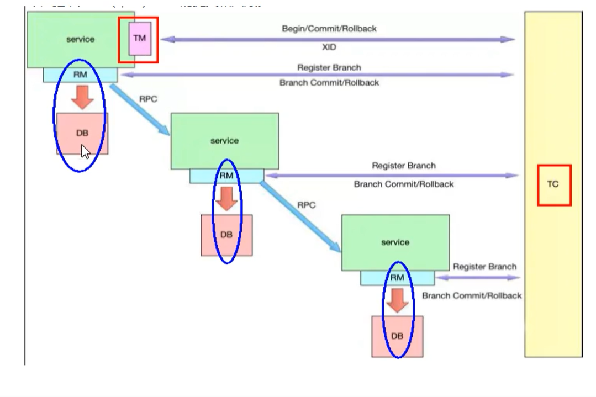

什么是TC，TM，RM

TC：seata服务器

TM：带有@GlobalTransaction注解的方法

RM：数据库，也就是事务参与方

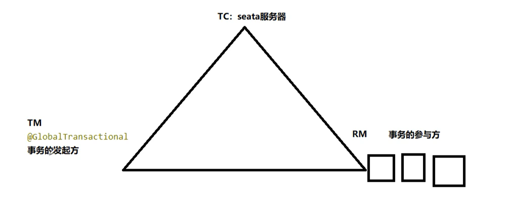

### 分布式事务的执行流程

- TM开启分布式事务（TM向TC注册全局事务记录），相当于注解 `@GlobelTransaction`注解
- 按业务场景，编排数据库，服务等事务内部资源（RM向TC汇报资源准备状态）
- TM结束分布式事务，事务一阶段结束（TM通知TC提交、回滚分布式事务）
- TC汇总事务信息，决定分布式事务是提交还是回滚
- TC通知所有RM提交、回滚资源，事务二阶段结束

### AT模式如何做到对业务的无侵入

默认AT模式，阿里云GTS

### AT模式

#### 前提

- 基于支持本地ACID事务的关系型数据库
- Java应用，通过JDBC访问数据库

#### 整体机制

两阶段提交协议的演变

- 一阶段：业务数据和回滚日志记录在同一个本地事务中提交，释放本地锁和连接资源
- 二阶段
  - 提交异步化，非常快速的完成
  - 回滚通过一阶段的回滚日志进行反向补偿

#### 一阶段加载

在一阶段，Seata会拦截 业务SQL

- 解析SQL语义，找到业务SQL，要更新的业务数据，在业务数据被更新前，将其保存成 `before image（前置镜像）`
- 执行业务SQL更新业务数据，在业务数据更新之后
- 将其保存成 after image，最后生成行锁

以上操作全部在一个数据库事务内完成，这样保证了一阶段操作的原子性

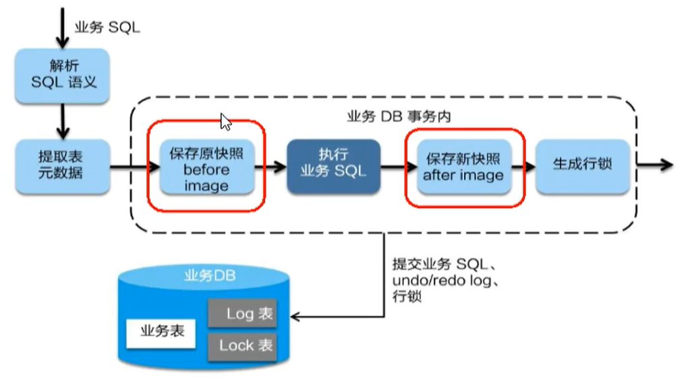

#### 二阶段提交

二阶段如果顺利提交的话，因为业务SQL在一阶段已经提交至数据库，所以Seata框架只需将一阶段保存的快照和行锁删除掉，完成数据清理即可

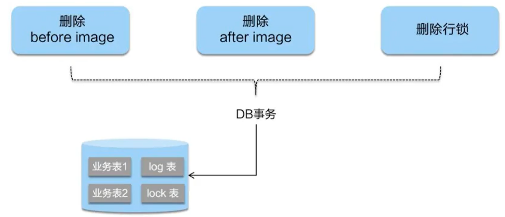

#### 二阶段回滚

二阶段如果回滚的话，Seata就需要回滚到一阶段已经执行的 业务SQL，还原业务数据

回滚方式便是用 before image 还原业务数据，但是在还原前要首先校验脏写，对比数据库当前业务数据 和after image，如果两份数据完全一致，没有脏写，可以还原业务数据，如果不一致说明有脏读，出现脏读就需要转人工处理

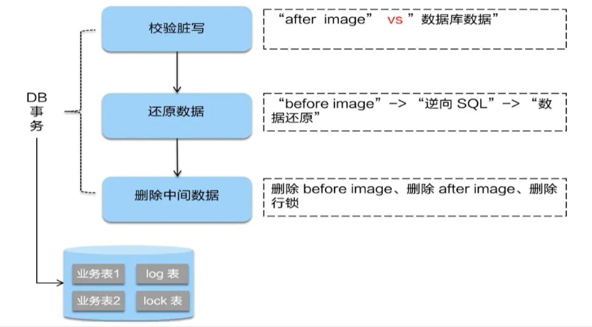

#### 总结

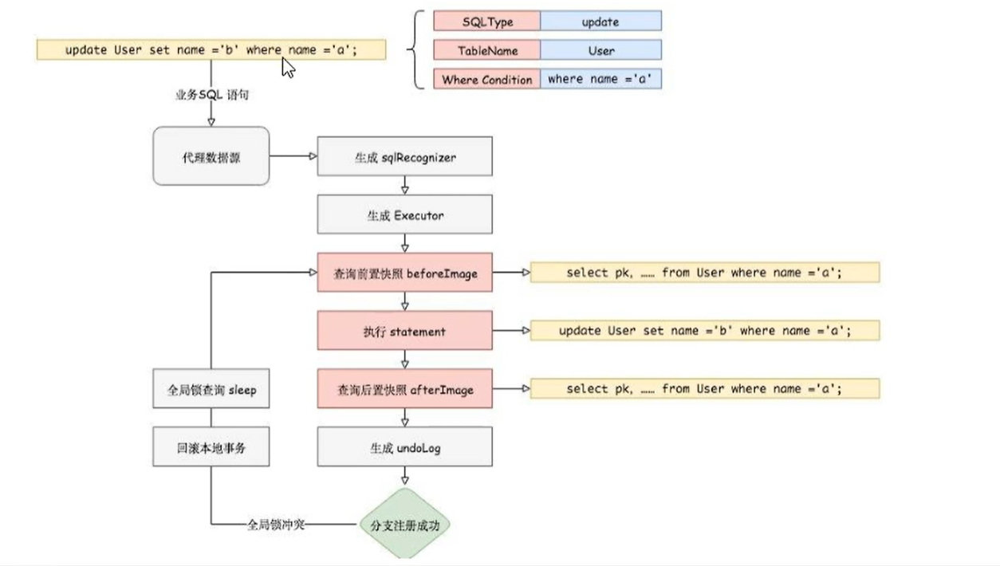