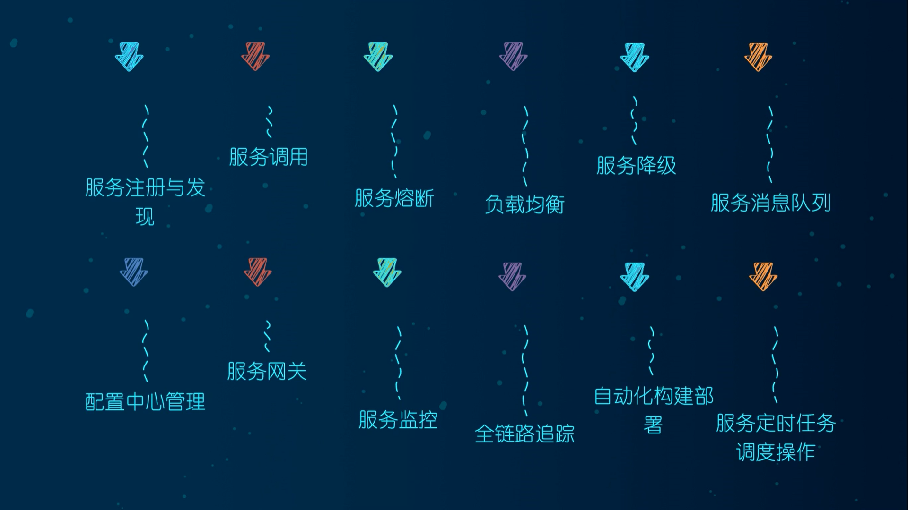
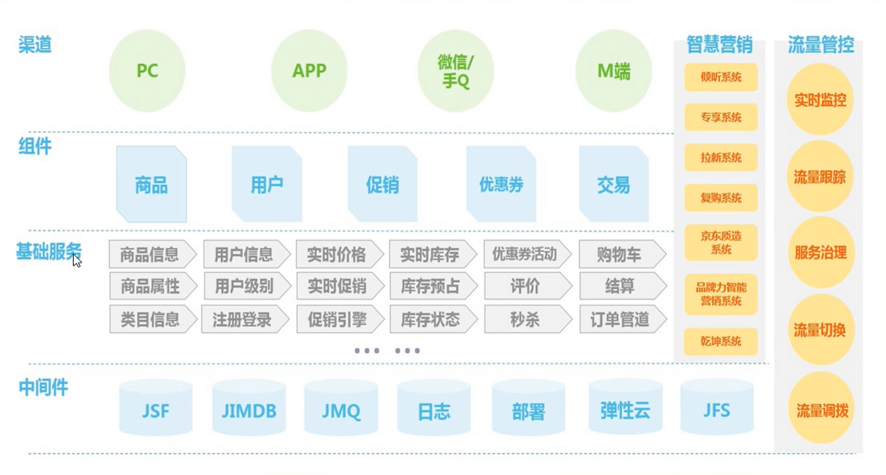
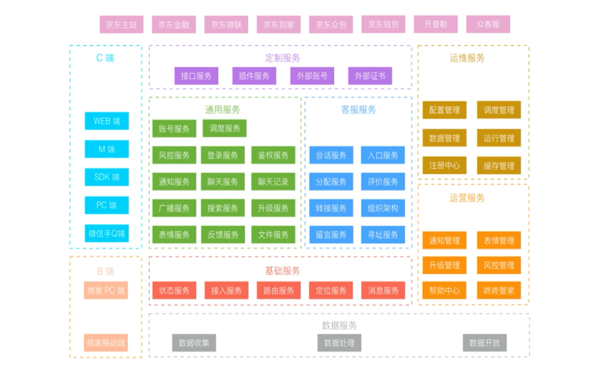
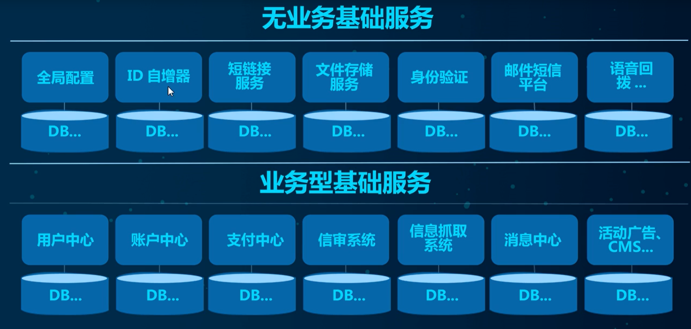
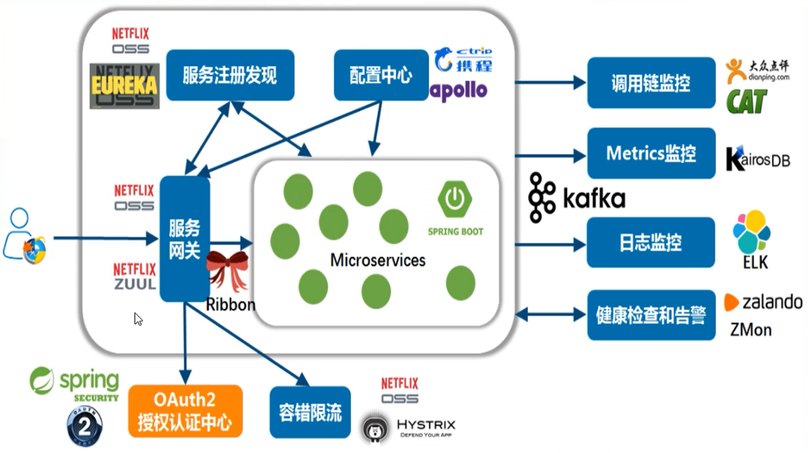
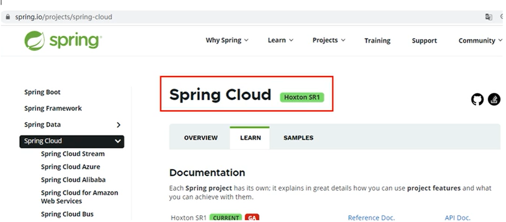
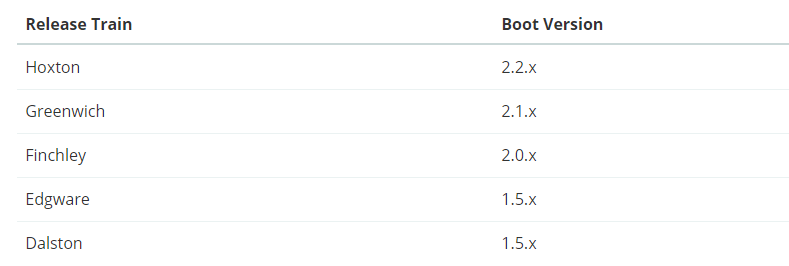

# 微服务

## 谈谈你对微服务的理解

微服务架构下的一整套解决方案

- 服务注册与发现
- 服务调用
- 服务熔断
- 负载均衡
- 服务降级
- 服务消息队列
- 配置中心
- 服务网关
- 服务监控
- 全链路追踪
- 自动化构建部署
- 服务定时任务调度操作

## Spring Cloud

分布式微服务架构的一站式解决方案，是多种微服务架构落地技术的集合体，俗称微服务全家桶

下面一张图是京东的促销架构

阿里的架构图：

京东物流的架构图：

基础服务：

## Spring Cloud技术栈

这是原来2020年以前的微服务方案

但是随着Eureka等组件的闭源，后续的一些解决方案也有了新的替换产品

## Spring Cloud版本选型

### SpringBoot2.X版 和 SpringCloud H版

SpringBoot官方已经强烈推荐 2.X版

SpringCloud采用英国伦敦地铁站的名称来命名，并由地铁站名称字母A-Z一次类推的形式发布迭代版本

SpringCloud是由许多子项目组成的综合项目，各子项目有不同的发布节奏，为了管理SpringCloud与各子项目的版本依赖关系，发布了一个清单，其中包括了某个SpringCloud版对应的子项目版本，为了避免SpringCloud版本号与子项目版本号混淆，SpringCloud版采用了名称而非版本号命名。例如Angel，Brixton。当SpringCloud的发布内容积累到临界点或者一个重大BUG被解决后，会发布一个Service releases版本，俗称SRX版本，比如 Greenwich.SR2就是SpringCloud发布的Greenwich版本的第二个SRX版本

## SpringBoot和SpringCloud版本约束

SpringBoot和SpringCloud的版本选择也不是任意的，而是应该参考官网的约束配置

地址：`https://spring.io/projects/spring-cloud`

版本对应：`https://start.spring.io/actuator/info`

## 关于Cloud各种组件的停更/升级/替换

### 停更引发的升级惨案

- 被动修复Bugs
- 不再接受合并请求
- 不再发布新版本

### 明细条目

- 服务调用
  - Eureka
  - Zookeeper
  - Consul
  - Nacos （推荐）
- 服务调用
  - Feign
  - OpenFeign  （推荐）
  - Ribbon
  - LoadBalancer
- 服务降级
  - Hystrix   
  - resilience4j
  - sentienl （推荐）
- 服务网关
  - Zuul
  - Zuul2
  - Gateway（推荐）
- 服务配置
  - Config
  - Nacos（推荐）
- 服务总线
  - Bus
  - Nacos（推荐）