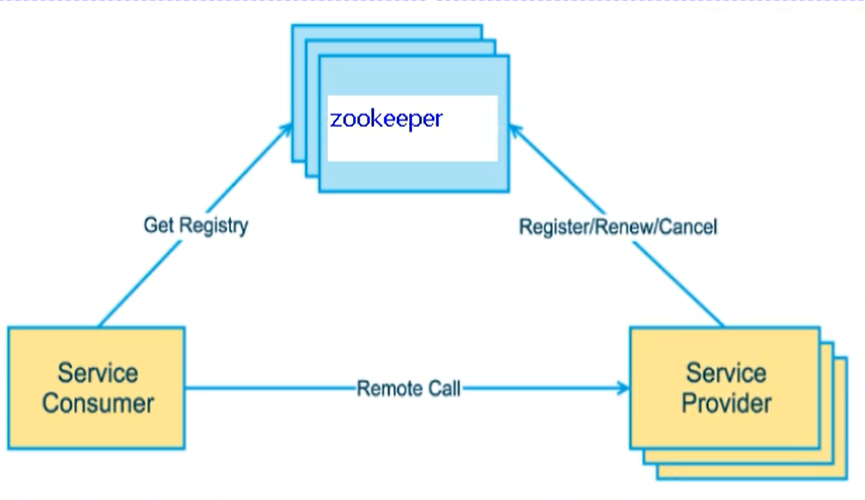
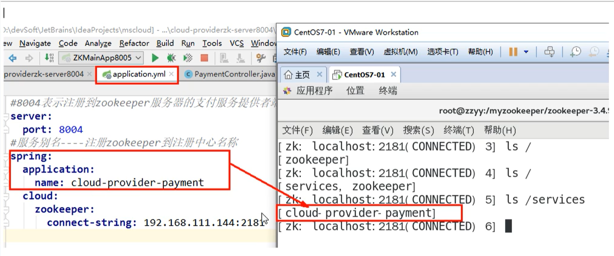
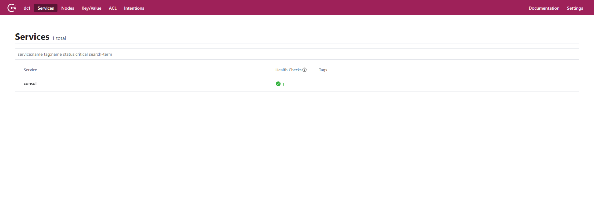
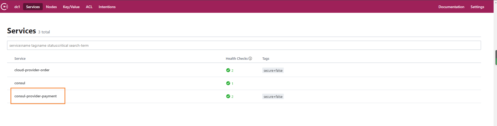
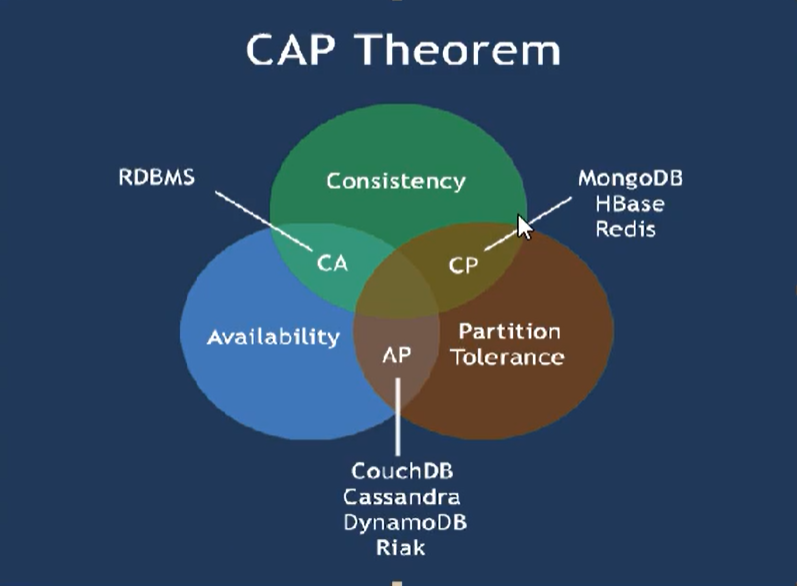
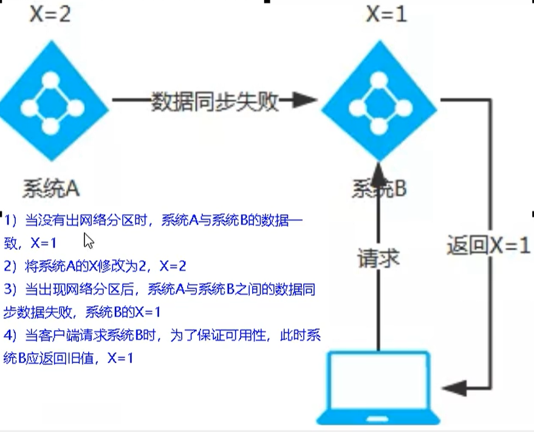
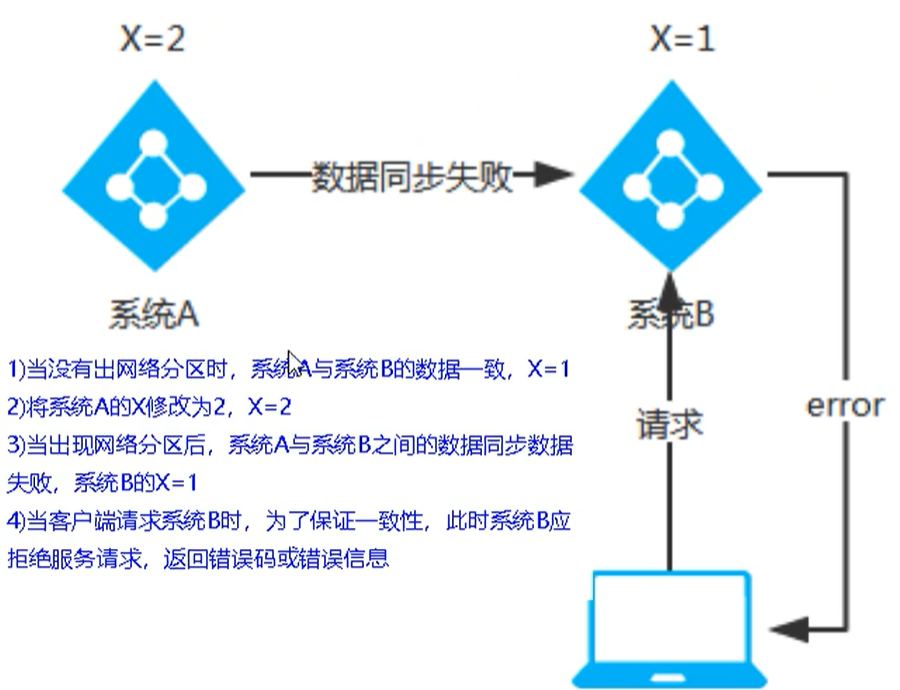

# Eureka停更后的替换

## Zookeeper替换Eureka



### Zookeeper是什么

Zookeeper是一个分布式协调工具，可以实现注册中心功能

关闭Linux服务器防火墙后，启动Zookeeper服务器，Zookeeper服务器取代Eureka服务器，zk作为服务注册中心。

### 搭建Zookeeper注册中心

#### 引入依赖

```
        <!--zookeeper客户端-->
        <dependency>
            <groupId>org.springframework.cloud</groupId>
            <artifactId>spring-cloud-starter-zookeeper-discovery</artifactId>
            <!--先排除自带的zookeeper3.5.3-->
            <exclusions>
                <exclusion>
                    <groupId>org.apache.zookeeper</groupId>
                    <artifactId>zookeeper</artifactId>
                </exclusion>
            </exclusions>
        </dependency>
        <dependency>
            <groupId>org.apache.zookeeper</groupId>
            <artifactId>zookeeper</artifactId>
            <version>3.4.9</version>
        </dependency>
```

#### 修改配置文件

连接上Zookeeper客户端

```
spring:
  application:
    name: cloud-provider-payment
  cloud:
    zookeeper:
      connect-string: 180.76.99.142:2181
```

#### 修改主启动类

使用`@EnableDiscoveryClient` 注解

```
@SpringBootApplication
@EnableDiscoveryClient
public class PaymentMain8004 {
    public static void main(String[] args) {
        SpringApplication.run(PaymentMain8004.class);
    }
}
```

#### 启动

启动成功后，把服务注册进Zookeeper客户端



#### 思考

服务已经成功注册到Zookeeper客户端，那么注册上去的节点被称为临时节点，还是持久节点？

首先Eureka有自我保护机制，也就是某个服务下线后，不会立刻清除该服务，而是将服务保留一段时间

Zookeeper也一样在服务下线后，会等待一段时间后，也会把该节点删除，这就说明Zookeeper上的节点是临时节点。


## Consul替换Eureka

### 简介

官网：`https://www.consul.io/`

Consul是一套开源的分布式服务发现和配置管理系统，由HashiCorp公司用Go语言开发

提供了微服务系统中的服务治理、配置中心、控制总线等功能，这些功能中的每一个都可以根据需要单独使用，也可以一起使用构建全方位的服务网路，总之Consul提供了一种完整的服务网络解决方案。

它具有很多优点，包括：基于raft协议，比较简洁；支持健康检查，同时支持HTTP和DNS协议，支持跨数据中心的WAN集群，提供图形化界面，跨平台，支持Linux，MAC，Windows

### 功能

- 服务发现：提供HTTP和DNS两种发现方式
- 健康监测：支持多种方法，HTTP，TCP，Docker，Shell脚本定制化
- KV存储：Key，Value的存储方式
- 多数据中心：Consul支持多数据中心
- 可视化Web界面

### 安装

官网：`https://www.consul.io/downloads.html`

- 查看版本：`consul --version`

- 运行：`consul agent -dev`

运行成功后，然后访问 `http://localhost:8500`，进入consul的可视化界面



### 服务提供者注册Consul

引入依赖

```
<!--consul-->
<dependency>
    <groupId>org.springframework.cloud</groupId>
    <artifactId>spring-cloud-starter-consul-discovery</artifactId>
</dependency>
```

修改yml

```
#consul服务端口号
server:
  port: 8006
spring:
  application:
    name: consul-provider-payment
#consul注册中心地址
  cloud:
    consul:
      host: localhost
      port: 8500
      discovery:
        service-name: ${spring.application.name}
```

然后启动项目，即可发现服务提供者已经注册到Consul中了




## 总结

| 组件名    | 语言 | 健康检查 | 对外暴露接口 | CAP  | Spring Clou集成 |
| --------- | ---- | -------- | ------------ | ---- | --------------- |
| Eureka    | Java | 可配支持 | HTTP         | AP   | 已集成          |
| Consul    | Go   | 支持     | HTTP/DNS     | CP   | 已集成          |
| Zookeeper | Java | 支持     | 客户端       | CP   | 已集成          |

### CAP理论

Availability：高可用

Consistency：强一致性

Partition Tolerance：分区容错性

CAP理论关注粒度是数据，而不是整体系统设计的策略

因此现在的微服务架构要么是 CP 要么是 AP，也就是P一定需要保证，最多只能较好的同时满足两个

CAP理论的核心：一个分布式系统不可能同时很好的满足：一致性，可用性和分区容错性这个三个需求

因此，根据CAP原理将NoSQL数据库分成了满足CA原则，满足CP原则，满足AP的三大类

- CA：单点集群，满足一致性，可用性的系统，通常在可扩展性上不太满足
- CP：满足一致性，分区容忍性，通常性能不是特别高
- AP：满足可用性，分区容忍性，通常对一致性要求低一些




部分情况下，我们对数据一致性的要求没有这么高，比如蘑菇博客的点赞和浏览记录，都是每隔一段时间才写入数据库的。

### AP架构

Eureka是AP架构



因为同步原因出现问题，而造成数据没有一致性

当出现网络分区后，为了保证高可用，系统B可以返回旧值，保证系统的可用性

结论：违背了一致性C的要求，只满足可用性和分区容错性，即AP

### CP架构

Zookeeper和Consul是CP架构



当出现网络分区后，为了保证一致性，就必须拒绝请求，否者无法保证一致性

结论：违背了可用性A的要求，只满足一致性和分区容错性，即CP