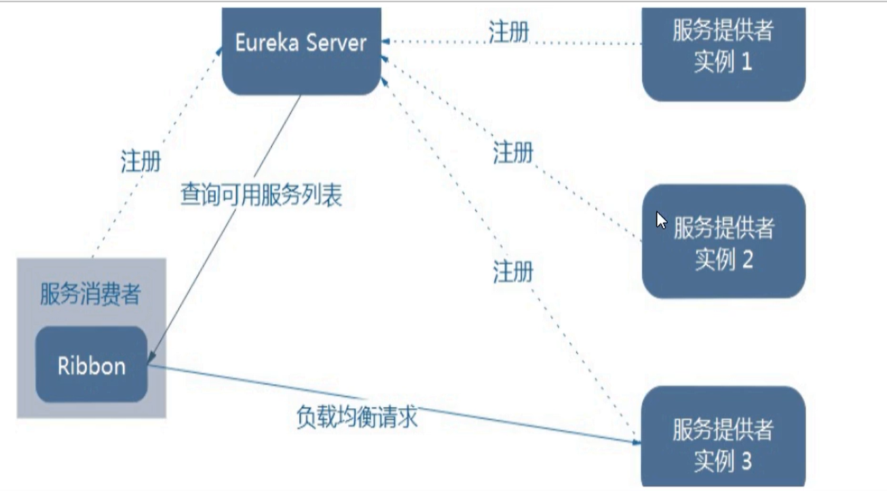
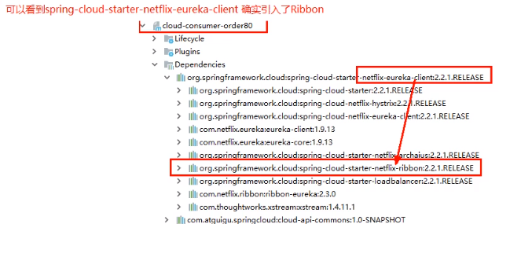
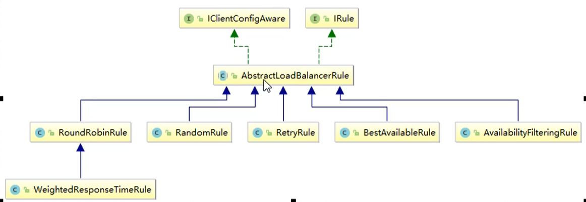
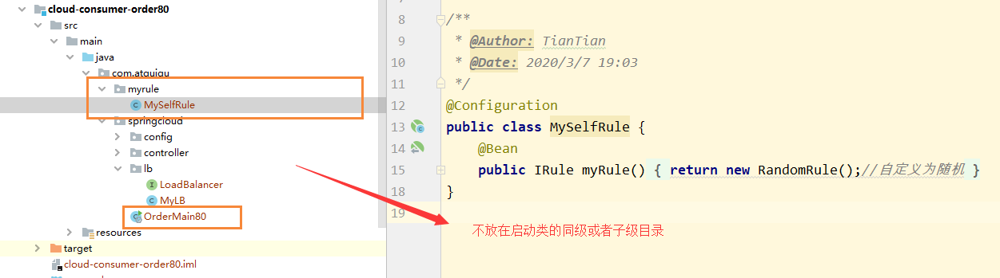
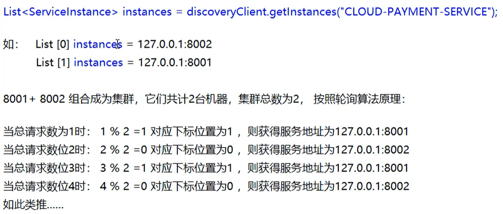

# Ribbon实现负载均衡

Ribbon目前已经进入了维护模式，但是目前主流还是使用Ribbon

Spring Cloud想通过LoadBalancer用于替换Ribbon

## 概念

Spring Cloud Ribbon是基于Netflix Ribbon实现的一套客户端，负载均衡的工具

简单的说，Ribbon是NetFlix发布的开源项目，主要功能是提供客户端的软件负载均衡算法和服务调用。Ribbon客户端组件提供了一系列完善的配置项如连接超时，重试等。简单的说，就是在配置文件中列出Load Balancer（简称LB）后面所有的机器，Ribbon会自动的帮助你基于某种规则（如简单轮询，随机连接等）去连接这些机器。我们很容易使用Ribbon实现自定义的负载均衡算法。

## LB负载均衡是什么

Load Balance，简单来说就是将用户的请求平摊的分配到多个服务上，从而达到系统的HA（高可用）。常见的负载均衡有软件Nginx，LVS，硬件F5等。

- 集中式LB：即在服务的消费方和提供方之间使用独立的LB设施（可以是硬件，如F5，也可以是软件，如Nginx），由该设施负责把访问请求通过某种策略转发至服务的提供方
- 进程内LB：将LB逻辑集成到消费方，消费方从服务注册中心获知有哪些地址可用，然后自己再从这些地址中选择出一个合适的服务器。Ribbon就属于进程内LB，它只是一个类库，集成于消费方进程，消费方通过它来获取到服务提供方的地址。

## Ribbon本地负载均衡客户端 VS Nginx服务端负载均衡

Nginx是服务器负载均衡，客户端所有的请求都会交给nginx，然后由nginx实现转发请求，即负载均衡是由服务端实现的。

Ribbon本地负载均衡，在调用微服务接口的时候，会在注册中心上获取注册信息服务列表之后，缓存到JVM本地，从而在本地实现RPC远程调用的技术。

一句话就是：RIbbon = 负载均衡 + RestTemplate调用

## Ribbon工作原理

Ribbon其实就是一个软负载均衡的客户端组件，它可以和其它所需请求的客户端结合使用，和Eureka结合只是其中的一个实例。



Ribbon在工作时分成两步

- 首先先选择EurekaServer，它优先选择在同一个区域内负载较少的Server
- 再根据用户的指定的策略，从Server取到服务注册列表中选择一个地址
- 其中Ribbon提供了多种策略：比如轮询，随机和根据响应时间加权

## 引入Ribbon

新版的Eureka已经默认引入Ribbon了，不需要额外引入

```
<!--Eureka客户端-->
<dependency>
    <groupId>org.springframework.cloud</groupId>
    <artifactId>spring-cloud-starter-netflix-eureka-client</artifactId>
</dependency>
```



## RestTemplate

主要方法为：

- reseTemplate.getForObject
- reseTemplate.posttForObject

```
    @GetMapping("/consumer/payment/create")
    public CommonResult<Payment> create(Payment payment) {
        return restTemplate.postForObject(PAYMENT_URL + "/payment/create", payment, CommonResult.class);
    }

    @GetMapping("/consumer/payment/get/{id}")
    public CommonResult<Payment> getPayment(@PathVariable("id") Long id) {
        return restTemplate.getForObject(PAYMENT_URL + "/payment/get/" + id, CommonResult.class);
    }
    @GetMapping("/consumer/payment/getForEntity/{id}")
    public CommonResult<Payment> getForEntity(@PathVariable("id") Long id) {
        ResponseEntity<CommonResult> entity = restTemplate.getForEntity(PAYMENT_URL + "/payment/get/" + id, CommonResult.class);
        if (entity.getStatusCode().is2xxSuccessful()){
            return entity.getBody();
        }else {
            return new CommonResult<>(444,"操作失败");
        }
    }
```


## Ribbon核心组件IRule

Ribbon默认是使用轮询作为负载均衡算法

IRule根据特定算法从服务列表中选取一个要访问的服务，IRule是一个接口

```
public interface IRule {
    Server choose(Object var1);

    void setLoadBalancer(ILoadBalancer var1);

    ILoadBalancer getLoadBalancer();
}
```

然后对该接口，进行特定的实现




### 负载均衡算法

IRule的实现主要有以下七种

- RoundRobinRule：轮询
- RandomRule：随机
- RetryRUle：先按照RoundRobinRule的策略获取服务，如果获取服务失败则在指定时间内会进行重试，获取可用服务
- WeightedResponseTimeRule：对RoundRobinRule的扩展，响应速度越快的实例选择的权重越大，越容易被选择
- BestAvailableRule：会先过滤掉由于多次访问故障而处于短路跳闸状态的服务，然后选择一个并发量最小的服务
- AvailabilityFilteringRule：先过滤掉故障实例，在选择并发较小的实例
- ZoneAvoidanceRule：默认规则，符合判断server所在区域的性能和server的可用性选择服务器

### 默认负载均衡算法替换

官网警告：自定义的配置类不能放在@ComponentScanner所扫描的当前包下以及子包下，否者我们自定义的这个配置类就会被所有的Ribbon客户端所共享，达不到特殊化定制的目的了



然后我们创建自定义Rule接口

```
@Configuration
public class MySelfRule {
    @Bean
    public IRule myRule(){
        return new RandomRule();//自定义为随机
    }
}
```

在主启动类中，添加`@RibbonClient`

```
@SpringBootApplication
@EnableDiscoveryClient
@RibbonClient(name="CLOUD-PAYMENT-SERVICE",configuration = MySelfRule.class)
public class OrderMain80 {
    public static void main(String[] args) {
        SpringApplication.run(OrderMain80.class,args);
    }
}
```

## 手写Ribbon负载均衡算法

### 原理

负载均衡算法：rest接口第几次请求数 % 服务器集群总数量 = 实际调用服务器位置下标，每次服务重启后rest接口计数从1开始。

```
假设现在有2台机器，同时 List = 2 instance（也就是服务注册列表中，有两台）
1 % 2 = 1 -> index = list.get(1)

2 % 2 = 0 -> index = list.get(0)

3 % 2 = 1 -> index = list.get(1)

....
```

这就是轮询的原理，即



### 源码

我们查看RandomRule的源码发现，其实内部就是利用的取余的技术，同时为了保证同步机制，还是使用了AtomicInteger原子整型类

```
public class RandomRule extends AbstractLoadBalancerRule {
    public RandomRule() {
    }

    @SuppressWarnings({"RCN_REDUNDANT_NULLCHECK_OF_NULL_VALUE"})
    public Server choose(ILoadBalancer lb, Object key) {
        if (lb == null) {
            return null;
        } else {
            Server server = null;

            while(server == null) {
                if (Thread.interrupted()) {
                    return null;
                }

                List<Server> upList = lb.getReachableServers();
                List<Server> allList = lb.getAllServers();
                int serverCount = allList.size();
                if (serverCount == 0) {
                    return null;
                }

                int index = this.chooseRandomInt(serverCount);
                server = (Server)upList.get(index);
                if (server == null) {
                    Thread.yield();
                } else {
                    if (server.isAlive()) {
                        return server;
                    }

                    server = null;
                    Thread.yield();
                }
            }

            return server;
        }
    }

    protected int chooseRandomInt(int serverCount) {
        return ThreadLocalRandom.current().nextInt(serverCount);
    }

    public Server choose(Object key) {
        return this.choose(this.getLoadBalancer(), key);
    }

    public void initWithNiwsConfig(IClientConfig clientConfig) {
    }
}
```

### 手写负载均衡算法

原理 + JUC（CAS+自旋锁）

首先需要在RestTemplate的配置上将 @LoadBalanced注解删除

```
    @Bean
    //@LoadBalanced 赋予RestTemplate负载均衡的能力
    public RestTemplate getRestTemplate() {
        return new RestTemplate();
    }
```

然后创建一个LoadBalanced接口

```
/**
 * 自定义负载均衡算法
 * @Author: TianTian
 * @Date: 2020/3/7 19:53
 */
public interface LoadBalancer {
    // 获取注册的一个实例
    ServiceInstance instances(List<ServiceInstance> serviceInstances);
}
```

创建一个实现类，首先LoadBalanced接口

```
@Component
public class MyLB implements LoadBalancer {

    // 创建原子整型类
    private AtomicInteger atomicInteger = new AtomicInteger(0);

    /**
     * 获取Rest调用的次数
     * @return
     */
    public final int getAndIncrement(){
        int current;
        int next;
        // 自旋锁
        do{
            // 获取当前值
            current=this.atomicInteger.get();

            /*2147483647:整型最大值*/
            // 发生越界，从0开始计数
            next= current >=2147483647 ? 0:current+1;

            // 比较并交换
        }while (!this.atomicInteger.compareAndSet(current,next));

        System.out.println("******第几次访问next"+next);
        return next;
    }

    //负载均衡算法：第几次请求%服务器总数量=实际访问。服务每次启动从1开始
    @Override
    public ServiceInstance instances(List<ServiceInstance> serviceInstances) {

        // 获取当前计数 模  实例总数
        int index= getAndIncrement() % serviceInstances.size();

        // 返回选择的实例
        return serviceInstances.get(index);
    }
}
```

具体使用

步骤就是，首先我们通过discoveryClient获取所有的注册实例，然后调用该实现类，获取到调用的地址

```
    /**
     * 在这边我为了以上程序的正常执行：把自定义接口注释掉，不用自定义负载均衡算法，若想再次启动
     * 请操作一下步骤：
     *          1.注释掉@LoadBalanced（在config下面），放开下方注释，同时会导致上方不可用，因为找不到具体服务
     */

    @GetMapping(value = "/consumer/payment/lb")
    public String getPaymentLB(){
        List<ServiceInstance> instances = discoveryClient.getInstances("CLOUD-PAYMENT-SERVICE");
        if (instances ==null || instances.size()<=0){
            return null;
        }
        //传入自己的
        ServiceInstance serviceInstance = loadBalancer.instances(instances);
        URI uri = serviceInstance.getUri();
        return restTemplate.getForObject(uri+"/payment/lb",String.class);
    }
```


