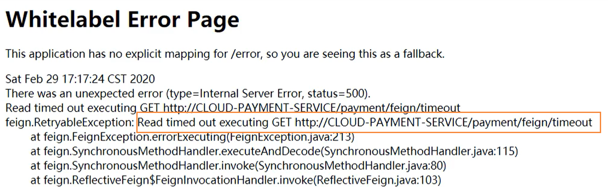

# OpenFeign实现服务调用

关于Feign的停更，目前已经使用OpenFeign进行替换

## 概述

Feign是一个声明式WebService客户端。使用Feign能让编写WebService客户端更加简单。

它的使用方法是定义一个服务接口然后在上面添加注解。Feign也支持可插拔式的编码和解码器。Spring Cloud对feign进行了封装，使其支持了Spring MVC标准注解和HttpMessageConverters。Feign可以与Eureka和Ribbon组合使用以支持负载均衡。

## Feign的作用

Feign旨在使编写Java Http客户端变得更容易。

前面在使用Ribbon + RestTemplate时，利用RestTemplate对http请求的封装处理，形成了一套模板化的调用方法。但是在实际开发中，由于对服务依赖的调用可能不止一处，往往一个接口会被多处调用，所以通常都会针对每个微服务自行封装一些客户端来包装这些依赖，所以Feign在这个基础上做了进一步封装，由他来帮助我们定义和实现依赖服务的接口定义。在Feign的实现下，我们只需要创建一个接口，并使用注解的方式来配置它（以前是Dao接口上面标注Mapper注解，现在是微服务接口上标注一个Feign注解），即可完成服务提供方的接口绑定，简化了使用Spring Cloud Ribbon时，自动封装服务调用客户端的开发量。

## Feign集成Ribbon

利用Ribbon维护了Payment的服务列表信息，并且通过轮询实现了客户端的负载均衡。而与Ribbon不同的是，通过Feign只需要定义服务绑定接口且声明式的方法，优雅而简单的实现了服务调用。

## Feign和OpenFeign的区别

|                            Feign                             |                          OpenFeign                           |
| :----------------------------------------------------------: | :----------------------------------------------------------: |
| Feign是Spring Cloud组件中的一种轻量级RestFul的HTTP服务客户端，Feign内置了Ribbon，用来做客户端的负载均衡，去调用服务注册中心的服务，Feign的使用方式是：使用Feign的注解定义接口，调用这个接口，就可以调用服务注册中心的服务 | OpenFeign是Spring Cloud 在Feign的基础上支持了SpringMVC的注解，如@RequestMapping等等，OpenFeign的@FeignClient可以解析SpringMVC的@RequestMapping注解下的接口，并通过动态代理的方法生产实现类，实现类中做均衡并调用其它服务 |
|                  spring-cloud-starter-feign                  |                spring-cloud-starter-openfeign                |

## OpenFeign使用步骤

### 引入依赖

```
<!--openfeign-->
<dependency>
    <groupId>org.springframework.cloud</groupId>
    <artifactId>spring-cloud-starter-openfeign</artifactId>
</dependency>
```

### 修改启动类

激活Feign组件

```
@SpringBootApplication
@EnableFeignClients
public class OrderFeignMain80 {
    public static void main(String[] args) {
        SpringApplication.run(OrderFeignMain80.class, args);
    }
}
```

### 添加业务逻辑接口

```
@Component
@FeignClient(value = "cloud-payment-service")
public interface PaymentFeignService {

    @GetMapping(value = "/payment/get/{id}")
    public CommonResult<Payment> getPaymentById(@PathVariable("id") Long id);

    @GetMapping("/payment/feign/timeout")
    public String paymentFeignTimeout();
}
```

### 具体使用

```
@RestController
@Slf4j
public class OrderFeignController {
    @Resource
    private PaymentFeignService paymentFeignService;

    @GetMapping(value = "/consumer/payment/get/{id}")
    public CommonResult<Payment> getPaymentById(@PathVariable("id") Long id){
        CommonResult<Payment> paymentById = paymentFeignService.getPaymentById(id);
        return paymentById;
    }

    @GetMapping("/consumer/payment/feign/timeout")
    public String paymentFeignTimeout(){
        //open-feign-ribbon,客户端默认等待一秒钟
        return paymentFeignService.paymentFeignTimeout();
    }
}
```

## OpenFeign的超时控制

服务提供者需要超过3秒才能返回数据，但是服务调用者默认只等待1秒，这就会出现超时问题。



这是因为默认Feign客户端只等待一秒钟，但是服务端处理需要超过3秒钟，导致Feign客户端不想等待了，直接返回报错，这个时候，消费方的OpenFeign就需要增大超时时间

```
# 设置feign客户端超时时间(OpenFeign默认支持ribbon)
ribbon:
  # 指的是建立连接所用的时间,适用于网络状态正常的情况下,两端连接所用的时间
  ReadTimeout: 5000
  # 指的是建立连接后从服务器读取到可用资源所用的时间
  ConnectTimeout: 5000
```


## OpenFeign日志打印功能

### 概念

Feign提供了日志打印功能，我们可以通过配置来调整日志级别，从而了解Feign中Http请求的细节，说白了就是对Feign接口的调用情况进行监控和输出。

### 日志级别

- NONE：默认的，不显示任何日志
- BASIC：仅记录请求方法、URL、相应状态码以及执行时间
- HEADERS：除了BASIC中定义的信息之外，还有请求和响应头的信息
- FULL：除了HEADERS中定义的信息之外，还有请求和相应的正文及元数据

```
@Configuration
public class FeignConfig {
    /**
     * feignClient配置日志级别
     *
     * @return
     */
    @Bean
    public Logger.Level feignLoggerLevel() {
        // 请求和响应的头信息,请求和响应的正文及元数据
        return Logger.Level.FULL;
    }
}
```

### 修改YML文件

```
logging:
  level:
    # feign日志以什么级别监控哪个接口
    com.atguigu.springcloud.service.PaymentFeignService: debug
```

