# Hystrix断路器

Hystrix官宣停更，官方推荐使用：resilence4j替换，同时国内Spring Cloud Alibaba 提出了Sentinel实现熔断和限流

## 概述

### 分布式面临的问题

复杂分布式体系结构中的应用程序有数十个依赖关系，每个依赖关系在某些时候将不可避免地失败（网络卡顿，网络超时）

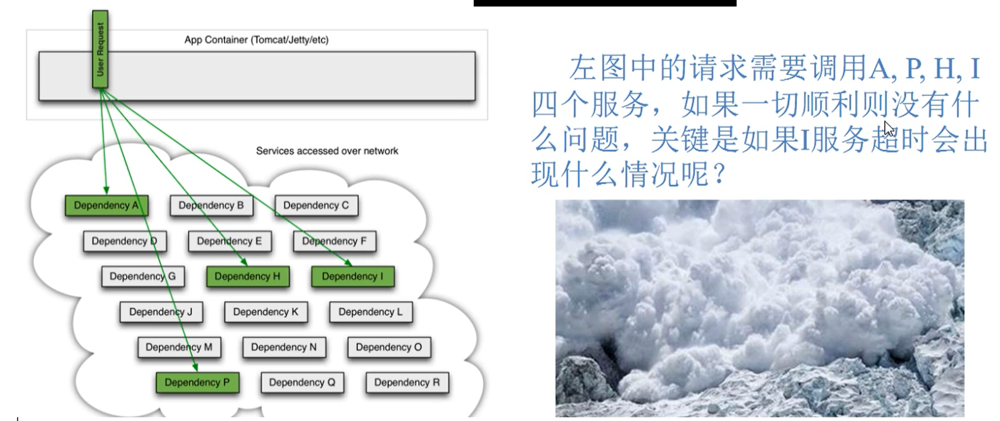

### 服务雪崩

多个微服务之间调用的时候，假设微服务A调用微服务B和微服务C，微服务B和微服务C又调用其它的微服务，这就是所谓的“扇出”。如果扇出的链路上某个微服务的调用响应时间过长或者不可用，对微服务A的调用就会占用越来越多的系统资源，进而引起系统崩溃，所谓的 雪崩效应

对于高流量的应用来说，单一的后端依赖可能会导致所有服务器上的所有资源都在几秒钟内饱和。比失败更糟糕的是，这些应用程序还可能导致服务之间的延迟增加，备份队列，线程和其它系统资源紧张，导致整个系统发生更多的级联故障，这些都表示需要对故障和延迟进行隔离和管理，以便单个依赖关系的失败，不能取消整个应用程序或系统。

通常当你发现一个模块下的某个实例失败后，这时候这个模块依然还会接收流量，然后这个有问题的模块还调用了其他的模块，这样就会发生级联故障，或者叫雪崩

### HyStrix的诞生

Hystrix是一个用于处理分布式系统的延迟和容错的开源库，在分布式系统里，许多依赖不可避免的会调用失败，比如超时，异常等，Hystrix能够保证在一个依赖出问题的情况下，不会导致整体服务失败，避免级联故障，以提高分布式系统的弹性。

断路器 本身是一种开关装置，当某个服务单元发生故障之后，通过断路器的故障监控（类似于熔断保险丝），向调用方返回一个符合预期的，可处理的备选响应（FallBack），而不是长时间的等待或者抛出调用方无法处理的异常，这样就保证了服务调用方的线程不会被长时间、不必要地占用，从而避免了故障在分布式系统中蔓延，乃至雪崩。

### Hystrix作用

- 服务降级
- 服务熔断
- 接近实时的监控（Hystrix Dashboard）
- 。。。。

## Hystrix重要概念

### 服务降级

fallback，假设对方服务不可用了，那么至少需要返回一个兜底的解决方法，即向服务调用方返回一个符合预期的，可处理的备选响应。

例如：服务繁忙，请稍后再试，不让客户端等待并立刻返回一个友好的提示，fallback

**哪些情况会触发降级**

- 程序运行异常
- 超时
- 服务熔断触发服务降级
- 线程池/信号量打满也会导致服务降级

### 服务熔断

break，类比保险丝达到了最大服务访问后，直接拒绝访问，拉闸断电，然后调用服务降级的方法并返回友好提示

一般过程：服务降级 -> 服务熔断 -> 恢复调用链路

### 服务限流

flowlimit，秒杀高并发等操作，严禁一窝蜂的过来拥挤，大家排队，一秒钟N个，有序进行


## Hystrix案例

### 构建

#### 引入依赖

```
<!--hystrix-->
<dependency>
    <groupId>org.springframework.cloud</groupId>
    <artifactId>spring-cloud-starter-netflix-hystrix</artifactId>
</dependency>
```

#### 启动类添加Hystrix注解

```
@SpringBootApplication
@EnableDiscoveryClient
@EnableCircuitBreaker
public class PaymentHystrixMain8001 {
    public static void main(String[] args) {
        SpringApplication.run(PaymentHystrixMain8001.class, args);
    }
    /**
     * 此配置是为了服务监控而配置，与服务容错本身无观，springCloud 升级之后的坑
     * ServletRegistrationBean因为springboot的默认路径不是/hystrix.stream
     * 只要在自己的项目中配置上下面的servlet即可
     * @return
     */
    @Bean
    public ServletRegistrationBean getServlet(){
        HystrixMetricsStreamServlet streamServlet = new HystrixMetricsStreamServlet();
        ServletRegistrationBean<HystrixMetricsStreamServlet> registrationBean = new ServletRegistrationBean<>(streamServlet);
        registrationBean.setLoadOnStartup(1);
        registrationBean.addUrlMappings("/hystrix.stream");
        registrationBean.setName("HystrixMetricsStreamServlet");
        return registrationBean;
    }
}
```

#### 业务类

```
@Service
public class PaymentService {
    /**
     * 正常访问
     *
     * @param id
     * @return
     */
    public String paymentInfo_OK(Integer id) {
        return "线程池:" + Thread.currentThread().getName() + " paymentInfo_OK,id:" + id + "\t" + "O(∩_∩)O哈哈~";
    }

    /**
     * 超时访问
     *
     * @param id
     * @return
     */
    @HystrixCommand(fallbackMethod = "paymentInfo_TimeOutHandler", commandProperties = {
            @HystrixProperty(name = "execution.isolation.thread.timeoutInMilliseconds", value = "5000")
    })
    public String paymentInfo_TimeOut(Integer id) {
        int timeNumber = 3;
        try { TimeUnit.SECONDS.sleep(timeNumber); } catch (InterruptedException e) { e.printStackTrace();}
        return "线程池:" + Thread.currentThread().getName() + " paymentInfo_TimeOut,id:" + id + "\t" +
                "O(∩_∩)O哈哈~  耗时(秒)";
    }

    public String paymentInfo_TimeOutHandler(Integer id){
        return "线程池:" + Thread.currentThread().getName() + " 8001系统繁忙请稍后再试！！,id:" + id + "\t"+"我哭了！！";
    }

    //====服务熔断，上方是降级
    /**
     * 在10秒窗口期中10次请求有6次是请求失败的,断路器将起作用
     * @param id
     * @return
     */
    @HystrixCommand(
            fallbackMethod = "paymentCircuitBreaker_fallback", commandProperties = {
            @HystrixProperty(name = "circuitBreaker.enabled", value = "true"),// 是否开启断路器
            @HystrixProperty(name = "circuitBreaker.requestVolumeThreshold", value = "10"),// 请求次数
            @HystrixProperty(name = "circuitBreaker.sleepWindowInMilliseconds", value = "10000"),// 时间窗口期/时间范文
            @HystrixProperty(name = "circuitBreaker.errorThresholdPercentage", value = "60")// 失败率达到多少后跳闸
    }
    )
    public String paymentCircuitBreaker(@PathVariable("id") Integer id) {
        if (id < 0) {
            throw new RuntimeException("*****id不能是负数");
        }
        String serialNumber = IdUtil.simpleUUID();
        return Thread.currentThread().getName() + "\t" + "调用成功,流水号:" + serialNumber;
    }

    public String paymentCircuitBreaker_fallback(@PathVariable("id") Integer id) {
        return "id 不能负数,请稍后重试,o(╥﹏╥)o id:" + id;
    }
}
```

### 高并发测试

Jmeter高并发测试

我们创建20000个线程去访问

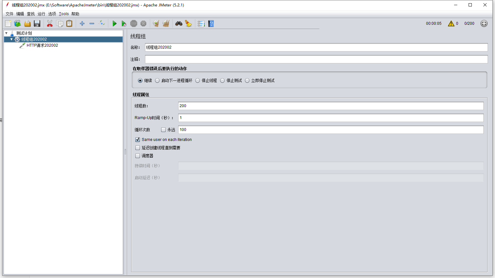

访问刚刚我们写的两个 延时接口

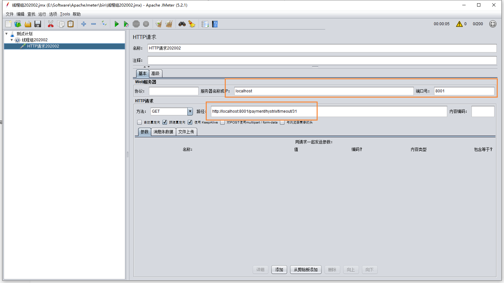

我们会发现当线程多的时候，会直接卡死，甚至把其它正常的接口都已经拖累

这是因为我们使用20000个线程去访问那个延时的接口，这样会把该微服务的资源全部集中处理 延时接口，而导致正常的接口资源不够，出现卡顿的现象。

同时tomcat的默认工作线程数被打满，没有多余的线程来分解压力和处理。

### 服务消费者加入

刚刚我们能够看到，光是调用服务提供者就不能支持20000的并发量，这个时候，在使用服务消费者的引入，同时请求该接口，这个时候我们就需要在服务消费端设置服务降级了

首先启动 hystrix，@EnableHystrix

```
@SpringBootApplication
@EnableEurekaClient
@EnableFeignClients
@EnableHystrix
public class OrderHystrixMain80 {
    public static void main(String[] args) {
        SpringApplication.run(OrderHystrixMain80.class, args);
    }
}
```

然后修改yml

```
server:
  port: 80
eureka:
  client:
    register-with-eureka: false
    fetch-registry: true
    service-url:
      defaultZone: http://eureka7001.com:7001/eureka,http://eureka7002.com:7002/eureka
  # 设置feign客户端超时时间(OpenFeign默认支持ribbon)
feign:
  hystrix:
    enabled: true
```

最后我们在feign调用上增加 fallBack

```
@Component
@FeignClient(value = "cloud-provider-hystrix-payment", fallback = PaymentFallbackService.class)
public interface PaymentHystrixService {
    /**
     * 正常访问
     *
     * @param id
     * @return
     */
    @GetMapping("/payment/hystrix/ok/{id}")
    public String paymentInfo_OK(@PathVariable("id") Integer id);
    /**
     * 超时访问
     *
     * @param id
     * @return
     */
    @GetMapping("/payment/hystrix/timeout/{id}")
    public String paymentInfo_TimeOut(@PathVariable("id") Integer id);
}
```

同时fallback的方法为

```
@Component
public class PaymentFallbackService implements PaymentHystrixService {
    @Override
    public String paymentInfo_OK(Integer id) {
        return "--- PaymentFallbackService  fall  paymentInfo_OK vack ，/(ㄒoㄒ)/~~";
    }

    @Override
    public String paymentInfo_TimeOut(Integer id) {
        return "--- PaymentFallbackService  fall  paymentInfo_TimeOut， /(ㄒoㄒ)/~~";
    }
}
```

## 解决方案

### 原因

超时导致服务器变慢，超时不再等待

出错，宕机或者程序运行出错，出错要有兜底

解决

- 对方服务8001超时了，调用者80不能一直卡死等待，必须有服务降级
- 对方服务8001宕机了，调用者80不能一直卡死，必须有服务降级
- 对方服务8001正常，调用者自己出故障或者有自我要求（自己的等待时间小于服务提供者），自己处理降级

### 服务降级

使用新的注解 `@HystrixCommand`

同时需要在主启动类上新增：`@EnableCircuiteBreaker`

设置8001自身调用超时时间的峰值，峰值内可以正常运行，超过了需要有兜底的方法处理，作为服务降级fallback

```
    /**
     * 超时访问
     *
     * @param id
     * @return
     */
    @HystrixCommand(fallbackMethod = "paymentInfo_TimeOutHandler", commandProperties = {
            @HystrixProperty(name = "execution.isolation.thread.timeoutInMilliseconds", value = "3000")
    })
    public String paymentInfo_TimeOut(Integer id) {
        int timeNumber = 3;
        try { TimeUnit.SECONDS.sleep(timeNumber); } catch (InterruptedException e) { e.printStackTrace();}
        return "线程池:" + Thread.currentThread().getName() + " paymentInfo_TimeOut,id:" + id + "\t" +
                "O(∩_∩)O哈哈~  耗时(秒)";
    }

    /**
     * 兜底的解决方案
     * @param id
     * @return
     */
    public String paymentInfo_TimeOutHandler(Integer id){
        return "线程池:" + Thread.currentThread().getName() + " 8001系统繁忙请稍后再试！！,id:" + id + "\t"+"我哭了！！";
    }
```

上述的方法就是当在规定的5秒内没有完成，那么就会触发服务降级，返回一个兜底的解决方案

同时不仅是超时，假设服务内的方法出现了异常，也同样会触发兜底的解决方法，例如下面的代码，我们制造出一个除数为0的异常。

```
    @HystrixCommand(fallbackMethod = "paymentInfo_TimeOutHandler", commandProperties = {
            @HystrixProperty(name = "execution.isolation.thread.timeoutInMilliseconds", value = "3000")
    })
    public String paymentInfo_TimeOut(Integer id) {
        int timeNumber = 10 / 0;
        return "线程池:" + Thread.currentThread().getName() + " paymentInfo_TimeOut,id:" + id + "\t" +
                "O(∩_∩)O哈哈~  耗时(秒)";
    }
```


上述说的是服务提供方的降级，服务消费者也需要设置服务降级的处理保护，也就是对客户端进行保护

也就是说服务降级，既可以放在客户端，也可以放在服务端，一般而言是放在客户端进行服务降级的

首先主启动类设置：`@EnableHystrix`

> 配置过的devtool热部署对java代码的改动明显，但是对@HystrixCommand内属性的修改建议重启微服务

然后yml开启hystrix

```
feign:
  hystrix:
    enabled: true
```

服务消费端降级

```
    @GetMapping("/consumer/payment/hystrix/timeout/{id}")
    @HystrixCommand(fallbackMethod = "paymentTimeOutFallbackMethod", commandProperties = {
            @HystrixProperty(name = "execution.isolation.thread.timeoutInMilliseconds", value = "1500")
    })
    public String paymentInfo_TimeOut(@PathVariable("id") Integer id) {
        return paymentHystrixService.paymentInfo_TimeOut(id);
    }
```


**目前问题**

目前异常处理的方法，和业务代码耦合，这就造成耦合度比较高

解决方法就是使用统一的服务降级方法

**方法1：**

除了个别重要核心业务有专属，其它普通的可以通过`@DefaultProperties(defaultFallback = "")`，这样通用的和独享的各自分开，避免了代码膨胀，合理减少了代码量

可以在Controller处设置 `@DefaultProperties(defaultFallback = "payment_Global_FallbackMethod")`

```
@RestController
@Slf4j
@DefaultProperties(defaultFallback = "payment_Global_FallbackMethod")
public class OrderHystrixController {

    @GetMapping("/consumer/payment/hystrix/timeout/{id}")
    @HystrixCommand  // 这个方法也会走全局 fallback
    public String paymentInfo_TimeOut(@PathVariable("id") Integer id) {
        int age = 10/0; //方法前挂了，跟后面挂了两种
        return paymentHystrixService.paymentInfo_TimeOut(id);
    }


    //下面是全局fallback方法
    public String payment_Global_FallbackMethod(){
        return "Global异常处理信息，请稍后再试,/(ㄒoㄒ)/~~";
    }
}
```


**方法2：**

我们现在还发现，兜底的方法 和 我们的业务代码耦合在一块比较混乱

我们可以在feign调用的时候，增加hystrix的服务降级处理的实现类，这样就可以进行解耦

格式：`@FeignClient(fallback = PaymentFallbackService.class)`

我们要面对的异常主要有

- 运行
- 超时
- 宕机

需要新建一个FallbackService实现类，然后通过实现类统一为feign接口里面的方法进行异常处理

feign接口

```
@Component
@FeignClient(value = "cloud-provider-hystrix-payment", fallback = PaymentFallbackService.class)
public interface PaymentHystrixService {
    /**
     * 正常访问
     *
     * @param id
     * @return
     */
    @GetMapping("/payment/hystrix/ok/{id}")
    public String paymentInfo_OK(@PathVariable("id") Integer id);
    /**
     * 超时访问
     *
     * @param id
     * @return
     */
    @GetMapping("/payment/hystrix/timeout/{id}")
    public String paymentInfo_TimeOut(@PathVariable("id") Integer id);
}
```

实现类

```
@Component
public class PaymentFallbackService implements PaymentHystrixService {
    @Override
    public String paymentInfo_OK(Integer id) {
        return "--- PaymentFallbackService  fall  paymentInfo_OK vack ，/(ㄒoㄒ)/~~";
    }

    @Override
    public String paymentInfo_TimeOut(Integer id) {
        return "--- PaymentFallbackService  fall  paymentInfo_TimeOut， /(ㄒoㄒ)/~~";
    }
}
```

这个时候，如果我们将服务提供方进行关闭，但是我们在客户端做了服务降级处理，让客户端在服务端不可用时，也会获得提示信息，而不会挂起耗死服务器


### 服务熔断

服务熔断也是服务降级的一个 特例

#### 熔断概念

熔断机制是应对雪崩效应的一种微服务链路保护机制，当扇出链路的某个微服务不可用或者响应时间太长时，会进行服务的降级，进而熔断该节点微服务的调用，快速返回错误的响应状态

当检测到该节点微服务调用响应正常后，恢复调用链路

在Spring Cloud框架里，熔断机制通过Hystrix实现，Hystrix会监控微服务间调用的状况，当失败的调用到一定的阈值，缺省是5秒内20次调用失败，就会启动熔断机制，熔断机制的注解还是 `@HystrixCommand`


来源，微服务提出者马丁福勒：https://martinfowler.com/bliki/CircuitBreaker.html

>这个简单的断路器避免了在电路打开时进行保护调用，但是当情况恢复正常时需要外部干预来重置它。对于建筑物中的断路器，这是一种合理的方法，但是对于软件断路器，我们可以让断路器本身检测底层调用是否再次工作。我们可以通过在适当的间隔之后再次尝试protected调用来实现这种自重置行为，并在断路器成功时重置它

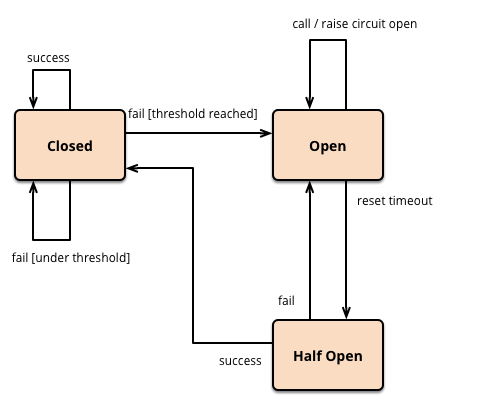

熔断器的三种状态：打开，关闭，半开

这里提出了 半开的概念，首先打开一半的，然后慢慢的进行恢复，最后在把断路器关闭

降级 -> 熔断 -> 恢复

这里我们在服务提供方 8001，增加服务熔断

这里有四个字段

```
// 是否开启断路器
@HystrixProperty(name = "circuitBreaker.enabled", value = "true"),

// 请求次数
@HystrixProperty(name = "circuitBreaker.requestVolumeThreshold", value = "10"),

// 时间窗口期/时间范文
@HystrixProperty(name = "circuitBreaker.sleepWindowInMilliseconds", value = "10000"),

// 失败率达到多少后跳闸
@HystrixProperty(name = "circuitBreaker.errorThresholdPercentage", value = "60")
```

首先是是否开启熔断器，然后是在一个时间窗口内，有60%的失败，那么就启动断路器，也就是10次里面，6次失败，完整代码如下：

```
    /**
     * 在10秒窗口期中10次请求有6次是请求失败的,断路器将起作用
     * @param id
     * @return
     */
    @HystrixCommand(
            fallbackMethod = "paymentCircuitBreaker_fallback", commandProperties = {
            @HystrixProperty(name = "circuitBreaker.enabled", value = "true"),// 是否开启断路器
            @HystrixProperty(name = "circuitBreaker.requestVolumeThreshold", value = "10"),// 请求次数
            @HystrixProperty(name = "circuitBreaker.sleepWindowInMilliseconds", value = "10000"),// 时间窗口期/时间范文
            @HystrixProperty(name = "circuitBreaker.errorThresholdPercentage", value = "60")// 失败率达到多少后跳闸
    }
    )
    public String paymentCircuitBreaker(@PathVariable("id") Integer id) {
        if (id < 0) {
            throw new RuntimeException("*****id不能是负数");
        }
        String serialNumber = IdUtil.simpleUUID();
        return Thread.currentThread().getName() + "\t" + "调用成功,流水号:" + serialNumber;
    }
```

当断路器被打开的时候，即使是正确的请求，该方法也会被断路

### 总结

#### 熔断类型

- 熔断打开：请求不再进行调用当前服务，内部设置时钟一般为MTTR（平均故障处理时间），当打开时长达所设时钟则进入半熔断状态
- 熔断关闭：熔断关闭不会对服务进行熔断
- 熔断半开：部分请求根据规则调用当前服务，如果请求成功且符合规则，则认为当前服务恢复正常，关闭熔断

#### 断路器启动条件

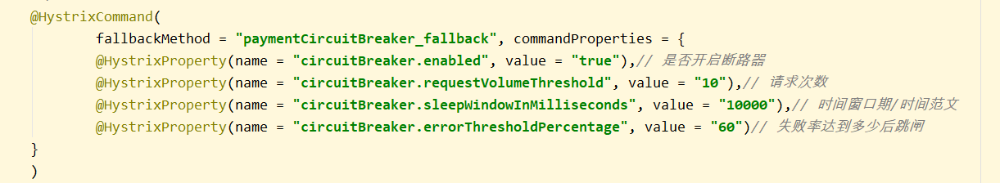

涉及到断路器的三个重要参数：快照时间窗，请求总阈值，错误百分比阈值

- 快照时间窗：断路器确定是否打开需要统计一些请求和错误数据，而统计的时间范围就是快照时间窗，默认为最近的10秒。
- 请求总数阈值：在快照时间窗口内，必须满足请求总数阈值才有资格熔断。默认为20，意味着在10秒内，如果hystrix的调用总次数不足20次，即使所有请求都超时或者其他原因失败，断路器都不会打开。
- 错误百分比阈值：当请求总数在快照时间窗内超过了阈值，比如发生了30次调用，并且有15次发生了超时异常，也就是超过了50的错误百分比，在默认设定的50%阈值情况下，这时候就会将断路器打开

开启和关闭的条件

- 当满足一定阈值的时候（默认10秒内超过20个请求）
- 当失败率达到一定的时候（默认10秒内超过50%的请求失败）
- 到达以上阈值，断路器将会开启 
- 当开启的时候，所有请求都不会进行转发
- 一段时间之后（默认是5秒），这个时候断路器是半开状态，会让其中一个请求进行转发。如果成功，断路器会关闭，若失败，继续开启，重复4和5

断路器开启后

- 再有请求调用的时候，将不会调用主逻辑，而是直接调用降级fallback，通过断路器，实现了自动的发现错误并将降级逻辑切换为主逻辑，减少相应延迟的效果。
- 原来的主逻辑如何恢复？
  - 对于这个问题，Hystrix实现了自动恢复功能，当断路器打开，对主逻辑进行熔断之后，hystrix会启动一个休眠时间窗，在这个时间窗内，降级逻辑是临时的成为主逻辑，当休眠时间窗到期，断路器将进入半开状态，释放一次请求到原来的主逻辑上，如果此次请求正常返回，断路器将继续闭合，主逻辑恢复，如果这次请求依然有问题，断路器继续保持打开状态，休眠时间窗重新计时。

### 服务限流

后面讲解Sentinel的时候进行说明


## Hystrix工作流程

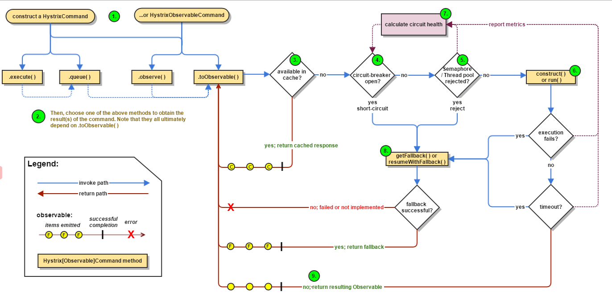

蓝色：调用路径

红色：返回路径

完整的请求路线：

1. 选择一个Hystrix注册方式
2. 二选一即可
3. 判断缓存中是否包含需要返回的内容（如果有直接返回）
4. 断路器是否为打开状态（如果是，直接跳转到8，返回）
5. 断路器为健康状态，判断是否有可用资源（没有，直接跳转8）
6. 构造方法和Run方法
7. 将正常，超时，异常的消息发送给断路器
8. 调用getFallback方法，也就是服务降级
9. 直接返回正确结果


## 服务监控HystrixDashboard

### 概述

除了隔离依赖服务的调用以外，Hystrix还提供了准实时的调用监控（Hystrix Dashboard），Hystrix会持续地记录所有通过Hystrix发起的请求的执行信息，并以统计报表和图形化的形式展示给用户，包括每秒执行多少请求，成功多少请求，失败多少，Netflix通过Hystrix-metrics-event-stream项目实现了对以上指标的监控，SpringCloud也提供了HystrixDashboard整合，对监控内容转化成可视化页面

### 搭建

引入依赖

```
<!--hystrix dashboard-->
<dependency>
    <groupId>org.springframework.cloud</groupId>
    <artifactId>spring-cloud-starter-netflix-hystrix-dashboard</artifactId>
</dependency>

<!--监控-->
<dependency>
    <groupId>org.springframework.boot</groupId>
    <artifactId>spring-boot-starter-actuator</artifactId>
</dependency>
```

application.yml添加端口

```
server:
  port: 9001
```

主启动类：配置注解`@EnableHystrixDashboard`

```
@SpringBootApplication
@EnableHystrixDashboard
public class HystrixDashboardMain9001 {
    public static void main(String[] args) {
        SpringApplication.run(HystrixDashboardMain9001.class);
    }
}
```

同时，最后我们需要注意，每个服务类想要被监控的，都需要在pom文件中，添加一下注解

```
<!--监控-->
<dependency>
    <groupId>org.springframework.boot</groupId>
    <artifactId>spring-boot-starter-actuator</artifactId>
</dependency>
```

同时在服务提供者的启动类上，需要添加以下的内容

```
@SpringBootApplication
@EnableDiscoveryClient
@EnableCircuitBreaker
public class PaymentHystrixMain8001 {
    public static void main(String[] args) {
        SpringApplication.run(PaymentHystrixMain8001.class, args);
    }
    /**
     * 此配置是为了服务监控而配置，与服务容错本身无观，springCloud 升级之后的坑
     * ServletRegistrationBean因为springboot的默认路径不是/hystrix.stream
     * 只要在自己的项目中配置上下面的servlet即可
     * @return
     */
    @Bean
    public ServletRegistrationBean getServlet(){
        HystrixMetricsStreamServlet streamServlet = new HystrixMetricsStreamServlet();
        ServletRegistrationBean<HystrixMetricsStreamServlet> registrationBean = new ServletRegistrationBean<>(streamServlet);
        registrationBean.setLoadOnStartup(1);
        registrationBean.addUrlMappings("/hystrix.stream");
        registrationBean.setName("HystrixMetricsStreamServlet");
        return registrationBean;
    }
}

```


输入以下地址，进入Hystrix的图形化界面

```
http://localhost:9001/hystrix
```

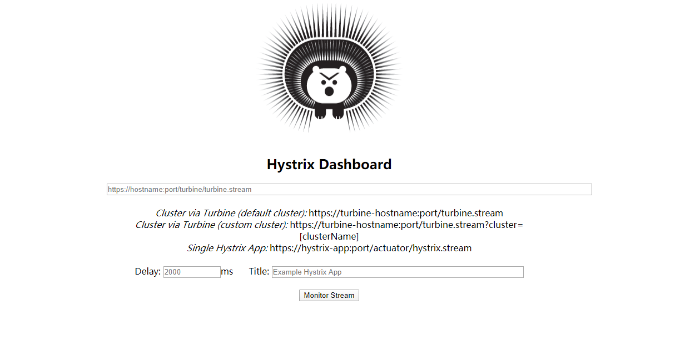

### 使用监控

我们需要使用当前hystrix需要监控的端口号，也就是使用 9001 去监控 8001，即使用hystrix dashboard去监控服务提供者的端口号

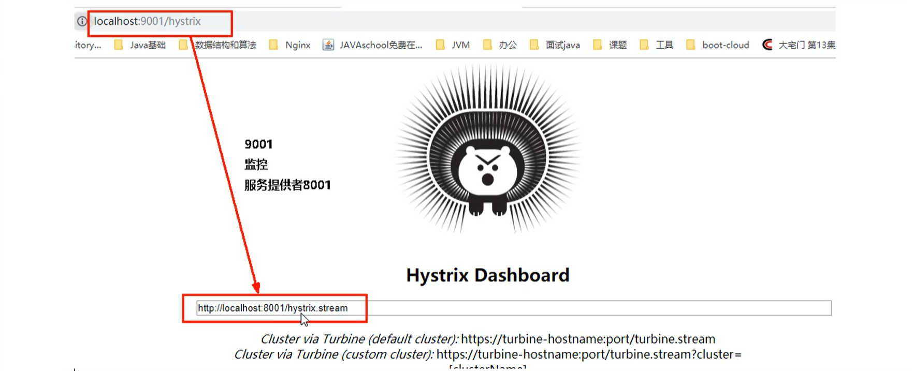

然后我们运行

```
http://localhost:8001/payment/circuit/31
```

就能够发现Hystrix Dashboard能够检测到我们的请求

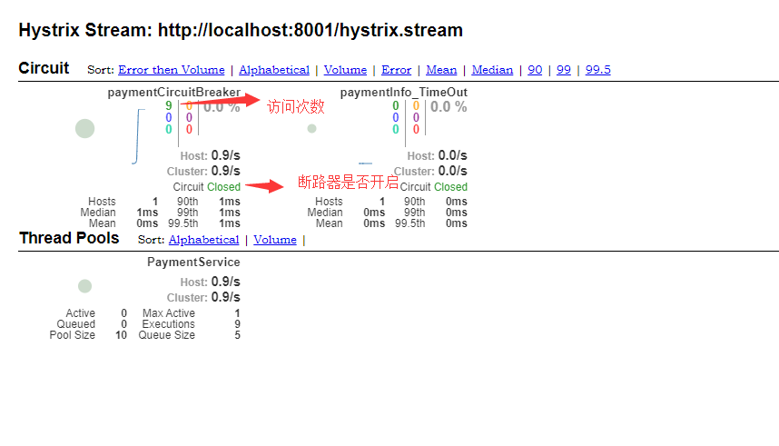

假设我们访问错误的方法后

```
http://localhost:8001/payment/circuit/-31
```

我们能够发现，此时断路器处于开启状态，并且错误率百分100

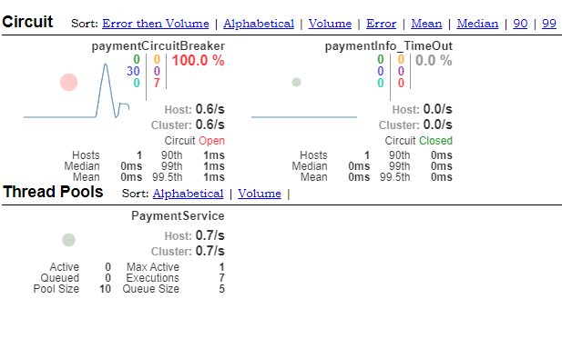

如何看懂图

首先是七种颜色


每个颜色都对应的一种结果


然后是里面的圆

实心圆：共有两种含义。它通过颜色的变化代表了实例的健康程度，它的健康程度从

绿色 < 黄色 < 橙色 <红色，递减

该实心圆除了颜色变化之外，它的大小也会根据实例的请求流量发生变化，流量越大该实心圆就越大，所以通过该实心圆的展示，就可以快速在大量的实例中快速发现故障实例和高压力实例

曲线：用于记录2分钟内流量的相对变化，可以通过它来观察到流量的上升和下降趋势

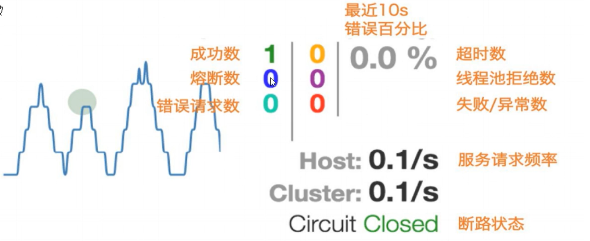