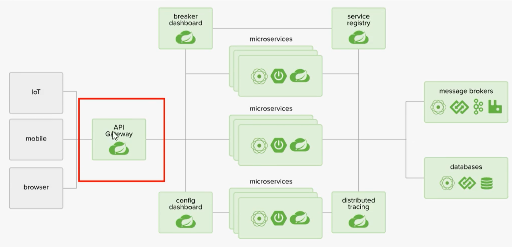
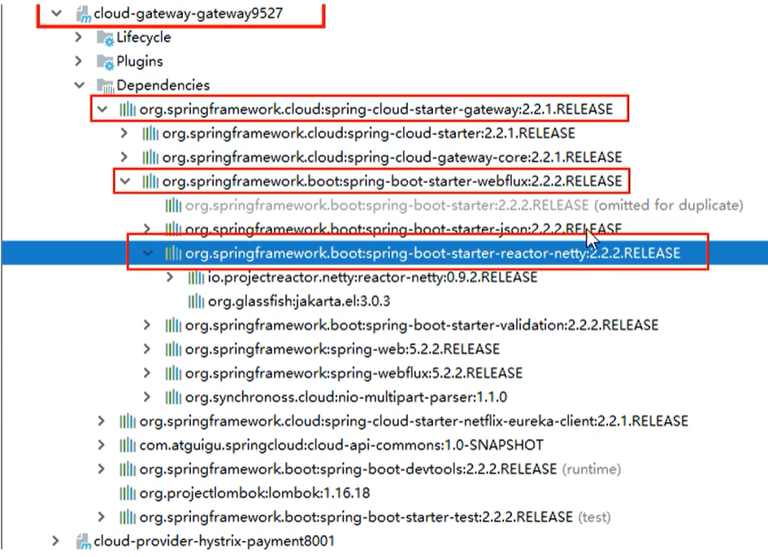
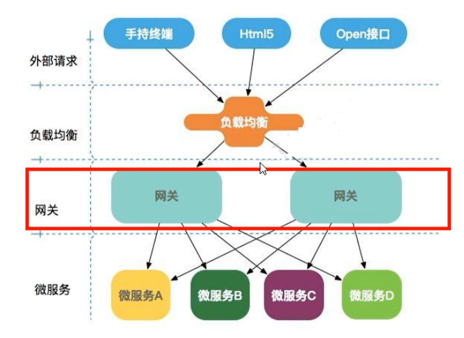
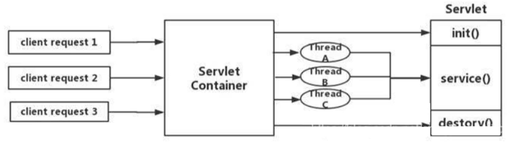
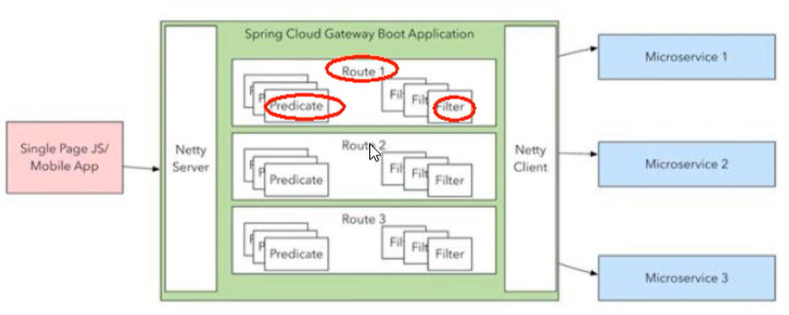
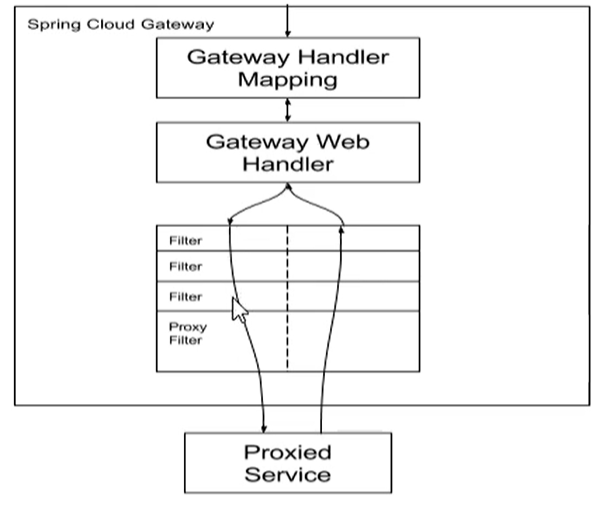
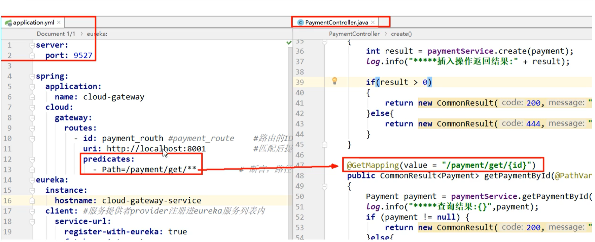
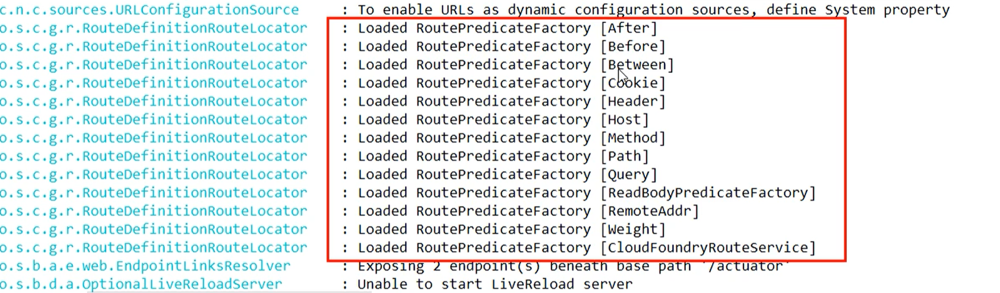
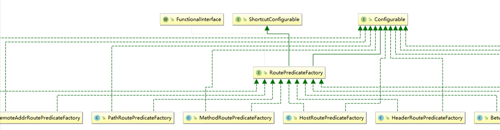
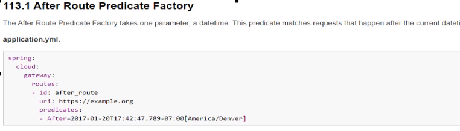

# 服务网关

## 前言

zuul目前已经出现了分歧，zuul  升级到 Zuul2的时候出现了内部分歧，并且导致Zuul的核心人员的离职，导致Zuul2一直跳票，等了两年，目前造成的局面是Zuul已经没人维护，Zuul2一直在开发中

目前主流的服务网关采用的是Spring Cloud 社区推出了 Gateway

## 概念

### Zuul

官网：https://github.com/Netflix/zuul/wiki

>Zuul是所有来自设备和web站点到Netflix流媒体应用程序后端的请求的前门。作为一个边缘服务应用程序，Zuul的构建是为了支持动态路由、监视、弹性和安全性。它还可以根据需要将请求路由到多个Amazon自动伸缩组。

### Gateway

Cloud全家桶有个很重要的组件就是网关，在1.X版本中都是采用Zuul网关，但在2.X版本中，zuul的升级一直跳票，SpringCloud最后自己研发了一个网关替代Zuul，那就是SpringCloudGateway，一句话Gateway是原来Zuul 1.X 版本的替代品



Gateway是在Spring生态系统之上构建的API网关服务，基于Spring 5，Spring Boot 2 和 Project Reactor等技术。Gateway旨在提供一种简单而且有效的方式来对API进行路由，以及提供一些强大的过滤器功能，例如：熔断，限流，重试等。

Spring Cloud Gateway 是Spring Cloud的一个全新项目，作为Spring Cloud生态系统中的网关，目标是替代Zuul，在Spring Cloud 2.0以上版本中，没有对新版本的Zuul 2.0以上最新高性能版本进行集成，仍然还是使用的Zuul 1.X非Reactor模式的老版本，而为了提高网关的性能，Spring Cloud Gateway是基于WebFlux框架实现的，而WebFlux框架底层则使用了高性能的Reactor模式通信框架Netty。

Spring Cloud Gateway的目标提供统一的路由方式，且基于Filter链的方式提供了网关基本的功能，例如：安全，监控、指标 和 限流。



### 能做啥

- 反向代理
- 鉴权
- 流量控制
- 熔断
- 日志监控

### 使用场景



网关可以想象成是所有服务的入口

### 为什么选用Gateway

目前已经有了Zuul了，为什么还要开发出Gateway呢？

一方面是因为Zuul 1.0已经进入了维护阶段，而且Gateway是Spring Cloud团队研发的，属于亲儿子，值得信赖，并且很多功能Zuul都没有用起来，同时Gateway也非常简单便捷

Gateway是基于异步非阻塞模型上进行开发的，性能方面不需要担心。虽然Netflix早就发布了Zuul 2.X，但是Spring Cloud没有整合计划，因为NetFlix相关组件都进入维护期，随意综合考虑Gateway是很理想的网关选择。

### Gateway特性

基于Spring Framework 5，Project Reactor 和Spring boot 2.0 进行构建

- 动态路由，能匹配任何请求属性
- 可以对路由指定Predicate（断言） 和 Filter（过滤器）
- 集成Hystrix的断路器功能
- 集成Spring Cloud服务发现功能
- 易于编写Predicate 和 Filter
- 请求限流功能
- 支持路径重写

### Spring Cloud Gateway  和 Zuul的区别

在Spring Cloud Gateway Finchley正式版发布之前，Spring Cloud推荐网关是NetFlix提供的Zuul

- Zuul 1.X 是一个基于阻塞IO的API Gateway
- Zuul 1.x 基于Servlet 2.5使用阻塞架构，它不支持任何场连接，Zuul的设计模式和Nginx比较像，每次IO操作都是从工作线程中选择一个执行，请求线程被阻塞到工作线程完成，但是差别是Nginx用C++实现，Zuul用Java实现，而JVM本身会有第一次加载较慢的情况，使得Zuul的性能较差。
- Zuul 2.X理念更先进，想基于Netty非阻塞和支持长连接，但Spring Cloud目前还没有整合。Zuul 2.X的性能相比于1.X有较大提升，在性能方面，根据官方提供的基准测试，Spring Cloud Gateway的RPS（每秒请求数）是Zuul的1.6倍。
- Spring Cloud Gateway建立在Spring 5，Spring Boot 2.X之上，使用非阻塞API
- Spring Cloud Gateway还支持WebSocket，并且与Spring紧密集成拥有更好的开发体验。

Spring Cloud 中所集成的Zuul版本，采用的是Tomcat容器，使用的还是传统的Servlet IO处理模型

Servlet的生命周期中，Servlet由Servlet Container进行生命周期管理。

Container启动时构建servlet对象，并调用servlet init()进行初始化

Container运行时接收请求，并为每个请求分配一个线程，（一般从线程池中获取空闲线程），然后调用Service

container关闭时，调用servlet destory() 销毁servlet



上述模式的缺点：

servlet是一个简单的网络IO模型，当请求进入Servlet container时，servlet container就会为其绑定一个线程，在并发不高的场景下，这种网络模型是适用的，但是一旦高并发（Jmeter测试），线程数就会上涨，而线程资源代价是昂贵的（上下文切换，内存消耗大），严重影响了请求的处理时间。在一些简单业务场景下，不希望为每个Request分配一个线程，只需要1个或几个线程就能应对极大并发的请求，这种业务场景下Servlet模型没有优势。

所以Zuul 1.X是基于Servlet之上的一种阻塞式锤模型，即Spring实现了处理所有request请求的Servlet（DispatcherServlet）并由该Servlet阻塞式处理，因此Zuul 1.X无法摆脱Servlet模型的弊端

### WebFlux框架

传统的Web框架，比如Struts2，Spring MVC等都是基于Servlet API 与Servlet容器基础之上运行的，但是在Servlet 3.1之后有了异步非阻塞的支持，而WebFlux是一个典型的非阻塞异步的框架，它的核心是基于Reactor的相关API实现的，相对于传统的Web框架来说，它可以运行在如 Netty，Undertow 及支持Servlet3.1的容器上。非阻塞式 + 函数式编程（Spring5必须让你使用Java8）

Spring WebFlux是Spring 5.0引入的新的响应式框架，区别与Spring MVC，他不依赖Servlet API，它是完全异步非阻塞的，并且基于Reactor来实现响应式流规范。


## 三大核心概念

### Route 路由

路由就是构建网关的基本模块，它由ID，目标URI，一系列的断言和过滤器组成，如果断言为True则匹配该路由

### Predicate 断言

参考的Java8的 `java.util.function.Predicate`

开发人员可以匹配HTTP请求中的所有内容，例如请求头和请求参数，如果请求与断言想匹配则进行路由

### Filter 过滤

指的是Spring框架中GatewayFilter的实例，使用过滤器，可以在请求被路由前或者之后对请求进行修改。

## Gateway工作流程

Web请求通过一些匹配条件，定位到真正的服务节点，并在这个转发过程的前后，进行了一些精细化的控制。

Predicate就是我们的匹配条件，而Filter就可以理解为一个无所不能的拦截器，有了这两个元素，在加上目标URL，就可以实现一个具体的路由了。



客户端向Spring Cloud Gateway发出请求，然后在Gateway Handler Mapping中找到与请求相匹配的路由，将其发送到Gateway Web Handler。

Handler在通过指定的过滤器链来将请求发送到我们实际的服务执行业务逻辑，然后返回。

过滤器之间用虚线分开是因为过滤器可能会在发送代理请求前（pre）或之后（post）执行业务逻辑。



Filter在 Pre 类型的过滤器可以做参数校验，权限校验，流量监控，日志输出，协议转换等。

在 Post类型的过滤器中可以做响应内容，响应头的修改，日志的输出，流量监控等有着非常重要的作用。

Gateway的核心逻辑：路由转发 + 执行过滤链

## 入门配置

### 引入依赖

```
<dependency>
    <groupId>org.springframework.cloud</groupId>
    <artifactId>spring-cloud-starter-gateway</artifactId>
</dependency>
```

### 修改YML

```
spring:
  application:
    name: cloud-gateway
  cloud:
    gateway:
      discovery:
        locator:
          enabled: true # 开启从注册中心动态创建路由的功能，利用微服务名称进行路由
      routes:
        - id: payment_route # 路由的id,没有规定规则但要求唯一,建议配合服务名
          #匹配后提供服务的路由地址
          #uri: http://localhost:8001
          uri: lb://CLOUD-PAYMENT-SERVICE
          predicates:
            - Path=/payment/get/** # 断言，路径相匹配的进行路由
        - id: payment_route2
          #uri: http://localhost:8001
          uri: lb://CLOUD-PAYMENT-SERVICE
          predicates:
            - Path=/payment/lb/** #断言,路径相匹配的进行路由
            - After=2020-03-09T22:40:37.365+08:00[Asia/Shanghai]
```

### 访问

在添加网关之前，我们的访问是

```
http://localhost:8001/payment/get/31
```

添加网关之后，我们的访问路径是

```
http://localhost:9527/payment/get/31
```

这么做的好处是慢慢淡化我们真实的IP端口号

### 路由匹配




### 路由配置的两种方式

- 在配置文件yml中配置
- 代码中注入RouteLocator的Bean

```
@Configuration
public class GateWayConfig {

	// 配置了一个id为route-name的路由规则，当访问地址 http://localhost:9527/guonei时，会自动转发到
	// 地址 http;//news.baidu.com/guonei
    @Bean
    public RouteLocator customRouteLocator(RouteLocatorBuilder routeLocatorBuilder){
        RouteLocatorBuilder.Builder routes = routeLocatorBuilder.routes();
        routes.route("path route atguigu",
                r ->r.path("/guonei").uri("https://www.baidu.com")).build();
        return routes.build();
    }
}
```


## 通过微服务名实现动态路由

默认情况下Gateway会根据注册中心的服务列表，以注册中心上微服务名为路径创建动态路由进行转发，从而实现动态路由的功能。

首先需要开启从注册中心动态创建路由的功能，利用微服务名进行路由

```
spring:
  application:
    name: cloud-gateway
  cloud:
    gateway:
      discovery:
        locator:
          enabled: true # 开启从注册中心动态创建路由的功能，利用微服务名称进行路由
```

URL换成服务名

```
uri: lb://CLOUD-PAYMENT-SERVICE
```


## Predicate的使用

### 概念

断言，路径相匹配的进行路由



Spring Cloud Gateway将路由匹配作为Spring WebFlux HandlerMapping基础架构的一部分

Spring Cloud Gateway包括许多内置的Route Predicate 工厂，所有这些Predicate都与Http请求的不同属性相匹配，多个Route Predicate工厂可以进行组合

Spring Cloud Gateway创建Route对象时，使用RoutePredicateFactory创建Predicate对象，Predicate对象可以赋值给Route，SpringCloudGateway包含许多内置的RoutePredicateFactores。

所有这些谓词都匹配Http请求的不同属性。多种谓词工厂可以组合，并通过逻辑 and




### 常用的Predicate

- After Route Predicate：在什么时间之后执行

  

  

- Before Route Predicate：在什么时间之前执行

- Between Route Predicate：在什么时间之间执行

- Cookie  Route Predicate：Cookie级别

  常用的测试工具：

  - jmeter
  - postman
  - curl

  ```
  // curl命令进行测试，携带Cookie
  curl http://localhost:9527/payment/lb --cookie "username=zzyy"
  ```

- Header  Route Predicate：携带请求头
- Host  Route Predicate：什么样的URL路径过来
- Method  Route Predicate：什么方法请求的，Post，Get
- Path  Route Predicate：请求什么路径 	`- Path=/api-web/**`
- Query  Route Predicate：带有什么参数的


## Filter的使用

### 概念

路由过滤器可用于修改进入的HTTP请求和返回的HTTP响应，路由过滤器只能指定路由进行使用

Spring Cloud Gateway内置了多种路由过滤器，他们都由GatewayFilter的工厂类来产生的

### Spring Cloud Gateway Filter

生命周期：only Two：pre，Post

种类：Only Two

- GatewayFilter
- GlobalFilter

### 自定义过滤器

主要作用：

- 全局日志记录
- 统一网关鉴权

需要实现接口：`implements GlobalFilter, Ordered`

全局过滤器代码如下：

```
@Component
@Slf4j
public class MyLogGateWayFilter implements GlobalFilter, Ordered {

    @Override
    public Mono<Void> filter(ServerWebExchange exchange, GatewayFilterChain chain) {
        log.info("come in global filter: {}", new Date());

        ServerHttpRequest request = exchange.getRequest();
        String uname = request.getQueryParams().getFirst("uname");
        if (uname == null) {
            log.info("用户名为null，非法用户");
            exchange.getResponse().setStatusCode(HttpStatus.NOT_ACCEPTABLE);
            return exchange.getResponse().setComplete();
        }
        // 放行
        return chain.filter(exchange);
    }

    /**
     * 过滤器加载的顺序 越小,优先级别越高
     *
     * @return
     */
    @Override
    public int getOrder() {
        return 0;
    }
}
```

