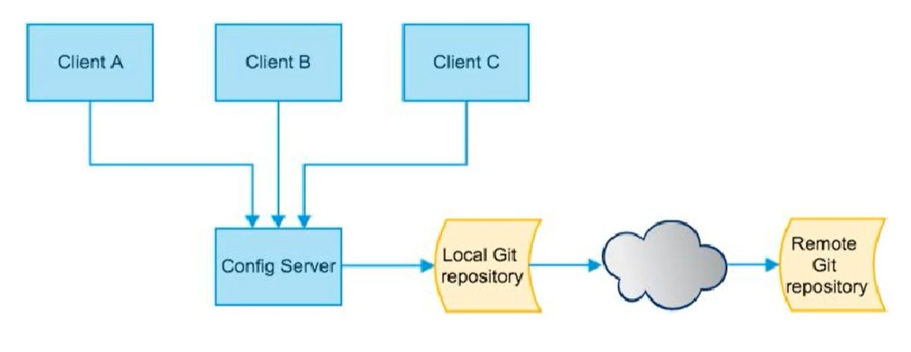

# 分布式配置中心SpringCloudConfig

## 概述

### 面临的问题

微服务意味着要将单体应用中的业务拆分成一个个子服务，每个服务的粒度相对较小，因此系统中会出现大量的服务，由于每个服务都需要必要的配置信息才能运行，所以一套集中式，动态的配置管理设施是必不可少的。

SpringCloud提供了ConfigServer来解决这个问题，原来四个微服务，需要配置四个application.yml，但需要四十个微服务，那么就需要配置40份配置文件，我们需要做的就是一处配置，到处生效。

所以这个时候就需要一个统一的配置管理

### 是什么

SpringCloud Config为微服务架构中的微服务提供集中化的外部配置支持，配置服务器为各个不同微服务应用提供了一个中心化的外部配置。



### 怎么玩

服务端也称为分布式配置中心，它是一个独立的微服务应用，用来连接配置服务器并为客户端提供获取配置信息，加密/解密信息等访问接口。

客户端则是通过指定的配置中心来管理应用资源，以及与业务相关的配置内容，并在启动的时候从配置中心获取和加载配置信息，配置服务器默认采用git来存储配置信息，这样有助于对环境配置进行版本管理，并且可以通过git客户端工具来方便的管理和访问配置内容。

### 能做什么

- 集中管理配置文件
- 不同环境不同配置，动态化的配置更新，分布式部署，比如 dev/test/prod/beta/release
- 运行期间动态调整配置，不再需要在每个服务部署的机器上编写配置文件，服务会向配置中心统一拉取自己的信息
- 当配置发生变动时，服务不需要重启即可感知配置的变化并应用新的配置
- 将配置信息以REST接口的形式暴露：post，curl命令刷新

### 与Github整合部署

由于SpringCloud Config默认使用Git来存储配置文件（也有其他方式，比如支持SVN和本地文件），但最推荐的还是Git，而且使用的是Http/https访问的形式


## Config服务端配置与测试

### 引入依赖

```
<!--添加消息总线Rabbitmq支持-->
<dependency>
    <groupId>org.springframework.cloud</groupId>
    <artifactId>spring-cloud-starter-bus-amqp</artifactId>
</dependency>

<!--config-->
<dependency>
    <groupId>org.springframework.cloud</groupId>
    <artifactId>spring-cloud-config-server</artifactId>
</dependency>
```

### 修改YML

```
server:
  port: 3344
spring:
  application:
    name: cloud-config-center
  cloud:
    config:
      server:
        git:
          uri: https://github.com/boytian/springcloud-config.git
          search-paths:
            - springcloud-config
      label: master
  rabbitmq: #mq相关配置
    host: localhost
    port: 5672
    username: guest
    password: guest
eureka:
  client:
    register-with-eureka: true
    fetch-registry: true
    service-url:
      defaultZone: http://eureka7001.com:7001/eureka,http://eureka7002.com:7002/eureka
# rabbitmq相关配置，暴露bus刷新点
management:
  endpoints: #暴露bus刷新配置的端点
    web:
      exposure:
        include: 'bus-refresh'
```

### 配置读取规则

- /{label}/{application}-{profile}.yml
  - http://config-3344.com:3344/master/config-dev.yml
- /{application}-{profile}.yml
  - http://config-3344.com:3344/config-dev.yml：如果不写的话，默认就是从master分支上找

### 参数总结

label：分支，branch

name：服务名

profiles：环境(dev/test/prod)


## Config客户端配置与测试

### 引入依赖

```
<!--添加消息总线Rabbitmq支持-->
<dependency>
    <groupId>org.springframework.cloud</groupId>
    <artifactId>spring-cloud-starter-bus-amqp</artifactId>
</dependency>

<!--config-->
<dependency>
    <groupId>org.springframework.cloud</groupId>
    <artifactId>spring-cloud-starter-config</artifactId>
</dependency>
```

### bootstrap.yml

application.yml：是用户级的资源配置项

bootstrap.yml：是系统级别的，优先级更加高

Spring Cloud会创建一个Bootstrap Context，作为Spring应用的Application Context的父上下文。初始化的时候，Bootstrap Context负责从外部源加载配置属性并解析配置。这两个上下文共享一个从外部获取的Environment。

Bootstrap属性有高优先级，默认情况下，他们不会被本地配置覆盖，Bootstrap context 和 Application Context有着不同的约定，所以新增了一个bootstrap.yml文件，保证Bootstrap Context 和 Application Context配置的分离。

要将客户端Client模块下的Application.yml文件改成bootstrap.yml这是很关键的，因为bootstrap.yml是比application.yml先加载的，bootstrap.yml优先级高于application.yml

```
server:
  port: 3355
spring:
  application:
    name: config-client
  cloud:
    config:
      label: master #分支名称
      name: config #配置文件名称
      profile: dev #读取后缀文件名，即 master分支config-dev.yml
      uri: http://localhost:3344 #配置中心地址

eureka:
  client:
    register-with-eureka: true
    fetch-registry: true
    service-url:
      defaultZone: http://eureka7001.com:7001/eureka,http://eureka7002.com:7002/eureka
#暴露监控端点
management:
  endpoints:
    web:
      exposure:
        include: "*"
```


## 存在的问题

分布式配置的动态刷新问题？

- Linux运维修改Github上的配置文件内容做调整
- 刷新3344，发现ConfigServer配置中心立刻响应
- 刷新3355，发现ConfigClient客户端没有任何响应
- 3355没有变化除非自己重启或者重启加载
- 难道每次运维修改后，都需要重启？

相当于直接修改Github上的配置文件，配置不会改变，这个时候就存在了分布式配置的动态刷新问题


## Config客户端之动态刷新

为了避免每次更新配置都要重启客户端微服务3355

### 引入了动态刷新

引入actuator监控依赖

```
<!--web启动器-->
<dependency>
    <groupId>org.springframework.boot</groupId>
    <artifactId>spring-boot-starter-web</artifactId>
</dependency>
<!--监控-->
<dependency>
    <groupId>org.springframework.boot</groupId>
    <artifactId>spring-boot-starter-actuator</artifactId>
</dependency>
```

然后修改bootstrap.yml，暴露监控端点

```
#暴露监控端点
management:
  endpoints:
    web:
      exposure:
        include: "*"
```

在业务类中，添加 `@RefreshScope`标签

```
@RestController
//实现刷新功能
@RefreshScope
public class ConfigClientController {

    @Value("${config.info}")
    private String configInfo;

    @GetMapping("/configInfo")
    public String getConfigInfo(){
        return configInfo;
    }

}
```

然后让运维人员发送一个post请求

```
curl -X POST "http://localhost:3355/actuator/refresh"
```

然后就能够生效了，成功刷新了配置，避免了服务重启

这个方案存在问题：

- 假设有多个微服务客户端 3355/ 3366 / 3377
- 每个微服务都要执行一次post请求，手动刷新？
- 可否广播，一次通知，处处生效？
- ....

目前来说，暂时做不到这个，所以才用了下面的内容，即Spring Cloud Bus 消息总线