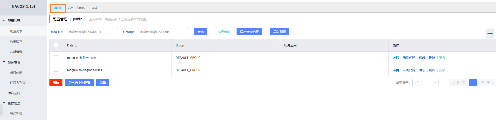
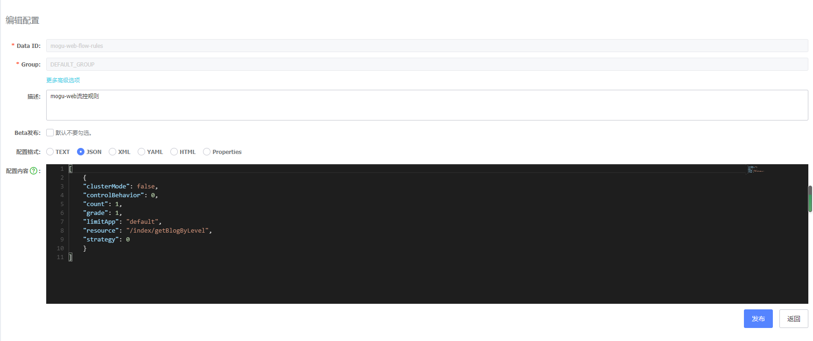
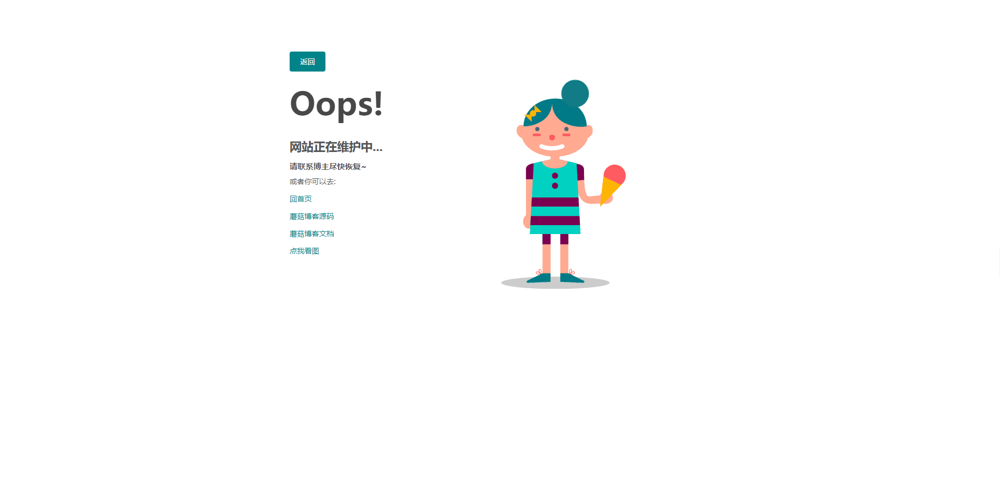
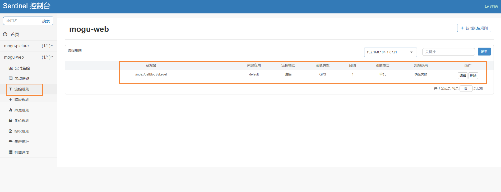
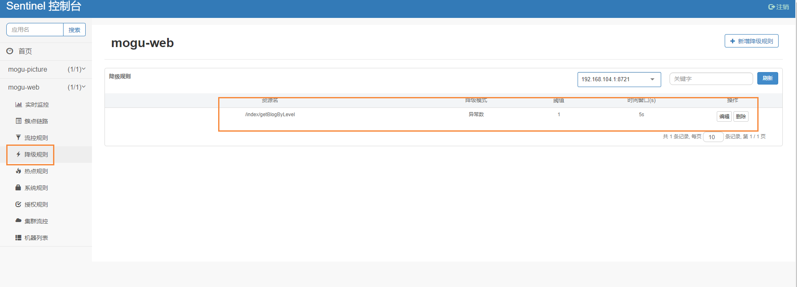

# 配置Sentinel规则持久化到Nacos中

## 前言

Sentinel如果没有配置持久化的话，默认是将规则存储在内存中的，如果服务重启那么定义的规则也会没有，需要我们再次手动创建规则。这样其实对我们来说是非常麻烦的一件事，因此这里重点说说Sentinel规则持久化到Nacos中，每次启动服务，只需要从Nacos拉取规则，加载到Sentinel中即可

## 安装依赖

如果要使用Sentinel持久化到Nacos，首先需要在项目文件中导入pom依赖

```xml
<!--sentinel持久化到nacos-->
<dependency>
    <groupId>com.alibaba.csp</groupId>
    <artifactId>sentinel-datasource-nacos</artifactId>
</dependency>
```

## 修改yml文件

然后我们找到原来配置sentinel的配置文件，添加datasouce相关

```bash
server:
  port: 8603

spring:
  application:
    name: mogu-web
  cloud:
    nacos:
      discovery:
        server-addr: localhost:8848
        namespace: dev
      config:
        server-addr: localhost:8848
        file-extension: yaml
        #指定分组
        group: dev
        #指定命名空间
        namespace: dev

    # 配置Sentinel流控
    sentinel:
      transport:
        #配置Sentinel dashboard地址
        dashboard: localhost:8070
        #默认8719端口,如果被占用会向上扫描。
        port: 8719

      # sentinel持久化到nacos
      datasource:
        flow:
          nacos:
            # nacos连接地址
            server-addr: ${spring.cloud.nacos.discovery.server-addr}
            # nacos中的配置名称
            data-id: ${spring.application.name}-flow-rules
            group-id: DEFAULT_GROUP
            data-type: json
            rule-type: flow
        degrade:
          nacos:
            server-addr: ${spring.cloud.nacos.discovery.server-addr}
            data-id: ${spring.application.name}-degrade-rules
            group-id: DEFAULT_GROUP
            data-type: json
            rule-type: degrade
```

在上面我们分别配置了sentinel的流控规则和降级规则

## 创建配置文件

然后我们需要到Nacos中创建配置文件

- mogu-web-flow-rules：流量规则
- mogu-web-degrade-rules：降级规则

因为我们没有指定对应的namespace，也就是命名空间，所以我们就默认在public下创建，这样在dev 或者 prod下都可以进行使用



### mogu-web-flow-rules

首先创建流量规则，主要用于接口的流量控制



规则如下所示：

```bash
[
    {
    "clusterMode": false,
    "controlBehavior": 0,
    "count": 1,
    "grade": 1,
    "limitApp": "default",
    "resource": "/index/getBlogByLevel",
    "strategy": 0
    }
]
```

字段含义：【所有属性来⾃源码FlowRule类】

- **resource**：资源名称
- **limitApp**：来源应⽤
- **grade**：阈值类型 0 线程数 1 QPS
- **count**：单机阈值
- **strategy**：流控模式， 0 直接 1 关联 2 链路
- **controlBehavior**：流控效果， 0 快速失败 1 Warm Up 2 排队等待
- **clusterMode**： true/false 是否集群

### mogu-web-degrade-rules

首先创建降级规则，主要用于接口的请求出错时，快速返回


规则如下所示：

```bash
[
    {
    "count": 1,
    "grade": 2,
    "resource": "/index/getBlogByLevel",
    "timeWindow": 5
    }
]
```

字段含义：【所有属性来⾃源码DegradeRule类】

- **resource**：资源名称
- **grade**：降级策略 0 RT 1 异常⽐例 2 异常数
- **count**：阈值
- **timeWindow**：时间窗

## 测试

创建完成后，我们启动项目测试，因为我们添加的是mogu-web的流控规则，所以我们只需要访问主页即可

```bash
# 输入首页地址
http://localhost:9527
```

然后发现成功跳转出500页面，说明我们的流控规则已经生效



然后到我们的sentinel图形化页面

```bash
http://localhost:8070
```

输入默认账号和密码：sentinel  sentinel





能够发现已经有一条流控规则和降级规则了~，到这里为止已经成功将规则持久化到nacos中了，更多的规则，我们只需要修改对应的配置文件即可